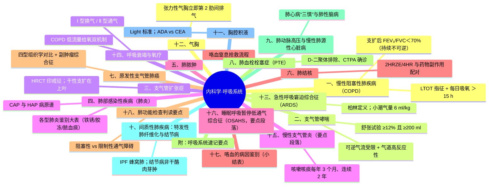
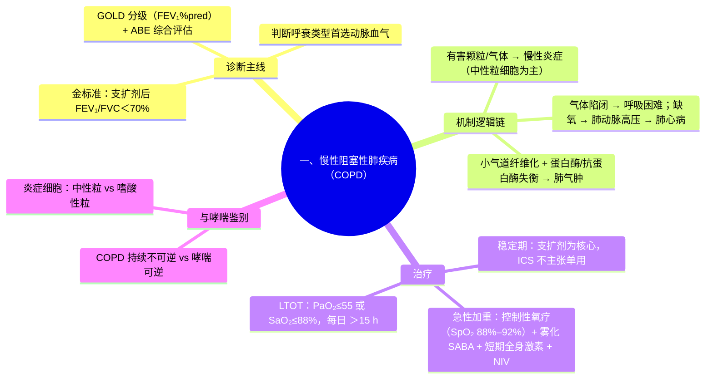
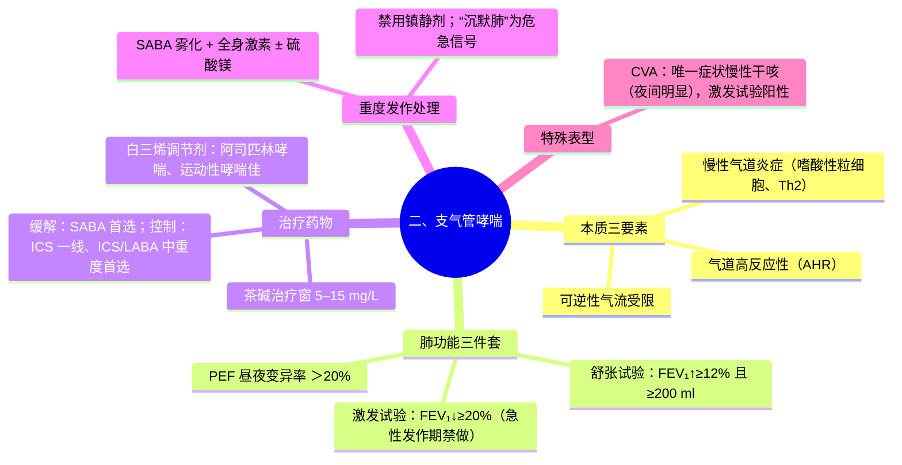
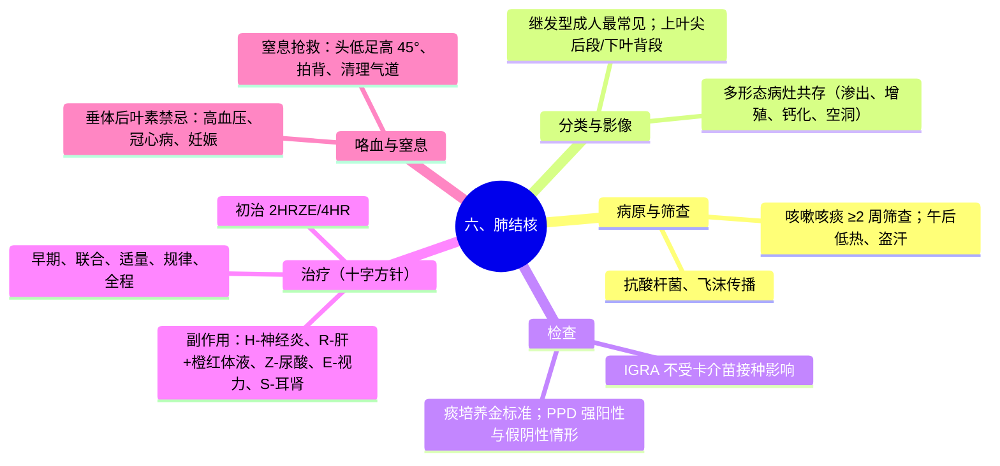
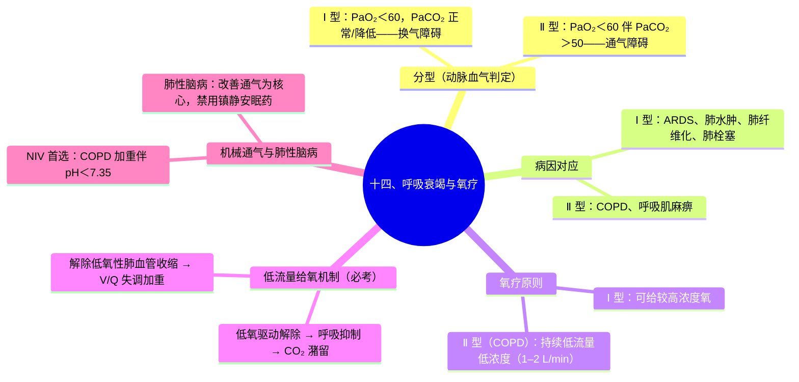

---
tags:
  - 考研306/内科学/呼吸系统
科目: 内科学
系统: 呼吸系统
内容: COPD、哮喘、支扩、肺炎、肺结核、肺癌、肺栓塞、肺心病、胸膜疾病、ARDS、呼衰
---
# 内科学·讲义精讲版——01 呼吸系统

> 覆盖：COPD、支气管哮喘、支气管扩张、肺炎各型、肺脓肿、肺结核、肺癌、肺血栓栓塞、肺动脉高压与慢性肺心病、IPF与结节病、胸腔积液、气胸、ARDS、呼吸衰竭与氧疗。
> 用法：一轮精读，重点吃透每病"病因与发病机制"小节和各鉴别大表；二轮直接过"高频考点提示"。
> 呼吸系统是 306 内科学的分值重镇，COPD/哮喘/结核/呼衰四个病几乎每年必考，务必把"气流受限可逆与否"和"低流量给氧机制"两条主线吃透。

---

## 一、慢性阻塞性肺疾病（COPD）

### 1.1 定义与分类
- COPD 是一组以**持续气流受限**为特征的可以预防和治疗的疾病；气流受限**呈进行性发展**，与气道和肺对有毒颗粒/气体的慢性炎症反应有关。
- **诊断的金口径：吸入支气管舒张剂后 FEV₁/FVC < 70%，即存在持续（不完全可逆）气流受限**——这是 COPD 与哮喘最根本的分界线。
- 表型传统分型（考试偶用）：**肺气肿型（A 型/红喘型）**——瘦、桶状胸、缺氧相对轻、发绀少；**支气管炎型（B 型/紫肿型）**——发绀明显、水肿、呼衰出现早。

### 1.2 病因与发病机制
- 危险因素：**吸烟（最重要的发病因素）**、职业粉尘与化学物质、生物燃料烟雾、空气污染；个体因素——**α₁-抗胰蛋白酶缺乏**（青年、肺底部为主的肺气肿，欧美多见）。
- 机制逻辑链：
  1. 有害气体/颗粒 → 气道与肺实质**慢性炎症**（中性粒细胞、巨噬细胞、CD8⁺T 细胞为主，与哮喘的嗜酸性粒细胞为主不同）；
  2. 炎症 → **小气道纤维化、狭窄**（阻力↑）+ **蛋白酶/抗蛋白酶失衡** → 肺实质破坏 → **肺气肿**（弹性回缩力↓）；
  3. 两者共同作用 → 呼气时气道塌陷、气流受限 → **气体陷闭、动态过度充气** → 呼吸困难；
  4. 长期低氧 → 肺动脉收缩、重建 → **肺动脉高压 → 肺心病**（见第九节）。

### 1.3 临床表现
- 症状：慢性咳嗽、咳痰（晨间明显）+ **进行性加重的劳力性呼吸困难**（核心症状）；急性加重期痰可变脓。
- 体征：桶状胸、呼吸运动减弱；叩诊过清音、肺下界下移；听诊呼吸音普遍减弱、呼气相延长；心音遥远。
- 急性加重（AECOPD）：症状（尤其呼吸困难）恶化超过日常波动，最常见诱因是**呼吸道感染**。

### 1.4 辅助检查
- **肺功能（首选、确诊依据）**：吸入支扩剂后 FEV₁/FVC<70%；FEV₁%pred 反映阻塞程度。
- 胸部 X 线：肺过度充气（膈低平、肋间隙增宽、心影狭长），价值在于排除其他疾病。
- 血气：判断有无Ⅱ型呼衰（判断呼衰类型首选动脉血气，不是指脉氧）。

### 1.5 诊断与评估（GOLD 分级 + ABE 评估）
- 确诊 = 危险因素暴露史/症状 + 持续气流受限（支扩后 FEV₁/FVC<70%）。
- **GOLD 症状分级（按 FEV₁%pred）**：

| GOLD 分级 | FEV₁ 占预计值% | 程度 |
|---|---|---|
| GOLD 1 | ≥80% | 轻度 |
| GOLD 2 | 50%–79% | 中度 |
| GOLD 3 | 30%–49% | 重度 |
| GOLD 4 | <30% | 极重度 |

- **ABE 综合评估（现行口径）**：症状（mMRC 呼吸困难量表、CAT 评分）+ 近 1 年急性加重史：

| 组别 | 急性加重史 | 症状 |
|---|---|---|
| A 组 | 0–1 次/年，无住院 | 少（mMRC 0–1 或 CAT<10） |
| B 组 | 0–1 次/年，无住院 | 多（mMRC≥2 或 CAT≥10） |
| E 组 | ≥2 次急性加重，或≥1 次导致住院 | 不限 |

### 1.6 治疗
- **稳定期**：
  - 核心是**支气管舒张剂**：LAMA、LABA 及其联合（LAMA+LABA 优先于单药；症状重者可与 ICS 三联）。
  - **ICS 联合方案仅推荐用于频繁急性加重者（如血嗜酸性粒细胞增高的 E 组/LABA+LAMA 仍加重者）——不主张单用 ICS 治疗慢阻肺**。
  - 祛痰（氨溴索、羧甲司坦）辅助；戒烟是唯一能延缓 FEV₁ 下降的干预；流感/肺炎疫苗。
  - 肺康复、必要时外科（肺大疱切除、肺减容、移植——α₁-AT 缺乏者可考虑 α₁-AT 替代）。
- **急性加重期**：
  - **控制性氧疗：目标 SpO₂ 88%–92%**（详见第十四节机制）；
  - **支气管舒张剂雾化**：SABA（沙丁胺醇/特布他林）±SAMA（异丙托溴铵）；
  - **全身糖皮质激素**：口服或静脉（疗程一般 5–7 天左右，考试常记"短期全身激素"）；
  - **抗感染指征**：呼吸困难加重 + 痰量增多和/或脓性痰；或需要机械通气的重度加重（抗铜绿假单胞菌风险高者覆盖之）；
  - 无创机械通气（NIV）是伴呼吸性酸中毒（pH<7.35）加重的**首选呼吸支持方式**。
- **长期家庭氧疗（LTOT）指征（必背）**：
  - PaO₂≤55 mmHg 或 SaO₂≤88%（有或无高碳酸血症）；
  - 或 PaO₂ 55–60 mmHg 伴**肺动脉高压、右心衰竭或继发性红细胞增多**之一；
  - **每日吸氧 >15 h**，长期坚持可提高生存率。

### 1.7 并发症
- 慢性呼吸衰竭（Ⅱ型为主）、**自发性气胸**（突发加重+鼓音要想到）、慢性肺源性心脏病、继发性红细胞增多。

### 1.8 高频考点提示
- ★ 支扩剂后 FEV₁/FVC<70% = 持续气流受限；哮喘是**可逆**。
- ★ ICS 不单用；LTOT 两类指征 + >15 h/d。
- ★ AECOPD 氧疗目标 SpO₂ 88%–92%；NIV 首选。
- ★ COPD 急性加重判断呼衰首选动脉血气。
- COPD vs 哮喘对比表（必考）：

| 对比项 | COPD | 支气管哮喘 |
|---|---|---|
| 气流受限 | **持续、不完全可逆** | **可逆（发作性）** |
| 炎症细胞 | 中性粒细胞、巨噬细胞、CD8⁺T | **嗜酸性粒细胞、肥大细胞、CD4⁺T（Th2）** |
| 气道重构 | 小气道纤维化、肺实质破坏 | 气道高反应性为主，重构较晚 |
| 年龄/习惯 | 中老年、吸烟史 | 起病早、过敏史、家族史 |
| 咳痰 | 常年咳痰 | 干咳或少量白痰、喘息 |
| 肺功能 | 支扩后 FEV₁/FVC<70% | 舒张试验阳性（FEV₁↑≥12% 且≥200 ml） |
| 对激素 | 仅频繁急性加重者联合使用 | **一线核心（ICS）** |
| 夜间/凌晨 | 不突出 | 典型（昼夜节律） |

> **相关知识点**：[[02-病理学-各论#7.1 慢性阻塞性肺疾病（COPD）★|COPD（病理）]] ｜ [[01-生理学-上#第五章 呼吸|呼吸（生理）]] ｜ [[04-心电图与器械检查#第 7 节 肺功能检查|肺功能检查（诊断）]] ｜ [[01-呼吸系统#九、肺动脉高压与慢性肺源性心脏病|慢性肺源性心脏病]] ｜ [[01-呼吸系统#十四、呼吸衰竭与氧疗|呼吸衰竭与氧疗]]

---

## 二、支气管哮喘

### 2.1 定义与本质
- 哮喘是**气道慢性炎症**（多种细胞参与：嗜酸性粒细胞、肥大细胞、T 淋巴细胞、气道上皮细胞等）+ **气道高反应性（AHR）** + **可逆性气流受限**三大特征。
- 与 COPD 的本质区别：炎症性质不同（嗜酸性/Th2 型 vs 中性粒型）+ 可逆性不同（详见上节对比表）。

### 2.2 病因与发病机制
- 遗传（多基因，过敏体质）+ 环境因素（变应原：尘螨、花粉、动物毛屑；感染：病毒为主；药物：阿司匹林；职业致敏物）。
- 机制链：变应原 → Th2 细胞活化、IL-4/5/13 分泌 → IgE 生成 → 肥大细胞致敏 → 再次暴露 → 肥大细胞脱颗粒（组胺、白三烯）→ 支气管平滑肌痉挛 + 黏膜水肿 + 黏液分泌 → **可逆性气流受限** → 喘息；慢性炎症 → 平滑肌增生、基底膜增厚（气道重构）→ AHR 持续。
- **咳嗽变异性哮喘（CVA）**：唯一/主要症状是慢性干咳（夜间、凌晨为著），无喘息；支气管激发试验阳性、支扩剂有效；治疗同典型哮喘（ICS 为核心），不治疗可发展为典型哮喘。
- **运动性哮喘**：运动后气道温度/湿度变化诱发；**阿司匹林哮喘**：阿司匹林等 NSAIDs 诱发（伴鼻息肉者——阿司匹林三联征）。

### 2.3 临床表现
- 发作性喘息、气急、胸闷、咳嗽；**发作时双肺弥漫哮鸣音、呼气相延长**；可自行缓解或用药缓解，夜间及凌晨加重/发作是特征。
- **危重征象（必须识别）**：说话不能成句、端坐呼吸、辅助呼吸肌参与、大汗、奇脉、**"沉默肺"（哮鸣音反而消失——极度气流受限）**、意识障碍。

### 2.4 辅助检查
- 肺功能：
  - **支气管舒张试验（确认可逆性）**：吸入 SABA 后 FEV₁ 较用药前增加 **≥12% 且绝对值 ≥200 ml** 为阳性；
  - **支气管激发试验（确认高反应性）**：乙酰甲胆碱/组胺吸入后 FEV₁ 下降 ≥20% 为阳性（用于症状不典型者，急性发作期禁做）；
  - **PEF 昼夜变异率 >20%** 支持哮喘。
- 血/痰嗜酸性粒细胞↑、IgE↑；胸片多正常（排除其他病）；血气用于重度发作评估。

### 2.5 诊断要点
- 典型症状 + 可变气流受限证据（舒张试验/激发试验/PEF 变异率三者其一）+ 除外其他疾病。
- 分期：**急性发作期、慢性持续期、临床缓解期**；慢性持续期按控制水平（良好/部分/未控制）指导阶梯升降。

### 2.6 治疗
- 药物分两大类：
  - **缓解药物（按需）**：SABA（沙丁胺醇、特布他林——**首选缓解药**）、SAMA（异丙托溴铵）、全身激素、短效茶碱；
  - **控制药物（维持）**：**ICS（一线基石）**、**ICS+LABA 联合制剂（中重度首选——福莫特罗既是 LABA 又起效快，可兼作缓解药）**、白三烯调节剂（孟鲁司特——阿司匹林哮喘、运动性哮喘佳）、缓释茶碱、奥马珠单抗（抗 IgE，重度过敏性哮喘）。
- **阶梯治疗（按控制水平升降级）**：

| 级别 | 治疗方案 |
|---|---|
| 第 1 级 | 按需缓解药物（现行推荐按需**低剂量 ICS-福莫特罗**，单用 SABA 有风险） |
| 第 2 级 | 低剂量 ICS + 按需缓解药 |
| 第 3 级 | **低剂量 ICS/LABA** + 按需缓解药 |
| 第 4 级 | 中/高剂量 ICS/LABA + 按需缓解药 |
| 第 5 级 | 高剂量 ICS/LABA + 参考表型附加治疗（口服激素最低量、抗 IgE/抗 IL-5 生物制剂等） |

- **重度急性发作处理（必背流程）**：
  1. 氧疗（目标 SpO₂ 93%–95%）；
  2. **SABA 持续雾化**（可联合 SAMA）；
  3. **全身激素**：口服泼尼松 40–50 mg/d 或静脉氢化可的松/甲泼尼龙（激素起效需数小时，不能代替支扩剂）；
  4. 重度可加静脉氨茶碱、**硫酸镁静脉**；补液纠正脱水；
  5. **禁用镇静剂**（抑制呼吸中枢，掩盖病情）；
  6. 机械通气指征：意识障碍、呼吸肌疲劳（矛盾呼吸）、PaCO₂ 进行性升高、PaO₂<60 mmHg 吸氧不能纠正。
- 注意事项：**茶碱治疗窗窄**（有效血药浓度约 5–15 mg/L，>20 mg/L 易中毒——心悸、抽搐、心律失常）；大环内酯类、喹诺酮类、西咪替丁等抑制肝药酶可升高茶碱浓度；β 阻滞剂可诱发哮喘发作。

### 2.7 并发症
- 急性：气胸、纵隔气肿、肺不张、呼吸衰竭；慢性：COPD、肺心病。

### 2.8 高频考点提示
- ★ 哮喘本质三要素：慢性炎症 + AHR + 可逆气流受限。
- ★ 舒张试验数值（≥12% 且 ≥200 ml）；激发试验（↓≥20%）。
- ★ CVA：唯一症状慢性咳嗽，夜间明显，激发试验阳性。
- ★ 重度发作：全身激素 + SABA 雾化 + 禁镇静剂；"沉默肺"是危急信号。
- ★ 茶碱治疗窗 5–15 mg/L；大环内酯类升高其浓度。

> **相关知识点**：[[02-体格检查#第 4 节 胸部与肺检查|胸部与肺检查（诊断）]] ｜ [[04-心电图与器械检查#第 7 节 肺功能检查|肺功能检查（诊断）]] ｜ [[01-呼吸系统#一、慢性阻塞性肺疾病（COPD）|COPD]] ｜ [[02-循环系统#十七、常见循环综合征鉴别（补充大表）|心源性哮喘 vs 支气管哮喘（内科）]]

---

## 三、支气管扩张症

### 3.1 定义与病因
- 支气管扩张症是支气管壁肌肉和弹性组织破坏导致的**支气管异常扩张**，多起病于儿童/青年期的麻疹、百日咳、支原体等下呼吸道感染反复发作。
- 病因分类：感染后（最常见）；气道阻塞（异物、肿瘤）；先天/遗传（**囊性纤维化**、原发性纤毛运动障碍/纤毛不动综合征、α₁-AT 缺乏、Young 综合征）；免疫缺陷（低丙种球蛋白血症）；其他（变态反应性支气管肺曲菌病 ABPA）。

### 3.2 发病机制（为什么反复感染与扩张互为因果）
感染 → 支气管壁炎性破坏 + 管周牵拉（瘢痕收缩、肺不张）→ 扩张 → 分泌物引流不畅 → 反复感染 → 破坏加重。**"感染-阻塞-再感染"的恶性循环**是核心。

### 3.3 临床表现
- 三大主症：慢性咳嗽、**大量脓痰**（静置分层：上层泡沫—中层黏液—下层脓块坏死物）、**反复咯血**。
- **干性支气管扩张**：以反复咯血为唯一症状、无（或少）脓痰，多位于**上叶**（引流好）——常继发于结核。
- 体征：病变部位**固定而持久的湿啰音**（背下部多见）、杵状指（趾）。

### 3.4 辅助检查与诊断
- **HRCT（高分辨率 CT）是首选/确诊影像**：支气管管腔扩张（柱状/囊状/混合）、**"印戒征"（扩张支气管横断面大于伴行肺动脉）**、**"轨道征"**、囊状扩张成串。
- 痰培养查病原（警惕铜绿假单胞菌定植）；肺功能可示阻塞性通气障碍。

### 3.5 治疗
- 控制感染：按培养选药；**铜绿假单胞菌——抗假单胞菌 β 内酰胺类±氨基糖苷，或氟喹诺酮（环丙沙星/左氧氟沙星）**。
- **体位引流**（病变在上叶者取头低脚高位等按叶段调整）+ 祛痰药；**慎用强镇咳药**（抑制咳嗽反射 → 痰液潴留）。
- 咯血处理：见肺结核节；**垂体后叶素**禁用于高血压、冠心病、妊娠；反复大咯血——**支气管动脉栓塞术（BAE）首选**。
- 手术：病变局限、反复感染/大咯血内科不能控制者可行肺叶切除；弥漫性者不宜。

### 3.6 高频考点提示
- ★ HRCT"印戒征/轨道征"；干性支扩在上叶、以咯血为唯一表现。
- ★ 静置分层的脓痰；固定湿啰音 + 杵状指。
- ★ 大咯血首选支气管动脉栓塞；强镇咳药慎用。

> **相关知识点**：[[01-症状学#第 3 节 咯血与呕血|咯血与呕血（诊断）]] ｜ [[02-病理学-各论#第七章 呼吸系统疾病 ★★|呼吸系统疾病（病理）]] ｜ [[01-呼吸系统#六、肺结核|肺结核]]

---

## 四、肺部感染性疾病（肺炎）

### 4.1 总论：CAP 与 HAP 病原谱
- **社区获得性肺炎（CAP）**：院外罹患的感染性肺实质炎症。常见病原体：**肺炎链球菌（历史最常见）**、**肺炎支原体（近年非住院患者占比高）**、流感嗜血杆菌、肺炎衣原体、呼吸道病毒；住院/重症者需警惕**军团菌、金黄色葡萄球菌、G⁻杆菌**。
- **医院获得性肺炎（HAP）**：入院 ≥48 h 后发生的肺炎（不含入院时已潜伏者）。常见病原体：**铜绿假单胞菌、金黄色葡萄球菌（含 MRSA）、肺炎克雷伯菌等 G⁻杆菌、不动杆菌**——多重耐药菌比例高。
- 诊断要点：新发咳嗽咳痰/呼吸困难/发热 + 肺实变体征或湿啰音 + **胸片新发浸润影**（临床诊断基本条件）；病原学（痰涂片培养、抗原、分子检测）指导用药。

### 4.2 各型肺炎鉴别大表（本系统第一大表，必背）

| 项目 | 肺炎链球菌肺炎 | 金黄色葡萄球菌肺炎 | 肺炎克雷伯菌肺炎 | 肺炎支原体肺炎 | 军团菌肺炎 |
|---|---|---|---|---|---|
| 病原 | G⁺球菌（荚膜） | G⁺球菌（产毒素） | G⁻杆菌（荚膜） | 非典型病原体（无细胞壁） | G⁻杆菌（胞内菌） |
| 好发人群 | 青壮年、淋雨受凉史 | 老年、婴幼儿、医院内、流感后 | 老年男性、酗酒、基础病 | 青少年、密集环境 | 中老年、军团菌水源暴露 |
| 起病 | 急骤、寒战高热 | 急、**中毒症状重** | 较急 | **缓慢、乏力为前驱** | 亚急性、全身症状重 |
| **特征性痰** | **铁锈色痰**、口周疱疹 | **脓血痰（黄色）** | **砖红色胶冻样痰** | 干咳/阵发性刺激性呛咳 | 少量黏痰 |
| 肺部体征 | 典型**肺实变征** | 体征可少而中毒重 | 实变 + 叶间裂下坠（X线） | **症状重、体征少（分离现象）** | 相对缓脉 |
| 肺外表现 | 少 | 易**肺脓肿、脓气胸** | 易空洞、脓肿 | 皮疹（斑丘疹）、肌痛、溶血（冷凝集） | **相对缓脉、低钠血症、腹泻、肌痛** |
| 胸片 | 大叶/肺段实变、支气管气像 | 多发空洞/肺气囊，变化快 | 大叶实变、**叶间隙下坠**、蜂窝状脓腔 | 间质性/斑片影、可游走 | 下叶斑片浸润、进展快 |
| 实验室 | 白细胞↑、痰培养 | 白细胞↑↑、血培养（+）多 | 白细胞不定 | 白细胞正常或略高、**冷凝集试验（+）、IgM 抗体（+）** | 白细胞不高、**低钠、低磷**、尿军团菌抗原（+） |
| **首选治疗** | **青霉素 G**（耐药或过敏者：呼吸氟喹诺酮/头孢曲松） | MRSA——**万古霉素/去甲万古霉素**；MSSA——耐酶青霉素（苯唑西林等） | **三代头孢±氨基糖苷类**，或碳青霉烯 | **大环内酯类**（阿奇霉素等；耐药者换呼吸喹诺酮/四环素类） | **大环内酯类或呼吸氟喹诺酮** |

### 4.3 肺炎链球菌肺炎要点
- 病理四期：充血期 → 红色肝变期 → 灰色肝变期 → 消散期（肺泡结构不破坏，**愈后不留瘢痕**）。
- 并发症：胸膜炎/胸腔积液、**感染性休克（中毒性休克型肺炎——重症表现，需扩容+血管活性药+足量抗生素）**、脑膜炎等肺外感染。
- 治疗：首选青霉素 G；热退后 3 天或疗程 5–7 天左右可停（具体按指南）；重症加用呼吸喹诺酮/三代头孢。

### 4.4 其他少见但考点性肺炎（要点段落）
- **病毒性肺炎**：流感病毒、新冠病毒等；间质性肺炎表现，白细胞不高，重者 ARDS；流感后继发金葡菌肺炎风险高。
- **肺真菌病**：念珠菌、曲霉（侵袭性曲霉病——"晕征/新月征"，高危宿主，伏立康唑首选）、隐球菌（鸽粪暴露，隐抗原检测）。
- **吸入性肺炎**：误吸口咽分泌物/胃内容物；厌氧菌混合感染；好发**上叶后段、下叶背段**（仰卧位误吸部位）。

### 4.5 高频考点提示
- ★ 铁锈色痰=肺炎链球菌；砖红色胶冻样痰+叶间裂下坠=克雷伯菌；脓血痰+肺气囊=金葡；呛咳+症状体征分离=支原体；相对缓脉+低钠=军团菌。
- ★ CAP 住院/重症要覆盖军团菌、金葡、G⁻杆菌；HAP 重点是铜绿、MRSA。
- ★ 中毒性休克型肺炎 = 肺炎链球菌肺炎重症，抗休克+足量抗生素。

> **相关知识点**：[[02-病理学-各论#7.2 肺炎 ★★|肺炎（病理）]] ｜ [[01-症状学#第 1 节 发热|发热（诊断）]] ｜ [[03-实验室检查#第 13 节 CRP 与 PCT（感染标志物对比）|CRP 与 PCT（诊断）]]

---

## 五、肺脓肿

### 5.1 定义与分类
- 肺脓肿是肺组织坏死形成的脓腔，临床以**高热、咳嗽、咳大量脓臭痰**为特征，胸片示含气液平面的空洞。
- 分类：**吸入性（最常见）**——口咽部定植菌（**厌氧菌为主**）误吸，好发于**上叶后段、下叶背段**（仰卧位）；**血源性**——身体其他部位感染灶经血行播散（**金黄色葡萄球菌**为主，多发脓肿）；**继发性**——继发于支扩、肺癌空洞、膈下脓肿直接蔓延等。

### 5.2 临床表现与诊断
- 急性吸入性肺脓肿：起病急、寒战高热、**10–14 天后咳出大量脓臭痰（厌氧菌标志）**、静置分层；脓痰咳出后体温下降。
- 慢性肺脓肿（>3 个月）：反复咳脓痰、咯血、消瘦、贫血、杵状指。
- 胸片：大片浓密影中**含气液平面的空洞**（内壁光滑或略不规则）；血源性为双肺多发小脓肿。

### 5.3 治疗
- 抗生素：覆盖厌氧菌——**青霉素（大剂量）±甲硝唑**，或克林霉素；吸入性者疗程**8–12 周**，至胸片空洞闭合、炎症消失（防复发）。
- **体位引流**是重要辅助（按病变部位取位）；营养支持。
- **手术指征**：内科治疗 **>3 个月**脓腔不缩小/不愈者；大咯血危及生命；疑及肺癌；慢性肺脓肿合并支扩反复感染；并发脓胸经引流无效者。

### 5.4 高频考点提示
- ★ 吸入性=厌氧菌=上叶后段/下叶背段=脓臭痰；血源性=金葡=多发。
- ★ 疗程要够 8–12 周；>3 个月不愈→手术。

> **相关知识点**：[[01-呼吸系统#四、肺部感染性疾病（肺炎）|肺炎]] ｜ [[01-呼吸系统#十七、咯血的病因鉴别（小结表）|咯血的病因鉴别]]

---

## 六、肺结核

### 6.1 病原与传播
- 结核分枝杆菌（抗酸染色阳性，人型为主）；**飞沫传播**为唯一重要途径；传染源主要是继发性肺结核（尤其空洞）排菌患者。

### 6.2 分类（我国标准五大类）
1. **原发型肺结核**：原发综合征（原发病灶+引流淋巴管炎+肺门淋巴结炎，X线"哑铃型"）；多见于儿童；多自愈。
2. **血行播散型肺结核**：急性（双肺"三均匀"——大小、密度、分布均匀的粟粒影，全身中毒症状重）、亚急性/慢性（"三不均匀"，双上中肺为主）。
3. **继发型肺结核（成人最常见的活动性肺结核）**：浸润性肺结核（最常见）、空洞性肺结核、结核球、干酪样肺炎、纤维空洞性肺结核（慢性传染源）；好发**上叶尖后段、下叶背段**。
4. **气管、支气管结核**。
5. **结核性胸膜炎**。
（其他肺外结核归第六类，如结核性脑膜炎、骨结核。）

### 6.3 临床表现
- 呼吸系统：**咳嗽咳痰 ≥2 周为筛查指征**、咯血（小量痰血至大咯血）、胸痛。
- 全身：**午后低热、盗汗、乏力、食欲减退、体重下降**（结核中毒症状）；女性月经失调。
- 体征：病变范围小可无体征；锁骨上下/肩胛间区叩浊、湿啰音对诊断有提示意义。

### 6.4 辅助检查
- **痰抗酸涂片、痰培养（金标准）**；分子检测（Xpert MTB/RIF）——快速且同时检出利福平耐药。
- **结核菌素试验（PPD/结素试验）**：硬结 ≥5 mm 为阳性，≥20 mm 或有水疱坏死为强阳性（提示活动性结核可能）；
  - ⚠ 假阳性：卡介苗接种、非结核分枝杆菌感染；假阴性：免疫抑制/HIV、重症结核、营养不良、早期感染未致敏。
- **γ-干扰素释放试验（IGRA/T-SPOT）**：不受卡介苗接种影响，特异性较高。
- 影像：上叶尖后段/下叶背段为主、**多形态病灶共存**（渗出、增殖、纤维化、钙化、空洞）、可见卫星灶。
- 咯血患者鉴别：需与支扩、肺癌、肺脓肿等咯血鉴别（咯血+结核中毒症状+好发部位+影像多形性→结核）。

### 6.5 诊断要点
- 确诊：痰培养阳性或分子检测阳性；临床诊断：典型影像+痰涂片阳性/IGRA 阳性+相应表现，抗结核治疗有效可回顾印证。
- 判断活动性：渗出/增殖/干酪灶为活动性；钙化、纤维条索为陈旧性。

### 6.6 治疗
- **原则：早期、联合、适量、规律、全程**（十字方针，必背）。
- **初治活动性肺结核标准方案：2HRZE/4HR**——强化期 2 个月（异烟肼 H+利福平 R+吡嗪酰胺 Z+乙胺丁醇 E）+ 巩固期 4 个月（HR）；总疗程 6 个月。
- **抗结核药物主要副作用（必背大表）**：

| 药物 | 主要不良反应 | 备注 |
|---|---|---|
| 异烟肼（H） | **周围神经炎（预防用维生素 B₆）、肝损害** | 可致狼疮样综合征 |
| 利福平（R） | **肝损害**；体液（尿、汗、泪）橙红色 | 妊娠早期慎用；与多种药物相互作用（诱导肝酶） |
| 吡嗪酰胺（Z） | **高尿酸血症（痛风发作）、肝损害** | 需监测尿酸 |
| 乙胺丁醇（E） | **球后视神经炎（视力减退、红绿色盲、视野缩小）** | 定期查视力色觉；儿童不宜 |
| 链霉素（S） | **耳毒性（前庭+耳蜗）、肾毒性** | 使用前询问过敏史 |

- 糖皮质激素应用（在**有效抗结核基础上**）：结核中毒症状重、大量胸腔积液、干酪样肺炎、急性血行播散型肺结核、结核性脑膜炎——减轻炎症与中毒症状、防粘连。
- 耐药结核（MDR-TB：至少耐 H+R）：长程个体化方案（含贝达喹啉、德拉马尼等新药或按国情方案）——了解即可。

### 6.7 咯血处理与窒息抢救（必背流程）
- 一般处理：安静休息、**患侧卧位**（防血流向健侧窒息）、保持大便通畅；咳嗽剧烈者可用可待因等弱镇咳药，但**禁用于体弱无力咳嗽者与大量咯血者**（痰血滞留）。
- 药物止血：**垂体后叶素**（收缩肺小动脉减少肺血流）——**禁忌：高血压、冠心病、妊娠（子宫收缩）**；禁用者改用酚妥拉明（扩血管降肺动脉压）等。
- **大咯血窒息抢救**（先兆：咯血骤止、烦躁、发绀、意识丧失）：
  1. 立即**头低足高位（约 45°）、患侧向下**，拍击背部促使血块排出；
  2. 清理口鼻血块，必要时**气管插管/气管镜吸引**清除气道；
  3. 高浓度吸氧、呼吸支持；循环支持。
- 反复大咯血：支气管动脉栓塞术。

### 6.8 高频考点提示
- ★ 咳嗽≥2 周筛查；上叶尖后段/下叶背段；多形态病灶。
- ★ 2HRZE/4HR；各药副作用一一对应（H-神经炎、Z-尿酸、E-视力、S-耳肾、R-肝+橙红体液）。
- ★ PPD 假阴性情形；IGRA 不受卡介苗影响。
- ★ 垂体后叶素三大禁忌；窒息抢救"头低足高 45°、拍背、清理气道"。

> **相关知识点**：[[02-病理学-各论#15.1 结核病 ★★★|结核病（病理）]] ｜ [[03-消化系统#六、肠结核|肠结核（内科）]] ｜ [[06-泌尿外科#三、泌尿系结核|泌尿系结核（外科）]] ｜ [[07-骨科学#十二、骨与关节结核|骨与关节结核（外科）]] ｜ [[01-呼吸系统#十一、胸腔积液|胸腔积液（结核性胸膜炎）]]

---

## 七、原发性支气管肺癌

### 7.1 组织学分型（必背大表）

| 项目 | 鳞状细胞癌 | 腺癌 | 大细胞癌 | 小细胞癌（SCLC） |
|---|---|---|---|---|
| 归属 | NSCLC | NSCLC | NSCLC | SCLC |
| 部位 | **中央型多见** | **周围型多见** | 周围型多 | **中央型多见** |
| 人群 | 老年男性、吸烟 | **女性、不吸烟者多**（近年最常见类型） | 吸烟 | 重度吸烟中老年 |
| 生长/转移 | 生长较慢、转移较晚 | **局部浸润和血行转移早、易胸膜转移（胸腔积液）** | 转移早 | **恶性度最高、倍增快、早期远处转移** |
| 治疗特点 | 手术机会多 | **驱动基因突变率高（EGFR、ALK）→ 靶向治疗** | 化疗 | **对放化疗极敏感，以全身化疗为主** |

### 7.2 临床表现
- 原发肿瘤：刺激性咳嗽（最常见早期症状）、痰血、呼吸困难；局限性喘鸣。
- 局部扩展：胸痛、声音嘶哑（喉返神经）、吞咽困难（食管压迫）、**上腔静脉阻塞综合征**（头面颈上肢水肿、颈静脉怒张）、**Horner 综合征（肺上沟瘤/Pancoast 瘤压迫颈交感神经：同侧瞳孔缩小、上睑下垂、眼球内陷、面部无汗）**、臂丛压迫。
- 远处转移：脑、骨、肝、肾上腺（相应症状）。
- **副肿瘤综合征（必背）**：

| 综合征 | 机制/物质 | 常见病理类型 |
|---|---|---|
| 异位 ACTH 综合征（Cushing） | ACTH | **小细胞癌** |
| **SIADH（稀释性低钠）** | ADH | **小细胞癌** |
| **Lambert-Eaton 肌无力综合征** | 抗体介导的突触前钙通道损害；肌电反复刺激波幅**递增** | **小细胞癌** |
| 肥大性肺性骨关节病（杵状指、骨膜增生） | 不明 | **鳞癌、腺癌** |
| 类癌综合征 | 5-HT 等 | 类癌 |

- 记忆：**内分泌类副瘤多在小细胞；骨关节类多在鳞癌/腺癌**。

### 7.3 诊断与治疗策略
- 确诊：**病理/细胞学**（支气管镜——中央型首选；经皮肺穿刺——周围型；EBUS、胸腔积液细胞学等）。
- 分期：NSCLC 用 TNM；SCLC 分**局限期/广泛期**。
- 治疗策略（必背）：
  - **SCLC**：以全身化疗为主（EP 方案：依托泊苷+铂类），局限期同步放化疗，广泛期化疗±免疫治疗；手术不作为常规。
  - **NSCLC**：**Ⅰ–Ⅱ 期首选手术（肺叶切除+系统淋巴结清扫）**；Ⅲ 期多学科综合（可切除者手术±辅助/新辅助治疗；不可切除者同步放化疗）；**Ⅳ 期先做驱动基因检测**——EGFR 突变→EGFR-TKI；ALK 融合→ALK 抑制剂；无驱动基因→免疫检查点抑制剂±化疗。

### 7.4 高频考点提示
- ★ 四型"部位+人群+转移+治疗"对应关系；SCLC 副瘤最多。
- ★ Horner 综合征四个体征；上腔静脉阻塞综合征表现。
- ★ Lambert-Eaton 肌电"递增"反应（与重症肌无力的递减相反）。

> **相关知识点**：[[02-病理学-各论#7.4 肺癌 ★★|肺癌（病理）]] ｜ [[04-胸部外科#六、肺癌的外科治疗原则|肺癌外科（外科）]] ｜ [[03-实验室检查#第 11 节 肿瘤标志物配对表（必背）|肿瘤标志物（诊断）]]

---

## 八、肺血栓栓塞症（PTE）

### 8.1 定义与危险因素
- 肺血栓栓塞症（PTE）是来自静脉系统或右心的血栓阻塞肺动脉或其分支所致；肺栓塞（PE）还包括脂肪、羊水、空气、肿瘤栓塞等，PTE 最常见。PTE 与深静脉血栓形成（DVT）合称静脉血栓栓塞症（VTE）。
- **Virchow 三要素**：血流淤滞（卧床、术后、心衰）、血管内皮损伤（创伤、手术、导管）、高凝状态（恶性肿瘤、妊娠/避孕药、易栓症、抗磷脂综合征）。

### 8.2 临床表现
- 呼吸困难（最常见）、胸痛（胸膜性或心绞痛样）、咯血——**"肺梗死三联征"同时出现者少见**；不明原因晕厥、低血压/休克提示大面积（高危）PTE；DVT 一侧下肢肿胀、周径增大。
- 体征：呼吸急促、P₂ 亢进、右心负荷增加表现；下肢肿胀压痛。
- 心电图（非特异但常考）：**S₁Q₃T₃**、窦性心动过速、V₁–V₄ T 波倒置、右束支阻滞。

### 8.3 诊断流程（必背）
1. 临床可能性评估：**Wells 评分/sPESI** 等分层；
2. **血浆 D-二聚体**：中低危患者 **<500 μg/L（ELISA 法）可基本排除急性 PTE**（阴性预测值高）；高危者不依赖 D-二聚体（常已升高，直接影像）；
3. **确诊首选：CT 肺动脉造影（CTPA）**——直接显示栓子；核素肺通气/灌注（V/Q）显像用于碘过敏/肾功能不全者；**肺动脉造影为金标准但为有创，临床少用**；
4. 寻找 DVT：下肢加压超声；查危险因素。
- 危险分层（决定治疗）：**高危（大面积）=低血压/休克**；中危=右心功能不全和/或心肌损伤标志物阳性；低危=均阴性。

### 8.4 治疗
- 一般处理：吸氧、镇痛、循环支持；绝对卧床防栓子再脱落。
- **溶栓指征：高危（大面积）PTE——休克/低血压者**；时间窗：症状发生 **14 天内**（越早越好）；常用 **rt-PA 50–100 mg 静脉滴注 2 h** 或尿激酶；**溶栓禁忌：活动性内出血、近期自发性颅内出血、近期大手术/创伤等**。
- **抗凝（治疗基石）**：普通肝素（监测 APTT 至对照 1.5–2.5 倍）、低分子肝素、磺达肝癸钠 → 与维生素 K 拮抗剂华法林**重叠 ≥5 天**（INR 2–3 达标后单用）；NOAC（利伐沙班、达比加群等）可用于多数无肿瘤、无严重肾功能不全者。
- 疗程：一过性危险因素——**3 个月**；首次无诱因——3 个月后评估延长；复发或危险因素持续——长期甚至终生。
- 慢性血栓栓塞性肺动脉高压（CTEPH）：肺动脉血栓内膜剥脱术/球囊扩张。

### 8.5 高频考点提示
- ★ D-二聚体"排除"价值（阴性排除，阳性不能诊断）；CTPA 确诊首选。
- ★ 溶栓只给高危（血流动力学不稳定）者；rt-PA 2 h 方案；抗凝重叠≥5 天。
- ★ S₁Q₃T₃ 提示急性肺心病/大面积 PTE。

> **相关知识点**：[[01-病理学-总论#3.2 血栓形成 ★★|血栓形成（病理）]] ｜ [[01-病理学-总论#3.3 栓塞 ★|栓塞（病理）]] ｜ [[05-腹部外科#十七、周围血管疾病|周围血管疾病（外科）]] ｜ [[02-循环系统#十四、周围血管疾病（要点段落）|深静脉血栓形成（内科）]] ｜ [[01-呼吸系统#九、肺动脉高压与慢性肺源性心脏病|慢性血栓栓塞性肺动脉高压]]

---

## 九、肺动脉高压与慢性肺源性心脏病

### 9.1 肺动脉高压定义与五分类
- 血流动力学定义（右心导管，海平面静息）：**平均肺动脉压（mPAP）>20 mmHg**（历史上以 ≥25 mmHg 为标准，考试多认可"新标准 20/旧标准 25"，作答以题目给定的版本为准）。
- **五大临床分类（必背）**：

| 分类 | 代表病因 |
|---|---|
| 第 1 类：动脉性肺动脉高压（PAH） | 特发性、遗传性、**结缔组织病相关（最重要）**、先天性心脏病、药物毒物、门脉高压、HIV、血吸虫病 |
| 第 2 类：左心疾病所致 | 左心衰、瓣膜病（二尖瓣狭窄等） |
| 第 3 类：肺部疾病/低氧所致 | **COPD**、间质性肺病、睡眠呼吸暂停、高原 |
| 第 4 类：肺动脉阻塞所致 | **CTEPH（慢性血栓栓塞性）**、肺动脉肿瘤等 |
| 第 5 类：机制未明/多因素 | 血液病（慢性溶血）、系统性疾病、代谢病等 |

- PAH 靶向药物（作用于三条通路）：前列环素类似物/前列环素受体激动剂、内皮素受体拮抗剂（波生坦等）、**5 型磷酸二酯酶抑制剂（西地那非等）**、可溶性鸟苷酸环化酶激动剂；基础治疗（利尿、抗凝、氧疗）+ 治疗原发病。

### 9.2 慢性肺源性心脏病
- 定义：由支气管-肺组织、胸廓或肺血管病变引起肺循环阻力增加、**肺动脉高压**，导致**右心室肥大**，伴或不伴右心衰竭的心脏病。
- **病因：COPD 最多见（80%–90%）**；缺氧性肺动脉高压早期以功能性收缩为主——**可逆**（这是治疗有效的病理基础）。
- 代偿期表现：P₂ 亢进（肺动脉高压）、三尖瓣区收缩期杂音、剑突下心脏搏动增强（右心肥大）。
- **失代偿期：右心衰竭**——颈静脉怒张、肝大压痛、肝颈静脉回流征阳性、下肢乃至全身水肿、腹水。
- 诊断依据：
  - 病史（COPD 等）+ 肺动脉高压征象 + 右心肥大证据；
  - **X 线**：右下肺动脉干扩张（横径 ≥15 mm）及"残根征"、**肺动脉段突出 ≥3 mm**、圆锥部膨隆、右心室增大；
  - **心电图**：**电轴右偏 ≥+90°**、**肺型 P 波（P 电压 ≥0.25 mV）**、RV₁+SV₅≥1.05 mV、重度顺钟向转位。
- 急性加重期治疗（必背要点）：
  1. **控制感染（首要措施）**；保持气道通畅、纠正缺氧与 CO₂ 潴留——**持续低流量吸氧**；
  2. **控制心衰——"三慎"**：**利尿剂慎用**（小量、缓给、间歇——防血液浓缩、痰液黏稠及电解质紊乱）；**强心药慎用**（缺氧+感染 → 洋地黄耐受差、易中毒；仅在感染控制、缺氧改善后心衰仍明显，或合并快速房颤者，选速效制剂、用常规剂量的 1/2–1/3）；**血管扩张剂慎用**（可加重低氧/低血压）；
  3. **禁用/慎用镇静剂**——诱发肺性脑病（⚠ 慎用要点）；
  4. 处理并发症。
- **并发症（必背排序）**：**肺性脑病（首要死因）**、酸碱失衡及电解质紊乱（最常见——呼吸性酸中毒）、心律失常（房性早搏、阵发性室上速为主）、休克、消化道出血、DIC。
- 肺性脑病：缺氧+CO₂ 潴留致神经精神障碍（神志恍惚、嗜睡、扑翼样震颤）——治疗以改善通气（呼吸兴奋剂/机械通气）为核心。

### 9.3 高频考点提示
- ★ 肺心病=肺动脉高压+右室肥大/右心衰；电轴右偏、肺型 P 波、RV₁+SV₅≥1.05。
- ★ 治疗三慎：利尿、强心、扩血管；禁镇静；死因肺性脑病。
- ★ 肺动脉高压新标准 mPAP>20；五分类与靶向药三通路。

> **相关知识点**：[[02-病理学-各论#7.3 肺尘埃沉着症与慢性肺心病 ★|慢性肺心病（病理）]] ｜ [[01-生理学-上#第五章 呼吸|呼吸（生理）]] ｜ [[01-呼吸系统#一、慢性阻塞性肺疾病（COPD）|COPD]] ｜ [[01-呼吸系统#十四、呼吸衰竭与氧疗|呼吸衰竭与氧疗]]

---

## 十、间质性肺疾病：特发性肺纤维化与结节病

### 10.1 特发性肺纤维化（IPF）
- 定义：慢性、进行性、纤维化性间质性肺炎，组织学/影像呈**普通型间质性肺炎（UIP）**型，病因不明，局限肺内。
- 临床：**隐匿起病、进行性加重的呼吸困难 + 刺激性干咳**；**Velcro 啰音（吸气末爆裂音）**、**杵状指**；晚期发绀、肺心病。
- **HRCT（首选）**：UIP 型——**胸膜下、基底部为主的网状影 + 蜂窝样改变 + 牵拉性支气管扩张**，伴或不伴磨玻璃影。
- 治疗：**抗纤维化药物吡非尼酮、尼达尼布**可延缓肺功能下降；**不推荐长期糖皮质激素单药治疗**；氧疗、肺康复；终末期肺移植。预后差。

### 10.2 结节病（要点段落）
- 定义：原因不明的多系统疾病，病理特征为**非干酪样坏死性上皮样肉芽肿**，肺与淋巴系统最常受累。
- 关键特征：**双侧对称性肺门淋巴结肿大**（±纵隔淋巴结肿大）、**血清血管紧张素转化酶（ACE）升高**、**高钙血症/高钙尿症**（肉芽肿产生活性维生素 D）、结核菌素试验常阴性/减弱。
- 治疗：无症状者观察自限；有症状/进展/重要器官受累——**糖皮质激素为主要治疗**。

### 10.3 高频考点提示
- ★ IPF：Velcro 啰音 + 杵状指 + HRCT 蜂窝肺（胸膜下基底部分布）；抗纤维化治疗，禁长期单用激素。
- ★ 结节病：非干酪肉芽肿 + 双肺门对称淋巴结大 + ACE↑ + 高钙。

> **相关知识点**：[[01-呼吸系统#六、肺结核|肺结核（干酪 vs 非干酪肉芽肿）]]

---

## 十一、胸腔积液

### 11.1 漏出液 vs 渗出液（Light 标准，必背）

| 项目 | 漏出液 | 渗出液 |
|---|---|---|
| 机制 | 静水压↑/胶体压↓ | 毛细血管通透性↑/淋巴回流障碍 |
| 外观 | 淡黄、清亮 | 草黄、血性、脓性、乳糜样 |
| 比重 | <1.018 | >1.018 |
| 蛋白定量 | <30 g/L | >30 g/L |
| 细胞数 | <100×10⁶/L（以淋巴/间皮为主） | >500×10⁶/L |
| LDH | 低 | 高 |
| Rivalta 试验 | 阴性 | 阳性 |
| 常见病因 | **心力衰竭（最常见）、肝硬化、肾病综合征、低蛋白血症** | **结核性（我国最常见病因）、肺炎旁积液、恶性肿瘤、结缔组织病、肺栓塞** |

- **Light 标准（判定渗出液，符合任一条即渗出液）**：①胸液蛋白/血清蛋白 >0.5；②胸液 LDH/血清 LDH >0.6；③胸液 LDH > 正常血清上限的 2/3。

### 11.2 结核性 vs 恶性 vs 脓胸（本系统第二大表）

| 项目 | 结核性胸膜炎 | 恶性胸腔积液 | 脓胸 |
|---|---|---|---|
| 外观 | 草黄，也可血性 | **多血性** | 脓性、浑浊 |
| 细胞 | **淋巴细胞为主**（>50%） | 淋巴细胞为主+**找到癌细胞** | **大量中性粒细胞** |
| 生化 | **ADA >45 U/L（升高）**、pH<7.3、葡萄糖可低 | **CEA 升高**、pH 可低 | **pH<7.2、葡萄糖<2.2 mmol/L、LDH>1000** |
| 病原 | 抗酸染色多阴性（培养分子可+） | 细胞学/胸膜活检 | 培养阳性（厌氧/G⁻） |
| 伴随 | 结核中毒症状、胸痛随积液增多反而减轻 | 消瘦、原发瘤表现、积液**增长快、反复** | 高热、胸痛、中毒症状重 |
| 处理 | **抗结核±激素+穿刺抽液**（见下） | 原发病+引流+**胸膜固定术（滑石粉）** | **尽早闭式引流**（pH<7.2 即引流）、抗生素，必要时手术清创 |

- 结核性胸膜炎抽液要点：**首次不超过 700 ml，此后每次不超过 1000 ml**，每周 2–3 次；过快过量抽液可致**胸膜反应（头晕、面色苍白、出汗、血压下降）**与**复张性肺水肿**。
- 激素用于中毒症状重、大量积液者（有效抗结核基础上），一般减停总疗程 4–6 周左右（⚠ 需核对具体疗程，记"短期、逐步减停"即可）。

### 11.3 高频考点提示
- ★ Light 标准三条；漏出液三大病因（心衰、肝硬化、肾病综合征）。
- ★ ADA>45 提示结核性；CEA↑+血性+细胞学=恶性；pH<7.2/葡萄糖<2.2=引流指征。
- ★ 抽液首次 <700 ml、以后 <1000 ml/次，防胸膜反应与复张性肺水肿。

> **相关知识点**：[[03-实验室检查#第 12 节 浆膜腔积液检查|浆膜腔积液检查（诊断）]] ｜ [[04-胸部外科#五、脓胸|脓胸（外科）]] ｜ [[01-呼吸系统#六、肺结核|肺结核]]

---

## 十二、气胸

### 12.1 三型对比（必背大表）

| 项目 | 闭合性（单纯性）气胸 | 交通性（开放性）气胸 | 张力性（高压性）气胸 |
|---|---|---|---|
| 胸膜破口 | 随肺萎陷而闭合 | 持续开放，胸膜腔与外界相通 | 破口形成**单向活瓣** |
| 胸膜腔压力 | 略或明显↑，抽气后下降不复升 | 接近 0（随呼吸波动） | **持续正压、进行性升高** |
| 病情 | 相对轻、稳定 | 气体自由进出、易感染 | **最危急——纵隔移位、皮下气肿、回心血量↓、循环衰竭** |
| 处理 | 观察/穿刺抽气 | 破口不闭合→闭式引流，必要时手术 | **立即排气减压：患侧锁骨中线第 2 肋间粗针穿刺（救命措施），继之闭式引流** |

### 12.2 临床表现与诊断
- 突发一侧针刺样/刀割样胸痛 + 呼吸困难；张力性气胸迅速加重并出现休克。
- 体征：气管向**健侧**移位、患侧饱满、叩诊鼓音、呼吸音消失、皮下气肿（握雪感）。
- X 线：气胸线（外凸弧形透亮带，其内无肺纹理）；CT 可发现小量气胸与肺大疱。

### 12.3 治疗
- 稳定型、小量（肺压缩通常 <20%–30% 者，各家标准不一 ⚠）：保守观察 + 吸氧促进吸收。
- 中大量/不稳定：**胸腔穿刺抽气**（患侧锁骨中线第 2 肋间）或**胸腔闭式引流**；引流位置——气体：锁骨中线第 2 肋间或腋前线第 4–5 肋间；液体：腋中线与腋后线之间第 6–8 肋间。
- 复发性气胸、血气胸、双侧气胸、张力性引流失败等：胸腔镜手术（VATS，肺大疱切除+胸膜固定）。

### 12.4 高频考点提示
- ★ 三型核心鉴别在"破口状态与胸膜腔压力"；张力性=立即第 2 肋间粗针排气。
- ★ 体征"气管向健侧移位+鼓音+呼吸音消失"。

> **相关知识点**：[[04-胸部外科#二、气胸（创伤性三型）|创伤性气胸（外科）]] ｜ [[01-生理学-上#5.1 肺通气 ★★|肺通气（生理）]] ｜ [[01-呼吸系统#一、慢性阻塞性肺疾病（COPD）|COPD]]

---

## 十三、急性呼吸窘迫综合征（ARDS）

### 13.1 定义与柏林标准（必背）
- ARDS 是由心源性以外的各种肺内/肺外因素（脓毒症、误吸、肺炎、创伤、大量输血等）导致的急性、进行性呼吸衰竭，病理基础为**肺泡-毛细血管膜损伤所致渗透性肺水肿（非心源性肺水肿）**。
- **柏林定义（四条）**：
  1. **时限**：已知临床损害或新发/加重呼吸症状后 **1 周内**起病；
  2. **影像**：双肺浸润影，不能完全用胸腔积液、肺叶塌陷或结节解释；
  3. **肺水肿来源**：不能完全用心衰或液体过负荷解释（无危险因素者需客观评估如超声心动图）；
  4. **氧合（PEEP≥5 cmH₂O 时）**：**轻度 200 mmHg<PaO₂/FiO₂≤300；中度 100<≤200；重度 ≤100**。

### 13.2 治疗（肺保护性通气是核心）
- **肺保护性机械通气**：**小潮气量 4–8 ml/kg（按理想体重，常用 6 ml/kg）**、平台压 **≤30 cmH₂O**、足够 PEEP（改善氧合、防肺泡塌陷）；
- **俯卧位通气**（中重度 ARDS 显著获益）；肺复张手法酌情；重度难治性者 **ECMO**；
- 液体管理：**限制性/负平衡液体策略**（在保证灌注前提下减轻肺水肿）；
- 原发病治疗（控制感染等）是根本；营养支持；不常规使用激素（特殊病因除外）。

### 13.3 高频考点提示
- ★ 柏林定义四条 + 氧合指数分级数值（≤300 轻度、≤100 重度分界）。
- ★ 小潮气量 6 ml/kg、平台压 <30；俯卧位；ECMO 是终极手段。
- ★ ARDS 为"非心源性肺水肿"——与心源性肺水肿鉴别（病史、BNP、肺毛细血管楔压）。

> **相关知识点**：[[01-生理学-上#5.2 肺换气与组织换气 ★|肺换气（生理）]] ｜ [[01-呼吸系统#十四、呼吸衰竭与氧疗|呼吸衰竭与氧疗]] ｜ [[02-循环系统#一、心力衰竭|心力衰竭（内科）]]

---

## 十四、呼吸衰竭与氧疗

### 14.1 分型（必背）
- 在海平面、静息状态、呼吸空气条件下：**Ⅰ 型：PaO₂<60 mmHg，PaCO₂ 正常或降低**——**换气功能障碍**（弥散、V/Q 失调、分流）为主，见于 ARDS、肺水肿、肺纤维化、肺栓塞；**Ⅱ 型：PaO₂<60 mmHg 伴 PaCO₂>50 mmHg**——**肺泡通气不足**，见于 COPD、呼吸肌麻痹等。
- 按病程分急/慢性；急性呼衰常见原因为气道阻塞、感染、ARDS、神经肌肉疾病。

### 14.2 氧疗原则（重点：COPD 低流量给氧的机制）
- Ⅰ 型呼衰：可给较高浓度氧（不限低流量），目标 PaO₂≥60 mmHg 或 SpO₂≥90%。
- **Ⅱ 型呼衰（COPD）：持续低流量、低浓度（1–2 L/min，FiO₂ 约 25%–29%）**，目标 SpO₂ 88%–92%。
- **机制（必考逻辑链）**：COPD Ⅱ 型呼衰者**呼吸中枢对 CO₂ 的敏感性下降**，呼吸驱动主要依靠**低氧血症对外周化学感受器（颈动脉体）的刺激**维持；
  1. 若给高浓度氧 → 低氧刺激解除 → 呼吸驱动减弱 → 呼吸抑制 → **CO₂ 进一步潴留 → "CO₂ 麻醉"（肺性脑病）**；
  2. 高浓度氧还解除了低氧性肺血管收缩 → 通气差区域血流↑ → **V/Q 比例失调加重**，加重 CO₂ 潴留。
- 机械通气：**无创正压（NIV）——COPD 急性加重伴呼吸性酸中毒的首选**；意识障碍、分泌物多、血流动力学不稳、NIV 失败 → 有创通气。
- 肺性脑病处理原则：改善通气为核心；**禁用镇静安眠药**；慎用脱水剂与碱性药物（纠酸过快加重 CO₂ 潴留与组织缺氧）。

### 14.3 高频考点提示
- ★ Ⅰ 型=换气、Ⅱ 型=通气；判断分型靠动脉血气。
- ★ COPD 低流量给氧双机制：①低氧驱动解除致呼吸抑制；②V/Q 失调加重。
- ★ NIV 首选场景：COPD 急性加重 + pH<7.35。

> **相关知识点**：[[03-实验室检查#第 9 节 电解质与血气分析|血气分析（诊断）]] ｜ [[01-生理学-上#第五章 呼吸|呼吸（生理）]] ｜ [[01-外科总论#二、外科患者的水、电解质与酸碱失衡|水电酸碱失衡（外科）]] ｜ [[01-呼吸系统#一、慢性阻塞性肺疾病（COPD）|COPD]] ｜ [[01-呼吸系统#九、肺动脉高压与慢性肺源性心脏病|肺性脑病]]

---

## 十五、慢性支气管炎（要点段落）

- 定义：咳嗽、咳痰或伴喘息，**每年发病持续 3 个月、连续 2 年或以上**，并排除心肺其他疾病者。属 COPD 的早期阶段/前驱状态。
- 病因：**吸烟为主要因素**、反复呼吸道感染、大气污染、职业粉尘、气候（寒冷）。
- 与肺气肿的关系：慢性支气管炎（大气道黏液腺增生、气道炎症为主）+ 阻塞性肺气肿（终末细支气管远端气腔异常持久扩大、弹性减退）→ 共同演进为 COPD；考试常见"慢支+肺气肿+持续气流受限"= COPD 的完整链条。
- 处理：**戒烟（唯一能延缓进展的干预）**、控制感染、祛痰镇咳（**慎用强镇咳药——痰液潴留**）、解痉平喘；一旦出现持续气流受限即按 COPD 管理。

> **相关知识点**：[[02-病理学-各论#7.1 慢性阻塞性肺疾病（COPD）★|COPD（病理）]] ｜ [[01-呼吸系统#一、慢性阻塞性肺疾病（COPD）|COPD]]

## 十六、睡眠呼吸暂停低通气综合征（OSAHS，要点段落）

- 定义：睡眠时上气道反复塌陷阻塞引起**呼吸暂停（口鼻气流停止 ≥10 s）与低通气**，伴打鼾与睡眠结构破坏；中老年肥胖、颈围大者多见。
- 临床特征：夜间**响鼾伴呼吸暂停、憋醒**；**白天嗜睡**（Epworth 嗜睡评分）、晨起头痛口干、注意力下降；长期后果——**难治性高血压的常见原因**、心律失常（夜间缓慢性/房颤）、肺动脉高压、糖代谢异常、认知障碍与交通事故风险。
- 诊断：**多导睡眠监测（PSG）为金标准**；**呼吸暂停低通气指数（AHI）≥5 次/h 伴相关症状**即可诊断（分轻/中/重度）。
- 治疗：**减重（核心）、侧卧睡眠、戒酒慎用镇静催眠药**；**无创持续气道正压通气（CPAP）为主要治疗手段**；口腔矫治器、上气道手术（悬雍垂腭咽成形术）选择合适病例；继发红细胞增多与肺心病者对症处理。

> **相关知识点**：[[02-循环系统#三、高血压|高血压（内科）]] ｜ [[01-呼吸系统#九、肺动脉高压与慢性肺源性心脏病|慢性肺源性心脏病]]

## 十七、咯血的病因鉴别（小结表）

| 疾病 | 咯血特点 | 伴随特征 |
|---|---|---|
| 肺结核 | 小量痰血至大咯血 | 午后低热、盗汗；上叶尖后段多形态病灶 |
| 支气管扩张 | 反复发作、量可大 | 大量脓痰分层、固定湿啰音、杵状指；干性支扩位于上叶 |
| 肺癌 | 痰中带血丝、刺激性咳嗽 | 40 岁以上吸烟者、消瘦、局限性喘鸣、锁骨上淋巴结 |
| 肺脓肿 | 脓血痰、痰静置分层 | 高热、大量脓臭痰、空洞性病变 |
| 二尖瓣狭窄 | 痰中带血/粉红色泡沫痰（急性肺水肿）/大咯血（支气管静脉破裂） | 心尖部舒张期隆隆样杂音 |
| 肺梗死 | 鲜红色血痰 | 呼吸困难+胸痛、DVT 史、低氧 |

- 处理总则（详见肺结核节）：安静、**患侧卧位**；垂体后叶素（禁忌：高血压、冠心病、妊娠）；禁忌者改酚妥拉明；**大咯血窒息——头低足高位+拍背+清理气道/插管**；反复大咯血——支气管动脉栓塞。

> **相关知识点**：[[01-症状学#第 3 节 咯血与呕血|咯血与呕血（诊断）]] ｜ [[01-呼吸系统#六、肺结核|肺结核]] ｜ [[01-呼吸系统#八、肺血栓栓塞症（PTE）|肺血栓栓塞症]] ｜ [[02-循环系统#五、心脏瓣膜病（四病对比表，必背）|二尖瓣狭窄（内科）]]

## 十八、肺功能检查判读要点

- 通气功能三步判读：①**FEV₁/FVC<70% → 阻塞性通气障碍**（COPD、哮喘、支扩）；②**FVC↓、FEV₁/FVC 正常或升高 → 限制性通气障碍**（间质性肺病、胸廓畸形、神经肌肉病、肥胖）；③两者并存 → 混合性。
- **弥散功能（DLCO）下降**：间质性肺病、肺气肿（肺泡毛细血管床破坏）、肺栓塞；贫血者需按 Hb 校正。
- **残气量（RV）与 RV/TLC 升高** → 肺过度充气（肺气肿、哮喘发作期）。
- 可逆性评估三件套：支气管舒张试验（≥12% 且 ≥200 ml）、支气管激发试验（FEV₁↓≥20%）、PEF 昼夜变异率 >20%。

> **相关知识点**：[[04-心电图与器械检查#第 7 节 肺功能检查|肺功能检查（诊断）]] ｜ [[01-呼吸系统#一、慢性阻塞性肺疾病（COPD）|COPD]] ｜ [[01-呼吸系统#二、支气管哮喘|支气管哮喘]]

## 附：呼吸系统速记要点

| 病/项目 | 一句话要点 |
|---|---|
| COPD | 支扩后 FEV₁/FVC<70%；GOLD 1–4 级；ABE 评估；LTOT：PaO₂≤55 或 SaO₂≤88%，>15 h/d |
| 哮喘 | 舒张试验 ≥12% 且 ≥200 ml；阶梯治疗 5 级；重度发作全身激素+雾化 SABA+禁镇静 |
| 支扩 | HRCT 印戒征；干性支扩在上叶；大咯血→支气管动脉栓塞 |
| 肺炎 | 铁锈痰-链球菌-青霉素；胶冻痰-克雷伯-三代头孢；脓血痰-金葡-万古；呛咳-支原体-大环内酯；低钠缓脉-军团菌-大环内酯/氟喹诺酮 |
| 肺脓肿 | 厌氧菌、上叶后段/下叶背段、脓臭痰分层；疗程 8–12 周；>3 个月不愈手术 |
| 结核 | 2HRZE/4HR；H-神经炎、R-橙红、Z-尿酸、E-视力、S-耳肾；垂体后叶素忌高血压/冠心病/妊娠 |
| 肺癌 | 小细胞=中央+恶性度高+化疗为主+副瘤多；腺癌=周围+EGFR 突变率高；鳞癌=中央+手术机会多 |
| PTE | D-二聚体排除；CTPA 确诊；高危溶栓（14 天内）；抗凝重叠 ≥5 天 |
| 肺心病 | 电轴右偏+肺型 P 波；三慎（利尿/强心/扩血管）；禁镇静；死因肺性脑病 |
| 胸腔积液 | Light 标准 3 条；ADA>45=结核性；CEA↑=恶性；pH<7.2=引流 |
| 气胸 | 张力性立即第 2 肋间粗针排气；闭式引流气-2 肋间/液-6–8 肋间 |
| ARDS | 柏林定义；PaO₂/FiO₂≤300；潮气量 6 ml/kg、平台压≤30、俯卧位 |
| 呼衰 | Ⅰ 型换气/Ⅱ 型通气；COPD 低流量给氧两机制；NIV 首选 COPD 加重伴酸中毒 |
