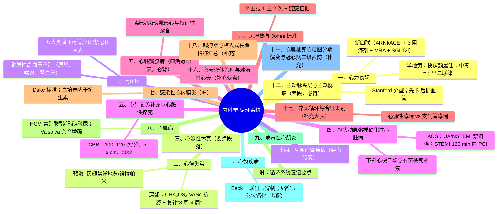
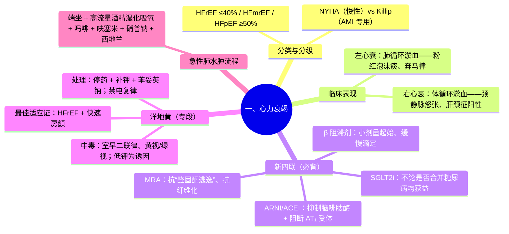
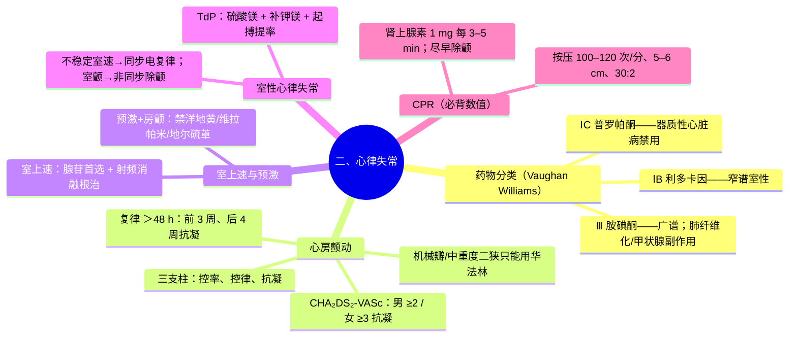
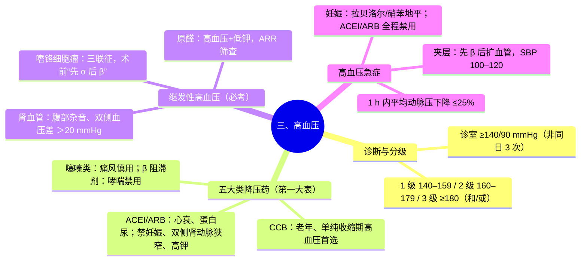
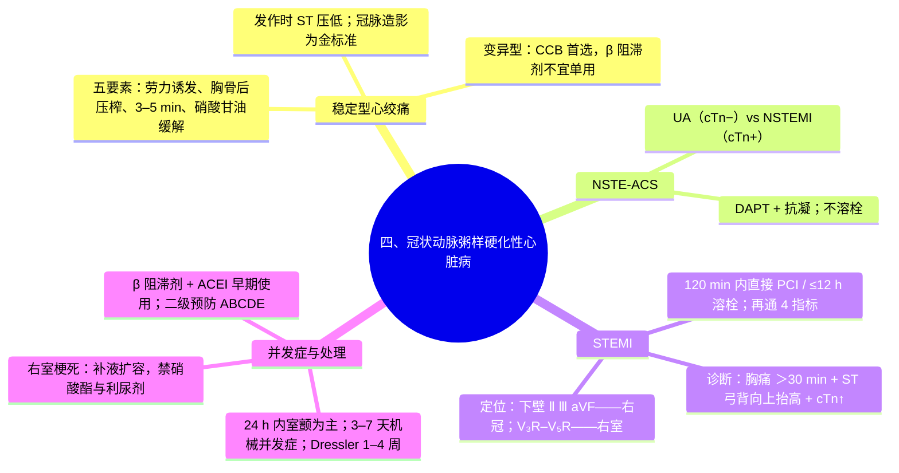

---
tags:
  - 考研306/内科学/循环系统
科目: 内科学
系统: 循环系统
内容: 心衰、心律失常、高血压、冠心病、瓣膜病、感染性心内膜炎、心肌病、心包疾病
---
# 内科学·讲义精讲版——02 循环系统

> 覆盖：心力衰竭（含急性左心衰、洋地黄）、心律失常、心脏骤停与CPR、高血压、冠心病（稳定心绞痛/ACS）、心脏瓣膜病、风湿热、感染性心内膜炎、心肌病、心肌炎、心包疾病。
> 用法：循环系统是 306 分值最高的系统之一，"新四联各药机制""房颤抗凝评分""五大降压药对比""STEMI 定位与并发症"四大块为必考主轴。
> 建议一轮逐病精读，把每张对比表抄写一遍；二轮只看各病"高频考点提示"。

---

## 一、心力衰竭

### 1.1 定义与分类
- 心衰是各种心脏结构/功能异常导致**心室收缩和/或舒张功能障碍**，进而引起一组复杂临床综合征；核心病理生理是**神经内分泌系统（RAAS 与交感神经）长期激活**，导致心肌重构——这正是现代药物治疗的靶点。
- **按射血分数分类（必背）**：
  - **HFrEF（射血分数降低的心衰）**：LVEF ≤40%；
  - **HFmrEF（射血分数轻度降低）**：LVEF 41%–49%；
  - **HFpEF（射血分数保留的心衰）**：LVEF ≥50%（舒张功能障碍为主，常见于高血压、糖尿病、肥胖老年女性）。
- 按部位：左心衰（肺循环淤血）、右心衰（体循环淤血）、全心衰；按发生速度：急/慢性。

### 1.2 病因与诱因
- 病因：**冠心病（最常见）、高血压**、瓣膜病、心肌病、心肌炎、先心病、甲亢/甲减等。
- 诱因（必背）：**感染（呼吸道感染最常见）**、**心律失常（心房颤动最常见）**、血容量增加（输液过多过快、钠盐摄入）、过度劳累/情绪、妊娠分娩、贫血、甲亢、不恰当停药（尤其洋地黄）、肺栓塞。

### 1.3 心功能分级（两大体系必背）

| 分级 | NYHA（适用慢性心衰，按主观症状） | Killip（仅用于急性心肌梗死心衰，按体征） |
|---|---|---|
| Ⅰ 级 | 日常活动不受限 | 无心衰 |
| Ⅱ 级 | 日常活动轻度受限（日常活动即气促/乏力） | 肺部湿啰音范围 **<50% 肺野** |
| Ⅲ 级 | 活动明显受限（轻于日常活动即症状） | 全肺湿啰音，**>50% 肺野，可伴奔马律** |
| Ⅳ 级 | 休息时也有症状 | **心源性休克（SBP<90 mmHg 等）** |

- ⚠ NYHA Ⅳ级休克的口径以教材为准；**NYHA 分级不能用于 AMI 早期**（AMI 用 Killip）。
- ACC/AHA 分期 A（危险因素）→B（结构改变无症状）→C（有症状）→D（终末期）——强调"分期不可逆"。

### 1.4 临床表现
- **左心衰——肺循环淤血 + 低排**：
  - 呼吸困难阶梯：劳力性 → 端坐呼吸 → **夜间阵发性呼吸困难** → 急性肺水肿（粉红色泡沫痰）；
  - 咳嗽咳痰、乏力、少尿；
  - 体征：双肺湿啰音（可伴哮鸣音——"心源性哮喘"）、**奔马律**、交替脉、原心脏体征。
- **右心衰——体循环淤血**：颈静脉怒张（最早）、肝大压痛 + **肝颈静脉回流征阳性**、下垂性凹陷性水肿（踝部开始）、胸腹水、发绀；三尖瓣区可闻收缩期吹风样杂音。
- 全心衰：两者并存；左衰症状因右衰（排血↓）反而可能减轻。

### 1.5 辅助检查
- **BNP/NT-proBNP**：排除诊断价值大（排除界值以下基本除外急性心衰；升高需结合临床）。
- **超声心动图**：测 LVEF、评价结构与舒张功能——**评估心功能的最重要手段**。
- X 线：心影增大、肺淤血（Kerley B 线）、肺水肿蝶翼状影。
- 血气、电解质、肝肾功能评估。

### 1.6 慢性 HFrEF 治疗——"新四联"（必背，逐药机制）
- 治疗目标：缓解症状、防止重构、降低死亡/住院。**"新四联"为基石，无禁忌应尽早、足量联用**：
  1. **ARNI/ACEI（或 ARB）**——沙库巴曲缬沙坦优先。机制：沙库巴曲抑制**脑啡肽酶**→利钠肽降解减少→利钠利尿、扩张血管、抑制 RAAS/交感；缬沙坦阻断 AT₁受体；双通路协同改善重构。⚠ 禁与 ACEI 同用（血管性水肿风险），转换需间隔 36 h。
  2. **β 受体阻滞剂**——琥珀酸美托洛尔、比索洛尔、卡维地洛三种有循证。机制：阻断交感过度激活→减慢心率、延长舒张期灌注、降低心肌耗氧、**上调 β₁ 受体密度**、抗心律失常（降低猝死）。要点：**小剂量起始、缓慢滴定至目标量**；急性失代偿期暂缓。
  3. **MRA（醛固酮受体拮抗剂）**——螺内酯、依普利酮。机制：对抗"醛固酮逃逸"→减少水钠潴留与**心肌纤维化**。注意：血钾 >5.0 mmol/L、eGFR 明显下降者慎用/禁用，监测高钾。
  4. **SGLT2 抑制剂**——达格列净、恩格列净。机制：抑制肾近端 SGLT2 → 排钠利尿减轻容量负荷、改善心肌能量代谢（酮体利用）、减轻炎症与氧化应激（部分机制仍在研究中）；**无论是否合并糖尿病均有获益**。
- 辅助药物：
  - **利尿剂（袢利尿剂为主）**：控制液体潴留、迅速缓解淤血症状**最有效**，但**不改善预后、不属"新四联"**；症状缓解后以最小有效量维持。
  - **地高辛**：正性肌力+减慢房室传导（兴奋迷走）；**改善症状、减少住院，不降低病死率**；适用于 HFrEF 合并**快速房颤**者最佳；治疗窗窄。
  - **伊伐布雷定**：窦性心律、**静息心率 ≥70 次/分、LVEF≤35%** 且已用最大耐受量 β 阻滞剂者——抑制窦房结 I_f 电流减慢心率。
  - 非药物：**CRT（QRS≥150 ms 且 LBBB、LVEF≤35%）**、**ICD（一级/二级预防猝死）**、心脏移植。
- ⚠ 心衰患者应避免：非二氢吡啶类 CCB（维拉帕米/地尔硫䓬）、Ⅰ类抗心律失常药、NSAIDs（水钠潴留）、噻唑烷二酮类。

### 1.7 急性左心衰竭（急性肺水肿）处理（必背流程）
- 诱因识别（常见：快速心律失常、高血压危象、感染、输液过量）。
- 处理顺序（"端、氧、吗、利、扩、强、通"）：
  1. **体位：端坐位、双腿下垂**（减少回心血量）；
  2. **吸氧：高流量 6–8 L/min，经 20%–30% 酒精湿化**（降低泡沫表面张力、去泡沫）；
  3. **吗啡 3–5 mg 静脉（缓慢）**：镇静 + 扩张静脉减轻前负荷——⚠ 禁忌：低血压/休克、COPD/呼吸抑制、意识障碍、颅内压增高；
  4. **利尿：呋塞米 20–40 mg 静脉**（快速扩血管效应先于利尿）；
  5. **血管扩张剂**：**硝普钠**（动静脉均扩，**高血压急症合并肺水肿首选**，避光、防氰化物蓄积）、硝酸甘油（静脉扩张为主）、重组人脑利钠肽（了解）；
  6. **正性肌力药**：**毛花苷 C（西地兰）——合并快速房颤者最佳**；低血压/低灌注者多巴胺（升压）或多巴酚丁胺、米力农；
  7. 机械通气：无创（CPAP/BiPAP）优先，必要时有创；主动脉内球囊反搏（IABP）用于心梗机械并发症等。
- ⚠ 处理原则：收缩压 >90 mmHg 才可用血管扩张剂；低灌注者优先正性肌力/升压。

### 1.8 洋地黄类药物（专段，必背）
- 机制：抑制心肌细胞膜 **Na⁺-K⁺-ATP 酶** → 细胞内 Na⁺↑ → Na⁺-Ca²⁺ 交换↓ → 细胞内 Ca²⁺↑ → **正性肌力**；同时兴奋迷走神经 → 减慢房室传导（负性频率/传导）。
- **适应证**：HFrEF 合并**快速心房颤动**（最佳适应证）；窦律的慢性收缩性心衰作为辅助。地高辛常规维持量小（治疗窗窄）。
- **禁忌/慎用**：**肥厚型梗阻性心肌病**、**预激综合征合并房颤**（抑制房室结→冲动经旁路下传→室颤）、Ⅱ/Ⅲ度房室传导阻滞（无起搏保护）、病态窦房结综合征、急性心梗 24 h 内慎用、低钾血症（易中毒）、与胺碘酮/维拉帕米/红霉素等合用时剂量减半（药代相互作用）。
- **中毒表现（必背）**：
  - **心律失常——最常见、最重要**：**室性早搏二联律/三联律（最常见）**、非阵发性交界性心动过速、房速伴房室阻滞、室速、缓慢性心律失常（特征之一：快速心律失常+传导阻滞并存）；
  - 胃肠道：恶心、呕吐（厌食常为早发信号）；
  - 神经系统/视觉：头痛、倦怠、**黄视/绿视**（视物模糊色觉异常——特征性）；
  - 诱因：低钾、低镁、高钙、肾功能减退、缺氧（肺心病）。
- **中毒处理（必背）**：①**立即停药**；②快速性心律失常：**补钾**（血钾低或正常时）、**苯妥英钠**（室性与室上性均可用，尤其伴传导阻滞者相对安全）、利多卡因（室性）；③缓慢性心律失常：阿托品，必要时临时起搏；④**严禁直流电复律**（易诱发室颤）——致命性心律失常时才用。
- 地高辛中毒重症：地高辛特异性抗体片段（Fab）。

### 1.9 高频考点提示
- ★ 新四联 = ARNI/ACEI + β 阻滞剂 + MRA + SGLT2i；利尿剂不改善预后。
- ★ 左衰看肺（粉红泡沫痰、奔马律）、右衰看体循环（颈静脉怒张、肝颈征）。
- ★ 洋地黄：适应证=心衰+快房颤；中毒最早信号=胃肠道/室早二联律；处理=停药+补钾+苯妥英钠/利多卡因；禁电复律。
- ★ 急性肺水肿口诀化处理：端坐、高流量酒精湿化吸氧、吗啡、利尿、硝普钠、西地兰。
- ★ 伊伐布雷定条件：窦律、HR≥70、EF≤35%、β 阻滞剂已足量。

> **相关知识点**：[[01-生理学-上#4.1 心脏泵血 ★★|心脏泵血（生理）]] ｜ [[02-体格检查#第 5 节 心脏检查|心脏检查（诊断）]] ｜ [[01-症状学#第 2 节 水肿|水肿（诊断）]] ｜ [[02-病理学-各论#6.5 心瓣膜病与心肌疾病|心瓣膜病与心肌疾病（病理）]] ｜ [[02-循环系统#五、心脏瓣膜病（四病对比表，必背）|心脏瓣膜病]] ｜ [[02-循环系统#二、心律失常|心律失常]]

---

## 二、心律失常

### 2.1 抗心律失常药物分类（Vaughan Williams，必背大表）

| 类别 | 机制 | 代表药物 | 主要应用/特点 |
|---|---|---|---|
| ⅠA 类 | 中度 Na⁺通道阻滞，延长 APD | 奎尼丁、丙吡胺（普鲁卡因胺） | 广谱；延长 QT |
| **ⅠB 类** | 轻度 Na⁺阻滞，缩短 APD | **利多卡因、美西律、苯妥英钠** | **窄谱（室性）**；洋地黄中毒首选之一 |
| **ⅠC 类** | 明显 Na⁺阻滞 | **普罗帕酮、氟卡尼** | 广谱；**心梗后/器质性心脏病禁用**（致心律失常） |
| **Ⅱ 类** | β 受体阻滞 | 美托洛尔、艾司洛尔、阿替洛尔 | 交感相关心律失常、**心梗后降低猝死**、控率 |
| **Ⅲ 类** | K⁺通道阻滞，延长复极 | **胺碘酮**、索他洛尔、伊布利特 | **广谱**；胺碘酮副作用——肺纤维化、甲状腺功能异常、肝损、角膜沉着 |
| **Ⅳ 类** | L 型 Ca²⁺通道阻滞 | **维拉帕米、地尔硫䓬** | 室上速、房颤控率；**负性肌力，心衰禁用** |
| 其他 | — | **腺苷/ATP**、洋地黄、硫酸镁、伊伐布雷定 | 腺苷半衰期极短——**终止室上速首选药物之一**（哮喘者慎用可改 ATP？⚠ 腺苷与 ATP 效果等同，哮喘非绝对禁忌，部分教材表述为慎用） |

### 2.2 心房颤动（房颤）
- 机制与表现：心房内折返/局灶激动，P 波消失代之以 **f 波（350–600 次/分）**，RR 绝对不齐，第一心音强弱不等，**脉短绌**；可致血栓栓塞（脑卒中为主）与心动过速性心肌病。
- 处理三大支柱：
  1. **心室率控制（控率）**：β 阻滞剂、非二氢吡啶 CCB、地高辛（单用或联合）；宽松控率（静息 <110 次/分）起步，症状不达标再从严（<80）。
  2. **节律控制（控律）**：药物复律（胺碘酮、普罗帕酮等——注意需按有无器质性心脏病选药）；**同步直流电复律**用于血流动力学不稳定者；**导管消融（肺静脉隔离）**——症状明显、药物无效者的根治手段。
  3. **抗凝（防栓塞）**：评分驱动。
- **CHA₂DS₂-VASc 评分（必背）**：充血性心衰 1；高血压 1；**年龄 ≥75 岁 2**；糖尿病 1；**卒中/TIA/血栓栓塞史 2**；血管疾病（心梗、外周动脉病、主动脉斑块）1；年龄 65–74 岁 1；女性 1。**男性 ≥2 分、女性 ≥3 分：抗凝（推荐）**；1 分：可考虑。
- 出血评估：**HAS-BLED** 评分（高分提示出血风险，需加强管理而非简单放弃抗凝）。
- 抗凝药：**华法林（INR 目标 2–3；药物/食物相互作用多，需监测）**；**NOAC/DOAC（利伐沙班、阿哌沙班、依度沙班——Xa 抑制剂；达比加群——直接凝血酶抑制剂）为多数非瓣膜性房颤首选**；机械瓣/中重度二尖瓣狭窄者**只能用华法林**。
- **复律前抗凝原则（必背）**：房颤持续时间 **>48 h 或未知**——复律前 **有效抗凝 3 周**、复律后 **4 周**；或经食管超声排除左房血栓后尽早复律（复律后仍抗凝 4 周）。

### 心房扑动与长 QT 综合征（补充要点）

- **心房扑动**：心电图见锯齿状 **F 波（250–350 次/分）**；房室多呈 **2:1 或 4:1 传导**（心室率常为规整的 150 或 75 次/分——**规整的 150 次/分心动过速应想到房扑 2:1 传导**）；处理原则同房颤（控率、复律、按 CHA₂DS₂-VASc 抗凝）；**峡部依赖型房扑射频消融成功率高（接近根治）**。
- **长 QT 综合征**：**QTc 延长（男 >470 ms/女 >480 ms 量级 ⚠ 界值需核对）+ 晕厥/多形性室速（TdP）史 ± 早发猝死家族史**；获得性——延长 QT 药物（ⅠA/Ⅲ类、大环内酯、抗精神病药）与低钾低镁；遗传性——KCNQ1、KCNH2 等突变；治疗——**停用诱因、补钾补镁、β 阻滞剂（LQT1/2 型）、高危者 ICD**。

### 2.3 阵发性室上性心动过速（室上速）
- 多为房室结折返或房室折返；突发突止、规律（150–250 次/分）、QRS 多窄。
- 终止发作：①**迷走神经刺激**（Valsalva、颈动脉窦按摩——先听诊除外杂音）；②**腺苷/ATP 静脉快速推注（首选药物）**；③维拉帕米（窄 QRS、血压可者）；④血流动力学不稳定——**同步电复律**。
- 根治：**导管射频消融（成功率极高，首选长期方案）**。

### 2.4 预激综合征与预激合并房颤（用药禁忌必考）
- 预激 = 房室旁路（Kent 束）；心电图：**PR 间期缩短、QRS 起始粗钝（δ 波）、继发 ST-T 改变**；可顺向型/逆向型 AVRT。
- **预激合并房颤**：QRS 宽大、心室率极快、不规则——可蜕变为室颤。
  - **禁用：洋地黄、维拉帕米、地尔硫䓬**（阻断房室结 → 冲动更多经旁路下传 → 心室率更快 → 室颤）；
  - **可用：普罗帕酮、胺碘酮静脉**（同时抑制旁路与房室结）；**血流动力学不稳定者立即同步电复律**；
  - 根治：射频消融旁路。

### 2.5 室性心律失常
- **室性心动过速（室速）**：宽大畸形 QRS、≥3 个连续、>100 次/分；有器质性心脏病者多为恶性。
  - 血流动力学**不稳定**（低血压、意识障碍、胸痛、心衰）→ **同步电复律**；
  - 稳定者：**胺碘酮静脉（首选广谱）**、利多卡因、普罗帕酮（无器质性心脏病者）。
- **尖端扭转型室速（TdP）**：多形性室速伴**长 QT**，QRS 沿基线扭转；诱因：延长 QT 的药物（ⅠA/Ⅲ类、大环内酯、抗精神病药）、电解质紊乱（低钾、低镁）、遗传性长 QT。
  - 处理：①**硫酸镁静脉**（首选即刻措施）；②停用延长 QT 的药物；纠正低钾低镁；③**心室起搏或异丙肾上腺素**（提高心率、缩短 QT）；④反复发作者临时起搏保驾。
- **室颤/无脉性室速**：**非同步电除颤 + CPR**（见下节）。

### 2.6 缓慢性心律失常与起搏器指征
- 病态窦房结综合征：窦缓、窦性停搏、窦房阻滞，可伴"**慢-快综合征**"（心动过缓基础上发作房速/房颤——用药矛盾：快时抗心律失常药加重慢，慢时起搏）；有症状者**起搏器（双腔）**。
- 房室传导阻滞：Ⅰ度无需治疗；**Ⅱ度 Ⅱ 型（莫氏Ⅱ型）与 Ⅲ 度（完全性）**——易进展为高度阻滞，**有症状者植入永久起搏器**；急性心梗合并者可先临时起搏（下壁心梗 AVB 常为房室结缺血所致，多可逆；前壁心梗 AVB 提示广泛坏死，预后差）。
- 起搏指征要点：症状性心动过缓（晕厥、黑蒙、乏力）、Ⅱ度Ⅱ型/Ⅲ度 AVB 无论有无症状（合并相关疾病时）、慢-快综合征需药物联合者、颈动脉窦过敏致晕厥等。

### 2.7 心脏骤停与心肺复苏（CPR）
- 判断：**意识丧失 + 大动脉（颈/股动脉）搏动消失**即启动 CPR（不再要求听呼吸）。
- **生存链**：早期识别呼救 → 早期 CPR → 早期除颤 → 高级生命支持 → 复苏后综合管理。
- **基础生命支持（C-A-B，必背数值）**：
  - **胸外按压：频率 100–120 次/分，深度 5–6 cm**（成人），按压-放松比 1:1，尽量减少中断（<10 s）；
  - **按压：通气 = 30:2**（单人/双人均然；高级气道建立后按压持续、通气 10 次/分）；
  - 开放气道、人工呼吸；**尽早电除颤**（室颤/无脉室速——非同步，越早越好）。
- 高级生命支持：**肾上腺素 1 mg 静脉，每 3–5 min 重复**；室颤/无脉室速除颤无效或复发——**胺碘酮**（首剂 300 mg）；可逆病因 5H5T（低血容量、缺氧、酸中毒、低/高钾、低体温；张力性气胸、心包填塞、中毒、肺栓塞、冠脉血栓）。
- 复苏后：目标温度管理、维护脑灌注、病因治疗。

### 2.8 高频考点提示
- ★ ⅠB 窄谱室性（利多卡因）、ⅠC 器质性心脏病禁用、胺碘酮广谱+肺/甲状腺副作用。
- ★ CHA₂DS₂-VASc：男 ≥2、女 ≥3 抗凝；复律"3 周-4 周"抗凝规则。
- ★ 预激+房颤禁三药：洋地黄、维拉帕米、地尔硫䓬。
- ★ 尖端扭转型：硫酸镁+补钾镁+起搏；室颤：非同步除颤。
- ★ CPR 数值：100–120 次/分、5–6 cm、30:2、肾上腺素 1 mg/3–5 min。

> **相关知识点**：[[01-生理学-上#4.2 心肌电生理 ★★★|心肌电生理（生理）]] ｜ [[01-生理学-上#2.2 静息电位与动作电位 ★★|静息与动作电位（生理）]] ｜ [[04-心电图与器械检查#第 4 节 心律失常|心律失常心电图（诊断）]] ｜ [[02-循环系统#1.8 洋地黄类药物（专段，必背）|洋地黄类药物]] ｜ [[06-内分泌与代谢#一、Graves 病（弥漫性毒性甲状腺肿）|Graves 病·甲亢心（内科）]]

---

## 三、高血压

### 3.1 定义、分级与危险分层
- 诊室血压诊断标准：**≥140/90 mmHg**（非同日 3 次测量）；家庭自测 ≥135/85；24 h 动态均值 ≥130/80。测量前静坐休息 5 min。
- **分级（必背）**：

| 分级 | 收缩压（mmHg） | /舒张压（mmHg） |
|---|---|---|
| 正常 | <120 | 且 <80 |
| 正常高值 | 120–139 | 和/或 80–89 |
| **1 级（轻度）** | 140–159 | 和/或 90–99 |
| **2 级（中度）** | 160–179 | 和/或 100–109 |
| **3 级（重度）** | ≥180 | 和/或 ≥110 |
| 单纯收缩期高血压 | ≥140 | 且 <90（老年人多见） |

- 危险因素：年龄（男 >55、女 >65）、吸烟、血脂异常、糖耐量异常/糖尿病、肥胖、早发心血管病家族史、高同型半胱氨酸。
- 分层规则要点：**≥3 个危险因素 → 高危；有任何靶器官损害、糖尿病、CKD 3 期以上、临床并存疾病（冠心病、卒中等）→ 至少很高危**；3 级血压无其他危险因素即高危。
- 靶器官损害：心（LVH、心衰）、脑（腔隙性梗死、高血压脑病）、**肾（良性小动脉性肾硬化——夜尿增多、蛋白尿（+）~（++）、肾功能渐降）**、眼底（视网膜动脉硬化）、大血管（动脉粥样硬化、主动脉夹层）。我国高血压主要并发症/死因为**脑卒中**。

### 3.2 五大类降压药适应证/禁忌证对比大表（本系统第一大表，必背）

| 药物 | 代表药 | 优先适应证（强指征） | 主要禁忌/慎用 |
|---|---|---|---|
| **ACEI（普利类）** | 卡托普利、培哚普利 | **心衰、心梗后、左室肥厚、糖尿病肾病/蛋白尿、代谢综合征** | **妊娠、双侧肾动脉狭窄、高钾血症禁用；干咳（缓激肽蓄积）、血肌酐升高（升幅 >30% 停药）** |
| **ARB（沙坦类）** | 氯沙坦、缬沙坦 | 同 ACEI，不咳嗽 | 妊娠、双侧肾动脉狭窄、高钾 |
| **二氢吡啶 CCB（地平类）** | 氨氯地平、硝苯地平控释片 | **老年高血压、单纯收缩期高血压（首选）、合并稳定型心绞痛、盐敏感性**；无绝对禁忌 | 副作用：踝部水肿、面部潮红、牙龈增生、反射性心率增快 |
| **噻嗪类利尿剂** | 氢氯噻嗪、吲达帕胺 | **老年、盐敏感性、合并心衰**、顽固性高血压联合 | **痛风（升尿酸）禁用/慎用；低钾、低钠；影响糖脂代谢**（大剂量时） |
| **β 受体阻滞剂** | 美托洛尔、比索洛尔 | **心率快者、冠心病/心绞痛、心衰、快速心律失常、甲亢** | **支气管哮喘禁用（非选择性）；Ⅱ/Ⅲ度 AVB；运动员、外周血管病慎用；糖尿病者掩盖低血糖症状** |

- 联合方案：**ACEI/ARB + CCB 或 + 利尿剂**为经典组合；**不常规联用 ACEI+ARB**（副作用叠加）；三联可用 ACEI/ARB+CCB+利尿剂；β 阻滞剂与非二氢吡啶 CCB 联用慎重（严重心动过缓/AVB 风险）。

### 3.3 继发性高血压逐一鉴别（必考专段）

| 病因 | 关键线索 | 确认/治疗要点 |
|---|---|---|
| **肾实质性（继发性中最常见）** | 年轻 + 蛋白尿/血尿、水肿、肾功能异常 | 治原发病 + 降压（RAAS 阻断为主） |
| **肾血管性（肾动脉狭窄）** | 30 岁前高血压（大动脉炎，青年女性）/50 岁后急进性（动脉粥样硬化）；**上腹部血管杂音；双侧血压差 >20 mmHg；ACEI/ARB 后肌酐明显升高；反复肺水肿** | 确诊：肾动脉 CTA/造影；治疗：支架/旁路 + 药物 |
| **原发性醛固酮增多症** | **高血压 + 低血钾**（肌无力、周期性瘫痪、感觉异常）+ 代谢性碱中毒；夜尿多 | **ARR（醛固酮/肾素比值）升高筛查**；确诊：盐水输注/卡托普利抑制试验；腺瘤→手术；双侧增生→螺内酯 |
| **嗜铬细胞瘤/副神经节瘤** | **阵发性或持续性高血压 + 头痛、心悸、多汗"三联征"**；发作时血糖↑ | 定性：血/尿甲氧基肾上腺素类（MNs）；定位：CT/MRI±¹³¹I-MIBG；术前**α 阻滞剂准备 ≥2 周，"先 α 后 β"**；手术切除 |
| **库欣综合征** | 向心性肥胖、满月脸、紫纹、糖代谢异常 | 皮质醇节律消失、地塞米松抑制试验不受抑（详见内分泌册） |
| **主动脉缩窄** | 上肢血压 > 下肢血压、背部肩胛间杂音、股动脉搏动减弱 | 影像确诊；手术/介入 |
| **药物性/Liddle 综合征** | 激素、避孕药、拟交感药史；Liddle——低钾高血压但**醛固酮降低**（上皮钠通道激活突变） | 停药；Liddle 用阿米洛利（保钾排钠）+ 限钠 |

### 3.4 治疗
- 生活方式（基础）：限盐（NaCl <5–6 g/d）、减重（BMI<24）、规律运动、限酒、戒烟、心理平衡。
- 启动药物时机与目标：一般患者 <140/90，能耐受者进一步降至 130/80 左右；老年、体弱者个体化。
- 高血压急症 vs 亚急症：
  - **急症 = 血压显著升高 + 急性靶器官损害**（高血压脑病、急进型/恶性高血压、ACS、急性主动脉夹层、急性肺水肿、脑出血、子痫）——**静脉降压**；
  - **亚急症 = 血压显著升高但无急性靶器官损害**——口服药 24–48 h 内逐步降压。
- **高血压急症降压节奏（必背）**：初始 1 h 内平均动脉压下降**不超过 25%**；随后 2–6 h 降至 160/100–110 mmHg 左右；24–48 h 逐步降至正常水平。
- 常用静脉药：**硝普钠**（多数急症首选之一）、硝酸甘油（ACS/肺水肿）、**乌拉地尔**、尼卡地平、**拉贝洛尔**（妊娠、主动脉夹层可用）、酚妥拉明（嗜铬危象）。
- 特殊情形（必背）：
  - **主动脉夹层**：目标 SBP 100–120 mmHg、心率 <60——**先 β 阻滞剂再血管扩张剂**（防反射性心动过速、剪应力增大）；
  - **脑出血**：降压需谨慎个体化（明显升高时逐步控制，避免灌注骤降）；
  - **缺血性卒中**：一般不积极降压（除非拟溶栓需 <185/110 等）；
  - **嗜铬细胞瘤危象**：酚妥拉明/尼卡地平。

### 特殊人群降压要点（补充）

| 人群 | 首选/注意 |
|---|---|
| 老年人 | CCB、利尿剂/ACEI——小剂量起始、缓慢达标；防体位性低血压与跌倒 |
| **妊娠期高血压** | **可选用拉贝洛尔、硝苯地平、甲基多巴；⚠ ACEI/ARB 妊娠全程禁用（致胎儿肾损伤/羊水过少）**；子痫前期/子痫——**硫酸镁防治抽搐**+降压+适时终止妊娠 |
| 糖尿病/蛋白尿 | ACEI/ARB 优先（肾保护） |
| 慢性肾病 | ACEI/ARB±CCB；监测肌酐与血钾 |
| 缺血性卒中后 | 平稳达标、避免过快降压致低灌注 |

### 3.5 高频考点提示
- ★ 分级数值 + "和/或"规则；老年人单纯收缩期高血压首选 CCB。
- ★ ACEI 四大点：干咳、高钾、肌酐升幅 >30% 停药、双侧肾动脉狭窄/妊娠禁用。
- ★ 嗜铬"三联征"与"先 α 后 β"；原醛"高低 combo"（高血压+低钾+碱中毒、醛固酮高肾素低）。
- ★ 高血压急症 1 h MAP↓≤25%；夹层"先 β 后扩、SBP 100–120、HR<60"。

> **相关知识点**：[[01-生理学-上#4.4 心血管活动的调节 ★★|心血管活动的调节（生理）]] ｜ [[02-病理学-各论#6.2 高血压病 ★|高血压病（病理）]] ｜ [[02-循环系统#十二、主动脉夹层与主动脉瘤（专段，必背）|主动脉夹层]] ｜ [[06-内分泌与代谢#七、嗜铬细胞瘤与副神经节瘤（PPGL）|嗜铬细胞瘤（内科）]]

---

## 四、冠状动脉粥样硬化性心脏病

### 4.1 概述
- 冠心病 = 冠状动脉粥样硬化使管腔狭窄/痉挛/闭塞导致心肌缺血缺氧或坏死；临床分**慢性冠脉综合征（稳定型心绞痛等）**与**急性冠脉综合征（ACS = UA + NSTEMI + STEMI）**。
- 危险因素：血脂异常（LDL-C 为核心）、高血压、糖尿病、吸烟、年龄/家族史、肥胖等。

### 4.2 稳定型心绞痛
- **典型心绞痛五要素（必背）**：
  1. 诱因：劳力、情绪激动、饱餐、寒冷；
  2. 部位：**胸骨体中上段之后**，可放射至左肩、左臂内侧、颈、咽、下颌；
  3. 性质：**压榨、闷胀、紧缩感**（非针刺样锐痛）；
  4. 时程：**3–5 min**，一般不超过 15 min；
  5. 缓解：休息或**含服硝酸甘油 3–5 min 内缓解**。
- 发作时心电图：**ST 段水平/下斜型压低 ≥0.1 mV、T 波倒置，缓解后恢复**（发作间歇期静息心电图可正常）。
- 检查选择：运动负荷试验（阳性：ST 压低 ≥0.1 mV 持续 >2 min；**禁忌：不稳定心绞痛、心梗急性期、严重心律失常、梗阻性肥厚型心肌病、失代偿心衰等**）；**冠脉 CTA**（阴性预测值高，适于中低危筛查）；**冠脉造影（金标准，狭窄 ≥50% 为有意义病变）**。
- 治疗：
  - 发作时：**硝酸甘油 0.5 mg 舌下含服**（5 min 不缓解可重复，最多 3 次；⚠ 收缩压低、近期用 5 型 PDE 抑制剂如西地那非者禁用——严重低血压）；
  - 缓解期 **ABCDE**：**A**——抗血小板（阿司匹林）+ ACEI/ARB；**B**——**β 阻滞剂（降低心肌耗氧、改善预后，劳力性心绞痛基础用药）**+ 血压；**C**——**他汀调脂（极高危 LDL-C 目标 <1.8 mmol/L，越低越好）**+ 戒烟；**D**——饮食、控糖；**E**——运动、教育；
  - 变异型（血管痉挛性）心绞痛：**CCB（地尔硫䓬/氨氯地平）首选**，**β 阻滞剂不宜单用**（可能加重痉挛）；
  - 血运重建：药物难控、左主干/三支病变（**CABG 优先**）、糖尿病多支病变等。

### 4.3 UA/NSTEMI（NSTE-ACS）
- **UA 与 NSTEMI 的分界：肌钙蛋白（cTn）**——cTn 阴性 → UA；cTn 升高 → NSTEMI（心电图多无 ST 持续抬高）。
- **危险分层（GRACE/TIMI 评分）决定介入时机**：极高危（血流动力学不稳、难治性胸痛、恶性心律失常等）——**2 h 内**介入；高危——**24 h 内**；中危——72 h 内；低危——可先药物、择期。
- **抗栓（必背）**：
  - **双联抗血小板（DAPT）**：**阿司匹林负荷 300 mg（嚼服）+ P2Y12 抑制剂**（替格瑞洛负荷 180 mg 或氯吡格雷 300–600 mg）；
  - **抗凝**：低分子肝素/普通肝素/磺达肝癸钠（按出血风险）；
  - **⚠ UA/NSTEMI 不溶栓**（已属不稳定斑块，溶栓反而促凝、增加风险）。
- 其他：β 阻滞剂、硝酸酯、他汀强化；发作时吸氧、吗啡镇痛。

### 4.4 STEMI（急性 ST 段抬高型心肌梗死）
- **诊断（必背）**：缺血性胸痛 **>30 min、硝酸甘油不缓解** + **≥2 个相邻导联 ST 段弓背向上抬高** + 动态演变 + **cTn 升高**；新发 LBBB 伴缺血症状按 STEMI 处理。
- **再灌注策略——"时间就是心肌"（必背）**：
  - 首选**直接 PCI**：**首诊至导丝通过 ≤120 min**（发病 12 h 内）；
  - 无 PCI 条件且不能及时转运 → **静脉溶栓（发病 ≤12 h）**：阿替普酶/瑞替普酶/尿激酶等；**溶栓后无论成败均应转运 PCI**；
  - **溶栓再通指标（必背 4 条）**：①2 h 内胸痛基本缓解；②ST 段回落 ≥50%；③再灌注性心律失常（加速性室性自主律等）；④CK-MB 峰值前移（<14 h）。
- **溶栓禁忌**：既往任何时间脑出血史、脑血管结构异常、缺血性卒中 6 个月内、活动性内出血、可疑主动脉夹层、近期大手术/创伤、严重未控高血压（>180/110）等。
- 基础治疗：卧床、监护、吸氧（SpO₂<90% 时）、**吗啡镇痛（⚠ 下壁/右室梗死慎用——抑制迷走/扩容依赖状态）**；DAPT+抗凝（肝素）、**β 阻滞剂（24 h 内无禁忌即用——缩小梗死面积、防猝死）**、**ACEI（24–48 h 内，前壁心梗/EF 低者获益最大）**、他汀；**下壁+右室梗死慎用硝酸酯与利尿剂**（前负荷依赖）。
- **定位诊断与罪犯血管（必背表）**：

| 梗死部位 | 导联 | 罪犯血管 |
|---|---|---|
| 前间壁 | V₁–V₃ | 前降支（间隔支） |
| 前壁 | V₃–V₅ | 前降支 |
| 广泛前壁 | V₁–V₅（±I、aVL） | **前降支近段** |
| 侧壁 | I、aVL、V₅–V₆ | 回旋支/对角支 |
| **下壁** | **Ⅱ、Ⅲ、aVF** | **右冠脉多见（少数回旋支）** |
| 正后壁 | V₇–V₉（V₁–V₃ 镜像高 R 波） | 回旋支 |
| **右心室** | **V₃R–V₅R（尤其 V₄R ST 抬高）** | 右冠脉近段 |

- **并发症（必背大段）**：
  1. **心律失常——24 h 内最重要，室颤为主要早期死因**：前壁——室性心律失常多；**下壁——缓慢性心律失常与 AVB 多（右冠供房室结）**；
  2. **心源性休克（Killip Ⅳ）**：大面积坏死；
  3. **机械并发症（多发生在 1 周内，3–7 天高危）**：**乳头肌断裂**（二尖瓣关闭不全、心尖区收缩期杂音、急性肺水肿）、**室间隔穿孔**（胸骨左缘 3–4 肋间粗糙收缩期杂音+震颤、迅速心衰）、**心室游离壁破裂**（猝死、心包填塞）；
  4. **室壁瘤**：**ST 段持续抬高**（数月）、心影局部膨出、附壁血栓——抗凝；
  5. 附壁血栓/栓塞：前壁大面积高危，抗凝；
  6. **梗死后综合征（Dressler）**：1–4 周后出现发热、胸痛、心包炎/胸膜炎（自身免疫性），激素/NSAIDs 有效；
  7. **右室梗死专段**：下壁心梗 + **V₄R ST 抬高** + 低血压 + 颈静脉怒张（Kussmaul 征可阳性）**而肺野清晰（无肺淤血）**——治疗：**快速补液扩容维持右室前负荷**，**禁用硝酸酯、禁用利尿剂**。

### 4.5 高频考点提示
- ★ 心绞痛五要素；硝酸甘油 3–5 min 缓解；运动试验禁忌。
- ★ UA（cTn−）vs NSTEMI（cTn+）；NSTE-ACS 禁溶栓；DAPT+抗凝。
- ★ STEMI：120 min 直接 PCI / ≤12 h 溶栓；再通 4 指标；β 阻滞剂+ACEI 早期使用。
- ★ 下壁心梗三连：Ⅱ Ⅲ aVF 抬高、AVB/心动过缓、慎硝酸酯+补液（合并右室梗）。
- ★ 机械并发症时间窗 3–7 天；Dressler 1–4 周。

> **相关知识点**：[[02-病理学-各论#6.1 动脉粥样硬化（AS）★|动脉粥样硬化（病理）]] ｜ [[04-心电图与器械检查#第 3 节 心肌缺血与心肌梗死|心肌缺血与心梗心电图（诊断）]] ｜ [[03-实验室检查#第 8 节 心肌标志物时间轴（必背大表）|心肌标志物（诊断）]] ｜ [[02-循环系统#十一、心肌梗死心电图分期演变与冠心病二级预防（补充）|心梗心电图分期与二级预防]]

---

## 五、心脏瓣膜病（四病对比表，必背）

### 5.1 四病对比大表

| 项目 | 二尖瓣狭窄 | 二尖瓣关闭不全 | 主动脉瓣狭窄 | 主动脉瓣关闭不全 |
|---|---|---|---|---|
| 最常见病因 | **风湿热** | 风湿性、**二尖瓣脱垂**、冠心病（乳头肌功能不全）、腱索断裂 | **老年退行性钙化（最常见）**、风湿、先天性二叶瓣 | 风湿、主动脉根部扩张（**高血压、马凡、夹层**）、感染性心内膜炎 |
| 血流动力学 | **左房压↑→肺淤血→肺动脉高压→右室肥大**（左室不大） | 左房、左室容量负荷↑ | **左室压力负荷↑→向心性肥厚→冠脉供血相对不足** | 左室容量负荷↑→离心性扩大 |
| **特征性杂音** | **心尖区舒张中晚期隆隆样杂音（局限、不传导）** | **心尖区全收缩期吹风样杂音，向左腋下/左肩胛下传导** | **胸骨右缘第 2 肋间收缩期喷射性杂音，向颈动脉传导** | **胸骨左缘第 3 肋间舒张期叹气样杂音（坐位前倾、呼气末最响）** |
| 其他听诊 | **S₁ 亢进、开瓣音、P₂ 亢进；Graham Steell 杂音**（肺动脉扩张的相对性肺动脉瓣关闭不全） | **S₁ 减弱**、S₃ | **S₂ 反常（逆）分裂**、A₂ 减弱 | 脉压增大周围血管征、**Austin-Flint 杂音**（相对性二尖瓣狭窄的舒张期隆隆音） |
| **心影** | **梨形心**（左房大+肺动脉段凸+右室大，**左室不大**） | **球形心**（左房+左室大） | 左室大、心腰凹陷（近似靴形） | **靴形心**（左室大+心腰凹陷） |
| 典型症状 | 劳力性呼吸困难、咯血、声嘶（扩大的左房压喉返神经）、房颤 | 疲乏、劳力性呼吸困难 | **心绞痛、晕厥、呼吸困难"三联征"** | 心悸、头部搏动感、劳力性呼吸困难 |
| 并发症 | **房颤（最常见）**、血栓栓塞、急性肺水肿、右心衰、感染性心内膜炎（少） | 房颤、感染性心内膜炎、心衰 | **猝死**、心衰、房颤 | 感染性心内膜炎、心衰、心律失常 |
| 药物治疗要点 | 利尿剂缓解淤血；**房颤抗凝（CHA₂DS₂-VASc）**；**忌用/慎用扩血管药与洋地黄**（单纯窦律狭窄者无益） | 减轻后负荷（ACEI 等）对慢性反流有益；急性者需急诊手术 | **药物几乎无效；血管扩张剂禁用/慎用**（血压难维持） | 血管扩张剂（减轻反流） |
| **治疗关键** | **经皮球囊二尖瓣成形术（PBMV）为单纯中度以上狭窄、瓣膜条件好者的首选**；瓣膜条件差/合并中度以上反流→置换 | 症状性重度反流：**二尖瓣修复（优先）/置换** | **一旦出现症状（痛、晕、喘）即为手术（瓣膜置换）指征**；高危不能手术者 TAVR | 症状性重度反流或左室进行性扩大：瓣膜置换（±根部手术） |

### 5.2 机制理解（为什么）
- **二尖瓣狭窄为什么是"梨形心"**：狭窄只挡住"入口"，血液淤在**左房**→左房扩大；继而肺淤血→**肺动脉高压**→肺动脉段膨出+右室肥大；左室血流量反而减少，故**左室不大**——三种成分构成"梨形"。
- **主动脉瓣狭窄为什么症状三联+猝死**：瓣口缩小→左室射血阻力↑→肥厚但冠脉储备↓（肥厚心肌供血相对不足）→**心绞痛**；运动时外周血管扩张而心输出不能同步↑→**晕厥**；长期压力负荷→舒张功能不全/收缩衰竭→**呼吸困难**；恶性心律失常→猝死。
- **主动脉瓣关闭不全为什么脉压大**：舒张期血液反流回左室→舒张压↓，而收缩期左室每搏量↑→收缩压↑→**脉压增大**→水冲脉、枪击音、毛细血管搏动征、Duroziez 双期杂音。

### 5.3 高频考点提示
- ★ 梨形心=二尖瓣狭窄；靴形心=主动脉瓣病变；球形心=二尖瓣关闭不全。
- ★ 开瓣音提示瓣膜弹性尚好（PBMV 适应证佳）；Graham Steell 杂音见于肺动脉高压扩张。
- ★ 主狭三联症状即手术指征；主闭周围血管征四项。
- ★ 二尖瓣狭窄房颤→抗凝。

> **相关知识点**：[[02-病理学-各论#6.3 风湿病 ★★|风湿病（病理）]] ｜ [[02-体格检查#5.11 各瓣膜区器质性杂音配对表（必背）|瓣膜区杂音（诊断）]] ｜ [[01-生理学-上#4.1 心脏泵血 ★★|心脏泵血（生理）]] ｜ [[02-循环系统#六、风湿热与 Jones 标准|风湿热]] ｜ [[02-循环系统#七、感染性心内膜炎（IE）|感染性心内膜炎]]

---

## 六、风湿热与 Jones 标准

- 定义：A 组乙型溶血性链球菌感染后发生的全身结缔组织**自身免疫性炎症**，主要累及心脏与关节；是风湿性心脏瓣膜病（尤其二尖瓣）的根源。
- 机制：链球菌抗原与心脏/结缔组织**交叉免疫反应**（分子模拟）。
- **Jones 诊断标准（必背）**：
  - **主要表现（5 项）**：**心脏炎**（最重要——心肌、心内膜、心包；致瓣膜炎）、**游走性多发性关节炎**（大关节、对称、红肿热痛、功能可完全恢复）、**舞蹈病**（链球菌感染后数月出现，女孩多）、**环形红斑**、**皮下结节**；
  - **次要表现**：关节痛、发热、ESR 增快/CRP 阳性、P-R 间期延长；
  - **前驱链球菌感染证据**：咽拭子培养或 **ASO 等抗体升高**；
  - 判定：**2 项主要，或 1 项主要 + 2 项次要**，且有前驱链球菌感染证据。
- 治疗：①清除链球菌：青霉素；②抗炎：**阿司匹林**（关节炎为主）；**糖皮质激素（心脏炎为主）**；③舞蹈病对症（镇静）。
- **继发预防（必考）**：**苄星青霉素（长效青霉素）肌注**定期预防复发——心脏受累者长期甚至终生预防。

### 高频考点提示
- ★ 主要表现 5 项；"1 主 2 次 + 链感证据"。
- ★ 关节炎用阿司匹林、心脏炎用激素；苄星青霉素继发预防。

> **相关知识点**：[[02-病理学-各论#6.3 风湿病 ★★|风湿病（病理）]] ｜ [[02-循环系统#五、心脏瓣膜病（四病对比表，必背）|心脏瓣膜病]]

---

## 七、感染性心内膜炎（IE）

### 7.1 病原与易感因素
- **亚急性（数周起病）**：**草绿色链球菌**最典型（口腔操作后）；基础瓣膜病者多。
- **急性（凶猛）**：**金黄色葡萄球菌**（**静脉药瘾者——三尖瓣受累**、皮肤软组织感染源）；正常瓣膜亦可受累。
- 人工瓣膜心内膜炎：早发——凝固酶阴性葡萄球菌；晚发——与自体瓣膜相似。
- 其他：肠球菌（泌尿生殖道操作）、HACEK 组、真菌（长期广谱/免疫抑制）。

### 7.2 临床表现与 Duke 诊断标准（必背）
- 临床四联：发热（最常见）+ 心脏杂音变化/新杂音 + **栓塞现象**（脑、脾、肾、肢体、冠脉；右心栓子致肺栓塞）+ 皮肤/免疫表现。
- 血管现象：瘀点、**Janeway 损害**（手掌足底无痛性出血斑）、感染性动脉瘤；免疫现象：**Osler 结节（指/趾垫痛性小结）**、**Roth 斑（视网膜出血白心斑）**、肾小球肾炎、RF 阳性。
- **Duke 标准**：
  - **主要标准**：①**2 次独立血培养**检出典型致病菌（草绿链、金葡等）；②**心内膜受累证据**——超声见**赘生物/脓肿/人工瓣新裂开**，或**新出现瓣膜反流**；
  - **次要标准**：易感心脏病/静脉药瘾；**发热 ≥38 ℃**；血管现象；免疫现象；微生物学证据（不符合主要标准的血培养阳性）；
  - 确诊：**2 主标 / 1 主 + 3 次标 / 5 次标**；疑诊：1 主 + 1 次 / 3 次标。
- ⚠ **血培养在抗生素应用前采，多次、足量**（一般 3 套以上，间隔取样）；经胸超声阴性而临床高度怀疑者做经食管超声（检出率高）。

### 7.3 治疗
- 原则：**先采血培养，再给予大剂量、长疗程（4–6 周）、静脉杀菌性抗生素**。
- 选药：草绿色链球菌——青霉素±庆大霉素（敏感者可短程联合）；金葡——耐酶青霉素/万古霉素（MRSA）；肠球菌——青霉素类+氨基糖苷；真菌——抗真菌药+手术。
- **手术指征（必背）**：①**瓣膜功能障碍致心衰**（最重要）；②**难控性感染**——持续菌血症/发热 >5–7 天（有效抗生素下）、真菌性 IE、瓣周脓肿/瘘；③**大赘生物（>10 mm）**尤其伴一次以上栓塞事件（防再栓塞）；④人工瓣膜心内膜炎（尤其早发）。
- 预防：高危人群（人工瓣膜、既往 IE、某些发绀型先心病、瓣膜成形材料）进行牙科等易出血操作前预防性抗生素。

### IE 抗生素方案要点（补充）

| 病原 | 方案要点 |
|---|---|
| 草绿色链球菌（青霉素敏感） | **青霉素 G 静脉 4 周 ± 庆大霉素（前 2 周）**；敏感者亦可用青霉素+庆大短程 2 周方案（⚠ 按指南核对） |
| 金黄色葡萄球菌 | 自体瓣膜——耐酶青霉素（苯唑西林/氟氯西林）±庆大霉素；**MRSA——万古霉素（或达托霉素）** |
| 肠球菌 | 大剂量青霉素类 + 氨基糖苷（协同杀菌），疗程延长 |
| 人工瓣膜早发（凝固酶阴性葡萄球菌） | 万古霉素 + 利福平 + 庆大霉素 |
| 真菌（念珠菌/曲霉） | 抗真菌药 + 手术（单靠药物极少治愈） |

- 疗效监测：抗生素后血培养转阴、体温正常、CRP 下降；**复发多发生在完成疗程后 2 个月内**——需随访。

### 7.4 高频考点提示
- ★ 亚急性=草绿链；急性/药瘾=金葡+三尖瓣。
- ★ Duke 主标两条；Osler（痛）/Janeway（不痛）/Roth 区别。
- ★ 手术指征：心衰、难控感染、大赘生物>10 mm。

> **相关知识点**：[[02-病理学-各论#6.4 感染性心内膜炎 ★|感染性心内膜炎（病理）]] ｜ [[02-循环系统#五、心脏瓣膜病（四病对比表，必背）|心脏瓣膜病]]

---

## 八、心肌病

### 8.1 三型对比（必背）

| 项目 | 扩张型心肌病（DCM） | 肥厚型心肌病（HCM） | 限制型心肌病（RCM） |
|---|---|---|---|
| 病理生理 | **全心扩大 + 收缩功能下降** | **室间隔不对称肥厚 + 左室流出道梗阻（LVOTO）**；舒张功能不全 | **心室壁僵硬、舒张充盈受限**（收缩多正常） |
| 病因 | 特发性/家族性（肌节/细胞骨架基因）、心肌炎后、酒精、围生期、化疗药（蒽环类） | **常染色体显性遗传（肌小节蛋白 MYH7、MYBPC3 突变）** | 淀粉样变、心内膜纤维化、嗜酸粒细胞增多症等 |
| 症状 | 心衰（呼吸困难、水肿）、心律失常、栓塞 | **劳力性呼吸困难、胸痛、晕厥/猝死**（年轻人运动猝死最常见原因之一） | 右心衰为主（颈静脉怒张、肝大、腹水），类似缩窄性心包炎 |
| 体征/超声 | 心腔扩大、EF↓、二/三尖瓣相对关闭不全 | **胸骨左缘 3–4 肋间收缩期喷射性杂音；SAM 征（二尖瓣收缩期前向运动）；不对称性室间隔肥厚** | 心房扩大、室壁不厚但僵硬、限制性充盈图形 |
| **杂音/血流动力学操作反应** | — | **减少前/后负荷（Valsalva、站立、硝酸甘油、利尿）→ 梗阻加重 → 杂音增强；增加前负荷（下蹲、抬腿）→ 杂音减弱** | — |
| **治疗要点** | 同 HFrEF（新四联）+ **ICD/CRT**；心衰终末期移植 | **β 阻滞剂（首选）或维拉帕米**缓解症状；**禁用：硝酸酯类、正性肌力药（洋地黄/多巴胺）、大剂量利尿剂**（加重梗阻）；高危猝死者 **ICD**；药物难治性梗阻——**室间隔心肌切除术/酒精室间隔消融**；避免竞技运动 | 无特异治疗——利尿缓解淤血、治原发病（淀粉样变化疗）；移植 |
| 鉴别 | — | 与主动脉瓣狭窄鉴别（杂音位置、传导、第二心音） | **与缩窄性心包炎鉴别：后者心包钙化、Kussmaul 征明显、心包叩击音** |

### 8.2 肥厚型心肌病专段（必考）
- 基因与家族史：常染色体显性，家族筛查重要。
- **"用药禁忌"三件套**：硝酸酯类（扩静脉↓前负荷→梗阻↑）、正性肌力药（收缩↑→梗阻↑）、大剂量利尿剂（容量↓→梗阻↑）；此外**避免 β 阻滞剂与非二氢吡啶 CCB 以外的扩血管降压药**。
- 猝死危险分层：家族猝死史、不明原因晕厥、极度室壁增厚、非持续性室速、运动血压反应异常等——高危者 ICD。

### 8.3 高频考点提示
- ★ HCM 杂音"Valsalva 增强、下蹲减弱"。
- ★ HCM 禁三药：硝酸酯、强心药、大剂量利尿。
- ★ DCM = 扩大 + EF↓；RCM 与缩窄性心包炎鉴别靠心包钙化等。

> **相关知识点**：[[02-病理学-各论#6.5 心瓣膜病与心肌疾病|心瓣膜病与心肌疾病（病理）]] ｜ [[02-循环系统#一、心力衰竭|心力衰竭]]

---

## 九、病毒性心肌炎

- 病因：**柯萨奇 B 组病毒最常见**；病前 1–3 周常有**上呼吸道或肠道病毒感染史**。
- 临床：感染后心悸、胸闷、胸痛、乏力，重者心律失常、心衰、心源性休克（暴发性心肌炎——青少年猝死重要原因之一）。
- 检查：**cTn、CK-MB 升高**、病毒抗体/核酸、ECG ST-T 改变与各种心律失常、超声心功能与室壁运动；心内膜心肌活检为确诊金标准但临床少用。
- 诊断要点：感染史 + 心脏症状体征 + 心肌损伤证据（cTn↑/心电图改变/心功能异常），并排除其他心肌病、冠心病。
- **治疗**：**休息是核心**（急性期卧床、忌剧烈运动——猝死风险）；营养心肌、对症支持；重症（暴发性）——**机械循环支持（ECMO）**、临时起搏，可考虑激素/免疫球蛋白；遗留心律失常者长期随访。

### 高频考点提示
- ★ 柯萨奇 B 组 + 感染后 1–3 周 + cTn↑；休息为首要治疗。

> **相关知识点**：[[02-循环系统#八、心肌病|心肌病]]

---

## 十、心包疾病

### 10.1 急性心包炎
- 病因：**特发性/病毒性最常见**；结核、细菌化脓性、肿瘤、尿毒症、心梗后（Dressler）、结缔组织病。
- 表现：胸痛（尖锐、与呼吸体位相关，**前倾坐位减轻、仰卧加重**）、**心包摩擦音**（胸骨左缘 3–4 肋间、抓搔样、心房收缩-心室收缩-心室舒张三相）。
- **心电图（必背）**：**广泛导联 ST 段弓背向下（凹面向上）抬高、aVR/V₁ 压低、PR 段压低**；无病理性 Q 波；数日后 ST 回落出现 **T 波倒置**。
- 治疗：病因治疗 + NSAIDs/秋水仙碱（特发性/病毒性，减少复发）；大量积液压塞则穿刺。

### 10.2 心包积液与心脏压塞
- 心包积液：心界向两侧扩大（烧瓶心）、**心音遥远**、**Ewart 征**（大量积液压迫左肺——左肩胛下区浊音、支气管呼吸音）；ECG **低电压 + 电交替**。
- **心脏压塞——Beck 三联征（必背）**：**低血压、心音遥远、颈静脉怒张**；加 **奇脉**（吸气时收缩压下降 >10 mmHg）与呼吸困难；机制：积液快速积聚→心包内压↑→舒张充盈受限→每搏量↓。
- **治疗：紧急心包穿刺引流（救命措施）**；补液维持灌注为过渡。

### 10.3 缩窄性心包炎
- 病因：**结核性最常见（我国）**；化脓性、心脏术后、放疗后。
- 表现：**体循环静脉压升高为著**——颈静脉怒张（**Kussmaul 征：吸气时颈静脉怒张更明显**——右心充盈不能随吸气增加）、肝大、**腹水重而下肢水肿相对轻**（特征）；心尖搏动减弱、**心包叩击音**；脉压小、奇脉少见。
- 辅助：**X线心包钙化（特征）**、CT/MRI 心包增厚；ECG 低电压、T 波改变。
- 鉴别：与限制型心肌病鉴别——**心包钙化/增厚、心房大、房室沟"缢痕"样改变提示缩窄**。
- **治疗：心包切除术**（唯一根治），术前改善营养与利尿；结核者术后继续抗结核。

### 10.4 高频考点提示
- ★ 心包炎 ECG：广泛 ST 弓背向下抬高 + PR 压低 + 无 Q 波。
- ★ Beck 三联征 + 奇脉 = 压塞 → 立即穿刺。
- ★ 缩窄：Kussmaul 征、心包叩击音、心包钙化、腹水>下肢水肿；治疗心包切除。

> **相关知识点**：[[02-体格检查#4.8 胸膜摩擦音 vs 心包摩擦音（屏气试验，必考）|心包摩擦音（诊断）]] ｜ [[02-循环系统#十七、常见循环综合征鉴别（补充大表）|缩窄性心包炎 vs 限制型心肌病]]

---

## 十一、心肌梗死心电图分期演变与冠心病二级预防（补充）

| 时期 | 心电图特征 |
|---|---|
| 超急性期（数分钟至数小时） | **T 波高尖（两肢对称）**，可无 ST 改变——最易漏诊 |
| 急性期（数小时至数天） | **ST 段弓背向上抬高**，与 T 波融合成"单向曲线"；R 波振幅渐减 |
| 亚急性期（数天至 2 周） | ST 段逐渐回落，**病理性 Q 波出现并加深**，T 波开始倒置 |
| 陈旧期（数月后） | **病理性 Q 波多残留**，T 波可恢复或持续倒置；**合并室壁瘤者 ST 段持续抬高** |

- 鉴别（必背）：**急性心包炎**——ST 弓背**向下（凹面向上）**、广泛导联、伴 PR 段压低、**无病理性 Q 波**；**应激性心肌病（Takotsubo）**——酷似前壁 STEMI，冠脉无固定狭窄、左室心尖球样扩张（常有应激诱因）；**主动脉夹层**——撕裂样痛、双侧血压差、纵隔增宽，累及冠脉开口时亦可表现为 STEMI。
- **冠心病二级预防（出院"ABCDE"，必背）**：**A**——抗血小板（DAPT）、ACEI/ARB；**B**——β 阻滞剂、控制血压；**C**——他汀强化（LDL-C <1.4–1.8 mmol/L 量级）、戒烟；**D**——饮食、控制血糖；**E**——运动康复、患者教育。

> **相关知识点**：[[04-心电图与器械检查#3.2 心肌梗死图形演变五期（必背）|心梗图形演变五期（诊断）]] ｜ [[02-循环系统#四、冠状动脉粥样硬化性心脏病|冠心病]]

## 十二、主动脉夹层与主动脉瘤（专段，必背）

### 12.1 定义与分型
- 主动脉夹层：血液经内膜破口进入主动脉壁中层形成真假两腔；危险因素——**高血压（最重要）、马凡综合征等遗传性结缔组织病、二叶式主动脉瓣、妊娠、外伤**。
- **Stanford 分型（必背）**：**A 型——累及升主动脉（无论破口位置）→ 首选急诊手术；B 型——仅累及降主动脉及以远 → 首选药物治疗（±腔内修复）**。DeBakey 分型（Ⅰ/Ⅱ/Ⅲ）了解即可。

### 12.2 临床表现
- 突发**撕裂样/刀割样剧烈胸背痛**，疼痛可沿夹层扩展方向迁移（加重与转移是病情进展标志），吗啡常不能完全缓解；
- **血压/脉搏不对称：双上肢或上下肢血压差 >20 mmHg、一侧脉搏减弱或消失**；
- 并发症：**新发主动脉瓣关闭不全（舒张期杂音——A 型）、心包积液/压塞（破入心包——猝死原因）、分支血管缺血**——冠脉开口受累（多为右冠→下壁心梗）、脑卒中、肾梗死/肾血管性高血压、肠系膜缺血、下肢缺血。

### 12.3 诊断与治疗
- **确诊首选 CTA**（主动脉全程成像）；血流动力学不稳者床旁经胸/经食管超声；X 线示上纵隔/主动脉增宽为提示；D-二聚体显著升高支持诊断，但不高**不能**排除临床高度可疑者。
- **治疗（必背）**：
  1. **降压降心率——"先 β 后扩血管"**：静脉 β 阻滞剂（艾司洛尔/拉贝洛尔）先控制心率至 <60 次/分 → 再用硝普钠/乌拉地尔将 SBP 降至 **100–120 mmHg**（在维持脏器灌注前提下取最低）；
  2. ⚠ **避免未先用 β 阻滞剂而单用血管扩张剂**（反射性心率增快、主动脉剪切力增大、夹层扩展）；
  3. **A 型——急诊外科手术**；B 型——药物控制后视进展/并发症行 **TEVAR（腔内覆膜支架修复）**；
  4. 镇痛（吗啡）、严密监护；**避免抗凝/抗血小板**（防出血与夹层扩展）。
- 胸主动脉瘤（要点段落）：多无症状（体检/影像偶然发现），压迫可致声嘶（喉返神经）、吞咽困难；**瘤径越大破裂/夹层风险越高**；治疗——控制血压+β 阻滞剂，达手术阈值（升主动脉 ≥5.5 cm 量级 ⚠ 数值需核对）行修复。

> **相关知识点**：[[01-症状学#第 5 节 胸痛|胸痛（诊断）]] ｜ [[02-循环系统#三、高血压|高血压]]

## 十三、心源性休克（要点段落）

- 定义：心脏泵功能衰竭导致的**持续性组织低灌注**：SBP<90 mmHg（或需升压药维持）+ 低灌注证据（意识改变、皮肤湿冷、尿量 <0.5 ml/(kg·h)、乳酸升高）± 肺淤血。
- 最常见病因：**急性心肌梗死**（大面积坏死或机械并发症——乳头肌断裂、室间隔穿孔、游离壁破裂）；其他：暴发性心肌炎、终末期心衰、心脏术后低心排。
- 处理（必背顺序）：①**血运重建（再灌注）为根本**；②容量评估（右室梗死/压塞者扩容，肺水肿者限液）；③**升压首选去甲肾上腺素**（多巴胺心律失常风险高），强心用多巴酚丁胺/米力农；④**机械循环支持：IABP（机械并发症辅助）、VA-ECMO、Impella（了解）**；⑤纠正可逆病因。
- ⚠ 心源性休克时慎用硝酸酯与利尿剂（进一步降低灌注）。

> **相关知识点**：[[02-循环系统#四、冠状动脉粥样硬化性心脏病|冠心病]] ｜ [[01-外科总论#四、外科休克|外科休克（外科）]]

## 十四、周围血管疾病（要点段落）

- **下肢动脉硬化闭塞症（ASO）**：老年、吸烟、糖尿病、血脂异常者；临床阶梯——**间歇性跛行 → 静息痛（夜间足痛、下垂位缓解）→ 缺血性溃疡/坏疽**；体征：足背/胫后动脉搏动减弱或消失、皮温低、毛发稀少、**Buerger 试验阳性（抬高患肢远端苍白、下垂后转潮红）**；**踝肱指数（ABI）<0.9 支持诊断、<0.4 提示重度缺血**。治疗：**戒烟（根本）**+他汀+抗血小板+运动康复；缺血加重者腔内/旁路重建。
- **血栓闭塞性脉管炎（Buerger 病）**：**青年男性重度吸烟者**，四肢中小动静脉节段性炎症、远端受累为主，伴游走性浅静脉炎、趾端缺血坏疽；**绝对戒烟是治疗核心**。
- **深静脉血栓形成（DVT）**：单侧下肢肿胀、疼痛压痛、周径增大（双侧对比测量），Homans 征可阳性；最大危险是**肺血栓栓塞（见呼吸系统册）**；治疗——**抗凝为基石**（LMWH 后 NOAC/华法林，一般 ≥3 个月），近端髂股型重症可溶栓/取栓；抗凝禁忌者下腔静脉滤器；急性期抬高患肢、弹力袜。
- **单纯性下肢静脉曲张**：浅静脉迂曲扩张、久站酸胀、足靴区色素沉着/湿疹/难愈性溃疡；Trendelenburg 试验（大隐静脉瓣膜功能）、Perthes 试验（深静脉通畅度）辅助评估；治疗——弹力袜、硬化剂、手术/激光闭合。

> **相关知识点**：[[01-呼吸系统#八、肺血栓栓塞症（PTE）|肺血栓栓塞症（内科）]] ｜ [[05-腹部外科#十七、周围血管疾病|周围血管疾病（外科）]]

## 十五、心肺复苏补充与心脏性猝死

- **心脏性猝死**：急性症状出现后 1 小时内因心脏原因的意外死亡；**80% 以上病因为冠心病**；其余——心肌病、离子通道病（长 QT、Brugada 综合征）、主动脉疾病。
- 猝死高危识别：**LVEF≤35% 的缺血性心衰、既往室速/室颤/不明原因晕厥、早发猝死家族史**——ICD 一级/二级预防。
- 高级生命支持补充：
  - 气道：球囊面罩 → 声门上气道/气管插管；高级气道建立后**按压持续不中断**（通气 10 次/分）；
  - 用药：**肾上腺素 1 mg 每 3–5 min**；可除颤心律（室颤/无脉室速）除颤不佳或复发——**胺碘酮首剂 300 mg**；症状性缓慢性心律失常——阿托品→起搏；
  - **ROSC（自主循环恢复）后管理**：目标温度管理（32–36 ℃ 量级 ⚠ 按指南版本核对）、维持 MAP≥65 mmHg、避免高/低氧、**尽快病因处理（5H5T）**、早期神经功能评估。
- 复苏终止：规范高级生命支持 ≥30 分钟仍无 ROSC 可考虑终止（低体温、药物中毒等可逆情形延长——具体按院内流程）。

> **相关知识点**：[[02-循环系统#二、心律失常|心律失常]] ｜ [[02-循环系统#2.7 心脏骤停与心肺复苏（CPR）|心脏骤停与心肺复苏]]

## 十六、心衰液体管理与难治性心衰（补充要点）

- 液体管理：每日晨起体重（控制增幅 ≤0.5–1 kg）、出入量记录；**限钠 <2–3 g/d（失代偿期更严）、重度低钠者限水 <1.5–2 L/d**。
- **利尿剂抵抗**：加量/静脉给药、袢利尿剂联合噻嗪类（"序贯性肾单位阻滞"）、超滤脱水。
- **难治性（D 期）心衰**：GDMT 最优化+器械治疗仍症状持续——评估**心脏移植或左室辅助装置（LVAD）**；间歇静脉正性肌力药（姑息过渡）。
- 心衰合并症：房颤（控率+按评分抗凝）、**缺铁（静脉补铁可改善症状与运动能力）**、糖尿病（**SGLT2i 优先**）、痛风、贫血、COPD（**可用选择性 β₁ 阻滞剂——COPD 不是 β 阻滞剂禁忌**）。

> **相关知识点**：[[02-循环系统#一、心力衰竭|心力衰竭]]

## 十七、常见循环综合征鉴别（补充大表）

### 心源性哮喘 vs 支气管哮喘

| 项目 | 心源性哮喘（急性左心衰） | 支气管哮喘 |
|---|---|---|
| 病史 | 高血压、冠心病、瓣膜病、心衰史 | 过敏史、幼年起病、反复喘息 |
| 痰 | **粉红色泡沫痰** | 白色黏痰 |
| 体征 | 双肺湿啰音为主+奔马律、心脏扩大 | 双肺弥漫哮鸣音、呼气延长 |
| 杂音 | 可有瓣膜杂音 | 无 |
| 试验治疗 | 利尿剂/血管扩张剂有效 | 支气管舒张剂有效 |
- ⚠ 鉴别不清时先按左心衰处理（吗啡禁用于呼吸抑制倾向者）。

### 缩窄性心包炎 vs 限制型心肌病

| 项目 | 缩窄性心包炎 | 限制型心肌病 |
|---|---|---|
| 心包 | **增厚/钙化**（CT 可见）、心包叩击音 | 心包正常 |
| 心脏 | 心房大、室壁无异常 | 心房大、**心内膜/心肌病变**（淀粉样物质沉积等） |
| 呼吸时压力变化 | **Kussmaul 征明显、吸气时充盈压下降 >25%**（"平台/平方根征"） | 不典型 |
| 治疗 | **心包切除术** | 治原发病（淀粉样变化疗）、移植 |

### 心脏各听诊区杂音速查（考试定位用）

| 部位 | 收缩期 | 舒张期 |
|---|---|---|
| 心尖区 | 二尖瓣关闭不全（吹风样→腋下传导） | 二尖瓣狭窄（隆隆样）；Austin-Flint |
| 胸骨右缘第 2 肋间 | 主动脉瓣狭窄（喷射样→颈部） | 主动脉瓣关闭不全（叹气样，胸骨左缘 3 肋间更典型） |
| 胸骨左缘 2–3 肋间 | 房间隔缺损（肺动脉瓣区相对性） | Graham Steell 杂音（肺动脉高压） |
| 胸骨左缘 3–4 肋间 | **室间隔缺损（粗糙全收缩期+震颤）**；**HCM 梗阻性** | —— |
| 胸骨下端/三尖瓣区 | 三尖瓣关闭不全（相对性——肺心病） | —— |
| 连续性 | **动脉导管未闭（胸骨左缘 2 肋间机器样连续性）** | （同一杂音跨双期） |

> **相关知识点**：[[01-呼吸系统#二、支气管哮喘|支气管哮喘（内科）]] ｜ [[02-循环系统#一、心力衰竭|心力衰竭]] ｜ [[02-循环系统#十、心包疾病|心包疾病]]

## 十八、起搏器与植入式装置指征汇总（补充）

| 装置 | 核心指征（考试口径） |
|---|---|
| **永久起搏器** | 症状性窦缓/窦性停搏；**Ⅱ度Ⅱ型与Ⅲ度 AVB**（有症状或高危）；慢-快综合征需药物保驾；颈动脉窦过敏晕厥 |
| **临时起搏** | 急性心梗合并高度 AVB、药物中毒/电解质致缓慢性心律失常过渡、围手术期保护 |
| **ICD** | 室颤/持续性室速幸存者（二级预防）；**HFrEF EF≤35% 伴猝死高危（心梗后 40 天以上评估）**、HCM 高危、长 QT 高危 |
| **CRT** | **窦律、QRS≥150 ms 且 LBBB、LVEF≤35%、NYHA Ⅲ–Ⅳ（最佳者：女性、非缺血、QRS 更宽）** |

> **相关知识点**：[[02-循环系统#二、心律失常|心律失常]]

## 附：循环系统速记要点

| 病/项目 | 一句话要点 |
|---|---|
| 心衰分级 | NYHA Ⅳ=静息症状；Killip Ⅲ=全肺啰音+奔马律、Ⅳ=休克 |
| 新四联 | ARNI/ACEI+β 阻滞+MRA+SGLT2i；利尿剂只改善症状 |
| 洋地黄 | 快房颤最佳；中毒=室早二联律+黄绿视；处理=停药+补钾+苯妥英；禁电复律 |
| 急性肺水肿 | 端坐+高流量酒精湿化+吗啡+呋塞米+硝普钠（SBP>90）+西地兰（快房颤） |
| 房颤 | CHA₂DS₂-VASc 男≥2/女≥3 抗凝；复律>48h 需前 3 周后 4 周抗凝；机械瓣只用华法林 |
| 预激+房颤 | 禁洋地黄/维拉帕米/地尔硫䓬；用普罗帕酮/胺碘酮；不稳→同步电复律 |
| TdP | 硫酸镁；停 QT 延长药；起搏提率 |
| CPR | 100–120 次/分、5–6 cm、30:2；肾上腺素 1 mg q3–5min；尽早除颤 |
| 降压药 | ACEI 干咳高钾；噻嗪痛风；β 阻滞剂哮喘；CCB 老年首选；ACEI+ARB 不联 |
| 高血压急症 | 1h MAP↓≤25%；夹层先 β 后扩血管、SBP 100–120 |
| 心绞痛 | 3–5 min、硝酸甘油缓解；运动试验禁忌；变异型用 CCB 禁单用 β |
| ACS | UA=cTn−、NSTEMI=cTn+；NSTE-ACS 禁溶栓；STEMI 120min PCI/12h 溶栓 |
| 心梗并发症 | 24h 内室颤为主；3–7 天机械并发症；Dressler 1–4 周；右室梗补液禁硝酸酯 |
| 瓣膜病 | 二狭=梨形+隆隆样+S₁ 亢进+开瓣音；主狭=三联即手术+扩血管禁用；主闭=叹气样+周围血管征 |
| 风湿热 | 2 主或 1 主 2 次+链感证据；心脏炎用激素；苄星青霉素预防 |
| IE | 血培养先于抗生素；Duke 2 主标；手术=心衰/难控感染/赘生物>10mm |
| HCM | Valsalva 杂音增强；禁硝酸酯/强心/利尿；高危 ICD |
| 心包 | ST 弓背向下+PR 压低；Beck 三联→穿刺；缩窄→心包钙化→切除 |
