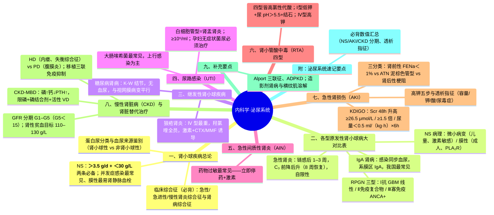
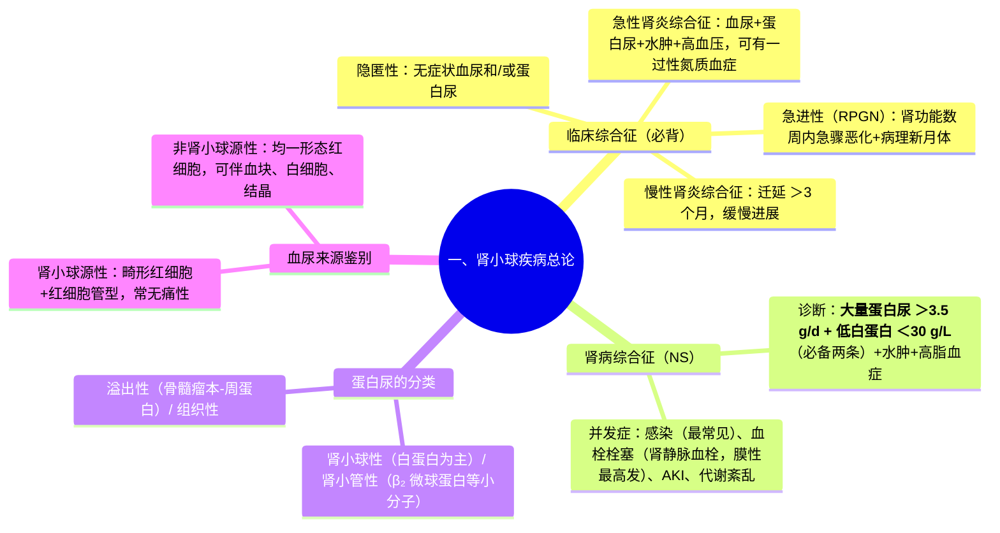
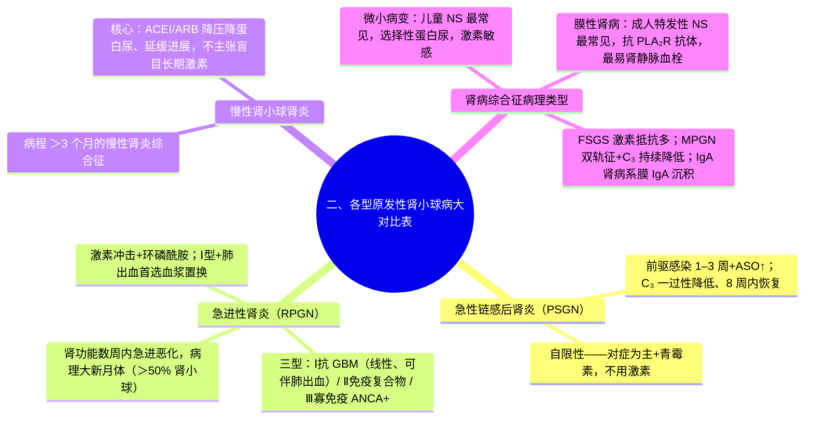
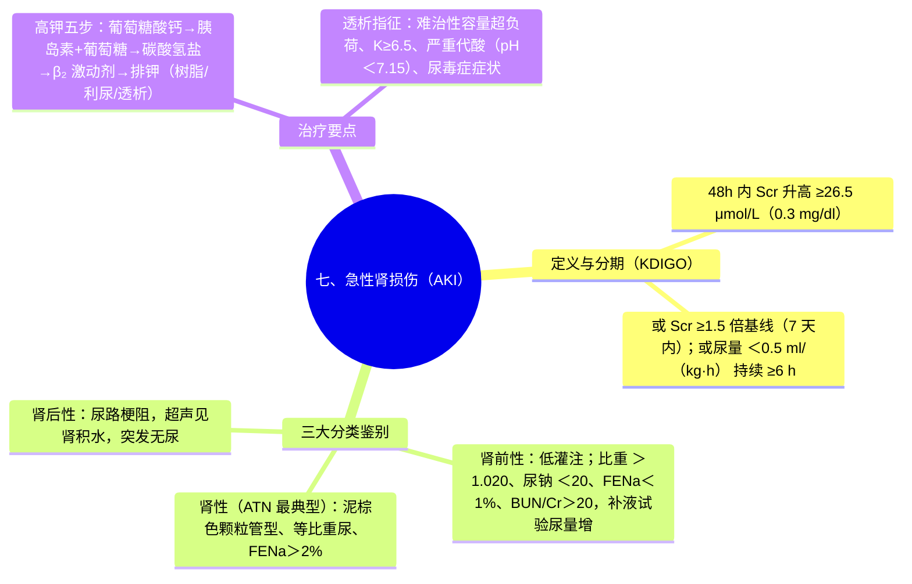

---
tags:
  - 考研306/内科学/泌尿系统
科目: 内科学
系统: 泌尿系统
内容: 肾小球病、尿路感染、AKI、CKD
---
# 内科学·讲义精讲版——04 泌尿系统

> 覆盖：肾小球疾病总论与临床综合征、各型原发性肾小球病大对比（光镜/电镜/荧光/临床/治疗）、继发性肾小球病（狼疮肾炎、糖尿病肾病）、尿路感染、急性间质性肾炎、肾小管酸中毒、AKI、CKD 与肾脏替代治疗。
> 用法：本系统最核心是"病理-临床-治疗"三位一体对照表，建议把各型肾小球病大表完整抄写一遍；AKI 三分类鉴别表与 CKD 管理为次核心。
> 数值类考点（NS 标准、KDIGO、透析指征）务必精确记忆。

---

## 一、肾小球疾病总论

### 1.1 发病机制
- **免疫介导炎症（核心）**：
  1. **循环免疫复合物沉积**（外源性/内源性抗原-抗体在循环形成，沉积于肾小球——如链感后肾炎、狼疮肾炎）；
  2. **原位免疫复合物形成**（抗体与植入肾小球内的抗原结合——如抗 GBM 肾炎、膜性肾病的 PLA₂R 抗原）；
  3. **细胞免疫**（T 细胞介导——微小病变、新月体形成）；
- **非免疫因素参与进展**（治疗靶点）：高血压、蛋白尿本身（肾小球高滤过）、高脂血症、肾小管间质损伤。
- 炎症介质：补体激活、细胞因子、中性粒细胞/单核巨噬细胞浸润等。

### 1.2 临床综合征（必背）
- **急性肾炎综合征**：急起血尿、蛋白尿、水肿、高血压，可伴一过性氮质血症（急性肾小球肾炎）；
- **急进性肾炎综合征**：肾炎综合征基础上肾功能**急骤（数周至数月）恶化**，病理见**新月体**；
- **慢性肾炎综合征**：蛋白尿、血尿、水肿、高血压迁延 >3 个月，缓慢进展；
- **肾病综合征（NS）诊断标准（必背）**：①**大量蛋白尿 >3.5 g/d**；②**低白蛋白血症 <30 g/L**；③水肿；④高脂血症。——**前两条为诊断必备**（后两条为表现）。
- **隐匿性（无症状性）肾炎**：无症状性血尿和/或蛋白尿，无水肿、高血压、肾功能损害。

### 1.3 NS 并发症（必背）
1. **感染**（最常见——大量 IgG 与补体丢失；肺炎链球菌腹膜炎经典）；
2. **血栓栓塞**——高凝（凝血因子↑、抗凝血酶Ⅲ丢失、血液浓缩）：**肾静脉血栓最经典（腰痛、血尿、蛋白尿加重），膜性肾病发生率最高**；
3. 急性肾损伤（低容量、管型堵塞）；
4. 蛋白质及脂质代谢紊乱（营养不良、加速动脉硬化）。

---

### 1.4 蛋白尿的分类与评估（必背）

| 类型 | 机制 | 代表 |
|---|---|---|
| **肾小球性** | 滤过屏障（电荷/孔径屏障）受损 | 各类肾小球疾病（以白蛋白为主；>3.5 g/d 为肾病综合征量蛋白尿） |
| **肾小管性** | 近端小管重吸收障碍 | 间质性肾炎、Fanconi 综合征（β₂ 微球蛋白等小分子蛋白为主，常 <2 g/d） |
| **溢出性** | 血中异常小分子蛋白过多 | **多发性骨髓瘤轻链蛋白、横纹肌溶解肌红蛋白** |
| 组织性 | 泌尿系组织蛋白释入尿 | 溶菌酶、分泌型 IgA 等 |

- 定量方法：**24 h 尿蛋白定量（经典标准）**；随机尿 **尿蛋白/肌酐比值（PCR）与尿白蛋白/肌酐比值（UACR）** 为替代（**UACR ≥30 mg/g 为白蛋白尿**，≥300 mg/g 为大量白蛋白尿）。
- **选择性蛋白尿**：尿中以中分子（白蛋白）为主、大分子蛋白（IgG、C₃）少——提示滤过屏障电荷屏障损伤为主，见于微小病变（与激素敏感性相关）。

### 1.5 血尿来源鉴别（必背）

| 项目 | 肾小球源性 | 非肾小球源性（外科性） |
|---|---|---|
| 红细胞形态 | **畸形红细胞为主（棘形、环状）** | 均一形态 |
| 尿沉渣伴随 | 红细胞管型、蛋白尿 | 血块、白细胞、结晶 |
| 代表疾病 | 各型肾炎、IgA 肾病、薄基底膜 | 结石、肿瘤、感染、外伤、胡桃夹现象 |

- 伴随线索：无痛性全程血尿+老年 → 警惕泌尿系肿瘤；血尿+腰痛+活动相关 → 结石；血尿+膀胱刺激征 → 感染；**运动后血尿 → 生理性或 IgA 肾病**。

### 1.6 肾性水肿机制（要点）
- **肾炎性水肿**：肾小球滤过率↓与球-管失衡 → 钠水潴留——特点为**晨起眼睑/颜面组织疏松部位水肿**；
- **肾病性水肿**：大量蛋白尿 → 低白蛋白 → 血浆胶体渗透压↓——特点为**下垂性水肿+浆膜腔积液**，程度常更重。

> **相关知识点**：[[02-病理学-各论#11.1 肾小球肾炎总论|肾小球肾炎总论（病理）]] ｜ [[03-实验室检查#第 4 节 尿液检查|尿液检查（诊断）]] ｜ [[01-生理学-上#第八章 尿的生成和排出 ★★★|尿的生成和排出（生理）]] ｜ [[04-泌尿系统#二、各型原发性肾小球病大对比表（本系统第一大表，必背）|各型原发性肾小球病大对比表]]

## 二、各型原发性肾小球病大对比表（本系统第一大表，必背）

| 项目 | 急性链球菌感染后肾炎（PSGN） | 急进性肾小球肾炎（RPGN） | 微小病变（MCD） | 膜性肾病（IMN） | 局灶节段性肾小球硬化（FSGS） | 膜增生性肾炎（MPGN） | IgA 肾病 |
|---|---|---|---|---|---|---|---|
| 好发人群 | **儿童**，前驱**咽部（1–3 周内）或皮肤感染**后 | 中老年为主（Ⅲ型）、青年（Ⅱ型） | **儿童 NS 最常见** | **中老年；成人特发性 NS 最常见** | 青少年、成人 | 中老年 | 青年，**我国最常见的原发性肾小球病** |
| 临床特征 | **急性肾炎综合征**（血尿、蛋白尿、水肿、高血压、一过性氮质）；**ASO↑** | 肾炎综合征+**肾功能数周内急进恶化（少尿型 AKI）** | 典型**肾病综合征**，**选择性蛋白尿**；光镜阴性 | 典型 NS 或无症状蛋白尿；**最易发生肾静脉血栓** | NS+高血压、肾功能进行性下降；激素抵抗多 | NS+肾炎综合征（混合）；**C₃ 持续降低** | **上感当天或 1–2 天内出现肉眼血尿（与 PSGN 的 1–3 周间隔相区别）**；无症状血尿/蛋白尿 |
| **光镜** | 内皮细胞+系膜细胞弥漫增生、中性粒细胞浸润 | **新月体（>50% 肾小球大新月体）** | **肾小球基本正常** | **GBM 弥漫增厚，上皮下免疫复合物、钉突形成** | **部分肾小球节段性硬化+玻璃样变** | **系膜细胞与基质重度增生插入 GBM——"双轨征"** | 系膜细胞与基质增生 |
| **电镜** | **上皮下"驼峰状"电子致密物** | 新月体内纤维蛋白、GBM 断裂（Ⅰ型） | **足突广泛融合（唯一病变）** | **上皮下电子致密物沉积** | 足突融合、节段硬化区电子致密物 | 内皮下（Ⅰ型）或膜内（Ⅱ型致密物病）电子致密物 | **系膜区电子致密物** |
| **免疫荧光** | **IgG、C₃ 沿毛细血管襻颗粒状沉积** | **Ⅰ型：IgG 沿 GBM 线性；Ⅱ型：颗粒状；Ⅲ型：阴性（寡免疫）** | **阴性** | **IgG、C₃ 沿血管襻颗粒状** | **IgM、C₃ 节段性沉积** | **C₃ 为主颗粒状（±IgG）** | **IgA（±C₃）系膜区颗粒状——确诊依据** |
| 特殊标志 | C₃ **一过性降低、8 周内恢复**（诊断关键）；ASO↑ | **Ⅰ型抗 GBM 抗体（+）（可伴肺出血=Goodpasture）**；**Ⅲ型 ANCA（+）** | 对激素敏感 | **血清抗 PLA₂R 抗体（+）** | — | 补体调节异常 | — |
| **治疗** | **自限性——对症为主（限盐限水、利尿、降压）；青霉素清除残存链球菌；不用激素/免疫抑制剂** | **强化免疫治疗：大剂量激素冲击+环磷酰胺（Ⅱ/Ⅲ型）；Ⅰ型+肺出血首选血浆置换** | **糖皮质激素（足量 8–12 周）敏感率高**；复发/激素依赖加环磷酰胺或钙调磷酸酶抑制剂/利妥昔单抗 | 低危观察；中高危——**激素+环磷酰胺（Ponticelli 方案）或 CNI/利妥昔单抗**；抗凝防血栓 | 激素+CNI（环孢素/他克莫司）为主 | 治疗困难（利妥昔/激素±免疫抑制探索） | 按蛋白尿分层：**ACEI/ARB 优化支持为基础**；进展高危者激素±免疫抑制剂 |
| 预后 | 好（绝大多数痊愈） | 差——**早诊断早治疗** | 儿童预后好，成人复发多 | 1/3 自发缓解、1/3 持续蛋白尿、1/3 进展 | 相对差（进展至 ESRD） | 缓慢进展 | 不一（与血压、蛋白尿、肾功能、病理相关） |

- 慢性肾小球肾炎（要点段落）：多种病理类型的中老年常见慢性肾炎综合征；治疗目标为**延缓进展**——降压（<130/80）、降尿蛋白（**ACEI/ARB 为核心**）、避免肾毒性药物与感染；不主张盲目长期用激素。

### 2.1 高频考点提示
- ★ NS 标准：>3.5 g/d + <30 g/L；并发症感染最常见、膜性最易肾静脉血栓。
- ★ 病理对应：驼峰=PSGN；足突融合=微小病变；钉突/PLA₂R=膜性；双轨征=MPGN；新月体=RPGN；IgA 系膜沉积=IgA 肾病。
- ★ "血尿出现时间"鉴别：IgA 肾病与感染**同步**（0–2 天）；PSGN 与感染**间隔 1–3 周**。
- ★ RPGN 三型荧光：Ⅰ型线性、Ⅱ型颗粒、Ⅲ型阴性（寡免疫、ANCA+）。

> **相关知识点**：[[02-病理学-各论#11.2 各型肾小球肾炎（必背大表之六——本表是病理学最高频表格之一）|各型肾小球肾炎（病理）]] ｜ [[04-泌尿系统#一、肾小球疾病总论|肾小球疾病总论]] ｜ [[04-泌尿系统#三、继发性肾小球疾病|继发性肾小球疾病]]

---

## 三、继发性肾小球疾病

### 3.1 狼疮性肾炎（LN）
- 定义：SLE 累及肾脏；几乎所有 SLE 均有肾组织免疫学异常，临床约半数以上表现 LN；是 SLE 最常见且严重的脏器损害与重要死因之一。
- 分型（ISN/RPS 2003，Ⅰ–Ⅵ 型）：**Ⅲ 型（局灶增殖）、Ⅳ 型（弥漫增殖——最常见且最重）、Ⅴ 型（膜性，可表现为肾病综合征）**；肾活检分型直接指导治疗强度。
- 诊断线索：SLE（多系统+自身抗体）+ 尿检异常（蛋白尿、血尿、管型）±肾功能；**肾活检指征：蛋白尿 >0.5 g/d 和/或活动性尿沉渣**。
- **治疗（必背）**：
  - 基础：**羟氯喹用于所有 LN 患者**（减少复发与血栓、改善预后；需眼底监测）；
  - **Ⅲ/Ⅳ 型（增殖性）**：诱导缓解——**糖皮质激素（口服±冲击）联合环磷酰胺（CTX 冲击）或吗替麦考酚酯（MMF）**；维持——MMF 或硫唑嘌呤 + 小剂量激素；
  - Ⅴ 型（膜性）伴 NS：激素+免疫抑制剂（MMF/CNI/CTX）；
  - 难治/复发：利妥昔单抗、贝利尤单抗等生物制剂；
  - Ⅵ 型（硬化）无活动则按 CKD 管理。
- 妊娠注意：**病情稳定（活动指标阴性）≥6 个月、肾功能稳定**方可妊娠；可用**羟氯喹（全程）、小剂量泼尼松（尽量 <15 mg/d）、硫唑嘌呤**；**CTX 与 MMF 为致畸药——孕前至少停 3 个月**；抗 SSA/SSB 阳性者监测新生儿狼疮/先天性房室传导阻滞；抗磷脂抗体阳性加阿司匹林/低分子肝素。

### 狼疮肾炎 ISN/RPS 分型与治疗对应（补充表）

| 分型 | 病理 | 临床 | 治疗要点 |
|---|---|---|---|
| Ⅰ 型 | 系膜区轻微改变 | 尿检多正常 | 按 SLE 全身管理 |
| Ⅱ 型 | 系膜增生 | 轻度蛋白尿/血尿 | 一般无需免疫抑制剂 |
| **Ⅲ 型** | **局灶增殖（<50% 肾小球）** | 蛋白尿、血尿±肾功能下降 | **激素+CTX/MMF 诱导 → 维持** |
| **Ⅳ 型** | **弥漫增殖（≥50% 肾小球）——最常见且最重** | 肾病综合征、可急进、低补体+抗 dsDNA 高 | 同上（强化诱导） |
| Ⅴ 型 | 膜性 | 肾病综合征为主 | 激素+免疫抑制（MMF/CNI/CTX） |
| Ⅵ 型 | 球性硬化 | 慢性肾衰 | 按 CKD 管理，免疫抑制获益有限 |

- 活动性指标（提示积极治疗）：新月体、纤维素样坏死、白金耳样改变、间质炎症细胞浸润；慢性化指标（球性硬化、间质纤维化、小管萎缩）决定治疗强度上限。

### 3.2 糖尿病肾病（DKD）
- 病理特征：**结节性肾小球硬化（K-W 结节）**、弥漫系膜增生、入球出球小动脉玻璃样变；**无细胞新月体/免疫复合物沉积**（区别于其他肾病）。
- 临床演进：高滤过期 → **微量白蛋白尿（UACR 30–300 mg/g）→ 大量白蛋白尿（≥300 mg/g）→ GFR 下降**；典型者**无血尿**、与视网膜病变平行。
- 诊断要点：糖尿病史长（1 型 ≥5–10 年、2 型确诊时即可合并）+ UACR 升高（3–6 个月内 3 次中 2 次异常）+ **糖尿病视网膜病变（强关联）**；**不符合典型病程（如短期出现肾损害、大量血尿、无视网膜病变且肾功能快速下降）应肾活检排除其他肾病**。
- 治疗：**ACEI/ARB 减少蛋白尿（即使血压不高也可用；监测肌酐与血钾）**；**SGLT2 抑制剂延缓 DKD 进展**；血糖个体化（HbA1c<7%）；血压 <130/80；他汀；蛋白 0.8 g/(kg·d) 量级；进展期按 CKD 管理（详见第八节）。

### 3.3 高频考点提示
- ★ LN Ⅳ 型最重；所有患者用羟氯喹；诱导=激素+CTX/MMF。
- ★ 妊娠"可停 CTX/MMF 至少 3 个月"。
- ★ DKD：UACR 分级（30/300 两个界值）+ 无血尿 + 与视网膜病变平行。

> **相关知识点**：[[07-风湿性疾病与中毒#二、系统性红斑狼疮（SLE）|SLE]] ｜ [[06-内分泌与代谢#十一、糖尿病|糖尿病]]

---

## 四、尿路感染（UTI）

### 4.1 病原与途径
- 病原：**大肠埃希菌最常见**（占大多数，尤其首次感染）；其他：克雷伯菌、变形杆菌、肠球菌、葡萄球菌；反复发作/器械操作者可见铜绿假单胞菌、念珠菌。
- 途径：**上行感染（最主要）**、血行感染（金葡/结核）、直接蔓延、淋巴途径；女性（尿道短）与妊娠、梗阻、糖尿病、器械操作为易感因素。

### 4.2 定位诊断（必背表）

| 项目 | 急性膀胱炎（下尿路） | 急性肾盂肾炎（上尿路） |
|---|---|---|
| 症状 | **尿频、尿急、尿痛（膀胱刺激征）**，可有肉眼血尿 | 膀胱刺激征 + **发热（>38 ℃）、寒战、腰痛/肋脊角叩击痛**、全身症状重 |
| 全身表现 | 无发热或低热 | 明显毒血症状 |
| 尿沉渣 | 白细胞尿、可有血尿 | 白细胞尿 + **白细胞管型（定位上尿路的特征性依据）** |
| 血象 | 多正常 | 白细胞与中性粒细胞↑ |
| 抗菌疗程 | **短程（3–5~7 天）** | **10–14 天** |

- **慢性肾盂肾炎**：诊断依赖**影像学（静脉肾盂造影）——肾盂肾盏变形、缩窄，或肾外形凹凸不平、皮质变薄**，伴反复感染史；单纯病史不能诊断。
- **无症状细菌尿**：中段尿培养达标而无症状——**妊娠期必须治疗**（防肾盂肾炎与早产）；一般成人/老年女性不治疗（仅列特殊：拟行泌尿系有创操作者治疗）。

### 4.3 诊断与治疗
- **真性菌尿**（诊断依据）：**清洁中段尿培养菌落计数 ≥10⁵/ml（杆菌）**有诊断意义；球菌 >10³–10⁴/ml 即有意义；**膀胱穿刺尿培养任意菌落数均有意义（金标准）**；尿常规：白细胞尿（≥5/HP）、亚硝酸盐（+）提示 G⁻杆菌。
- 复杂性 UTI：存在梗阻、结石、留置导管、免疫抑制、妊娠、男性等——疗程延长、按药敏。
- 治疗：
  - 急性单纯性膀胱炎：短程口服（磷霉素/呋喃妥因/氟喹诺酮，按当地耐药与指南）；
  - 急性肾盂肾炎：轻症口服（氟喹诺酮/三代头孢）；重症静脉（三代头孢±氨基糖苷/氟喹诺酮），退热 2–3 天后转口服，**总疗程 14 天**；
  - **再发性感染**（6 个月内 ≥2 次或 1 年内 ≥3 次）：长程低剂量抑菌疗法（如每晚小剂量呋喃妥因等）或性交后预防；纠正诱因（结石、反流）。

### 特殊人群尿路感染（补充要点）

- **妊娠期**：无症状菌尿必须治疗（防肾盂肾炎与不良妊娠结局）；选择**青霉素类/头孢类**（⚠ 喹诺酮、磺胺孕早晚期避免）；疗程后复查培养直至分娩。
- **男性 UTI**：多为复杂性（前列腺疾病、梗阻、器械操作）——疗程延长（≥2 周）并查找/纠正解剖学因素。
- **导尿管相关 UTI（CAUTI）**：最常见的医院获得性感染之一——**预防核心：尽早拔管、无菌置管、维持密闭引流**；无症状者（除高危)不治疗。
- **反复发作性 UTI**：6 个月 ≥2 次或 1 年 ≥3 次——行为指导（排尿后、性生活后排尿）+ 长程低剂量抑菌或性交后预防；绝经后女性局部雌激素可降低复发。

### 4.4 高频考点提示
- ★ 白细胞管型=上尿路特征；慢性肾盂肾炎靠影像确诊。
- ★ ≥10⁵/ml（杆菌）；孕妇无症状菌尿要治。
- ★ 疗程：膀胱炎短程、肾盂肾炎 14 天。

> **相关知识点**：[[02-病理学-各论#11.3 肾盂肾炎与泌尿系肿瘤 ★|肾盂肾炎（病理）]]

---

## 五、急性间质性肾炎（AIN）（要点段落）

- 定义：以肾间质炎症细胞浸润与间质水肿为特征的急性肾损害，**药物过敏为最常见原因**（β 内酰胺类尤其甲氧西林类、NSAIDs、PPI、利福平、磺胺）；感染、自身免疫（TINU 综合征）亦可。
- 临床：用药数日至数周后出现** AKI + 少量蛋白尿（<1 g/d）+ 无菌性白细胞尿**；**过敏三联（皮疹、发热、嗜酸性粒细胞增多）只见部分病例**；NSAIDs 所致可呈肾病综合征样。
- 诊断线索：尿中**嗜酸性粒细胞**、肾小管性蛋白尿；超声肾大小正常或增大；确诊依赖肾活检（间质水肿+嗜酸/淋巴细胞浸润，无明显纤维化）。
- 治疗：**立即停用可疑药物（根本）**；重症/肾功能明显受损——**糖皮质激素**（多数有效、需及时）；支持与透析（按 AKI 原则）；多数可恢复，延误治疗→慢性化。

### 高频考点提示
- ★ 药物过敏机制 + 停药为第一措施；无菌性白细胞尿+少量蛋白尿+AKI。

---

## 六、肾小管酸中毒（RTA）四型（必背大表）

| 项目 | Ⅰ 型（远端型） | Ⅱ 型（近端型） | Ⅲ 型（混合型） | Ⅳ 型（高钾型） |
|---|---|---|---|---|
| 缺陷 | **远端小管泌 H⁺障碍** | **近端小管 HCO₃⁻ 重吸收障碍** | Ⅰ+Ⅱ 混合（少见） | **醛固酮缺乏/抵抗**（集合管排 H⁺、K⁺ ↓） |
| 酸中毒类型 | **AG 正常（高氯性）代谢性酸中毒** | 同左 | 同左 | 同左 |
| 血钾 | **低钾血症** | 低钾血症（常更明显，合并 Fanconi） | 低钾 | **高钾血症** |
| **尿 pH** | **即使在酸中毒时仍 >5.5（不能酸化尿）** | 血 HCO₃⁻ 降至阈值以下时尿 pH 可 <5.5 | 居中 | **可 <5.5（仍能酸化）** |
| 尿 NH₄⁺/可滴定酸 | 明显降低 | 相对保留 | 降低 | 降低 |
| 常见病因 | 自身免疫（干燥综合征最常见之一）、高钙尿、两性霉素 B、遗传 | 范科尼综合征、重金属、过期四环素、多发性骨髓瘤 | 少见 | 糖尿病肾病、Addison 病、ACEI/ARB、螺内酯、NSAIDs |
| 特点/并发症 | **肾结石/肾钙质沉着（高钙尿+枸橼酸↓）**、骨病、低钾周期性瘫痪 | 儿童生长迟缓、糖尿病（近端）物质重吸收异常 | — | 老年糖尿病、CKD 患者多见 |
| 治疗 | **枸橼酸钾/枸橼酸盐合剂（补碱补钾并减少结石）**，足量长期 | **大剂量碳酸氢盐**（因大量丢失）；补钾；治原发病 | 联合 | **限钾、排钾树脂；盐皮质激素（氟氢可的松）；治原发病，慎用致高钾药物** |

### 高频考点提示
- ★ Ⅰ 型"尿 pH 不能 <5.5"+低钾+结石；Ⅳ 型"高钾+能酸化尿"。
- ★ 四型均为**高氯（AG 正常）性代酸**。

> **相关知识点**：[[03-实验室检查#9.3 四型酸碱失衡大表（必背）|四型酸碱失衡（诊断）]] ｜ [[01-外科总论#二、外科患者的水、电解质与酸碱失衡|水电酸碱失衡（外科）]]

---

## 七、急性肾损伤（AKI）

### 7.1 定义与分期（KDIGO，必背）
- **AKI 诊断（符合任一）**：
  1. **48 h 内血肌酐升高 ≥26.5 μmol/L（0.3 mg/dl）**；
  2. 血肌酐较基线**升高 ≥1.5 倍**（明确或推测发生于 7 天内）；
  3. **尿量 <0.5 ml/(kg·h) 持续 ≥6 h**。
- **分期**：1 期——Scr 1.5–1.9 倍基线或升高 ≥26.5 μmol/L；尿量 <0.5 ml/kg/h 持续 6–12 h。2 期——Scr 2.0–2.9 倍；尿量 <0.5 持续 ≥12 h。3 期——Scr 3.0 倍或 ≥353.6 μmol/L（4 mg/dl）或启动透析；无尿 ≥12 h。

### 7.2 三大分类鉴别大表（本系统第二大表，必背）

| 项目 | 肾前性 | 肾性（ATN 最典型） | 肾后性 |
|---|---|---|---|
| 病因 | **低血容量（出血、脱水）、心衰、肝衰、脓毒症等低灌注** | **缺血（持续低灌注后）与肾毒性**（造影剂、氨基糖苷、肌红蛋白/血红蛋白尿） | **尿路梗阻**（结石、前列腺增生、肿瘤、腹膜后纤维化） |
| 尿常规/沉渣 | 正常或**透明管型**；尿钠低 | **棕褐色（泥沙样）颗粒管型、肾小管上皮细胞** | 多正常；可有结晶 |
| **尿比重** | **>1.020（浓缩）** | **≈1.010（等渗/固定低比重）** | 可变 |
| **尿钠（mmol/L）** | **<20** | **>40** | 可变 |
| **FENa（钠排泄分数）** | **<1%** | **>2%** | 早期可 <1% |
| **BUN/Cr 比值** | **>15–20:1（肾小管重吸收尿素↑）** | **≈10–15:1** | 可变（>15） |
| 补液试验 | **尿量增加** | **尿量不增** | 无反应（解除梗阻后增加） |
| 关键鉴别手段 | 病史+容量评估 | 沉渣+暴露史 | **超声见肾积水** |

- ⚠ 造影剂肾病与横纹肌溶解早期 FENa 可 <1%——不能机械套用。

### 7.3 临床经过与治疗
- 典型 ATN 三期：**少尿期（水潴留、高钾、代酸、尿毒症）→ 多尿期（脱水、电解质紊乱）→ 恢复期**；非少尿型常见（造影剂、氨基糖苷）。
- **高钾血症处理顺序（必背）**：①**葡萄糖酸钙（拮抗心肌毒性，不降血钾）**；②**胰岛素+葡萄糖**（促钾入胞）；③碳酸氢盐（酸中毒时）；④β₂ 激动剂；⑤排钾——阳离子交换树脂、袢利尿剂（有尿时）；⑥**血钾 ≥6.5 mmol/L 或药物无效——透析**。
- 代谢性酸中毒：严重者（pH<7.2 量级）补碳酸氢盐或透析。
- **透析指征（必背）**：
  - **难治性容量超负荷（肺水肿、顽固高血压）**；
  - **高钾血症（≥6.5 mmol/L）或药物不能控制的严重电解质紊乱**；
  - **严重代谢性酸中毒（pH<7.15 左右）**；
  - **明显尿毒症症状（脑病、心包炎、顽固呕吐等）**；
  - 传统参考数值：**无尿 >2 天或少尿 >4 天、BUN>21.4 mmol/L、Scr>442 μmol/L**（数值型指标考试常考，但现代指南更重临床情形）。
- 多尿期：补液按尿量的 1/3–1/2 量级渐进、监测电解质；恢复期：避免肾毒性药物。
- 预防：**水化（等渗盐水）预防造影剂肾病**；围手术期维持灌注；避免肾毒性药物联用。

### 7.4 高频考点提示
- ★ KDIGO 三条诊断标准 + 三期。
- ★ FENa<1%、比重 >1.020、BUN/Cr>20 = 肾前性；泥棕色管型 = ATN。
- ★ 高钾五步；透析指征（容量/钾/酸/尿毒症 + 无尿 2 天少尿 4 天等数值）。

> **相关知识点**：[[01-生理学-上#8.2 肾小球滤过 ★★|肾小球滤过（生理）]] ｜ [[04-泌尿系统#八、慢性肾脏病（CKD）与肾脏替代治疗|CKD 与肾脏替代治疗]]

---

## 八、慢性肾脏病（CKD）与肾脏替代治疗

### 8.1 定义与分期（必背）
- **CKD**：肾脏结构或功能异常 **>3 个月**（GFR<60 ml/(min·1.73 m²) 或存在肾损伤标志：白蛋白尿、尿沉渣异常、影像异常、病理异常等）。
- **GFR 分期**：

| 分期 | GFR [ml/(min·1.73 m²)] | 说明 |
|---|---|---|
| G1 | ≥90 | 正常/高（需有肾损伤证据） |
| G2 | 60–89 | 轻度下降 |
| G3a | 45–59 | 轻-中度下降 |
| G3b | 30–44 | 中-重度下降 |
| G4 | 15–29 | 重度下降 |
| G5 | <15 | **肾衰竭（尿毒症期）——需肾脏替代治疗准备/实施** |

### 8.2 慢性管理（必背）
- **延缓进展核心**：**ACEI/ARB 降尿蛋白与降压**（血压 <130/80；监测血钾与肌酐——肌酐升幅 >30% 需评估肾动脉等因素）、**SGLT2 抑制剂**（G2–G4 获益）、血糖管理、他汀、戒烟；避免肾毒性药物（NSAIDs、造影剂）、感染与容量不足。
- **肾性贫血（必背）**：EPO 生成不足+铁缺乏+尿毒症毒素抑制骨髓；
  - 评估铁状态后**补铁**（TSAT<30% 且 ferritin<500 μg/L 时补铁获益大）；
  - **ESA（EPO 及类似物）**：目标 **Hb 110–130 g/L 之间（不低于 110，不宜 >130）**；EPO 低反应者查缺铁、感染、甲旁亢、失血；
  - HIF-PHI（罗沙司他）为新型口服药（了解）。
- **CKD-MBD（钙磷代谢与骨病，必背）**：
  - 链条：GFR↓ → 磷潴留 → **血钙↓、PTH 继发↑（继发性甲旁亢）** → 纤维囊性骨炎（高转运骨病）等 + 血管钙化；
  - 治疗：**限磷+磷结合剂（碳酸钙——餐中服、司维拉姆——不含钙、镧制剂）**；**活性维生素 D（骨化三醇）**或维生素 D 类似物（抑制 PTH，⚠ 监测钙磷防高钙高磷加重钙化）；拟钙剂（西那卡塞）；甲状旁腺切除（药物难控的重度 SHPT）；
  - 监测：磷、钙、PTH、碱性磷酸酶。
- 代谢性酸中毒：碳酸氢钠维持 HCO₃⁻ 22–26 mmol/L；高钾、容量、心血管风险管理；尿毒症期营养（优质低蛋白+酮酸）。

### 8.3 尿毒症（G5）临床表现
- 消化系统（**最早出现**）：食欲不振、晨起恶心呕吐、口腔尿素味；
- **心血管（最主要死因）**：心衰、尿毒症性**心包炎（心包摩擦音——透析指征之一）**、高血压、动脉硬化；
- 血液：肾性贫血、出血倾向；
- 神经：**扑翼样震颤**、周围神经病变、尿毒症脑病；
- 骨骼：肾性骨病（CKD-MBD）；皮肤瘙痒、色素沉着；内分泌紊乱、感染易感。
- GFR<15 或出现难以管理的并发症 → 准备肾脏替代治疗（提前建立通路/教育）。

### 8.4 血液透析 vs 腹膜透析（必背对比表）

| 项目 | 血液透析（HD） | 腹膜透析（PD/CAPD） |
|---|---|---|
| 原理 | 半透膜体外弥散+超滤 | 腹膜为天然半透膜，腹透液弥散/渗透超滤 |
| 频率 | 每周 3 次，每次 4–5 h，医院进行 | 每日数次换液（CAPD 持续居家） |
| 通路 | **自体动静脉内瘘（首选，成熟需 6–8 周）；深静脉置管为过渡** | 腹透管（腹腔置管） |
| 清除效率 | 小分子（钾、尿素）效率高 | 中分子清除相对好、溶质清除持续平稳 |
| 血流动力学 | 变动大（对老年/心血管不稳者欠佳） | **平稳（适合心血管不稳定、老年人）** |
| 优点 | 效率高、专业人员操作 | 居家、自由度高、残肾功能保护较好 |
| 主要并发症 | **透析失衡综合征（首次——脑水肿；预防：首次短时低效、可加甘露醇）**、低血压、内瘘并发症、瘘管相关感染 | **腹膜炎（最常见而重要并发症——透出液浑浊；G⁺菌多见；真菌性/难治性需拔管）**、导管功能障碍、腹膜功能衰竭、蛋白丢失 |
| 禁忌相对 | 严重心血管不稳、活动性出血等 | 腹膜广泛粘连、腹腔感染、疝、严重肺功能不全 |

### 8.5 肾移植要点（要点段落）
- G5 期患者最理想的替代方式（生活质量与生存最佳）；活体或尸体供肾，ABO/Rh 血型相容 + HLA 配型 + 群体反应抗体（PRA/交叉配型）阴性。
- **免疫抑制"三联"基础方案：钙调磷酸酶抑制剂（他克莫司/环孢素）+ 抗增殖药（吗替麦考酚酯/硫唑嘌呤）+ 糖皮质激素**（±诱导治疗如 IL-2R 抗体）。
- 排斥反应：**超急性（体液、术中——不可逆）**、**急性（细胞免疫为主，T 细胞——激素冲击/ATG）**、**慢性（缓慢移植肾失功——无特效治疗）**。
- 术后监测：他克莫司血药浓度、感染（CMV、机会性感染）、肿瘤风险。

### 8.6 高频考点提示
- ★ CKD 定义 >3 个月；G3a 45–59、G5<15。
- ★ 贫血目标 110–130；CKD-MBD "磷↑钙↓PTH↑"链条与三类药物。
- ★ HD 首选内瘘（6–8 周成熟）；透析失衡综合征；PD 最常见并发症腹膜炎。
- ★ ACEI/ARB 是延缓 CKD 进展与降蛋白的核心药物。

> **相关知识点**：[[03-实验室检查#6.2 CKD 分期（按 GFR，ml/min/1.73m²，必背）|CKD 分期（诊断）]] ｜ [[05-血液系统#一、贫血总论|贫血总论]] ｜ [[01-生理学-上#第八章 尿的生成和排出 ★★★|尿的生成和排出（生理）]] ｜ [[04-泌尿系统#七、急性肾损伤（AKI）|急性肾损伤（AKI）]]

---

## 九、补充要点（遗传性肾病、特殊类型 AKI 与 CKD 随访）

### 9.1 Alport 综合征（要点段落）
- 病因：**Ⅳ 型胶原基因突变（COL4A5——X 连锁为主；COL4A3/4 常染色体遗传型）** → GBM 结构异常。
- 三联征：**持续性血尿（最早表现）+ 进行性肾功能减退 + 感音神经性耳聋 ± 眼部异常（前圆锥晶状体、视网膜病变）**。
- 电镜：GBM **增厚与变薄交替、致密层撕裂分层呈"篮网状"**；家族中男性重、女性轻（X 连锁型）。
- 治疗：无根治——ACEI/ARB 延缓进展；ESRD 后透析/移植（移植后罕见发生抗 GBM 肾炎）。

### 9.2 薄基底膜肾病（要点段落）
- 常染色体显性/隐性 COL4A3/4 突变或携带者；**持续性镜下血尿、血压与肾功能长期正常、GBM 弥漫变薄**；预后极好——与 Alport 的鉴别要点在于无进行性肾衰与耳眼病变，**无需特殊治疗，告知预后并随访**。

### 9.3 常染色体显性多囊肾病（ADPKD，要点段落）
- **PKD1（多见、更重）/PKD2 突变**；**双肾多发囊肿进行性增大** → 高血压（常为早期表现）、腰腹胀痛、囊肿出血/血尿、结石、**慢性肾衰**；肾外表现——**肝囊肿（最常见）、颅内动脉瘤（有家族史者建议筛查）**。
- 治疗：控压（RAAS 阻断为首选）、充足饮水低盐、囊肿感染按囊内感染处理；**托伐普坦（vasopressin V2 受体拮抗剂）可延缓囊肿增大与 GFR 下降（了解）**；终末期行替代治疗（移植优先）。

### 9.4 特殊类型 AKI（要点段落）
- **造影剂肾病（CI-AKI）**：使用碘造影剂后 48–72 h 内 Scr 升高；高危——CKD、糖尿病、脱水、心衰、大剂量/高渗造影剂；**预防：等渗生理盐水水化（核心措施）、最小剂量等渗或低渗造影剂、停用 NSAIDs 等肾毒性药**；无确切有效药物预防（NAC 证据有限）。
- **横纹肌溶解致 AKI**：诱因——挤压伤、剧烈运动、癫痫持续状态、药物（他汀联用、可卡因）、酒精；表现——**肌痛肌无力+酱油色尿+CK 显著升高（常 >5000 U/L）+肌红蛋白尿**；早期 FENa 可 <1%（肾小管未坏死前），⚠ 不能据此判断为肾前性；治疗——**大量补液、碱化尿液、防高钾与钙磷沉积（不盲目补钙，仅在症状性低钙/高钾时）**、早期透析（高钾、容量、酸中毒）。
- **脓毒症相关 AKI**：以控制感染与血流动力学支持为核心；避免肾毒性药物。

### 9.5 GFR 评估方法（要点）
- **eGFR——CKD-EPI 公式（现行首选，基于血肌酐±胱抑素 C）**；Cockcroft-Gault 公式计算肌酐清除率（曾用于药物剂量调整）；**血肌酐受肌肉量影响——老年、消瘦者高估 GFR**； cystatin C 较少受肌肉量影响。

### 9.6 CKD 随访一体化管理表

| 随访内容 | 频率/目标 |
|---|---|
| eGFR 与 UACR | G3a–G5 每 3–6 个月（按进展速度个体化） |
| 血压 | <130/80 mmHg |
| 血钾、碳酸氢盐 | 每 3–6 个月（用 RAAS 阻断剂/SGLT2i 者早期加密） |
| 血红蛋白与铁代谢 | 启动/调整 ESA 期每 2–4 周，稳定后 1–3 个月 |
| 钙、磷、PTH（CKD-MBD） | G3b 起每 3–6 个月 |
| 用药审查 | 每次就诊——按 eGFR 校准剂量、停肾毒性药物 |
| 替代治疗教育 | G4 期开始（血管通路建立、腹透培训、移植评估） |

## 附：泌尿系统速记要点

| 病/项目 | 一句话要点 |
|---|---|
| NS | >3.5 g/d + <30 g/L；感染最常见；膜性最易肾静脉血栓 |
| 病理对应 | 驼峰=PSGN；足突融合=微小病变；钉突/PLA₂R=膜性；双轨=MPGN；线形荧光=抗 GBM |
| RPGN | Ⅰ 型抗 GBM→血浆置换；Ⅱ 型复合物；Ⅲ 型 ANCA（寡免疫）；激素冲击+CTX |
| IgA 肾病 | 同步血尿（感染后 1–2 天内）；系膜 IgA；ACEI/ARB 基础 |
| 狼疮肾炎 | Ⅳ 型最重；羟氯喹全员；诱导激素+CTX/MMF；妊娠停 CTX/MMF≥3 月 |
| DKD | UACR 30/300 分级；无血尿；SGLT2i+ACEI/ARB |
| UTI | 大肠杆菌；白细胞管型=肾盂肾炎；≥10⁵/ml；膀胱炎短程、肾盂肾炎 14 天；孕妇无症状菌尿要治 |
| AIN | 药物过敏；停药+激素；无菌性白细胞尿 |
| RTA | 四型皆高氯代酸；Ⅰ 型低钾+尿 pH>5.5+结石；Ⅳ 型高钾 |
| AKI | KDIGO 三条；肾前 FENa<1%/比重>1.020/BUN-Cr>20；ATN 泥棕色管型 |
| 透析指征 | 容量、K≥6.5、pH<7.15、尿毒症症状；无尿 2 天/少尿 4 天（传统数值） |
| CKD | >3 个月；G3a 45–59/G5<15；贫血 110–130；CKD-MBD 磷钙 PTH 链 |
| 替代 | HD=内瘘+失衡综合征；PD=腹膜炎；移植=三联免疫抑制 |
