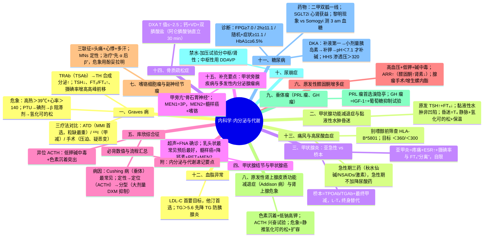
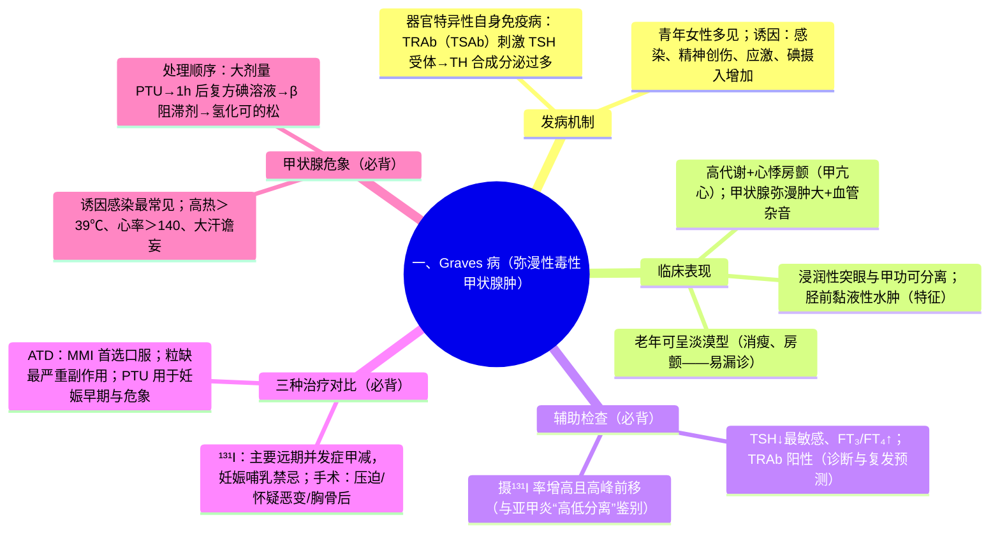
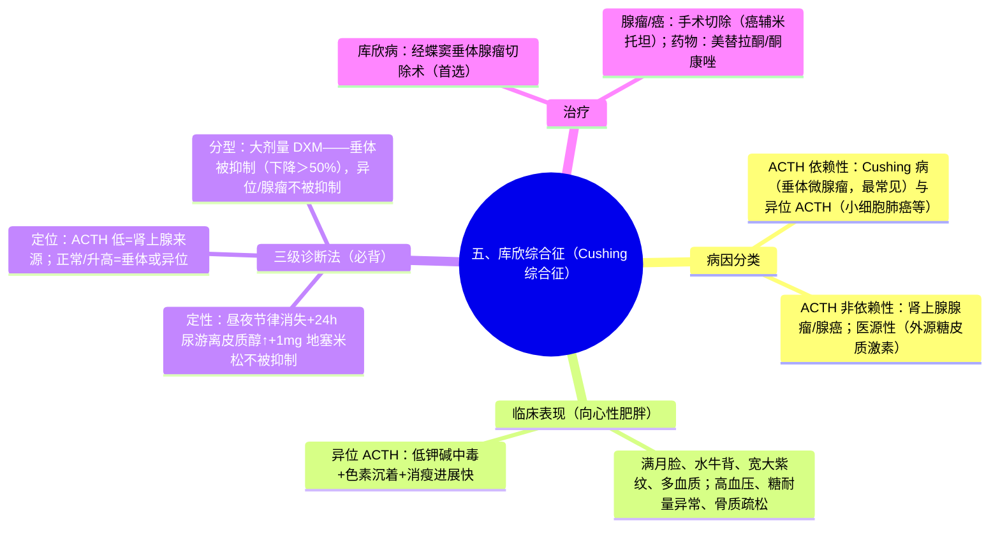
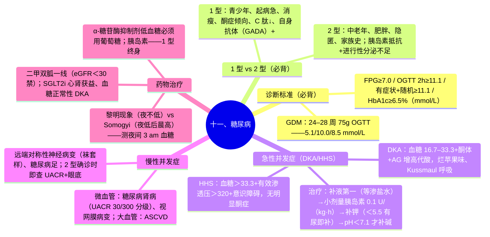

---
tags:
  - 考研306/内科学/内分泌与代谢
科目: 内科学
系统: 内分泌与代谢
内容: 甲状腺、肾上腺、垂体、糖尿病、血脂异常、痛风、骨质疏松
---
# 内科学·讲义精讲版——06 内分泌与代谢

> 覆盖：Graves 病与甲亢危象、甲减与黏液性水肿昏迷、甲状腺炎两型、甲状腺结节与癌、库欣综合征三级诊断、原醛、嗜铬细胞瘤、Addison 病与肾上腺危象、垂体瘤（PRL/GH）、尿崩症、糖尿病及 DKA/HHS、慢性并发症、口服降糖药大表、胰岛素方案、低血糖、血脂异常、痛风、骨质疏松。
> 用法：内分泌的逻辑是"激素轴的反馈规律"——先理解下丘脑-垂体-靶腺轴，再记各病的"定性+定位"诊断流程；糖、甲、肾上腺三大块为分值主轴。
> 药物对比表（甲亢三疗法、口服降糖药）为必背大表。

---

## 一、Graves 病（弥漫性毒性甲状腺肿）

### 1.1 定义与发病机制
- 甲亢最常见病因（占 80% 左右）；器官特异性自身免疫病——**TSH 受体抗体（TRAb）中的刺激性抗体（TSAb）与 TSH 受体结合 → 甲状腺激素合成与分泌↑**；同时甲状腺弥漫性肿大、常有眼病与胫前黏液性水肿（同一机制累及眶后/胫前组织）。
- 诱因：感染、精神创伤、应激、碘摄入增加。

### 1.2 临床表现
- **高代谢综合征**：怕热多汗、多食易饥、消瘦、心悸、大便次数增多；
- 神经系统：激动、失眠、手细颤；
- **心血管**：心率增快（休息时仍快）、收缩压↑脉压↑、**心房颤动**（老年甲亢性心脏病）；
- **甲状腺**：弥漫性肿大、质地软、**可闻血管杂音/触及震颤**（特征性）；
- **眼征（Graves 眼病）**：非浸润性（凝视、瞬目减少、上睑挛缩——交感兴奋所致，可随甲亢控制消退）；**浸润性（恶性）突眼**——眶后组织炎症水肿，与甲功水平可分离；
- 特殊体征：**胫前黏液性水肿（特征性）**、杵状指；
- ⚠ 老年甲亢可表现为**淡漠型**（食欲差、消瘦、房颤、乏力——易漏诊）。

### 1.3 辅助检查（必背）
- **TSH↓、FT₃/FT₄↑**（敏感组合；TSH 先变化）；
- **TRAb 阳性**（诊断与复发预测；TRAb=TSAb+TSBAb）；
- **甲状腺摄¹³¹I 率：增高且高峰前移**——与亚急性甲状腺炎（摄碘率↓）、碘致甲亢、外源激素性甲亢鉴别（后两者摄碘率↓）；
- 超声：血流丰富"火海征"；闪烁扫描用于结节性鉴别。

### 1.4 三种治疗对比（必背大表）

| 项目 | 抗甲状腺药物（ATD） | ¹³¹I 治疗 | 手术治疗 |
|---|---|---|---|
| 机制 | **抑制过氧化物酶→阻断碘的有机化与酪氨酸碘化（抑制 TH 合成）**；PTU 兼抑制 T₄→T₃ 外周转化 | **β 射线破坏甲状腺滤泡细胞** | 切除大部分甲状腺 |
| 适应证 | 轻中度初治、孕妇（PTU 妊娠早中期）、儿童、术前准备、¹³¹I 前后辅助 | 成人 Graves；ATD 无效/复发/过敏；合并心肝肾疾病不宜手术者；甲状腺中度以上肿大 | 中重度甲状腺肿大、**压迫症状**、**怀疑恶变**、**胸骨后甲状腺肿**；合并妊娠中期需治疗者 |
| 疗程/效果 | **1.5–2 年**；缓解率约 40%–50%，复发常见 | 一次或数次；治愈率高 | 治愈率高 |
| 主要并发症 | **粒细胞缺乏（最严重——发热咽痛立即查血常规）**、皮疹、**肝损害（PTU 可致暴发性肝坏死，MMI 多为胆汁淤积）** | **甲减（最常见远期并发症）**、放射性甲状腺炎（短期加重）、突眼可能加重（活动期慎用或配合激素） | **喉返神经损伤（声嘶）、甲状旁腺损伤（低钙抽搐）、出血窒息、甲减** |
| 代表药物 | **甲巯咪唑（MMI，首选口服）**；**丙硫氧嘧啶（PTU）——妊娠早期与甲亢危象首选** | — | 术前准备：**ATD 控制甲功正常→术前 2 周复方碘溶液（抑制释放、减少充血）**；心率快加 β 阻滞剂 |

- 辅助用药：**β 受体阻滞剂（普萘洛尔/美托洛尔）——阻断交感症状并轻度抑制 T₄→T₃；哮喘者禁用非选择性 β 阻滞剂**。
- 浸润性突眼：戒烟（最重要）、护眼、**中重度活动期用糖皮质激素（冲击）**、眶后放疗、眶减压；**活动期重度眼病者慎用 ¹³¹I 或加激素保护**。

### 1.5 甲状腺危象（甲亢危象，必背）
- 诱因：**感染（最常见）、手术/创伤、¹³¹I 治疗后早期、突然停用抗甲状腺药、精神应激**。
- 表现：**高热 >39 ℃、心率 >140 次/分、大汗、呕吐腹泻、脱水、烦躁谵妄→昏迷、心衰/休克**（原有甲亢症状急剧加重）。
- 处理（顺序必背）：
  1. **抑制 TH 合成：首选大剂量 PTU**（兼抑制 T₄→T₃）口服/胃管；
  2. **抑制 TH 释放：PTU 后 1 h 给复方碘溶液**（⚠ 先给碘剂会"供料"加重合成——必须先用 ATD 阻断合成）；
  3. **β 受体阻滞剂**（普萘洛尔——控制心率；心衰者慎用）；
  4. **糖皮质激素（氢化可的松）**——阻滞 TH 释放、纠正相对肾上腺皮质功能不足、阻滞 T₄→T₃；
  5. 降温（物理为主，⚠ 阿司匹林慎用——竞争结合蛋白升高游离 TH）、镇静、补液、抗感染、心衰支持。

### 1.6 高频考点提示
- ★ TRAb 阳性+摄碘率增高且高峰前移=Graves；亚甲炎摄碘率与 FT₄"分离"。
- ★ 三疗法适应证与并发症逐项对应；PTU=妊娠早期+危象首选。
- ★ 粒缺=ATD 最严重副作用；碘剂必须在 ATD 之后用。

> **相关知识点**：[[02-生理学-下#11.3 甲状腺激素 ★★|甲状腺激素（生理）]] ｜ [[02-病理学-各论#13.2 甲状腺疾病 ★★|甲状腺疾病（病理）]] ｜ [[03-颈部与乳腺外科#二、甲状腺功能亢进的外科治疗|甲亢外科（外科）]] ｜ [[03-实验室检查#10.1 甲状腺功能|甲状腺功能（诊断）]] ｜ [[02-体格检查#3.3 甲状腺|甲状腺检查（诊断）]] ｜ [[06-内分泌与代谢#二、甲状腺功能减退症与黏液性水肿昏迷|甲状腺功能减退症]]

---

## 二、甲状腺功能减退症与黏液性水肿昏迷

### 2.1 病因与诊断
- 原发性甲减（甲状腺本身——最常见）：**桥本甲状腺炎、¹³¹I 治疗后、甲状腺手术后、碘缺乏/过量、药物（锂、胺碘酮）**；继发性（垂体/下丘脑——TSH/LH 等多轴受累）；外周抵抗（罕见）。
- 诊断（轴规律必背）：**原发性——TSH↑ + FT₄↓**；**继发性（垂体性）——TSH↓或正常 + FT₄↓**；**亚临床甲减——TSH↑ + FT₄ 正常**（TSH>10 mIU/L 或有症状/血脂异常者考虑替代治疗）。

### 2.2 临床表现
- 代谢率↓：畏寒、乏力、嗜睡、体重增加（黏液性水肿）、便秘；
- **黏液性水肿：非凹陷性**（透明质酸沉积于真皮）；面色蜡黄、毛发稀疏、声音低哑；
- 心血管：心动过缓、心包积液、**胆固醇↑（易误为血脂异常）**；
- 贫血（正细胞或大细胞）、月经紊乱、不育；
- **甲减性肌病、腱反射迟缓期延长（特征）**。

### 2.3 治疗与黏液性水肿昏迷（必背）
- 替代治疗：**左甲状腺素（L-T₄）晨起空腹口服**；老年/冠心病者**小剂量起始缓慢加量**（防诱发心绞痛/心梗）；继发性甲减需先/同用糖皮质激素（防肾上腺危象）。
- **黏液性水肿昏迷（甲减危象）**：
  - 诱因：寒冷、感染、手术、镇静药、擅自停药；冬季老年多见；
  - 表现：**低体温（<35 ℃）、昏迷、心动过缓、低血压、呼吸浅慢（CO₂ 潴留）、低钠血症、低血糖**；
  - 处理：①**静脉 L-T₄（首剂后维持；可联用 L-T₃——组织渗透快）**；②**氢化可的松（合并肾上腺皮质功能不足——先于或同时于 T₄）**；③保温（缓慢复温）、支持呼吸（必要时机械通气）、限水纠正低钠、抗感染、避免镇静剂。

### 2.4 高频考点提示
- ★ 原发 TSH↑/FT₄↓；黏液性水肿非凹陷性；TSH>10 或有症状者替代。
- ★ 昏迷处理：静脉 T₄+氢化可的松+保温；老年冠心病小剂量起始。

> **相关知识点**：[[02-生理学-下#11.3 甲状腺激素 ★★|甲状腺激素（生理）]] ｜ [[06-内分泌与代谢#一、Graves 病（弥漫性毒性甲状腺肿）|Graves 病]] ｜ [[06-内分泌与代谢#三、甲状腺炎：亚急性 vs 桥本（必背对比表）|甲状腺炎]]

---

## 三、甲状腺炎：亚急性 vs 桥本（必背对比表）

| 项目 | 亚急性甲状腺炎（肉芽肿性/巨细胞性） | 慢性淋巴细胞性甲状腺炎（桥本甲状腺炎） |
|---|---|---|
| 病因 | **病毒感染后**（柯萨奇、腮腺炎、EBV 等），病前常有上感史 | **自身免疫**（TPOAb、TGAb 阳性） |
| 临床 | **甲状腺疼痛、触痛（放射至耳/下颌）、质硬结节**、发热 | 无痛、弥漫性坚韧肿大（可有结节）；可有压迫感 |
| 实验室 | **ESR↑、CRP↑；"分离现象"——FT₃/FT₄↑ 而摄碘率↓（滤泡破坏释放激素+摄取受抑）——诊断特征** | **TPOAb/TGAb 高滴度**；甲功三期演变：一过性甲亢→正常→**最终甲减** |
| 病理 | 异物巨细胞/上皮样肉芽肿 | 淋巴细胞浸润、生发中心、嗜酸性变（Askanazy 细胞） |
| 治疗 | **自限性**——轻者 NSAIDs；症状重者**糖皮质激素**（短期）；早期一过性甲亢不需抗甲药；少数遗留一过性甲减需短期替代 | 甲减者 **L-T₄ 终身替代**；一过性甲亢对症；观察结节变化 |
| 预后 | 多自行恢复（可复发） | 常进展为永久甲减 |

- 产后甲状腺炎（要点）：产后 1 年内自身免疫性甲状腺炎——先甲亢后甲减，多数恢复；下次妊娠易复发。

### 高频考点提示
- ★ 亚甲炎=疼痛+ESR↑+"高低分离"（FT₄ 高、摄碘率低）+自限。
- ★ 桥本=TPOAb/TGAb+最终甲减+终身替代。

> **相关知识点**：[[02-病理学-各论#13.2 甲状腺疾病 ★★|甲状腺疾病（病理）]] ｜ [[06-内分泌与代谢#一、Graves 病（弥漫性毒性甲状腺肿）|Graves 病]] ｜ [[06-内分泌与代谢#二、甲状腺功能减退症与黏液性水肿昏迷|甲状腺功能减退症]]

---

## 四、甲状腺结节与甲状腺癌

### 4.1 结节的评估原则
- 病史危险因素：**童年头颈部放射史、一级家人甲状腺癌史、男性、年龄 <20 或 >70 岁、颈部淋巴结肿大、声音嘶哑/饮水呛咳、结节短期内迅速增大、质硬固定**。
- 检查路径：**TSH 初筛**（TSH↓→热结节可能性→核素扫描；TSH 正常/↑→超声）；**超声（首选影像——TI-RADS 分类：低回声、微钙化、纵横比>1、边缘不规则、异常淋巴结为恶性征象）**；**细针穿刺细胞学（FNA）——超声可疑结节（≥1 cm 的可疑征象者）确诊的主要手段**。
- 功能判断：核素显像分**热结节（自主功能——多良性）、温、冷结节（⚠ 癌变风险相对高，但多数冷结节仍为良性）**。

### 4.2 甲状腺癌四型（必背表）

| 类型 | 占比/来源 | 生物学行为 | 处理要点 |
|---|---|---|---|
| **乳头状癌** | 最常见（成人） | **预后最好；易颈淋巴结转移；生长慢** | 手术（腺叶切除/全切±淋巴结清扫）+ **术后 TSH 抑制治疗（L-T₄ 抑制 TSH）**±¹³¹I；长期随访（Tg 监测） |
| 滤泡状癌 | 次之 | **易血行转移（肺、骨）** | 同上原则，¹³¹I 治疗敏感 |
| **髓样癌** | 滤泡旁 C 细胞 | **分泌降钙素（CEA 也↑）；RET 基因突变；MEN2 相关** | 手术为主；**TSH 抑制无意义（非 TSH 依赖）**；家族性筛查 RET |
| **未分化癌** | 少见 | **恶性度最高、进展快、预后极差** | 姑息为主（放化疗、靶向）；少手术 |

### 4.3 高频考点提示
- ★ 冷结节≠癌，但风险相对高；FNA 是确诊主要手段。
- ★ 髓样癌=降钙素+RET+MEN2；乳头状=预后最好+淋巴结转移。

> **相关知识点**：[[03-颈部与乳腺外科#四、甲状腺结节评估与甲状腺癌|甲状腺结节与甲状腺癌（外科）]] ｜ [[02-病理学-各论#13.2 甲状腺疾病 ★★|甲状腺疾病（病理）]] ｜ [[06-内分泌与代谢#十五、补充要点：甲状旁腺疾病与多发性内分泌腺瘤病|MEN]]

---

## 五、库欣综合征（Cushing 综合征）

### 5.1 定义与病因分类
- 定义：**糖皮质激素（皮质醇）分泌过多**所致综合征。
- 病因（必背）：
  1. **依赖 ACTH**：**Cushing 病（垂体 ACTH 微腺瘤——最常见病因）**；**异位 ACTH 综合征（小细胞肺癌、胸腺/胰腺类癌——进展快、低钾碱中毒与色素沉着突出）**；
  2. **不依赖 ACTH**：**肾上腺皮质腺瘤**、**肾上腺皮质癌**（儿童多见、雄激素过多症状突出）、**大结节/微结节样增生**；
  3. **医源性（外源性糖皮质激素——临床最常见）**。
- 临床：**向心性肥胖、满月脸、水牛背、多血质、宽大紫纹（腹/股部 >1 cm）、痤疮多毛**、高血压、糖耐量异常/糖尿病、**骨质疏松**、易感染、精神症状、儿童生长停滞、女性月经稀发。

### 5.2 三级诊断法（定性→定位→分型，必背）
1. **定性（功能诊断——证实皮质醇过多）**：
   - **血皮质醇昼夜节律消失**（午夜 0 点、晨 8 点采样；午夜>50 nmol/L≈1.8 μg/dl 提示异常 ⚠ 数值需核对，记"午夜不被抑制/节律消失"）；
   - **24 h 尿游离皮质醇（UFC）↑**；
   - **过夜 1 mg 地塞米松抑制试验（筛查首选）：不受抑制（次晨皮质醇不被压低）→ 库欣状态**；
   - 注意：单纯性肥胖可有假阳性（需复测/联合试验）。
2. **定位（ACTH 依赖 vs 非依赖）**：血浆 ACTH——**降低 → 肾上腺来源（腺瘤/癌）**；**正常或升高 → 垂体 Cushing 病或异位 ACTH**。
3. **分型（垂体 vs 异位）**：
   - **大剂量（8 mg）地塞米松抑制试验：垂体者被抑制（皮质醇下降 >50%）、异位/肾上腺者不受抑**；
   - CRH 兴奋试验、**岩下窦静脉采血（中枢/外周 ACTH 比值）**为难分型金标准；
   - 影像：垂体 MRI（微腺瘤）、肾上腺 CT；**异位者找原发瘤（胸部 CT）**。
- ⚠ 鉴别记忆：**异位 ACTH——低钾碱中毒+色素沉着明显+消瘦进展快；垂体者——典型向心肥胖、病程慢**。

### 库欣综合征病因鉴别大表（补充，必背）

| 项目 | Cushing 病（垂体） | 异位 ACTH 综合征 | 肾上腺腺瘤/癌 |
|---|---|---|---|
| ACTH 水平 | 升高/正常 | **明显升高** | **降低** |
| **大剂量地塞米松抑制** | **被抑制（皮质醇下降 >50%）** | 不被抑制 | 不被抑制 |
| CRH 兴奋试验 | 多有反应（增强） | 多无反应 | 无反应 |
| 临床特点 | **典型向心性肥胖、病程缓慢** | **消瘦、进展快、低钾碱中毒与色素沉着突出** | 雄激素过多症状突出（癌——女性男性化） |
| 影像 | 垂体 MRI（微腺瘤，可阴性） | 胸部 CT（小细胞肺癌、胸腺类癌）等 | 肾上腺 CT 占位 |
| 治疗 | **经蝶窦手术** | 切除原发瘤/药物（皮质醇合成抑制剂） | 手术切除（癌辅以米托坦） |

- 记忆主线：**先看 ACTH（低=肾上腺原发；不低=垂体或异位），再用大剂量 DXM 抑制与岩下窦采血区分垂体 vs 异位**。

### 5.3 治疗
- **Cushing 病：经蝶窦垂体腺瘤切除术（首选）**；不能切除/复发——放疗、双侧肾上腺切除（ Nelson 综合征风险——ACTH 瘤生长）、药物（皮质醇合成抑制剂：美替拉酮、酮康唑——⚠ 肝毒性、米托坦用于肾上腺癌）。
- 肾上腺腺瘤/癌——手术切除（腹腔镜）；癌可辅米托坦。

### 5.4 高频考点提示
- ★ 定性三试验（节律消失/UFC↑/1 mg DXM 不受抑）；定位看 ACTH；分型用大剂量 DXM 抑制。
- ★ 最常见病因=Cushing 病（垂体微腺瘤）；异位 ACTH 突出表现=低钾碱中毒+色素沉着。

> **相关知识点**：[[02-生理学-下#11.5 肾上腺 ★★|肾上腺（生理）]] ｜ [[06-内分泌与代谢#六、原发性醛固酮增多症（原醛）|原发性醛固酮增多症]] ｜ [[06-内分泌与代谢#八、原发性肾上腺皮质功能减退症（Addison 病）与肾上腺危象|Addison 病与肾上腺危象]]

---

## 六、原发性醛固酮增多症（原醛）

- 定义：肾上腺皮质**自主分泌过多醛固酮**→**水钠潴留（高血压）+排钾（低钾血症）+抑制肾素**。
- 病因：**醛固酮腺瘤（APA，约 1/3——单侧，手术治愈）**与**特发性醛固酮增多症（IHA，双侧增生——药物治疗为主）**两大类；少数为糖皮质激素可调节性醛固酮增多症（GRA，家族性——地塞米松治疗）。
- 临床（必背逻辑链）：**高血压 + 低血钾（肌无力、周期性瘫痪、感觉异常）+ 代谢性碱中毒（手足搐搦）+ 低钾性肾病（夜尿多、多尿）**；⚠ 现认识：多数患者血钾可正常——**不能以低钾作为筛查前提**。
- 诊断：
  - **筛查：血浆醛固酮/肾素比值（ARR）升高**（醛固酮↑而肾素↓——这是"原发"的标志）；筛查前停用影响药物（β 阻滞剂、ACEI/ARB、利尿剂等 2–4 周以上，换用 α 阻滞剂/非二氢吡啶 CCB）⚠ 换药方案需核对；
  - **确诊试验：生理盐水输注试验、卡托普利抑制试验等**（醛固酮不被抑制→确诊）；
  - **分型定位：肾上腺 CT（腺瘤/增生）±肾上腺静脉采血（AVS——分侧定性的金标准）**。
- 治疗：**腺瘤/单侧增生——腹腔镜肾上腺切除（术前螺内酯准备、纠正低钾降压）**；**IHA/双侧——螺内酯（首选）或依普利酮长期治疗**（±其他降压药）。
- 高频考点：★ 高血压+低钾+碱中毒；ARR↑（醛固酮高、肾素低）；腺瘤手术、增生螺内酯。

> **相关知识点**：[[02-生理学-下#11.5 肾上腺 ★★|肾上腺（生理）]] ｜ [[01-生理学-上#8.3 肾小管与集合管重吸收与分泌 ★★|肾小管重吸收与分泌（生理）]] ｜ [[06-内分泌与代谢#五、库欣综合征（Cushing 综合征）|库欣综合征]]

---

## 七、嗜铬细胞瘤与副神经节瘤（PPGL）

- 定义：肾上腺髓质或肾上腺外（副神经节，沿腹主动脉旁、膀胱等）**嗜铬细胞肿瘤，分泌大量儿茶酚胺**；约 90% 为肾上腺内；部分为恶性（转移）；家族综合征：**MEN2（RET）、VHL、NF1、SDHx 突变**。
- 临床（必背）：
  - **阵发性高血压（发作性——典型）或持续性高血压（阵发加剧）**；
  - **发作"三联征"：头痛、心悸、多汗**（伴面色苍白、焦虑、震颤）；
  - 发作时**血糖↑（交感-糖代谢）、白细胞轻度↑、体温可↑**；
  - 并发症：儿茶酚胺心肌病（心衰、心律失常）、高血压脑病、脑卒中、休克（肿瘤出血坏死→"儿茶酚胺骤减"低血压）。
- 诊断：
  - **定性（首选）：血浆或 24 h 尿甲氧基肾上腺素类物质（MNs——儿茶酚胺的甲氧基代谢物，敏感性特异性高）**；发作期采血更佳；儿茶酚胺、VMA（尿香草扁桃酸）辅助；
  - **定位：肾上腺 CT/MRI；疑异位/转移者 ¹³¹I-MIBG 闪烁显像**；
  - ⚠ 注意鉴别药物（拟交感、三环类）与应激。
- **治疗（"先 α 后 β"必背）**：
  1. **术前准备：α 受体阻滞剂（酚苄明或选择性 α₁ 阻滞剂多沙唑嗪）≥2 周**，充分扩容（高盐饮食）→ 血压稳定后如仍有心动过速/心律失常**再加用 β 阻滞剂**；
  2. ⚠ **严禁在未用 α 阻滞剂时单用 β 阻滞剂**（阻断血管 β₂ 扩张 → 血压骤升/高血压危象，亦可诱发心衰）；
  3. **手术切除为根治手段**（腹腔镜微创为主）；围术期避免触压肿瘤；
  4. 高血压危象发作：**酚妥拉明静脉**（或硝普钠）+ 补液；
  5. 恶性/转移：¹³¹I-MIBG 治疗、化疗、随访。
- 高频考点：★ 三联征=头痛+心悸+多汗；定性用 MNs；**α 先 β 后**；危象用酚妥拉明。

> **相关知识点**：[[02-生理学-下#10.5 自主神经系统 ★|自主神经系统（生理）]] ｜ [[02-生理学-下#11.5 肾上腺 ★★|肾上腺（生理）]] ｜ [[02-循环系统#三、高血压|高血压]]

---

## 八、原发性肾上腺皮质功能减退症（Addison 病）与肾上腺危象

- 病因：**自身免疫性肾上腺炎（现在最常见）**；既往结核为常见原因；其他：转移癌、淋巴瘤、感染（HIV、真菌）、药物（酮康唑等）；继发性（垂体 ACTH 缺乏——无色素沉着）。
- 临床（必背）：**乏力、体重下降、食欲不振**；**皮肤黏膜色素沉着**（ACTH↑ 及其前体 MSH 样作用——**牙龈、颊黏膜、掌纹、乳晕、瘢痕、摩擦部位**——与继发性无色素相区别）；**低血压（体位性）、低钠血症、高钾血症、低血糖**；恶心呕吐、女性阴毛腋毛稀少。
- 诊断：**清晨血皮质醇↓ + ACTH↑（原发性）**；**ACTH 兴奋试验（250 μg 刺激后皮质醇不能升高）确诊肾上腺储备不足**；自身抗体、肾上腺 CT（结核/转移示钙化增大、自身免疫示缩小）。
- 治疗：**生理替代——糖皮质激素（氢化可的松，模拟昼夜节律分次口服）+ 盐皮质激素（氟氢可的松，维持血压血钠）**；教育：**应激（感染、手术、外伤）时激素加量（感冒可加倍，手术静脉大剂量）**；随身标识。
- **肾上腺危象（必背）**：
  - 诱因：**突然停用长期糖皮质激素、感染/手术/创伤等应激、双侧肾上腺出血/梗死（如抗磷脂综合征、败血症——Waterhouse-Friderichsen 综合征）**；
  - 表现：**恶心呕吐、腹痛、脱水、低血压/休克（对补液与血管活性药反应差）、低血糖、意识障碍、低钠高钾**；
  - **处理：立即静脉氢化可的松（首剂 100 mg 后持续/分次维持）+ 大量生理盐水扩容 + 纠正低血糖 + 去除诱因**；病情稳定后逐步过渡口服。

### 高频考点提示
- ★ 色素沉着=原发性特征（ACTH↑）；ACTH 兴奋试验确诊。
- ★ 危象处理：氢化可的松静推+盐水扩容+葡萄糖；慢性替代者应激加量。

> **相关知识点**：[[02-生理学-下#11.5 肾上腺 ★★|肾上腺（生理）]] ｜ [[06-内分泌与代谢#五、库欣综合征（Cushing 综合征）|库欣综合征]]

---

## 九、垂体瘤（PRL 瘤、GH 瘤）

### 9.1 分类概览
- 按功能：功能性（**PRL 瘤最常见**、GH 瘤、ACTH 瘾、TSH 瘤少见）与无功能瘤（大腺瘤压迫表现）；按大小：微腺瘤 <10 mm、大腺瘤 ≥10 mm。
- 大腺瘤压迫表现：**头痛、视力障碍（双颞侧偏盲——视交叉受压）**、垂体功能减退（性腺最先）。

### 9.2 PRL 瘤（必背）
- 表现：女性——**闭经-溢乳-不孕**；男性——**性欲减退、阳痿、不育（起病隐匿，确诊时多已为大腺瘤）**；
- 诊断：**PRL 明显升高**（>200 μg/L 强烈提示腺瘤 ⚠ 界值需核对）；**必须排除药物性（抗精神病药/甲氧氯普胺——多巴胺受体阻断）、原发性甲减（TRH↑→PRL↑）、妊娠、应激**——轻度升高者复查/去除干扰后再定；
- **治疗：多巴胺激动剂（溴隐亭；卡麦角林效更好）为首选——抑制 PRL 分泌并使肿瘤缩小、恢复性腺功能**；耐药/不耐受或大腺瘤压迫——经蝶手术±放疗。

### 9.3 GH 瘤（巨人症/肢端肥大症）
- 表现：青春期前——巨人症；成人——**肢端肥大：手足增厚增大、面容粗陋（眉弓/下颌前突、鼻唇肥厚）、舌大（打鼾/睡眠呼吸暂停）、声音低沉**；代谢——**糖尿病（GH 拮抗胰岛素）、高血压、心肌肥厚心衰**；**结肠息肉/癌风险↑（定期肠镜）**、关节病、多汗；
- 诊断：**IGF-1 升高（筛查）+ 口服葡萄糖抑制试验 GH 不被抑制（金标准）**；垂体 MRI 定位；
- 治疗：**经蝶手术切除（首选）**；未愈——**生长抑素类似物（奥曲肽/兰瑞肽）**、GH 受体拮抗剂（培维索孟）、多巴胺激动剂；放疗。

### 9.4 高频考点提示
- ★ PRL 瘤首选溴隐亭（多巴胺激动剂）；先排除药物性/甲减性 PRL 升高。
- ★ 肢端肥大诊断：IGF-1↑+葡萄糖负荷后 GH 不抑制；手术首选。

> **相关知识点**：[[02-生理学-下#11.2 下丘脑与垂体 ★|下丘脑与垂体（生理）]] ｜ [[02-生理学-下#12.2 女性生殖与月经周期 ★★|月经周期（生理）]]

---

## 十、尿崩症

- 定义：**ADH（AVP）分泌不足（中枢性）或肾小管对其不敏感（肾性）→ 低渗性多尿**。
- 病因：中枢——特发性、**下丘脑-垂体手术/外伤、肿瘤（颅咽管瘤等）、肉芽肿（结节病）、遗传**；肾性——**药物（锂剂最主要）、低钾/高钙、AVPR2 基因突变（X 连锁）**；妊娠期尿崩症（胎盘血管加压素酶）。
- 临床：**多尿（>2.5–3 L/d，常达 5–10 L+）、烦渴多饮、低比重尿（<1.005）/低渗尿**；缺水时若不能及时饮水 → 高钠血症、意识障碍。
- 诊断与鉴别（必背）：
  - **禁水-加压试验**：禁水后尿仍不能浓缩（尿渗透压低于血浆）→ 注射 AVP 后：**中枢性——尿渗透压明显升高（≥50%）；肾性——不升高**；精神性烦渴——禁水可部分浓缩；
  - 血 AVP 测定（中枢性↓、肾性正常/↑）；MRI 垂体柄/后叶；查病因。
- 治疗：**中枢性——去氨加压素（DDAVP：口服/鼻喷，首选）**；部分性者可用氢氯噻嗪（反常抗利尿）等；**肾性——限盐+噻嗪类利尿剂（减少尿量）+ 吲哚美辛辅助，治原发/停锂剂**；保证饮水。
- 高频考点：★ 禁水加压试验区分中枢/肾性；DDAVP 治中枢性。

> **相关知识点**：[[01-生理学-上#8.4 尿液的浓缩与稀释 ★★|尿液的浓缩与稀释（生理）]]

---

## 十一、糖尿病

### 11.1 诊断标准（必背）
- **符合任一（无症状者需改日复查确认）**：
  1. **空腹（≥8 h）血糖 ≥7.0 mmol/L**；
  2. **OGTT 2 h 血糖 ≥11.1 mmol/L**；
  3. **有典型症状（多饮多食多尿消瘦）+ 随机血糖 ≥11.1 mmol/L**；
  4. **HbA1c ≥6.5%**（须用标准化检测方法）。
- 糖尿病前期：**IFG——FPG 6.1–6.9 mmol/L（WHO）；IGT——OGTT 2h 7.8–11.0 mmol/L**（ADA 的 IFG 下限为 5.6 ⚠ 按教材口径）。
- **妊娠期糖尿病（GDM）**：24–28 周 75 g OGTT——0/1/2 h 界值 **5.1/10.0/8.5 mmol/L**，任一达标即诊断。

### 11.2 1 型 vs 2 型（必背大表）

| 项目 | 1 型糖尿病 | 2 型糖尿病 |
|---|---|---|
| 机制 | **β 细胞自身免疫破坏 → 胰岛素绝对缺乏** | **胰岛素抵抗 + 进行性 β 细胞分泌不足** |
| 年龄/起病 | 青少年多、**起病急** | 中老年为主（年轻化）、**隐匿（可多年无症状）** |
| 体型 | 不胖/消瘦 | **多肥胖/超重** |
| 家族史 | 较少 | 明显 |
| 自发酮症/DKA | **常见（首发表现可为 DKA）** | 少见（应激时） |
| C 肽/胰岛素 | **低或测不出** | 正常/偏高→晚期低 |
| 自身抗体 | **GADA、IA-2A、ICA、ZnT8A（+）** | （−） |
| 治疗 | **胰岛素终身（基础+餐时）** | 生活方式+口服药→可进展为需胰岛素 |

- 特殊类型速览：**LADA（成人隐匿性自身免疫糖尿病——1 型的缓慢进展型，抗体+，早期可口服药后需胰岛素）**、MODY（单基因）、继发性（库欣、肢端肥大症、嗜铬细胞瘤、胰腺炎/胰腺术后）。

### 11.3 DKA 与 HHS（两大急性并发症，必背流程）

| 项目 | 糖尿病酮症酸中毒（DKA） | 高渗高血糖状态（HHS） |
|---|---|---|
| 人群 | **1 型常见**；诱因——感染、停用胰岛素、应激 | **老年 2 型**；诱因——感染、脱水（限水、利尿） |
| 生化 | **高血糖（常 16–33 mmol/L）+ 酮体（+）+ 代谢性酸中毒（AG↑）**；呼气烂苹果味、深大呼吸（Kussmaul） | **血糖 >33.3 mmol/L + 有效血浆渗透压 >320 mOsm/kg + 无明显酮症/酸中毒**；**意识障碍突出（嗜睡→昏迷）** |
| 治疗 | ①**补液（第一、最首要）：等渗生理盐水起始，前 1–2 h 快速；血糖降至 ~13.9 mmol/L 后换 5% 葡萄糖（防低血糖+继续消酮）**；②**小剂量胰岛素 0.1 U/(kg·h) 静脉持续滴注**（先静推负荷亦可；每小时血糖下降 3.9–6.1 mmol/L 为宜——**过快 → 脑水肿、低血糖、低钾**）；③**补钾：血钾 <5.5 且有尿即开始；血钾 <3.3 先补钾后用胰岛素**；④**补碱：仅重度酸中毒（pH<7.1 且 HCO₃⁻<5 mmol/L）时小量——过多补碱加重组织缺氧与低钾、脑水肿**；⑤去除诱因、监测渗透压 | ①**补液更积极但渗透压下降须缓慢（0.45% NaCl 视血钠选用，防脑水肿）**；②胰岛素小剂量（0.05–0.1 U/kg/h，需求量常低于 DKA）；③补钾、抗凝（高凝）、去诱因 |

- **低血糖症（必背）**：**血糖 <3.9 mmol/L 即达标处理**；交感兴奋（心悸、出汗、手抖、饥饿感）→ 神经缺糖症状（行为异常、意识障碍、抽搐昏迷——老年可无交感征直接昏迷）；**Whipple 三联**：低血糖症状 + 发作时血糖低 + 供糖后迅速缓解；**处理："15-15 原则"——清醒者口服 15 g 葡萄糖（15 min 复测）；意识障碍者 50% 葡萄糖 20–40 ml 静推，随后葡萄糖液维持**；**⚠ α-糖苷酶抑制剂所致低血糖必须用葡萄糖（蔗糖/淀粉分解被抑制）**；长效磺脲类所致低血糖需持续监护。

### 11.4 慢性并发症筛查与防治（必背）

| 并发症 | 机制/表现 | 筛查 | 防治 |
|---|---|---|---|
| **糖尿病肾病（DKD）** | 高糖→系膜/结节病变；**UACR 30–300（微量）→≥300（大量）→GFR↓** | **2 型确诊时即查 UACR+eGFR；1 型 5 年后起每年** | **ACEI/ARB（即使血压正常）+SGLT2i；血压 <130/80；HbA1c<7；他汀** |
| **糖尿病视网膜病变（DR）** | 微血管瘤/出血硬渗（非增殖期）→**新生血管、玻璃体出血（增殖期）** | **2 型确诊时即查眼底；1 型 5 年内起**；每年 1 次 | 控糖控压控脂；**抗 VEGF 玻璃体注射、激光光凝、玻璃体手术** |
| 糖尿病神经病变 | **远端对称性多发性神经病（袜套样感觉异常）最常见**；自主神经（体位性低血压、胃轻瘫、ED、静息心动过速） | 每年 10 g 尼龙丝/震动觉 | 控糖+对症（普瑞巴林等）、足部教育 |
| **糖尿病足** | 神经病变+血管病变+感染 | 每年查足、**10 g 尼龙丝+踝肱指数（ABI）** | Wagner 分级处理：清创、抗感染、改善血运（介入/搭桥）、截趾/截肢 |
| 大血管并发症 | ASCVD（冠心病、卒中、外周动脉病） | 每年评估 | **他汀、抗血小板（二级预防）、控压、SGLT2i/GLP-1RA 心血管获益** |

### 11.5 口服降糖药机制对比大表（必背）

| 药物 | 机制 | 降糖特点 | 主要注意事项 |
|---|---|---|---|
| **二甲双胍** | **抑制肝糖输出为主+改善外周胰岛素敏感性** | **2 型一线首选（无禁忌全程保留）**；不增重/可减重 | **eGFR<30 禁用（乳酸酸中毒风险）；碘造影/手术围期暂停；缺氧状态慎用** |
| **磺脲类（格列美脲/格列本脲）** | **关闭 β 细胞 K-ATP 通道→胰岛素分泌↑** | 有效但不依赖血糖水平 | **低血糖+体重增加**；老年/肾功能差者选格列美脲或格列奈类，**格列本脲慎用** |
| 格列奈类（瑞格列奈） | 同上（起效快半衰期短） | **控制餐后血糖，餐前即服** | 低血糖较磺脲轻 |
| **α-糖苷酶抑制剂（阿卡波糖）** | **抑制小肠绒毛刷状缘糖苷酶→延缓碳水化合物吸收** | **以餐后血糖为主**；单用不致低血糖 | **胀气、腹泻**；**其所致低血糖必须口服/静脉葡萄糖** |
| TZD（吡格列酮） | **PPARγ 激动剂→增敏** | 改善胰岛素抵抗 | **水钠潴留/心衰（NYHA Ⅲ–Ⅳ 禁）、骨折风险、体重增加** |
| DPP-4 抑制剂（西格列汀） | **抑制 GLP-1 降解→葡萄糖依赖性促泌** | 中效、中性体重、低血糖少 | 耐受好；罕见胰腺炎 |
| **SGLT2 抑制剂（达格列净/恩格列净）** | **抑制肾近曲小管 SGLT2→尿糖排泄** | 减重、降压；**心衰与 CKD 硬终点获益** | **泌尿生殖道感染；"血糖正常性 DKA"；eGFR 限制；脱水** |
| **GLP-1RA（利拉鲁肽/司美格鲁肽）** | **GLP-1 受体激动：葡萄糖依赖性促泌+抑制食欲+延缓胃排空** | **显著减重、心血管获益** | 胃肠反应（恶心呕吐）；**甲状腺髓样癌个人/家族史或 MEN2 禁用**；胰腺炎史慎用 |

### 11.6 胰岛素治疗（必背）
- 适应证：**1 型糖尿病（终身）；2 型——口服药控制不佳/新诊断 HbA1c 很高或高血糖症状明显、DKA/HHS、手术/妊娠/重症、肝肾功能不全**。
- 方案：
  - **基础+餐时（强化）**：长效（甘精、德谷）+速效类似物（门冬/赖脯）——模拟生理，低血糖风险小；
  - **预混胰岛素**（早晚餐前）：依从性好但灵活性差；
  - **1 型强化方案/胰岛素泵（CSII）**——目标 HbA1c<7%（个体化）；
  - 2 型起始：基础胰岛素（晚间）或预混；联用口服药。
- 黎明现象 vs Somogyi 效应（必背鉴别）：**黎明现象——夜间无低血糖，晨起（生长激素/皮质醇升高）血糖高 → 增加晚间基础量；Somogyi——夜间低血糖 → 反调节激素 → 晨起反跳性高血糖 → 减少晚间剂量；鉴别手段：测夜间（如 0/3 am）血糖**。

### 11.7 高频考点提示
- ★ 诊断四条标准+复查；GDM 5.1/10.0/8.5。
- ★ DKA 处理次序：补液第一→小剂量胰岛素→补钾→补碱（pH<7.1 才补）；血糖 <13.9 换糖水。
- ★ HHS：>33.3+渗透压>320+意识障碍；补液渗透压缓降。
- ★ 低血糖 <3.9 处理；α-糖苷酶抑制剂低血糖用葡萄糖。
- ★ 黎明现象（夜血糖不低）vs Somogyi（夜低血糖后反跳）——测 3 am 血糖。

> **相关知识点**：[[02-生理学-下#11.6 胰岛内分泌 ★★|胰岛内分泌（生理）]] ｜ [[01-生物化学-上#第五章 糖代谢 ★★★|糖代谢（生化）]] ｜ [[02-病理学-各论#13.3 糖尿病 ★|糖尿病（病理）]] ｜ [[03-实验室检查#第 7 节 血糖与血脂|血糖与血脂（诊断）]] ｜ [[06-内分泌与代谢#十二、血脂异常|血脂异常]]

---

## 十二、血脂异常

### 12.1 分类与危险分层
- 临床表型：**高胆固醇血症（TC/LDL-C↑）、高甘油三酯血症（TG↑）、混合型、低 HDL-C 血症**；**LDL-C 为致动脉粥样硬化核心、干预首要目标**。
- 继发性原因：糖尿病、甲减（TC↑）、肾病综合征、药物（糖皮质激素、噻嗪类）、酒精（TG↑）。
- 风险分层：按 ASCVD 危险分层（超高危/极高危/高危等）决定 LDL-C 目标——**超高危 <1.4 mmol/L 且较基线降 ≥50%；极高危 <1.8；高危 <2.6 mmol/L**（中国指南口径 ⚠ 数值随版本更新需核对）。
- TG 升高：**TG>5.6 mmol/L 优先降 TG（防急性胰腺炎）**——贝特类/高纯度鱼油。

### 12.2 治疗
- 生活方式（基础）：限饱和脂肪/反式脂肪、增加膳食纤维、运动、减重、限酒。
- **药物**：
  - **他汀——首选**（HMG-CoA 还原酶抑制剂；副作用——**肌病/横纹肌溶解（肌痛+CK↑）、肝酶升高**；⚠ 与 CYP3A4 抑制剂（大环内酯、唑类、环孢素）联用增加肌病风险）；
  - **依折麦布**——抑制小肠胆固醇吸收，联合他汀；
  - **PCSK9 抑制剂（依洛尤单抗等）**——LDL 受体回收↑，用于极高危/家族性；
  - **贝特类（非诺贝特）——PPARα、降 TG**；与他汀联用选非诺贝特（安全性较好），监测肌病；
  - 胆酸螯合剂、Inclisiran（了解）。

### 12.3 高频考点提示
- ★ LDL-C 为首要目标；TG>5.6 先防胰腺炎；他汀肌病+药物相互作用。

> **相关知识点**：[[01-生物化学-上#6.5 血浆脂蛋白 ★★|血浆脂蛋白（生化）]] ｜ [[02-循环系统#四、冠状动脉粥样硬化性心脏病|冠心病]] ｜ [[06-内分泌与代谢#十一、糖尿病|糖尿病]]

---

## 十三、痛风与高尿酸血症

### 13.1 定义与分期
- 高尿酸血症：**血尿酸 >420 μmol/L（男/绝经后女）；>360 μmol/L（绝经前女）**；痛风=尿酸钠结晶沉积所致的晶体性关节炎与/或组织损害。
- 分期（必背）：**无症状高尿酸血症期 → 急性关节炎发作期（午夜突发的第一跖趾关节红肿热痛——最典型；自限数天至 2 周）→ 间歇期 → 慢性期（痛风石——耳廓/关节周围、慢性痛风性关节炎、关节畸形）+ 肾脏损害（尿酸性肾结石、慢性尿酸性肾病、急性尿酸性肾病）**。
- 诊断金标准：**关节液或痛风石标本偏振光显微镜见针状、负性双折射的尿酸钠结晶**；2015 ACR/EULAR 分类标准用于临床研究。
- 诱因：高嘌呤饮食、饮酒（**啤酒最差**）、受凉/劳累、**利尿剂（噻嗪、袢）、小剂量阿司匹林、环孢素**、创伤手术。

### 13.2 治疗（分期处理，必背）
- **急性发作期**：
  - **秋水仙碱（发作 36 h 内效果最好）**——抑制中性粒细胞趋化/微管（NLRP3 炎症小体通路）；副作用**腹泻（剂量限制性）**；肾功能不全减量；
  - **NSAIDs（足量）**；不能耐受/多关节/肾功不全——**糖皮质激素**（口服/关节腔注射）；
  - ⚠ **急性期不新加降尿酸药（诱发/加重发作）；已用者不停药**；两药不宜随意联用（先单药足量）。
- **间歇期/慢性期降尿酸（指征：痛风发作 ≥2 次/年、痛风石、尿酸性肾石、慢性肾病等）**：
  - **黄嘌呤氧化酶抑制剂：别嘌醇（从低剂量起始渐加）**——⚠ **使用前筛查 HLA-B*5801（汉族人群阳性率高，阳性者禁用——致死性 SJS/TEN 风险）**；**非布司他**（同理降尿酸，⚠ 心血管事件争议需核对）；
  - **促尿酸排泄药：苯溴马隆**（抑制 URAT1 重吸收）——**尿路结石者禁用、中重度肾功能不全慎用；需碱化尿液（枸橼酸盐）、多饮水**；
  - **目标：血尿酸 <360 μmol/L；有痛风石/慢性关节炎/频繁发作者 <300 μmol/L（不建议长期 <180）**；
  - 降尿酸初期可联合小剂量秋水仙碱/NSAIDs 预防"溶晶"发作（数月）。
- 生活方式：**限酒（啤酒、白酒）、限内脏/海鲜/浓肉汤、限含果糖饮料**；乳制品（低脂）与蔬菜不限制或有益；多饮水 >2000 ml/d。

### 13.3 高频考点提示
- ★ 急性期三药：秋水仙碱（36 h 内）/NSAIDs/激素；急性期不加降尿酸药。
- ★ 别嘌醇-HLA-B*5801；苯溴马隆-结石禁用+碱化尿液。
- ★ 降尿酸目标 360/300。

> **相关知识点**：[[01-生物化学-上#第八章 核苷酸代谢 ★|核苷酸代谢（生化）]] ｜ [[07-骨科学#十三、非化脓性关节炎（重点 OA，配鉴别表）|关节炎鉴别（外科）]]

---

## 十四、骨质疏松症

### 14.1 定义与诊断
- 定义：骨量降低+骨微结构破坏→骨脆性↑、易骨折的代谢性骨病。
- **诊断（必背）**：双能 X 线吸收测定（DXA）骨密度——**T 值 ≤−2.5**（绝经后女性及 ≥50 岁男性；绝经前/围绝经期女性与 <50 岁男性用 Z 值并参考骨折风险）；
- **脆性骨折**（轻微外力/跌倒所致——**椎体压缩性骨折最常见，髋部骨折危害最大**）即可临床诊断。
- 危险因素：**绝经、高龄、低体重、吸烟过量饮酒、糖皮质激素使用、维生素 D 缺乏、制动、家族史、甲亢/性腺功能减退、类风湿**；FRAX 工具评估 10 年骨折风险。
- ⚠ 实验室：**血钙、磷、ALP、PTH 正常**（鉴别甲旁亢/骨软化/多发性骨髓瘤——后者骨痛+穿凿样破坏+M 蛋白）。

### 14.2 治疗
- **基础措施**：元素钙 1000–1200 mg/d + **维生素 D 800–1200 IU/d**；负重运动、防跌倒、戒烟限酒。
- **抗骨质疏松药物**：
  - **双膦酸盐（一线）**——抑制破骨细胞：**阿仑膦酸钠口服（晨起空腹、足量清水送服、服药后保持直立 30 min——防食管炎）**；**唑来膦酸静脉每年 1 次（流感样急性期反应）**；⚠ 罕见下颌骨坏死（用药前处理牙病）、非典型股骨骨折（长期使用）；
  - **地舒单抗**——RANKL 单抗，皮下每 6 个月；停药需序贯（反弹性骨折风险）；
  - **特立帕肽**——**甲状旁腺素片段，促骨形成**，用于严重/极高危者，疗程 ≤2 年，之后接双膦酸盐巩固；
  - 雌激素/雌孕激素（绝经症状并存、无禁忌者）；降钙素（辅助镇痛）。
- 高频考点：★ T 值 ≤−2.5；阿仑膦酸钠服法（直立 30 min）；特立帕肽促骨形成；椎体骨折最常见。

> **相关知识点**：[[02-生理学-下#11.4 钙磷调节三激素 ★★（必背大表）|钙磷调节三激素（生理）]]

---

## 十五、补充要点：甲状旁腺疾病与多发性内分泌腺瘤病

### 甲状旁腺功能亢进症（要点段落）
- **原发性甲旁亢**：病因——**腺瘤（最常见）、增生、癌（罕见）**；生化标志：**PTH↑ + 高钙血症 + 低磷血症**（±高氯、碱中毒少见）。
- 临床记忆："**骨、石、胃、神经**"——骨痛/纤维囊性骨炎与棕色瘤、肾结石（反复）、消化性溃疡与急性胰腺炎（高钙所致）、乏力抑郁等精神症状；无症状者多由体检高钙发现。
- 治疗：**有症状/明显高钙/靶器官损害——手术切除（首选）**；**高钙危象——大量水化（生理盐水）+ 袢利尿剂（水化充分后）+ 双膦酸盐 ± 降钙素 + 治疗原发病**；术后警惕"骨饥饿综合征"（严重低钙——补钙补镁）。

### 甲状旁腺功能减退症（要点段落）
- 病因：**甲状腺/颈部手术后（最常见）**、自身免疫、遗传（DiGeorge 等）。
- 生化：**低钙 + 高磷 + PTH 降低（或抵抗）**。
- 表现：**手足搐搦、口周麻木；Chvostek 征（叩击面神经致面肌收缩）与 Trousseau 征（袖带充气后腕部痉挛）阳性**；长期——基底节钙化、白内障、癫痫样发作。
- 治疗：**钙剂 + 活性维生素 D（骨化三醇——PTH 依赖下肾脏 1α 羟化不足，普通 VitD 不够）**；必要时加噻嗪类与限磷。

### 多发性内分泌腺瘤病（MEN，要点）
- **MEN1（menin 基因突变，常显）——"3P"：甲状旁腺增生（最常见、常首发）+ 胰腺神经内分泌肿瘤（胃泌素瘤/胰岛素瘤）+ 垂体瘤**。
- **MEN2A（RET 突变）——甲状腺髓样癌 + 嗜铬细胞瘤 + 甲状旁腺增生**；**MEN2B——甲状腺髓样癌 + 嗜铬细胞瘤 + 黏膜神经瘤/马凡体型（无甲旁亢）**。
- 考试要点：**家族性 RET 突变者——甲状腺髓样癌可行预防性甲状腺切除**；先处理嗜铬细胞瘤再行甲状腺/甲状旁腺手术（防止术中危象）。

## 附：内分泌与代谢速记要点

| 病/项目 | 一句话要点 |
|---|---|
| Graves | TRAb+、摄碘率↑高峰前移；MMI 首选；PTU=妊娠早期/危象；粒缺最重副作用 |
| 危象 | 高热+心率>140；PTU→1h 后碘剂→β 阻滞剂→氢化可的松 |
| 甲减 | TSH↑/FT₄↓；黏液性水肿非凹陷；昏迷=T₄ 静脉+氢化可的松+保温 |
| 亚甲炎 | 疼痛+ESR↑+摄碘率↓与 FT₄↑分离；自限；重者激素 |
| 桥本 | TPOAb/TGAb+；最终甲减；L-T₄ 终身 |
| 甲癌 | 乳头状最常见预后最好；髓样=降钙素+RET+MEN2；未分化最差 |
| 库欣 | 1mg DXM 不受抑=定性；ACTH 低=肾上腺；大剂量 DXM 抑制=垂体；异位=低钾碱中毒+色素 |
| 原醛 | 高血压+低钾+碱中毒；ARR↑（醛固酮高肾素低）；腺瘤手术/增生螺内酯 |
| 嗜铬 | 三联=头痛+心悸+多汗；MNs 定性；MIBG 定位；α 先 β 后；危象酚妥拉明 |
| Addison | 色素沉着+低钠高钾低血糖；ACTH 兴奋试验；危象=氢化可的松静推+盐水 |
| 垂体 | PRL 瘤→溴隐亭首选；GH 瘤→IGF-1+葡萄糖抑制试验；经蝶手术 |
| 尿崩 | 禁水加压试验：中枢对 AVP 反应+、肾性无反应；DDAVP 治中枢性 |
| 糖尿病诊断 | FPG≥7.0/2h≥11.1/随机+症状≥11.1/HbA1c≥6.5；GDM 5.1/10.0/8.5 |
| DKA | 补液第一；胰岛素 0.1 U/kg/h；补钾有尿即补；pH<7.1 才补碱；<13.9 换糖水 |
| HHS | 血糖>33.3+渗透压>320+意识障碍；渗透压缓降 |
| 低血糖 | <3.9；50%GS 静推；α-糖苷酶抑制剂者必须葡萄糖 |
| 降糖药 | 二甲双胍一线（eGFR<30 禁）；SGLT2i 心肾获益+血糖正常 DKA；GLP-1RA 减重+MTC 禁；阿卡波糖低血糖用葡萄糖 |
| 胰岛素 | 黎明现象=夜不低；Somogyi=夜低后晨高——测 3 am 血糖 |
| 血脂 | LDL-C 首要目标；TG>5.6 先降 TG；他汀肌病 |
| 痛风 | 急性=秋水仙碱/NSAIDs/激素；急性期不加降酸药；别嘌醇 HLA-B*5801；目标 360/300 |
| 骨质疏松 | DXA T 值≤−2.5；阿仑膦酸钠直立 30min；特立帕肽促骨形成 |
