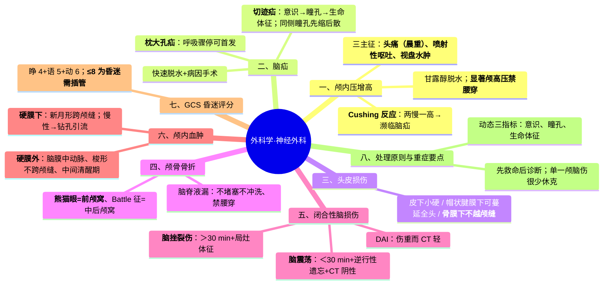
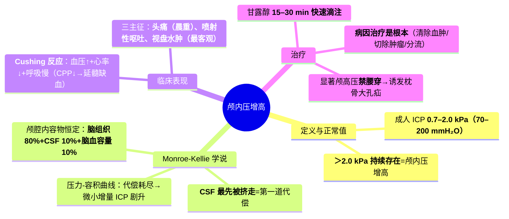
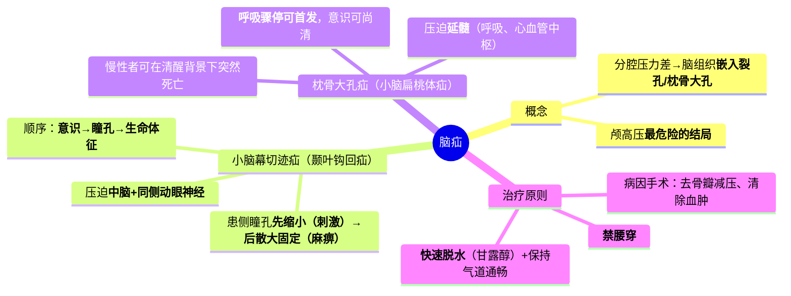

---
tags:
  - 考研306/外科学/神经外科
科目: 外科学
系统: 神经外科
内容: 颅高压、脑疝、颅脑损伤
---
# 外科学·讲义精讲版——神经外科

> 本册覆盖：颅内压增高、脑疝、头皮与颅骨损伤、脑损伤、颅内血肿、GCS 评分。
> 神经外科在 306 外科学中题量不大，但概念题密集、易混点多，属于"少而准"的得分模块。
> 复习主线：一条 Monroe-Kellie 学说贯穿颅高压与脑疝；一组对比表区分各类颅脑损伤。

---

## 一、颅内压增高

### 【定义与正常值】
- 颅内压（ICP）正常值：成人侧卧位腰穿测定约 **0.7–2.0 kPa（70–200 mmH₂O）**；儿童约 0.5–1.0 kPa（50–100 mmH₂O）。
- 成人 ICP **>2.0 kPa（200 mmH₂O）** 且持续存在，即为颅内压增高。

### 【解剖与调节基础：Monroe-Kellie 学说】
- 颅腔容积固定（成人约 1400–1500 ml），内容物三要素：**脑组织（约 80%）+ 脑脊液（约 10%）+ 脑血容量（约 10%）**。
- 三者体积总和恒定：一方增大，其余必须缩减以代偿。
  - 脑脊液最易被"挤走"（吸收加快、向脊髓蛛网膜下腔转移）——第一道代偿；
  - 脑血流量其次（脑血管受压、灌注下降）；
  - 脑组织本身几乎不可压缩——没有代偿能力。
- **压力-容积曲线**：代偿期内 ICP 缓慢上升或不变；一旦代偿耗尽（曲线陡直段），容积的微小增加即引起 ICP 剧烈升高——这解释了为什么慢性占位可以长期无症状，而一次小出血即诱发脑疝。

### 【病因】（三大类）
| 机制 | 举例 |
|---|---|
| 颅内容物体积增大 | 脑水肿（血管源性/细胞毒性）、脑积水（CSF 增多）、脑血流量增加（高碳酸血症等） |
| 颅内占位性病变 | 颅内血肿、脑肿瘤、脑脓肿、寄生虫 |
| 颅腔容积缩小 | 狭颅症、大面积凹陷性颅骨骨折 |

### 【临床表现】
1. **三主征**：
   - **头痛**：最常见，特点为**晨起或夜间加重**、弯腰低头用力时加重。机制：平卧及睡眠时静脉回流减慢、CO₂ 潴留使脑血流增加，ICP 夜间相对更高。
   - **呕吐**：呈**喷射性**，常不伴恶心前驱、与进食无关。机制：呕吐中枢/迷走神经核团受刺激。
   - **视盘水肿**：**最客观、最重要的体征**。机制：ICP 升高沿视神经鞘传导，阻碍视网膜中央静脉回流。长期视盘水肿→视神经继发萎缩→视力下降。
2. 其他：意识障碍（嗜睡→昏迷）、展神经麻痹（假性定位征——外展神经在颅底行程长，最易受牵拉）、婴幼儿头围增大、颅缝分离。
3. **Cushing 反应（库欣反应，"两慢一高"）**：**血压升高、心率减慢、呼吸减慢**。
   - 机制链：ICP↑ → 脑灌注压（CPP = MAP − ICP）↓ → 脑干（延髓）缺血 → 交感神经中枢大量放电 → 血压骤升以维持脑灌注 → 颈动脉窦/主动脉弓压力感受器反射 → 心率减慢；呼吸中枢受累则呼吸变慢变深。
   - 意义：出现 Cushing 反应提示 ICP 已显著升高、**濒临脑疝**，是急诊降压（脱水）与手术的强烈信号。

### 【辅助检查】
- CT/MRI 为首选：明确占位、水肿、脑积水；颅高压时慎做腰穿（见下）。

### 【治疗】
1. **病因治疗是根本**：清除血肿、切除肿瘤、脑积水行分流。
2. 一般处理：抬高床头 15–30°、保持气道通畅（防高碳酸血症扩张脑血管）、控制体温、避免低钠。
3. 降颅压药物：
   - **甘露醇**：20% 溶液 0.25–1 g/kg，**15–30 分钟内快速滴完**，每 4–6 小时可重复；机制为血浆高渗→脑组织脱水。
   - 甘油果糖（起效缓、维持久、可供给热量）、高渗盐水；呋塞米可与甘露醇交替增强脱水。
   - 激素对**血管源性脑水肿**（肿瘤周围水肿）有效，对细胞毒性水肿无效。
4. 亚低温治疗、过度通气（仅作**临时**措施：低碳酸使脑血管收缩、脑血流下降）。
5. 手术：去骨瓣减压、内减压（切除部分脑组织/肿瘤）、脑脊液分流。
6. **腰穿禁忌**：颅内压显著增高（尤其后颅窝占位、已提示脑疝者）禁做腰穿——放出 CSF 后椎管内压力骤降，压力梯度使脑组织向下移位，可**诱发枕骨大孔疝**。

### 【高频考点提示】
- 三主征中"最客观"是视盘水肿，"最常见"是头痛；喷射性呕吐不伴恶心。
- Cushing 反应 = 两慢一高，机制从 CPP 下降→延髓缺血说起。
- 腰穿为何禁忌（压力梯度→枕骨大孔疝）与 CSF 漏时禁腰穿（逆流感染）是两个不同理由，考试易互换设错。

> **相关知识点**：[[01-症状学#第 10 节 意识障碍|意识障碍（诊断）]] ｜ [[02-神经外科#二、脑疝|脑疝]] ｜ [[02-神经外科#六、颅内血肿（外伤性）|颅内血肿]]

---

## 二、脑疝

### 【概念】
- 颅腔被大脑镰、小脑幕分为三个分腔；当某一分腔压力显著高于邻近分腔时，脑组织从高压区向低压区移位，被挤入硬脑膜裂孔或枕骨大孔，压迫脑干、血管与脑神经，即为脑疝。是颅高压最危险的结局。

### 【小脑幕切迹疝 vs 枕骨大孔疝】（必背大表）

| 项目 | 小脑幕切迹疝（颞叶钩回疝） | 枕骨大孔疝（小脑扁桃体疝） |
|---|---|---|
| 疝出结构 | 颞叶钩回、海马回经小脑幕切迹缘疝入脚间池/环池 | 小脑扁桃体及延髓经枕骨大孔疝入椎管 |
| 常见诱因 | 大脑半球（幕上）占位、颞部硬膜外血肿 | 后颅窝占位、幕下血肿；腰穿不当 |
| 受压关键结构 | 中脑 + 同侧动眼神经 | 延髓（呼吸、心血管中枢） |
| 瞳孔变化 | **患侧瞳孔先缩小（刺激期）→后散大固定（麻痹期）**，对光反射消失 | 瞳孔改变出现晚且多变（晚期因脑干缺血可散大） |
| 意识障碍 | 出现早，进行性加深 | 相对较晚（慢性者可长期意识清醒） |
| 运动障碍 | 对侧锥体束征/偏瘫（中脑大脑脚受压；偶尔脑干推移使对侧大脑脚压向小脑幕缘→同侧偏瘫，即假定位征） | 意识尚清时运动障碍不突出 |
| 生命体征 | 紊乱出现相对较晚（先意识/瞳孔改变，后血压脉搏呼吸异常） | **紊乱出现早而剧烈，呼吸骤停常为首发或最突出表现**，可在意识清楚背景下突然死亡 |
| 其他体征 | 去大脑强直（晚期） | 颈项强直、强迫头位（枕下痛） |
| 总体顺序特点 | "意识→瞳孔→生命体征" | "生命体征（呼吸）→意识→瞳孔" |
| 紧急处理 | 甘露醇脱水 + 病因手术（去骨瓣减压、清除血肿） | 甘露醇 + 脑室穿刺引流（幕下占位梗阻性脑积水时）+ 枕下减压 |

- **瞳孔变化机制**（理解记忆）：颞叶钩回疝入时先**牵拉刺激**动眼神经副交感纤维→瞳孔缩小；随后神经**受压麻痹**→瞳孔散大、固定。所以"先缩小后散大"是同一过程的两个阶段，也是与视神经、交感神经病变鉴别的关键。

### 【治疗原则】
- 快速脱水（甘露醇）、保持气道通畅与过度通气（临时）、脑室穿刺外引流；根本是病因手术：清除血肿、去骨瓣减压、切除占位。
- 禁忌：明显颅高压时禁腰穿。

### 【高频考点提示】
- "同侧瞳孔散大 + 对侧肢体瘫痪"提示小脑幕切迹疝；"意识尚清却突然呼吸停止"提示枕骨大孔疝。
- 两大脑疝的意识/瞳孔/生命体征出现顺序相反，是选择题最常设的混淆点。

> **相关知识点**：[[01-症状学#第 10 节 意识障碍|意识障碍（诊断）]] ｜ [[02-神经外科#一、颅内压增高|颅内压增高]] ｜ [[02-神经外科#六、颅内血肿（外伤性）|颅内血肿]]

---

## 三、头皮损伤

### 【头皮血肿三类对比表】（必背）

| 项目 | 皮下血肿 | 帽状腱膜下血肿 | 骨膜下血肿 |
|---|---|---|---|
| 血肿层次 | 皮下组织层（致密） | 帽状腱膜下疏松结缔组织层 | 骨膜与颅骨外板之间 |
| 范围 | 小而局限 | **可蔓延至整个头部**（此层无边界） | **局限于一块颅骨、不越过颅缝**（骨膜与颅缝紧密粘连） |
| 质地 | 硬、触痛明显 | 软、有明显波动感 | 较硬、张力高 |
| 常见原因 | 直接暴力 | 牵拉/剪切暴力、凝血障碍 | **产伤（新生儿"头颅血肿"）**、伴颅骨线形骨折 |
| 危险 | 一般无 | 小儿大量出血可致贫血甚至休克 | 需与凹陷骨折鉴别（常需 CT） |
| 处理 | 自行吸收，早期冷敷 | 大者穿刺抽吸后加压包扎 | 观察，多自行吸收；勿盲目按压 |

### 【头皮裂伤与撕脱伤】
- 头皮血供极丰富（吻合多），裂伤后虽出血凶猛，但清创缝合时限可放宽至伤后 24 小时内（仍应尽早）。
- 撕脱伤：整层头皮（常连帽状腱膜）被强力牵拉撕脱——止血、抗休克，撕脱头皮妥善保存（低温、干燥）争取再植；无法再植者清创后植皮。

### 【高频考点提示】
- 骨膜下血肿"不越颅缝"是解剖判断题的高频点；帽状腱膜下血肿"可蔓延全头"与之互为镜像。

---

## 四、颅骨骨折

### 【颅盖骨折】
- 线形骨折：最常见，本身无需特殊处理，警惕其下方血管（脑膜中动脉、静脉窦）损伤。
- 凹陷性骨折手术指征：①凹陷深度 **>1 cm**；②位于脑功能区并有神经损害体征；③骨折片刺入脑组织或伴开放性损伤；④大面积凹陷（直径 >5 cm）引起颅高压；⑤影响美观或诱发癫痫。颅骨静脉窦表面的凹陷骨折，无明显症状时不盲目撬起（防大出血）。

### 【颅底骨折】
- 绝大多数为线形骨折，多为间接暴力传导所致；因颅底结构复杂 X 线价值有限，诊断主要靠**临床征象 + CT（薄层/骨窗）**。颅底骨折本身不需手术治疗，重点在处理脑脊液漏与感染预防。

**三型颅底骨折对比表**（必背）

| 项目 | 前颅窝骨折 | 中颅窝骨折 | 后颅窝骨折 |
|---|---|---|---|
| 骨折部位 | 筛板、眶顶、蝶骨体 | 颞骨岩部、蝶骨 | 枕骨基底部、岩部后方 |
| 典型软组织征 | **"熊猫眼征"**（眶周瘀斑）、球结膜下瘀血 | **Battle 征**（乳突部瘀斑）、耳后皮下瘀血 | Battle 征、枕下瘀血肿胀 |
| 脑脊液漏 | **鼻漏** | **耳漏**（或经蝶窦鼻漏） | 少见 |
| 脑神经损伤 | 嗅神经（I）、视神经（II） | 面神经（VII）、听神经（VIII），亦可 II–VI | 后组脑神经（IX–XII） |
| 伴随 | 额叶挫伤、气颅 | 颞叶挫伤、鼓膜穿孔出血 | 延髓损伤、后组神经麻痹（吞咽呛咳） |

### 【脑脊液漏的处理原则】（必考）
- 漏口使颅腔与外界（鼻旁窦、中耳）相通，若堵塞漏口、擤鼻、咳嗽用力，气体与分泌物可被"吸"入颅内→**逆行性颅内感染（脑膜炎）**；因此处理核心是"让它顺流、防逆流"。
  1. 取**头高位**（床头抬高 15–30°）卧床，借重力使脑组织贴附漏口、减少漏液；
  2. **不可堵塞、不可冲洗漏道、不可向鼻/耳内滴药**，不可用棉球深塞；
  3. 避免**擤鼻、咳嗽、用力排便**（骤升颅压使液体/气体逆流）；
  4. **不做腰穿**（椎管内压力降低，鼻咽部分泌物逆流）；
  5. 预防性抗生素、T 破伤风免疫按需；
  6. 绝大多数 1–2 周内自愈；**漏液超过约 1 个月不愈者**手术修补漏口。
- 识别技巧：区分"血性耳/鼻漏"与局部出血——漏液滴在纱布上呈**中心红色、周边淡黄晕圈**（"靶征/晕环"）提示含脑脊液。

### 【高频考点提示】
- 熊猫眼=前颅窝，Battle 征=中/后颅窝；耳漏=岩部（中颅窝）。
- 脑脊液漏"三不一早"：不堵塞、不冲洗、不滴药、早抬头；禁忌腰穿的理由是**逆流感染**而非脑疝（此处颅压不高的慢性漏）。

> **相关知识点**：[[02-神经外科#六、颅内血肿（外伤性）|颅内血肿]] ｜ [[02-神经外科#一、颅内压增高|颅内压增高]]

---

## 五、闭合性脑损伤：脑震荡 vs 脑挫裂伤

### 【机制概览】
- 原发性脑损伤：暴力直接造成——脑震荡、脑挫裂伤、弥漫性轴索损伤（DAI）。
- 继发性脑损伤：伤后逐渐出现——脑水肿、颅内血肿、ICP 增高、脑疝。伤情评估的核心是区分"原发伤的轻重"与"继发伤的进展"。

### 【脑震荡 vs 脑挫裂伤 对比表】（必背）

| 项目 | 脑震荡 | 脑挫裂伤 |
|---|---|---|
| 病理基础 | 无肉眼可见器质性损伤（一过性脑功能障碍） | 脑实质挫伤、裂伤，点片状出血、水肿 |
| 意识障碍 | **一过性，<30 分钟**，完全清醒后不再恶化 | **>30 分钟**，程度重、可持续数日至数周，可进行性加重 |
| 逆行性遗忘 | **标志性表现**（清醒后不能回忆受伤经过） | 可有，但非特征 |
| 神经系统体征 | 无阳性体征 | 局灶体征：偏瘫、失语、锥体束征等 |
| 脑脊液/CT | CSF 无红细胞；CT 阴性 | CSF 可含红细胞；CT 示挫裂伤灶低密度水肿+点片高密度出血，常伴蛛网膜下腔出血 |
| 处理与预后 | 观察 48 小时（警惕迟发颅内血肿）、对症休息，完全恢复 | 防脑水肿、降颅压、必要时手术；遗留神经功能缺损可能 |

### 【弥漫性轴索损伤（DAI）要点】
- 旋转/剪切暴力致大脑白质广泛轴索断裂；伤后即刻持续昏迷（多为重型）、去大脑强直；CT 可仅见散在小出血灶（胼胝体、脑干旁），MRI 更敏感。临床"伤重而 CT 轻"要想到 DAI。

> **相关知识点**：[[02-神经外科#六、颅内血肿（外伤性）|颅内血肿]]

---

## 六、颅内血肿（外伤性）

### 【分类】
- 按解剖：硬脑膜外血肿、硬脑膜下血肿、脑内血肿。
- 按病程：急性（<3 天）、亚急性（3 天–3 周）、慢性（>3 周）。

### 【硬膜外血肿 vs 硬膜下血肿】（本文件核心大表）

| 项目 | 硬脑膜外血肿 | 硬脑膜下血肿 |
|---|---|---|
| 出血来源 | **脑膜中动脉**（最典型，颞部）、静脉窦、板障血管 | **桥静脉**撕裂（慢性型）、皮层小血管/挫裂伤灶（急性型） |
| 与颅骨骨折关系 | 常伴同侧颞部**颅骨骨折**（骨折线撕破血管） | 不一定伴骨折；老年人脑萎缩者轻微外力即可 |
| 血肿层面 | 颅骨与硬脑膜之间（硬膜与颅骨内板粘连处受限于骨缝） | 硬脑膜与蛛网膜之间（此间隙阻力小） |
| CT 形态 | **梭形（双凸透镜形）高密度影，不跨越颅缝** | **新月形/半月形高密度影，可跨越颅缝** |
| 原发脑损伤 | 常较轻 | 常较重 |
| 意识变化 | **典型"中间清醒期"**：伤后昏迷→清醒→再昏迷 | 伤后持续昏迷，多无中间清醒期；慢性者病程数周、头痛+痴呆+偏瘫 |
| 中间清醒期机制 | 原发伤轻（短暂震荡昏迷）→血肿缓慢增大、ICP 升高→脑疝→再昏迷 | 桥静脉出血缓慢者可呈慢性；急性者原发伤重，清醒期不明显 |
| 瞳孔改变 | 血肿侧瞳孔散大（小脑幕切迹疝） | 可有，多为血肿侧 |
| 主要治疗 | 幕上血肿量约 >30 ml、幕下约 >10 ml，或意识进行性恶化、颅高压明显者→**骨瓣开颅血肿清除**；小血肿可 CT 动态观察 | 急性量较大→开颅清除+去骨瓣减压；**慢性硬膜下血肿→钻孔引流术**（首选，老年人） |
| 预后 | 及时手术者预后好 | 急性伴严重脑挫伤者预后较差 |

- **中间清醒期再昏迷的本质**是"继发性脑损伤（血肿→颅高压→脑疝）叠加于轻度原发伤之上"，因此凡有中间清醒期者几乎都是手术绝对指征的预警。

### 【慢性硬膜下血肿要点】
- 老年人常见：脑萎缩使桥静脉被拉长、张力增加，轻微外伤（甚至无外伤史）即可撕裂；出血缓慢、包膜形成。
- 表现：慢性颅高压（头痛）+ 痴呆、精神异常 + 轻偏瘫，酷似老年痴呆或卒中。
- 治疗：**钻孔引流**，效果立竿见影。

### 【高频考点提示】
- CT 形态（梭形不跨颅缝 vs 新月形跨颅缝）+ 中间清醒期 + 脑膜中动脉——三件套几乎每年以不同形式出现。
- 慢性硬膜下血肿=老年人+轻微外伤+钻孔引流。

> **相关知识点**：[[02-神经外科#一、颅内压增高|颅内压增高]] ｜ [[02-神经外科#二、脑疝|脑疝]]

---

## 七、GCS 昏迷评分（格拉斯哥）

| 分项 | 评分 | 表现 |
|---|---|---|
| 睁眼（E，4 分） | 4 / 3 / 2 / 1 | 自动睁眼 / 呼唤睁眼 / 刺痛睁眼 / 无睁眼 |
| 语言（V，5 分） | 5 / 4 / 3 / 2 / 1 | 回答正确 / 对话错乱（语无伦次）/ 只能说单词 / 只能发声 / 无语言 |
| 运动（M，6 分） | 6 / 5 / 4 / 3 / 2 / 1 | 遵嘱动作 / 刺痛能定位 / 刺痛躲避 / 刺痛异常屈曲（去皮层强直）/ 刺痛异常伸展（去大脑强直）/ 无反应 |

- 总分 3–15 分；三项相加。**13–15 轻型、9–12 中型、3–8 重型**；**GCS ≤8 视为昏迷**，需尽早气管插管保护气道。
- 注意：气管插管者语言项记"T"，镇静肌松者无法准确评分，评分以最佳反应为准。

> **相关知识点**：[[01-症状学#第 10 节 意识障碍|意识障碍分级（诊断）]]

---

## 八、颅脑损伤处理原则与重症要点

### 【急诊评估流程】
1. 先救命后诊断：保持气道通畅（GCS≤8 即插管）、循环稳定（颅脑伤合并低血压时优先纠正——脑灌注依赖血压，单一颅脑伤本身很少引起休克，出现休克必先找颅外出血）。
2. 病史三要素：受伤机制、伤后意识变化轨迹（是否昏迷—清醒—再昏迷）、瞳孔与呕吐。
3. CT 指征：意识障碍、局灶体征、颅骨骨折、可疑血肿者； CT 阴性但意识障碍者须留观复查。

### 【治疗原则】
- 手术指征：颅内血肿有占位效应（意识恶化、颅高压、CT 占位明显）、凹陷骨折符合指征、脑脊液漏不愈者修补。
- 非手术：降颅压（甘露醇等，同总论）、防治癫痫（创伤后早期抗惊厥）、亚低温、营养支持、防治肺部感染、应激性溃疡（预防用 PPI）、DVT 预防。
- 动态观察三指标：**意识（GCS 趋势）、瞳孔、生命体征**；任一恶化立即复查 CT。

### 【补充：颅内血肿手术与保守观察的界限】
- 手术指征（要点）：①意识进行性恶化、出现脑疝征象（瞳孔散大、Cushing 反应）；②幕上血肿量约 >30 ml、幕下约 >10 ml，或中线移位明显（>1 cm 量级，⚠ 数值需核对）；③CT 示明显占位效应（脑室受压、基底池消失）；④降颅压治疗无效的颅高压。
- 保守观察条件：神志清楚且稳定、血肿量小（幕上 <30 ml 量级）、中线无明显移位——但必须**住院严密监测 + 24–72 h 内动态复查 CT**；观察期间慎用强镇静（掩盖神志变化），任何恶化立即手术。

### 【全册神经外科高频考点提示汇总】
| 考点 | 答案要点 |
|---|---|
| 颅高压三主征 | 头痛（晨重）、喷射性呕吐、视盘水肿（最客观） |
| Cushing 反应 | 血压↑+心率↓+呼吸慢——濒临脑疝 |
| 切迹疝瞳孔 | 同侧先缩小后散大（动眼神经先刺激后麻痹） |
| 枕大孔疝 | 呼吸骤停可先于意识障碍；禁腰穿 |
| 皮下/帽状腱膜下/骨膜下血肿 | 小硬局限 / 大软全头 / 局限不越颅缝（产伤） |
| 脑脊液漏 | 头高位、禁堵塞冲洗擤鼻、禁腰穿、>1 月不愈手术 |
| 脑震荡 | 昏迷 <30 min+逆行性遗忘+CT 阴性 |
| 硬膜外血肿 | 脑膜中动脉、中间清醒期、CT 梭形不跨颅缝 |
| 硬膜下血肿 | 桥静脉、CT 新月形跨颅缝；慢性→钻孔引流 |
| GCS | 睁 4+语 5+动 6；3–15 分；≤8 为昏迷需插管 |

> **相关知识点**：[[02-神经外科#七、GCS 昏迷评分（格拉斯哥）|GCS 昏迷评分]] ｜ [[01-外科总论#四、外科休克|外科休克]]
