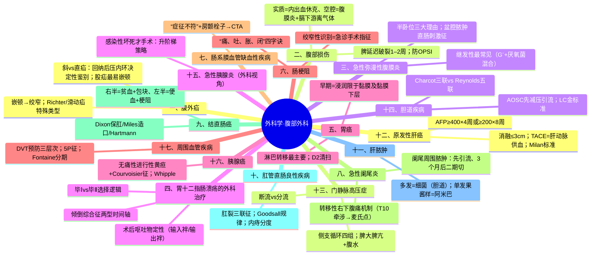
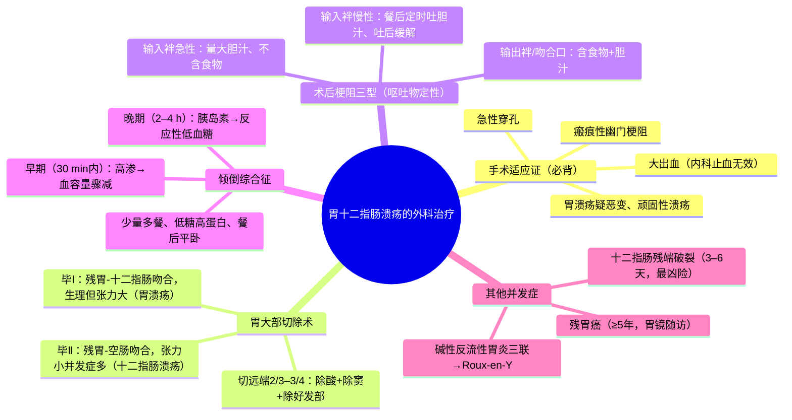
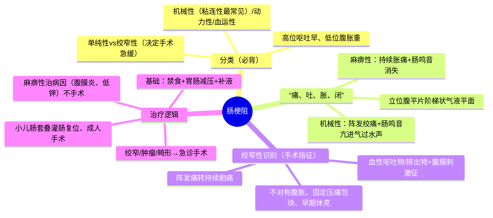
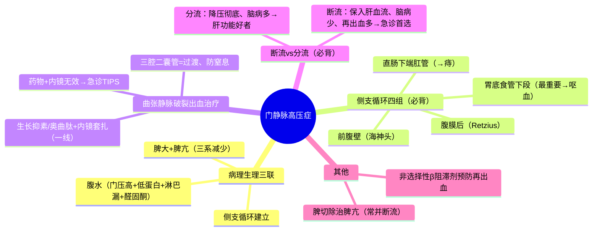
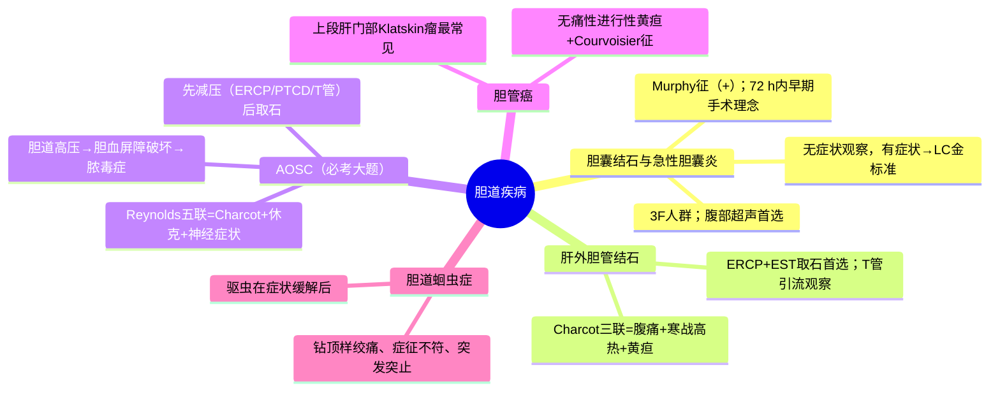

---
tags:
  - 考研306/外科学/腹部外科
科目: 外科学
系统: 腹部外科
内容: 疝、腹部损伤、腹膜炎、胃大部切除、肠梗阻、阑尾炎、结直肠癌、肝胆胰、门脉高压、周围血管
---
# 外科学·讲义精讲版——腹部外科

> 本册覆盖：腹外疝、腹部损伤、急性腹膜炎、胃十二指肠溃疡外科、胃癌、肠梗阻、肠系膜血管缺血、阑尾炎、结直肠癌与肛管疾病、肝脓肿、原发性肝癌、门静脉高压症、胆道疾病、胰腺炎（外科视角）与胰腺癌、周围血管疾病。
> 腹部外科是 306 外科学分值最大的模块，"机理+术式选择逻辑"是命题重心。
> 复习主线：腹腔按"腹壁→腹膜→空腔脏器→实质脏器→血管系统"逐层推进，对比表贯穿全册。

---

## 一、腹外疝

### 【解剖基础】
- 疝=体内脏器或组织离开其正常解剖部位，通过先天或后天形成的薄弱点、缺损或孔隙进入另一部位。腹外疝的组成：**疝环、疝囊、疝内容物（小肠最多见）、疝外被盖**。
- 易复性→难复性（粘连或滑动疝）→嵌顿→绞窄，是同一过程的连续谱。
- **斜疝的结构基础**：腹股沟管四壁（前壁：腹外斜肌腱膜；后壁：腹横筋膜与腹股沟镰；上壁：腹内斜肌与腹横肌弓状下缘；下壁：腹股沟韧带）——内环（深环）、外环（浅环）。
- **直疝的结构基础**：**直疝三角（Hesselbach 三角）**——外侧边：腹壁下动脉；内侧边：腹直肌外缘；底边：腹股沟韧带。

### 【斜疝 vs 直疝 vs 股疝】（必背大表）

| 鉴别点 | 腹股沟斜疝 | 腹股沟直疝 | 股疝 |
|---|---|---|---|
| 发病年龄 | **儿童、青壮年** | **老年人**（腹壁薄弱） | **中年以上女性**（多次妊娠、股管宽松） |
| 突出途径 | 经**内环→腹股沟管→外环→可进入阴囊** | 经**直疝三角**直接向前突出，**不入阴囊** | 经**股环→股管→卵圆窝**突出（腹股沟韧带下方） |
| 疝块位置 | 腹股沟部斜行、可入阴囊 | 腹股沟内侧、半球形 | **卵圆窝处半球形**，耻骨结节外下方 |
| 与腹壁下动脉关系 | 疝囊颈在其**外侧** | 疝囊颈在其**内侧** | — |
| 与精索关系 | 疝囊在精索**前方** | 在精索**内后方** | 与精索无关 |
| **回纳后压迫内环** | **疝块不再突出**（决定性鉴别） | **仍可突出** | 压内环无效（经股管） |
| 嵌顿机会 | 较多 | **极少**（直疝三角宽大直通） | **最容易嵌顿**（股环狭小、周围韧带坚韧） |
| 嵌顿后果 | 需急诊手术 | 少见 | **早期绞窄风险最高**、表现易被忽略 |

### 【嵌顿疝与绞窄疝】（必考）
- **机制链**：疝内容物（多为小肠）经狭小疝环挤出→疝环卡压→**先压迫静脉回流**→肠壁淤血水肿→肠腔内压进一步升高→**继而动脉血供受阻**→肠壁缺血、坏死→穿孔。
- **嵌顿**：静脉回流受阻、疝块紧张疼痛、不能回纳、可有机械性肠梗阻表现（**Rovsing 征/疝块压痛**）；**绞窄**：动脉血供中断→**疝块触痛明显、局部红肿、全身中毒症状（发热、脉速、白细胞升高）、肠坏死穿孔可致疝外被盖红肿蜂窝织炎甚至脓肿**。
- 临床鉴别要点：嵌顿时间越长越易绞窄；**只要不能确定是否绞窄，按绞窄处理（急诊手术）**。
- 特殊类型（必背）：
  - **Richter 疝（肠管壁疝）**：仅**部分肠管壁**被嵌顿→可以**没有肠梗阻表现**而直接绞窄穿孔（最易被漏诊）；
  - **Littre 疝**：嵌顿内容物为 **Meckel 憩室**；
  - **滑动性疝**：疝囊壁的一部分由**盲肠、乙状结肠或膀胱**等构成（脏器本身是"囊壁"）→**不能完全回纳**、多见于右侧；手术修补时须识别防损伤（误将膀胱/肠管当疝囊切开）；
  - 逆行性嵌顿（W 形嵌顿）：肠袢呈 W 形，**腹腔内中间肠袢也可坏死**——术中必须检查腹腔内肠管。
- 处理：
  - 嵌顿原则上**急诊手术**，解除疝环压迫、检查肠管活力（色泽、蠕动、系膜血管搏动）、坏死切除吻合；
  - **手法复位适应证窄**：嵌顿时间短（数小时内，一般 <3–4 h）、局部压痛不剧、无腹膜刺激征、年老体弱不宜手术者；复位后仍须观察肠梗阻与腹膜炎征象。复位动作：头低足高、镇静、持续缓慢推送。

### 【治疗与术式】
- 除婴幼儿（部分可自愈）外，腹股沟疝均以手术为主：
  - 传统：疝囊高位结扎（婴幼儿即可治愈）+疝修补（Ferguson、Bassini、McVay/Marcy 等——加强后壁）；
  - **无张力疝修补术（网片填充，现代主流）**：复发率低、术后疼痛少、可早期下床；
  - 腹腔镜修补（TAPP/TEP）。
- **McVay 术**（联合腱与腹股沟韧带缝于**耻骨梳韧带**）：适用于**股疝与直疝、巨大斜疝**。
- 婴幼儿嵌顿疝：腹壁肌薄弱、疝环弹性好，嵌顿后绞窄相对晚，短期密切观察下可试手法复位，失败即手术。
- **切口疝**：最常见原因为**切口感染**，其次切口裂开、腹压增高；表现为站立时切口处肿物、平卧消失、疝环大不易嵌顿；治疗：手术修补（无张力）。

### 【高频考点提示】
- 压内环试验是斜/直疝"决定性"鉴别；斜疝经腹壁下动脉外侧、直疝内侧。
- Richter 疝"无肠梗阻也会穿孔"；滑动疝的疝囊壁=内脏；逆行嵌顿查腹腔内肠袢。
- 股疝=中年女性+卵圆窝+最易嵌顿。

> **相关知识点**：[[05-腹部外科#六、肠梗阻|肠梗阻]]（嵌顿疝→机械性肠梗阻）

---

## 二、腹部损伤

### 【实质脏器 vs 空腔脏器破裂】（必背大表）

| 项目 | 实质性脏器破裂（脾、肝、胰、肾） | 空腔脏器破裂（胃、肠、膀胱） |
|---|---|---|
| 病理核心 | **破裂出血→腹膜后/腹腔积血** | 内容物漏出→**化学性→细菌性腹膜炎** |
| 主要表现 | **内出血/休克**（面色苍白、脉速、血压下降） | **腹膜炎**（持续剧痛、腹肌紧张、压痛反跳痛） |
| 腹痛 | 持续性胀痛，腹膜刺激征较轻（血液刺激弱） | 剧烈，**板状腹**（胃十二指肠穿孔最典型） |
| 膈下游离气体 | 无 | **常见（立位 X 线，胃十二指肠穿孔多见）** |
| 腹腔穿刺 | **不凝血** | 消化液、胆汁、肠内容物、浑浊液 |
| 血象 | 出血→Hb/Hct 下降 | 感染→白细胞显著升高 |

### 【诊断步骤】
- 病史（暴力方向、受伤部位）、生命体征优先（**先抗休克**）、腹部"视触叩听"+直肠指检；
- **诊断性腹腔穿刺**：穿刺点常选**脐与髂前上棘连线的中、外 1/3 交界处**（避开腹壁血管）；多象限/多部位穿刺。阳性价值大（不凝血=实质脏器出血；浑浊液体/胆汁/肠内容=空腔破裂）；**穿刺阴性不能排除内脏损伤**（假阴性 10%–20%）——必要时行**诊断性腹腔灌洗（DPL）**或 CT；
- 超声（FAST——快速筛查腹腔积液，尤其床旁）、CT（实质脏器分级首选）；
- **有下列情况之一即应手术探查**：休克经抗休克无好转或恶化；持续腹痛加重、腹膜刺激征扩大；进行性腹胀肠鸣音消失；穿刺阳性；呕血/便血/血尿合并休克；⚠ 火器伤穿透腹腔原则上探查。
- 探查原则："先止血、后修补"：实质性脏器出血常比空腔脏器穿孔更急。

### 【脾破裂】（最常见腹部实质脏器损伤）
- 分类：中央型（脾实质深部）、被膜下（被膜完整、被膜下积血）、真性破裂（被膜与实质均破——最常见）。
- **延迟性脾破裂（被膜下破裂）机制**：被膜下血肿压力升高或轻微外力→**被膜迟发性破裂**→伤后（常见 1–2 周内，多在伤后 48 h–数日）突然腹腔大出血。故脾破裂患者**伤后须卧床观察 1–2 周**。
- Kehr 征：血液刺激左膈→**左肩部放射性疼痛**（深呼吸时加重）。
- 治疗：
  - 无休克或休克易纠正、损伤分级低→**非手术治疗（绝对卧床、禁食、补液、动态观察）**，是儿童首选；
  - 手术：脾修补/部分切除→**全脾切除**；**"脾切除+自体脾片移植/保留脾脏"的理由：预防脾切除术后凶险性感染（OPSI——以肺炎球菌为主的暴发性感染，儿童风险最高）**；
  - 成人真性破裂大出血→脾切除为主。

### 【肝破裂】
- 特点：出血+**胆汁漏**→腹痛与腹膜炎都比脾破裂明显（胆汁刺激强）；可有胆道出血（伤后黑便/呕血+黄疸——胆道与血肿相通）。
- 处理：清创、缝合、填塞（损伤控制）、肝部分切除；右上腹/右下胸受伤要想到。
- **十二指肠损伤**：腹膜后部分损伤隐匿——右上腹/腰背部持续痛、放射至右睾丸、早期体征少→CT 示腹膜后积气积液；治疗复杂（修补+减压造瘘）。
- **胰腺损伤**：车祸方向盘伤；血清/腹腔液淀粉酶升高提示；处理按主胰管是否断裂。

### 【高频考点提示】
- 穿刺不凝血=出血、凝固血=刚出的活动性血或误入血管；假阴性 10%–20%。
- 脾延迟破裂=伤后 1–2 周；OPSI 与保脾逻辑。
- 十二指肠腹膜后伤"症征不符"。

> **相关知识点**：[[05-腹部外科#三、急性弥漫性腹膜炎|急性弥漫性腹膜炎]]（空腔脏器破裂→腹膜炎）

---

## 三、急性弥漫性腹膜炎

### 【定义与分类】
- 腹膜炎症：**继发性腹膜炎（最常见）**——腹腔内脏器穿孔（阑尾炎穿孔、胃十二指肠溃疡穿孔、肠穿孔）、炎症扩散（胰腺炎、女性生殖道感染）、外伤；致病菌多为**大肠埃希菌为主的混合感染（G⁻+厌氧菌）**；
- **原发性腹膜炎**：腹腔内无原发病灶、血行/淋巴/女性生殖道上行感染；**儿童（链球菌、肺炎球菌）与肝硬化腹水患者（自发性细菌性腹膜炎 SBP）**多见。

### 【临床表现与机制】
- 腹痛：持续性剧痛，深呼吸咳嗽加重；由原发病灶向全腹扩散。
- **腹膜刺激征三联：压痛、反跳痛、腹肌紧张**——胃十二指肠穿孔→**板状腹**（胃酸化学刺激最强）；老年、幼儿、肥胖、衰竭者可不明显（⚠ "症状体征与病情不符"陷阱）。
- **腹胀、肠鸣音减弱或消失**（麻痹性肠梗阻的表现）——炎症抑制肠蠕动。
- 全身：发热、心率快；重症→感染性休克、MODS。
- 直肠指检：直肠前窝饱满触痛（盆腔积脓）。

### 【辅助检查】
- 白细胞升高；立位腹平片：**膈下游离气体**（空腔穿孔）、麻痹性肠梗阻征象；超声：积液、原发病灶；CT 更精确；诊断性穿刺（脓液→培养）。

### 【治疗】
1. **非手术（基础处理）**：**半卧位**（盆腔腹膜吸收能力弱、中毒轻，且脓液积聚盆腔便于引流——必考机制）；禁食、**胃肠减压**；补液纠正水电解质；广谱抗生素（覆盖 G⁻+厌氧菌）；镇痛（诊断明确后）。
2. **手术指征**：①非手术治疗 6–8 小时无效或加重；②**原发病需手术处理**（溃疡穿孔、化脓坏疽性阑尾炎、绞窄性肠梗阻、胆囊穿孔）；③腹腔内积脓多、中毒症状重；④休克不易纠正者边抗休克边手术。
3. 手术目的："**处理原发灶（穿孔修补/病灶切除）+彻底清洗腹腔+充分引流**"。

### 【腹腔脓肿】（腹膜炎后局限化）
| 脓肿 | 部位与机制 | 特点与处理 |
|---|---|---|
| 膈下脓肿 | 平卧位最低点为膈下间隙（脓液易积聚） | 高热不退、呃逆、季肋部痛、胸膜反应（胸腔积液）；超声/CT 引导穿刺引流或手术 |
| 盆腔脓肿 | 半卧位使脓液流向盆腔（腹膜吸收弱→全身症状轻但形成脓肿） | **直肠/膀胱刺激征**（里急后重、尿频）、直肠指检触及触痛包块；**温盐水灌肠、直肠前壁切开引流**（经直肠/阴道） |
| 肠间脓肿 | 肠袢间包裹 | 腹胀、不完全性肠梗阻表现；超声引导引流 |

### 【高频考点提示】
- 半卧位的三大理由（吸收弱/中毒轻/便引流）；盆腔脓肿=直肠刺激征+直肠指检；膈下脓肿=呃逆+胸腔积液。

> **相关知识点**：[[01-症状学#第 6 节 腹痛|腹痛（诊断）]] ｜ [[01-病理学-总论#第四章 炎症 ★★|炎症（病理）]] ｜ [[05-腹部外科#四、胃十二指肠溃疡的外科治疗|胃十二指肠溃疡的外科治疗]]

---

## 四、胃十二指肠溃疡的外科治疗

### 【外科手术适应证】（必背）
1. **急性穿孔**（弥漫性腹膜炎）；
2. **大出血**：短期出血量大（休克、Hb 持续下降）、**24 h 内输血量较大仍不能稳定**、或非手术止血无效；⚠ 具体输血量界限（如 24 h 输血 >1000 ml 或 6–8 h 内 >600 ml）各版本有差异，需核对；
3. **瘢痕性幽门梗阻**（器质性——水肿性可先保守）；
4. **胃溃疡疑恶变**（十二指肠溃疡极少恶变）；
5. **内科正规治疗无效的顽固性溃疡**（严格掌握）。
- 特殊溃疡：胃溃疡手术指征比十二指肠溃疡宽（恶变可能）；**十二指肠后壁溃疡**易穿透侵及**胃十二指肠动脉**→大出血（机制：解剖毗邻）。

### 【胃大部切除术】（必背核心）
- 切除范围：**胃远端 2/3–3/4**（含幽门与十二指肠球部一部分）；残胃容量约 1/3。
- 理论基础："无酸即无溃疡"——切除大部分分泌胃酸与胃蛋白酶的壁细胞区+切除幽门窦部（G 细胞，减少促胃液素）+切除溃疡好发部位。

**毕Ⅰ式 vs 毕Ⅱ式对比表**（必背大表）

| 项目 | 毕Ⅰ式（Billroth Ⅰ） | 毕Ⅱ式（Billroth Ⅱ） |
|---|---|---|
| 吻合方式 | **残胃与十二指肠直接吻合** | **残胃与空肠吻合**，十二指肠残端关闭 |
| 生理性 | **接近正常解剖生理**（食糜仍经十二指肠，胆胰液与食物汇合正常） | 改变解剖：十二指肠被旷置，胆胰液经输入袢与胃内容在输出袢汇合 |
| 适用 | **胃溃疡**（远端胃切除后张力可及） | **十二指肠溃疡**为主（即使切除范围大、吻合无张力）；胃溃疡亦可用 |
| 优点 | 并发症少（无十二指肠残端问题、反流少） | 吻合口张力小、溃疡复发率低 |
| 缺点 | 吻合口张力大；若切除不够→酸高→吻合口溃疡复发 | **十二指肠残端破裂、碱性反流性胃炎、倾倒综合征、营养障碍更多** |

### 【术后并发症】（本模块必考大题库）
1. **术后胃出血**：24 h 内少量暗红为正常；**大量鲜红或持续黑便→吻合口/残端血管出血**，非手术无效再手术。
2. **十二指肠残端破裂（毕Ⅱ式特有，最凶险）**：
   - 多在术后 **3–6 天**；原因：残端处理不满意、**输入袢梗阻致残端内压升高**、贫血低蛋白；
   - 表现：**突发右上腹剧痛、发热、腹膜炎体征**，腹腔引流出胆汁样液；
   - 处理：立即手术——残端造瘘/引流+腹腔引流+充分冲洗+营养支持（可空肠造瘘喂养）；重在预防（残端妥善处理、防输入袢梗阻）。
3. **术后梗阻**（必背三型）：
| 类型 | 机制与部位 | 呕吐物特点 |
|---|---|---|
| **输入袢梗阻（急性完全性）** | 输入袢疝入/扭转/内疝→闭袢性梗阻，胆胰液积聚 | **频繁呕吐胆汁样液，量多、"不含食物"**，上腹剧痛、可扪及包块；急诊手术 |
| **输入袢梗阻（慢性不全性）** | 输入袢慢性扩张，餐后胆胰液积聚到一定程度"喷射"涌入胃 | **餐后定时大量呕吐胆汁，吐后症状缓解，呕吐物几乎不含食物** |
| **输出袢/吻合口梗阻** | 吻合口水肿（多在术后早期，可自行缓解）、输出袢粘连扭转 | 呕吐物**含食物与胆汁**；水肿者胃肠减压营养支持等待；机械性者手术 |
4. **倾倒综合征**（必考机制）：
   - **早期倾倒综合征（餐后 30 min 内）**：机制——胃切除+幽门功能丧失→**高渗食物快速进入空肠**→①大量细胞外液渗入肠腔→血容量骤减；②肠道释放 5-HT、缓激肽、血管活性肽等→血管扩张。表现：**心悸、出汗、面色苍白、头晕、恶心、腹痛腹泻**。
   - **晚期（迟发）倾倒综合征（餐后 2–4 h）**：机制——糖快速吸收→胰岛素一过性过度分泌→**反应性低血糖**。表现：心悸、出汗、乏力、手抖，进糖后缓解（低血糖发作）。
   - 防治：**少量多餐、低糖高蛋白干食、进餐后平卧 20–30 min**（延缓胃排空）；症状重者手术（倒置空肠段等，少用）。
5. **碱性反流性胃炎（毕Ⅱ式后多见，"三联征"）**：
   - 表现：**①上腹持续灼痛（进食后加重、制酸剂无效）②呕吐胆汁（胆汁性呕吐）③体重减轻/贫血**；
   - 机制：毕Ⅱ式旷置幽门→胆胰液反流入残胃→胆盐破坏胃黏膜屏障；
   - 治疗：内科效果差→手术改道 **Roux-en-Y 吻合**（长输出袢使胆汁远离残胃）。
6. **吻合口溃疡**：多因胃切除不足/毕Ⅰ式残留壁细胞多→复发痛、出血；治疗需再手术或药物治疗。
7. **营养性并发症**：
   - **缺铁性贫血**（毕Ⅱ式旷置十二指肠——**铁主要在十二指肠吸收**）+巨幼贫（内因子减少→维生素 B12 缺乏）；
   - 脂肪泻、骨病（钙与维生素 D 吸收差、代谢性骨病）；
8. **残胃癌**：**胃良性疾病行胃切除术后 5 年以上**（多在 15–20 年以后）发生的原发于残胃的癌；机制：残胃萎缩性胃炎、肠化、反流损伤；**术后定期胃镜随访**。

### 【高频考点提示】
- 毕Ⅰ生理好但张力大、毕Ⅱ张力小但并发症多——选择逻辑"十二指肠溃疡选毕Ⅱ"。
- 呕吐物定性：胆汁不含食物=输入袢；含食物胆汁=输出袢/吻合口。
- 倾倒两型时间轴（30 min 内=高渗容量转移；2–4 h=胰岛素低血糖）。
- 碱性反流性胃炎三联+Roux-en-Y；残胃癌≥5 年。

> **相关知识点**：[[03-消化系统#三、消化性溃疡（PU）|消化性溃疡（内科）]] ｜ [[02-病理学-各论#8.2 消化性溃疡 ★★|消化性溃疡（病理）]] ｜ [[01-生理学-上#6.3 胃液分泌 ★★|胃液分泌（生理）]] ｜ [[05-腹部外科#三、急性弥漫性腹膜炎|急性弥漫性腹膜炎]]（急性穿孔） ｜ [[05-腹部外科#五、胃癌|胃癌]]（残胃癌随访）

---

## 五、胃癌

### 【病理与转移】
- 腺癌为主；早期胃癌=**浸润仅限于黏膜及黏膜下层**（无论有无淋巴结转移）；进展期（Borrmann 分型）。
- **转移途径**：直接蔓延；**淋巴转移为最主要途径**——第 1 站（邻近）→第 2、3 站；**跳跃式转移（左锁骨上淋巴结 Virchow 结节、脐周）**；血行转移（肝最常见）；种植转移——**女性卵巢 Krukenberg 瘤**、直肠前凹（Blumer shelf 经直肠指检可及）、腹膜播散。

### 【诊断】
- 胃镜+活检=确诊金标准；钡餐（充盈缺损/龛影/皮革胃）；CT 增强评估分期；**HER2 检测**指导靶向；CEA、CA19-9 辅助监测。
- 筛查：40 岁以上+高危因素（萎缩性胃炎伴肠化/不典型增生、幽门螺杆菌感染、家族史、高盐腌熏饮食）定期胃镜。

### 【治疗】（术式选择逻辑必考）
1. **根治性手术（D2 根治术）**：切除胃 2/3 以上或全胃+**清扫第 2 站淋巴结（D2 为标准清扫范围）**+网膜；近端胃/全胃切除（贲门部、弥漫型）；消化道重建 **Roux-en-Y** 或食管空肠吻合（全胃）。
2. **新辅助化疗**：局部进展期（T3–4a/N+，无远处转移）先行 2–3 周期化疗→降期、提高 R0 切除率、改善生存；**术后辅助化疗**：Ⅱ 期以上（⚠ 具体指征按指南）。
3. 早期胃癌内镜下切除（EMR/ESD——黏膜内、分化型、无溃疡等条件）。
4. 晚期：姑息手术（解除梗阻出血）+化疗（氟尿嘧啶类+铂+紫杉类）/抗 HER2（曲妥珠单抗）/免疫治疗（⚠ 按指南）。

### 【高频考点提示】
- 早期胃癌定义只看深度（黏膜及黏膜下层）。
- 淋巴转移最主要+Virchow 结节；Krukenberg 瘤=种植转移。
- D2=第二站淋巴结清扫；新辅助用于局部进展期降期。

> **相关知识点**：[[03-消化系统#四、胃癌|胃癌（内科）]] ｜ [[05-腹部外科#四、胃十二指肠溃疡的外科治疗|胃十二指肠溃疡的外科治疗]]（残胃癌来源）

---

## 六、肠梗阻

### 【分类】（必背）
| 分类轴 | 类型 | 说明 |
|---|---|---|
| 机制 | 机械性（粘连性最常见——腹部手术后；肿瘤、嵌顿疝、肠扭转、蛔虫） | 有梗阻的机械原因 |
| | 动力性：**麻痹性**（术后、腹膜炎、**低钾**）、痉挛性 | 无机械阻塞、肠管无力/痉挛 |
| | 血运性 | 肠系膜血管栓塞→先缺血后梗阻 |
| 血运 | 单纯性 / **绞窄性** | 有无血运障碍（决定手术急缓） |
| 部位 | 高位（空肠上段）/低位（回肠、结肠） | 呕吐早晚、腹胀程度不同 |
| 程度 | 完全性 / 不完全性 | 病程与排气排便情况 |

### 【临床表现："痛、吐、胀、闭"】
- 腹痛：机械性→**阵发性绞痛**；麻痹性→持续性胀痛无阵发；
- 呕吐：高位梗阻→**呕吐早而频繁**（胃内容物、胆汁）；低位→晚、可吐粪样物；麻痹性→溢出性；
- 腹胀：低位与麻痹性明显，高位不明显；**不对称腹胀提示闭袢/扭转**；
- 停止自肛门排气排便（不完全性者仍有少量）。
- 体征：机械性→**肠鸣音亢进、气过水声/金属音**；麻痹性→**肠鸣音消失**；绞窄→腹膜刺激征。
- 辅助检查：立位腹平片——**阶梯状气液平面**（完全性）与扩张肠袢；低位结肠梗阻钡灌肠见"鸟嘴征"（乙状结肠扭转）/杯口状（肠套叠）；CT 是判断绞窄与病因的首选。

### 【绞窄性肠梗阻的识别】（必背，手术指征）
1. 腹痛由**阵发性转为持续性剧痛**，或起病即为持续性；
2. **呕吐物、胃肠减压引流物、肛门排出物为血性**（血性液体=黏膜缺血坏死）；
3. 出现**腹膜刺激征**、发热、脉速、白细胞升高、**早期即出现休克**（且抗休克不易纠正）；
4. **不对称性腹胀/触及压痛固定的包块**（闭袢）；
5. 腹部 X 线：孤立扩张肠袢不随时间改变（"咖啡豆征"）；
6. 腹腔穿刺抽出血性液体。
- 机制理解：绞窄=血运障碍→肠壁渗血→血性渗液/血便；肠坏死→腹膜炎与感染中毒。

### 【治疗】
1. **基础治疗（一切肠梗阻通用）**：禁食、**胃肠减压**（减轻腹胀、降低肠内压——改善肠壁血运）；补液纠正水电解质酸碱失衡（低位梗阻丢失大量肠液→等渗脱水+低钾）；抗生素（绞窄/腹膜炎时）；解痉对症。
2. **手术治疗**：
   - **绞窄性、肿瘤性、先天性畸形所致梗阻：急诊/尽早手术**（解除原因+处理坏死肠管：切除吻合、造口）；
   - 粘连性单纯性梗阻：多数**先非手术**（减压多可缓解），反复发作或非手术无效→手术（粘连松解、排列、捷径）；
   - 乙状结肠扭转：纤维结肠镜复位减压（成功率高、易复发→择期切除）或急诊手术；
   - 肠套叠：儿童→**空气/钡灌肠复位**（发病 48 h 内、无绞窄征象）；成人→多为器质性病变（肿瘤）→**手术切除**；
   - 麻痹性梗阻：**治疗病因（腹膜炎、低钾）+胃肠减压，不手术**。
3. ⚠ 手术时机核心逻辑：**绞窄是手术绝对指征，拖延=肠坏死切除+短肠风险**。

### 【高频考点提示】
- "痛吐胀闭"四字诀；机械性 vs 麻痹性肠鸣音对比。
- 血性呕吐物/排出物+腹膜刺激征=绞窄。
- 肠套叠：小儿灌肠复位、成人手术；乙状结肠扭转"鸟嘴征"。

> **相关知识点**：[[01-生理学-上#第六章 消化和吸收|消化和吸收（生理）]] ｜ [[01-症状学#第 6 节 腹痛|腹痛（诊断）]] ｜ [[05-腹部外科#七、肠系膜血管缺血性疾病|肠系膜血管缺血性疾病]]（血运性肠梗阻）

---

## 七、肠系膜血管缺血性疾病

### 【病因分类】
- 肠系膜上动脉栓塞（**房颤栓子最常见来源**）、动脉血栓形成（动脉硬化狭窄基础上）、肠系膜上静脉血栓形成（门脉高压、高凝状态、腹腔感染）。

### 【临床表现】（必考"症征不符"）
- **早期：剧烈腹痛（重）+腹部体征轻微（轻）——"症征不符"是最大特点**；
- 腹痛突发持续、向后背/腰放射（动脉型）；呕吐腹泻（可血性）；
- 晚期（肠坏死）：腹膜刺激征、血便、休克——此时已失去最佳手术时机；
- 白细胞显著升高、乳酸升高（灌注不足）、D-二聚体升高。
- 诊断：CTA（首选，显示血管阻塞部位）；DSA 既往为金标准。

**栓塞 vs 血栓形成鉴别（要点）**：
| 项目 | 肠系膜上动脉栓塞 | 肠系膜上动脉血栓形成 |
|---|---|---|
| 基础病 | **房颤等心律失常（心源性栓子）** | 动脉粥样硬化狭窄基础上形成；可有慢性餐后腹痛史（"肠绞痛"） |
| 起病 | **突然、剧痛** | 相对缓慢渐进 |
| 好发部位 | 中结肠动脉开口以远的远段分支 | **肠系膜上动脉开口处**（斑块狭窄最重处） |
| 治疗侧重 | 取栓术/介入取栓 | 旁路转流为主 |

### 【治疗】
- **早期诊断、恢复血运是关键**：动脉栓塞→**取栓术/介入取栓+溶栓**；血栓形成→旁路转流；静脉血栓→抗凝为主；
- **坏死肠管切除**；术后抗凝、短肠综合征风险管理；⚠ 疑诊即抗凝（在排除禁忌后）是处理原则要点。

### 【高频考点提示】
- "腹痛与体征不符"→老年+房颤→CTA；延误至腹膜炎=肠坏死。

> **相关知识点**：[[05-腹部外科#六、肠梗阻|肠梗阻]]（绞窄性肠梗阻） ｜ [[05-腹部外科#十三、门静脉高压症|门静脉高压症]]（肠系膜静脉血栓病因）

---

## 八、急性阑尾炎

### 【病因与机制】
- **阑尾管腔阻塞是最主要原因**（粪石最常见；淋巴滤泡增生——儿童；食物残渣、肿瘤）；阻塞→腔内压升高→黏膜缺血→细菌（大肠埃希菌等肠道菌）入侵→化脓→坏疽→穿孔。
- 解剖基础：阑尾为盲肠后下细长盲管、系膜短于阑尾→扭曲、引流差；位置多变（回肠前/后位、盲肠后位、盆位、肝下位等）→体征多变。

### 【临床表现与机制】（必背）
- **转移性右下腹痛**（70%–80%）：早期炎症局限于阑尾腔/浆膜→内脏神经（交感，传至 **T10 左右脊髓节段**）→**脐周/上腹牵涉痛**（定位模糊）；**6–8 小时后炎症波及壁层腹膜**→躯体神经→**定位准确的右下腹痛（麦氏点）**。⚠ 转移痛≠"疼痛从右下移到脐周"，而是"位置从脐周固定到右下"。
- 胃肠道症状：恶心呕吐、食欲减退；发热（穿孔后升高）。
- **体征**：
  - **麦氏点压痛（最重要、最恒定体征）**；反跳痛（Blumberg 征——腹膜受累）；
  - **Rovsing 征**（结肠充气试验）：按压左下腹→气体逆行传至发炎阑尾→右下腹痛；
  - **腰大肌试验**：右下肢后伸→**盲肠后位阑尾**受刺激→痛；
  - **闭孔内肌试验**：屈髋内旋→**盆位阑尾**受刺激→痛；
  - 直肠指检：盆位阑尾炎/盆腔脓肿→直肠右前触痛、包块。

### 【诊断与鉴别】
- 血白细胞与中性粒细胞升高；超声（阑尾肿大、粪石、周围积液）为首选影像；CT 最敏感（不典型者）；妊娠用 MRI。
- 鉴别：胃十二指肠穿孔（气腹）、右侧输尿管结石（绞痛向会阴、血尿、体征轻）、宫外孕破裂（停经+休克+穿刺不凝血——**育龄女性必查 HCG**）、卵巢囊肿扭转、肠系膜淋巴结炎（儿童上感后、多灶痛）。

### 【并发症】
1. **腹腔脓肿**：**阑尾周围脓肿**最常见（大网膜包裹）；表现：右下腹固定包块、压痛、发热；
   - 处理：**非手术为主（抗生素+支持）**；脓肿增大/高热不退→**超声引导穿刺或切开引流**；**阑尾切除留待脓肿消退后 3 个月左右行"延期/二期手术"**（此时期局部水肿粘连，一期切除困难且并发症多）；
2. 内外瘘形成（脓肿穿破入肠/膀胱/阴道）；
3. **化脓性门静脉炎**：感染沿阑尾静脉→肠系膜上静脉→门静脉→**高热、黄疸、肝大、肝脓肿**——抗生素治疗（此并发症提示阑尾炎感染严重，手术+强效抗感染）；
4. 切口感染（最常见术后并发症）。

### 【治疗】
- **手术切除（首选，腹腔镜阑尾切除术为现代首选）**：化脓、坏疽、穿孔性尽早手术；穿孔局限包裹（>72 h、形成脓肿）按脓肿处理；单纯性亦宜早期手术；
- 非手术（抗生素）用于：早期单纯性且拒绝手术、有手术禁忌、脓肿期。
- 术后注意：切口感染（尤其穿孔者）、腹腔残余脓肿、肠粘连。

### 【特殊人群】（必考）
| 人群 | 特点 | 处理原则 |
|---|---|---|
| 小儿 | **大网膜短且发育不全→炎症难局限、穿孔率高、腹膜炎重**；主诉不清 | 早期手术，不宜过久观察 |
| 老年人 | 反应差，**症状体征轻而病理重（"症征不符"）**、合并症多 | 高度警惕，及时手术 |
| 妊娠 | **阑尾随子宫增大而向外上方移位→压痛点上移**；大网膜被推移→**炎症难局限，穿孔后腹膜炎危害母子** | **早期手术**（任何孕周），术中操作保护子宫 |

### 【高频考点提示】
- 转移性右下腹痛的神经机制（T10 牵涉→壁层腹膜定位）。
- 四个体征试验与阑尾位置配对（腰大肌=盲肠后位、闭孔肌=盆位）。
- 阑尾周围脓肿"先引流、三月后切"；门静脉炎=高热黄疸。

> **相关知识点**：[[01-病理学-总论#第四章 炎症 ★★|炎症（病理）]] ｜ [[01-症状学#第 6 节 腹痛|腹痛（诊断）]] ｜ [[05-腹部外科#三、急性弥漫性腹膜炎|急性弥漫性腹膜炎]]（穿孔后） ｜ [[05-腹部外科#十一、肝脓肿|肝脓肿]]（门静脉炎播散）

---

## 九、结直肠癌

### 【结肠癌】
**右半 vs 左半结肠癌对比表**（必背大表）
| 项目 | 右半结肠癌（盲肠、升结肠） | 左半结肠癌（降结肠、乙状结肠） |
|---|---|---|
| 肠腔特点 | 肠腔宽大、粪便稀（未成形） | 肠腔窄、粪便干成形 |
| 肿瘤形态 | 多为**隆起/肿块型**（向腔内生长） | 多为**浸润型/缩窄型**（环状狭窄） |
| 主要表现 | **全身症状：贫血（慢性失血）、腹部包块、乏力消瘦** | **便血、黏液便、肠梗阻（早且常见）** |
| 梗阻 | 少见而晚（腔宽、内容稀） | 常见而早（腔窄、内容干） |
| 一句话 | "右侧=全身型（贫血+包块）" | "左侧=梗阻型（便血+梗阻）" |
- 机制：右半肠腔大+粪便稀→肿瘤长大才被察觉，但表面糜烂致**长期慢性失血→贫血**为首发；左半肠腔窄+粪便干→**易环状缩窄→梗阻**，出血易见于粪便表面。

- 诊断：**结肠镜+活检=确诊金标准**；CEA 用于疗效与复发监测（非确诊、非筛查首选）；CT 评估转移；钡灌肠示充盈缺损/狭窄。
- 治疗：
  - 根治性切除+淋巴结清扫：右半结肠切除（回肠-横结肠吻合）、横结肠切除、左半结肠切除、乙状结肠切除；
  - **肠梗阻的处理（必考逻辑）**：左半结肠急性梗阻（闭袢、肠壁薄、粪便稠）→一般**不宜一期切除吻合**——先**横结肠/近端造口减压**或支架解除，二期切除吻合（Hartmann 式）；右半结肠梗阻肠管条件好者可一期切除吻合；
  - 化疗：Ⅲ 期及高危 Ⅱ 期术后辅助化疗（FOLFOX/XELOX 类方案）；靶向（贝伐珠单抗、西妥昔单抗——后者限 RAS/BRAF 野生型左半，⚠ 按指南）。
  - **结肠癌高危人群筛查**：50 岁以上（或更早，家族史者）结肠镜；息肉癌变序贯（腺瘤→癌）是筛查理论基础。

### 【直肠癌】
- 流行特点：**中低位直肠癌约占 70%**（腹膜返折以下）；直肠指检可发现约 70%–80% 的直肠癌——**简单、最重要的初查手段**。
- 临床表现：**直肠刺激征（便意频繁、里急后重、排便习惯改变）+便血（鲜红或暗红，附于便面）+黏液脓血便**；晚期梗阻与消瘦。⚠ 便血者首先排除直肠癌，勿轻易诊断为"痔疮"。
- 诊断：**直肠指检（最基本最重要）→结肠镜+活检（确诊）→盆腔 MRI（中低位直肠癌分期与环周切缘评估首选）+直肠腔内超声（T 分期）→胸腹 CT**；CEA 监测。
- **术式选择逻辑（必背大表）**：
| 术式 | 适应证 | 要点 |
|---|---|---|
| **Dixon 手术（直肠低位前切除+吻合）** | 中上段直肠癌、肿瘤下缘距肛缘较远（一般 **≥5 cm** 量级）、吻合可行者 | **保肛手术**；双吻合器技术使低位保肛成为可能 |
| **Miles 手术（腹会阴联合直肠癌根治）** | **肿瘤下缘距肛缘 <5 cm（约腹膜返折以下低位）**、侵犯肛门括约肌/肛管者 | 切除乙状结肠下段+直肠+肛管+肛门，**永久性乙状结肠造口** |
| **Hartmann 手术** | 直肠癌伴梗阻、全身情况差，不能耐受更大手术者 | 切除病变直肠+乙状结肠，**近端造口、远端封闭**——为二期还纳保留可能 |
- **术前放化疗（新辅助放化疗）**：**中低位、局部进展期直肠癌（T3–4 和/或 N+）**→术前同步放化疗→**降期、缩小肿瘤、提高保肛率、降低局部复发**——必考结论（与胃癌的新辅助化疗同理：局部晚期先降期）。
- 术后辅助化疗按分期；随访：CEA+结肠镜+影像。

### 【高频考点提示】
- 右半"贫血+包块"、左半"便血+梗阻"的形成机制。
- 直肠指检的覆盖率（约 70%–80%）；便血鉴别意识。
- Dixon（保肛）/Miles（<5 cm+造口）/Hartmann（梗阻+高危）选择逻辑；中低位局部进展期先新辅助放化疗。

> **相关知识点**：[[03-消化系统#十六、结直肠息肉与结直肠癌筛查（要点段落）|结直肠息肉与筛查（内科）]] ｜ [[01-病理学-总论#5.4 癌前病变、异型增生与原位癌 ★★|癌前病变（病理）]] ｜ [[05-腹部外科#六、肠梗阻|肠梗阻]]（左半结肠癌梗阻） ｜ [[05-腹部外科#十、肛管直肠良性疾病|肛管直肠良性疾病]]（便血鉴别）

---

## 十、肛管直肠良性疾病

### 【肛裂】
- 好发于**后正中线（截石位 6 点）**——机制：肛管后部承压最大、肛尾韧带血供差；少数在前正中。
- **"三联征"**：**肛裂+前哨痔（裂口下端皮赘）+肛乳头肥大**。
- **典型疼痛周期**：排便时刀割样剧痛（裂口撕开）→缓解数分钟→**括约肌痉挛性剧痛数小时**（缺血-痉挛恶性循环）→惧便→便秘加重→恶性循环。
- 治疗：**保守为先**——坐浴、润肠（保持软便）、扩肛、局部硝酸甘油/钙通道阻滞剂（降低括约肌张力、改善血供）；**慢性/顽固性→手术：肛裂切除+内括约肌部分切断术（侧方内括约肌切断——打断痉挛-缺血循环）**。

### 【直肠肛管周围脓肿】
- 病因：**肛腺感染**（肛窦开口向上、易积粪→感染沿肛腺导管扩散至肛管直肠周围间隙）。
- 分型（由浅入深，必背）：
| 脓肿 | 特点 |
|---|---|
| **肛门周围脓肿** | **最常见**；浅、局部红肿热痛明显、波动感；全身症状轻 |
| 坐骨肛管间隙脓肿 | 脓腔大而深；**全身中毒症状重**（发热寒战）；局部从剧痛渐转为胀痛、排便加重 |
| 骨盆直肠间隙脓肿 | **位置最深、少见**；全身症状重而局部体征少（仅排便坠胀便意）——**诊断难**，需直肠指检（深部触痛饱满）、超声/CT、穿刺 |
- 治疗均以**切开引流**为原则（抗生素辅助）；位置深者术后注意肛瘘形成可能。

### 【肛瘘】
- 定义：肛管直肠脓肿破溃/切开后遗留的**肉芽肿性管道**——**内口（齿状线附近肛窦）+瘘管+外口（肛周皮肤）**；反复破溃流脓、瘙痒、潮湿。
- **Goodsall 规律**（内口定位，必考）：经肛门中央画横线——外口在**横线前方**且距肛缘近→瘘管直行放射状，内口与外口对应；外口在**横线后方**（或前方但距肛缘远）→瘘管**弯曲、内口多在后正中**。
- 治疗：**手术为主**——瘘管切开、**挂线疗法**（慢性切割、**保护肛门括约肌功能**——治疗高位瘘的经典方法）、瘘管切除；术后防肛门失禁（高位复杂瘘）。

### 【痔】
- 解剖基础：齿状线上下血管、黏膜/皮肤结构不同（见对比表）。
| 项目 | 内痔 | 外痔 |
|---|---|---|
| 部位 | 齿状线**以上** | 齿状线**以下** |
| 被覆 | 黏膜（交感/内脏神经，**无痛觉**） | 皮肤（躯体神经，**痛觉敏锐**） |
| 出血 | **无痛性间歇性便后鲜血**（滴血、喷血） | 一般不出血 |
| 疼痛 | 不痛（脱出嵌顿/血栓时痛） | **血栓性外痔→剧痛、紫蓝色硬结** |
- **内痔分度（必背）**：
  - Ⅰ 度：便血、**无脱出**；
  - Ⅱ 度：便血+脱出，**便后可自行回纳**；
  - Ⅲ 度：脱出**需手法回纳**；
  - Ⅳ 度：脱出**不能回纳**（嵌顿风险）。
- 治疗阶梯：Ⅰ–Ⅱ 度→保守（饮食纤维、坐浴、药物）+注射硬化剂/胶圈套扎；Ⅲ–Ⅳ 度→手术：**外剥内扎（Milligan-Morgan）**、**PPH（吻合器痔上黏膜环切钉合——环形脱垂）**；血栓性外痔剧痛者 48–72 h 内可切开取栓。
- ⚠ 便血鉴别意识：凡便血先行**直肠指检**排除直肠癌，再按痔处理。

### 【高频考点提示】
- 肛裂三联征+疼痛周期两段式；肛裂好发后正中的力学解释。
- 脓肿三型的"深-浅-全身症状"反比规律（越深局部越轻、全身越重）。
- Goodsall 后方外口→弯曲→后正中内口；挂线=保护括约肌。
- 内痔分度判读题（自行回纳=Ⅱ、手托=Ⅲ）。

> **相关知识点**：[[05-腹部外科#九、结直肠癌|结直肠癌]]（便血先排除直肠癌）

---

## 十一、肝脓肿

### 【细菌性肝脓肿 vs 阿米巴肝脓肿】（必背大表）
| 项目 | 细菌性肝脓肿 | 阿米巴肝脓肿 |
|---|---|---|
| 病原 | 大肠埃希菌、金葡、厌氧菌（混合感染常见） | 溶组织内阿米巴 |
| 感染途径 | **胆道逆行感染（最常见）**、门静脉（腹腔感染）、肝动脉、直接蔓延、开放伤 | 门静脉（肠道阿米巴病） |
| 脓肿特点 | **多发、多灶、较小** | **多为单发、大**（右叶多见） |
| 脓液 | 黄白色、有臭味、培养可阳性 | **果酱样（巧克力色）**、无臭、涂片找到阿米巴滋养体阳性率不高、培养多无菌 |
| 全身表现 | 寒战高热明显、白细胞显著升高 | 起病相对缓、发热较轻、有痢疾/腹泻史 |
| 诊断 | 超声（首选）+CT；穿刺脓液培养 | 血清阿米巴抗体（阳性率高）+诊断性治疗 |
| 治疗 | **抗生素+经皮穿刺置管引流（超声引导）**，多发者抗感染为主；必要时手术 | **甲硝唑（首选）**；大脓肿（>5–10 cm 量级，⚠ 数值需核对）或破溃风险者穿刺引流；**一般不手术**；继发细菌感染时抗生素 |

### 【高频考点提示】
- 胆道是细菌入肝的最常见途径；果酱样脓液=阿米巴；多发=细菌、单发大=阿米巴。

> **相关知识点**：[[05-腹部外科#十四、胆道疾病|胆道疾病]]（胆道逆行感染）

---

## 十二、原发性肝癌

### 【流行病学与病因】
- 我国高发；三大危险因素：**乙肝/丙肝病毒感染（最主要）→肝硬化→肝癌"三部曲"**、黄曲霉毒素、饮水污染（微囊藻毒素）；酒精性/代谢性肝病叠加。
- 大体分型：结节型、巨块型、弥漫型；组织学：**肝细胞癌（约 90%）**、胆管细胞癌、混合型。

### 【临床表现】
- 早期（亚临床）无症状——**高危人群筛查的意义所在**；
- 中晚期典型三联：**肝区疼痛（首发最常见，持续性钝痛——包膜牵张）+肝大/上腹包块（进行性）+乏力消瘦**；可伴发热（癌性热）、食欲减退、腹水、黄疸；
- **癌结节破裂→突发剧烈腹痛+腹膜刺激征+血腹（休克）**——急症；
- 副瘤综合征：低血糖、红细胞增多（EPO 样物质）、高钙等（⚠ 概念了解）。

### 【诊断与筛查】（必背）
- **筛查**：**高危人群（乙肝/丙肝、肝硬化、40 岁以上有家族史等）每 6 个月腹部超声+AFP**——筛查组合为必考结论；
- **AFP（甲胎蛋白）诊断标准**：**AFP ≥400 μg/L 持续 4 周**，或 **≥200 μg/L 持续 8 周**，并排除妊娠、活动性肝病、生殖腺胚胎瘤等——必须结合影像；
- **影像**：增强 CT/MRI 典型表现 **"快进快出"**（动脉期强化、门脉期/延迟期廓清——肝癌血供来自肝动脉）；超声筛查、超声造影；小肝癌 MRI（肝胆特异对比剂）敏感；
- 肝功能储备评估：Child-Pugh 分级、**ICG-R15**（决定可切除性）。
- 鉴别：肝硬化结节（强化模式不同）、血管瘤（"早出晚归"）、转移癌（多发、环形强化）。

### 【治疗】（术式选择逻辑必考）
1. **肝切除术（首选可切除者）**：适用于单发肿瘤、肝功能 Child A（部分 B）、余肝功能足够；解剖性切除；**术前 ICG-R15 评估残肝储备**。
2. **射频/微波消融**：**≤3 cm 的小肝癌疗效与手术切除相近**——适合位置深、肝功能差、高龄者；超声/CT 引导经皮穿刺。
3. **TACE（肝动脉化疗栓塞）**：中晚期**不可切除**肝癌的主要治疗——原理：**肝癌血供 90% 以上来自肝动脉**（正常肝组织双重供血、门脉为主），栓塞肝动脉可"杀瘤保肝"；碘油+化疗药物混合+栓塞剂。
4. **肝移植**：**Milan 标准（必背）**——**单发肿瘤直径 ≤5 cm，或多发 ≤3 个且最大直径 ≤3 cm，无大血管侵犯及肝外转移**；同时解决肿瘤与肝硬化（适合失代偿肝硬化患者）。
5. 晚期系统治疗：**靶向（索拉非尼、仑伐替尼）+免疫（PD-1 抗体）±局部治疗**；TACE 联合靶免是趋势（⚠ 方案按指南）。
6. 破裂出血：急诊 TAE 栓塞止血或手术。

### 【高频考点提示】
- 筛查=超声+AFP 每 6 个月；AFP 两个数值门槛（400/4 周、200/8 周）。
- "快进快出"vs 血管瘤"早出晚归"。
- TACE 原理（肝动脉供血）；消融 ≤3 cm；Milan 标准数字。

> **相关知识点**：[[03-消化系统#十、原发性肝癌|原发性肝癌（内科）]] ｜ [[02-病理学-各论#8.5 消化系统常见癌 ★★|消化系统常见癌（病理）]]

---

## 十三、门静脉高压症

### 【解剖与血流动力学】（必背机制）
- 门静脉由肠系膜上静脉+脾静脉汇合，正常压力约 **13–24 cmH₂O**（门静脉高压症：>25 cmH₂O，⚠ 界值表述有差异需核对）；无瓣膜，压力沿血管向两端传导。
- 病因：**肝内型最常见（肝硬化——肝炎后/酒精性）**；肝前型（门静脉血栓、海绵样变）、肝后型（Budd-Chiari、缩窄性心包炎）。
- 病理生理三联：**脾肿大+脾功能亢进**（脾窦扩大破坏血细胞→白细胞、血小板、红细胞减少）、**侧支循环建立**、**腹水**（门脉高压+低蛋白+肝淋巴液漏出+醛固酮增多）。
- **侧支循环四组（必背）**：
  1. **胃底食管下段交通支（最重要）**——门静脉→胃冠状静脉→食管胃底静脉丛→奇静脉→上腔静脉；**破裂=呕血（最凶险并发症）**；
  2. 直肠下端肛管交通支（→痔）；
  3. 前腹壁交通支（**脐周静脉曲张——"海神头"**）；
  4. 腹膜后交通支（Retzius 静脉丛）。

### 【临床表现】
- 脾大、脾亢；呕血/黑便（食管胃底曲张静脉破裂——量大、凶猛、易休克、**易诱发肝性脑病**）；腹水；肝病面容、蜘蛛痣、肝掌、黄疸（肝功能失代偿）。
- 检查：血三系减少；**超声（门脉宽度、血流方向——离肝血流）+CT/MRI（侧支血管）**；胃镜（食管胃底静脉曲张分级——出血风险评估与套扎依据）；肝功能 Child-Pugh。

### 【食管胃底曲张静脉破裂出血的治疗】（外科视角，与内科衔接）
1. **急诊处理**：禁食、复苏（**限制性补液防门压骤升**）、药物降门压——**生长抑素/奥曲肽（首选）**、血管加压素±硝酸甘油；**内镜下套扎/硬化剂注射**（药物+内镜为一線）；三腔二囊管压迫（过渡性——压迫 24 h 内、防窒息与糜烂）；**急诊 TIPS（经颈静脉肝内门体分流）**用于药物+内镜无效者。
2. **外科手术**：
   - **断流术（贲门周围血管离断术，含 Sugiura 术式思想）**：离断食管胃底周围所有反常血流——**保持门静脉向肝血流、肝性脑病发生率低、急诊止血可靠**→**国内急诊/首选术式**；缺点：门静脉压未降、**再出血率相对高**（胃黏膜缺血性出血）。
   - **分流术**：门体分流降低门静脉压（脾肾分流、肠腔分流、限制性分流）——**止血彻底、再出血少，但入肝血流减少→肝性脑病发生率高、加速肝衰**；不适合肝功能差者。
   - **断流 vs 分流对比表**（必背）：
| 项目 | 断流术（贲门周围血管离断） | 分流术（门体分流） |
|---|---|---|
| 原理 | 阻断食管胃底侧支反常血流 | 门静脉血部分转入体循环→降低门脉压 |
| 入肝血流 | **保持**（肝营养因子仍入肝） | 减少 |
| 肝性脑病 | **少** | **多** |
| 止血效果 | 即刻可靠 | 彻底 |
| 再出血 | 相对多 | 相对少 |
| 适用 | **急诊止血首选、肝功能差者** | 肝功能好（Child A/B）、再出血预防 |
   - 预防性手术（对未出血者）争议大，一般不推荐常规预防性断流/分流。
3. **预防再出血**：内镜套扎序贯、**非选择性 β 受体阻滞剂（普萘洛尔——降低心输出量与内脏血流）**、断流术后或 TIPS；原发病治疗（抗病毒）与肝移植（终末期+反复出血者，曲张静脉出血不是移植唯一指征，⚠ 按教材）。
4. 脾亢：脾切除（常与断流合并进行）；部分脾栓塞。

### 【高频考点提示】
- 侧支四组与"最重要"=食管胃底；海神头=脐周。
- 断流保肝灌注、脑病少、再出血多；分流相反——机制决定对比表全部条目。
- 生长抑素+内镜套扎为一线；三腔二囊管是过渡不是根治。

> **相关知识点**：[[03-消化系统#八、肝硬化|肝硬化（内科）]] ｜ [[01-症状学#第 7 节 呕血与黑便|呕血与黑便（诊断）]] ｜ [[05-腹部外科#七、肠系膜血管缺血性疾病|肠系膜血管缺血性疾病]]（门脉血栓）

---

## 十四、胆道疾病

### 【胆囊结石】
- 流行病学特征："**3F**"（Female 女性、Forty 四十岁、Fat 肥胖）+生育多产（Fecundity）；静止性结石常见。
- 临床：进食油腻后右上腹不适/胆绞痛（**夜间平卧时嵌顿胆囊管**→绞痛发作）；**Mirizzi 综合征**（胆囊管/颈部结石压迫肝总管→黄疸）；继发胆总管结石、胆源性胰腺炎、胆囊癌（长期结石刺激）。
- 诊断：**腹部超声（首选——敏感度高）**。
- 治疗：
  - **无症状（静止性）结石：观察随访**，不常规预防性切除（⚠ 高危人群——结石大、瓷化胆囊、合并息肉、糖尿病等的预防性切除指征需核对教材）；
  - **有症状或有并发症→胆囊切除术**；**腹腔镜胆囊切除（LC）是金标准**；
  - 急性发作非手术期：禁食、解痉（**阿托品/山莨菪碱类**；⚠ 胆绞痛用吗啡类需联用解痉剂——吗啡收缩 Oddi 括约肌）、抗生素（胆道浓度高的三代头孢+甲硝唑）。

### 【急性胆囊炎】
- 90% 以上由**胆囊管结石梗阻**引起（非结石性见于重症应激者）；机制：梗阻→胆汁淤积浓缩→黏膜损伤+细菌繁殖→化脓→坏疽→**穿孔**（坏疽性）。
- 表现：**右上腹持续性痛阵发加剧、向右肩背放射、Murphy 征阳性（深压胆囊点时因疼痛而屏气）**、发热；黄疸少见（出现黄疸提示胆总管结石/Mirizzi）。
- 超声：胆囊增大、壁增厚（>3 mm）、"双边征"、结石。
- 治疗：**早期手术切除（LC，发病 72 h 内急诊手术优于保守后择期——"早期手术"理念）**；症状轻、发病久已局限者可先抗感染后择期；不能耐受手术者胆囊造瘘（PTGBD）过渡。
- ⚠ 老年与糖尿病者症状轻而进展快，坏疽穿孔风险高。

### 【肝外胆管结石与 ERCP】
- 来源：原发（胆道感染、胆汁淤滞——多为胆色素/混合结石）与继发（胆囊结石排入）。
- 表现：取决于梗阻与感染——**典型 Charcot 三联征=腹痛（剑突下/右上绞痛）+寒战高热+黄疸**（胆管梗阻+胆道感染）；
- 检查：超声→**MRCP（无创显示胆管树）**→**ERCP（诊断+治疗一体：EST 乳头切开取石、鼻胆管引流 ENBD）**；⚠ 诊断性 ERCP 已基本被 MRCP 替代，ERCP 主要用于治疗。
- 治疗：
  - **胆总管结石：ERCP+EST 取石（首选微创）**或腹腔镜胆总管探查取石（LCBDE）+T 管引流；开腹胆总管切开取石+T 管；
  - **T 管引流的观察（必考）**：术后记录胆汁量与性状；T 管造影无残余结石、胆道通畅后**夹管试验→拔管（一般术后 2 周左右，⚠ 具体时间与拔管条件需核对——需窦道形成，长期用激素/营养差者延后）**；拔管前夹管观察有无腹痛发热黄疸。
- 肝内胆管结石：肝叶段切除（含病灶）为根治手段+胆管切开取石引流；易复发、与胆管癌相关。

### 【急性梗阻性化脓性胆管炎（AOSC/ACST）】（必考大题）
- 本质：**胆管急性完全性梗阻+化脓性感染**（胆管结石最常见）——胆道内高压→**胆血屏障破坏**→细菌与毒素大量入血→脓毒症。
- **Charcot 三联征**（腹痛+寒战高热+黄疸）+**休克**+**神经中枢症状（嗜睡、谵妄、昏迷）**=**Reynolds 五联征**（AOSC 的特征表现）。
- 处理原则：**"抗休克+抗生素+紧急胆道减压引流"**——**解除梗阻、引流胆道是救治关键**（不减压则任何药物无效）：
  - 减压方式：**ERCP+ENBD（鼻胆管引流，首选微创）**、**PTCD（经皮肝穿刺胆管引流）**、手术**胆总管切开减压+T 管引流**（条件允许时同时取石；病情危重者只求减压，彻底手术二期）；
  - 抗休克：补液、血管活性药；抗生素：三代头孢+甲硝唑（覆盖 G⁻ 与厌氧菌）；
  - ⚠ 未引流前**禁用吗啡类强效镇痛**（掩盖病情、收缩 Oddi 括约肌加重高压）。
- 记忆：**"先减压、后取石、再择期"**。

### 【胆管癌】
- 部位：**上段（肝门部 Klatskin 瘤——最常见）**、中段、下段。
- 表现：**进行性加重的无痛性梗阻性黄疸**（胆红素与 ALP/GGT 升高、陶土便、瘙痒、肝大）；下段癌可及**肿大胆囊**——**Courvoisier 征（无痛性梗阻性黄疸+可触及肿大胆囊）**：机制为胆管下端渐进性梗阻（非炎症性），胆囊被动充盈增大而非"结石性胆囊炎的萎缩瘢痕胆囊"。
- 影像：MRCP/CT 增强评估范围；CA19-9 辅助。
- 治疗：**手术切除是唯一根治手段**（肝门部：肝门胆管癌骨骼化切除+肝切除；中下段：胰十二指肠切除）；不能切除者胆道引流减黄（ENBD/支架/PTCD）。

### 【胆道蛔虫症要点】
- **"钻顶样绞痛"+体征轻微（症征不符）**；突发突止；可并发胆管炎、胰腺炎。
- 处理：解痉（阿托品）、镇痛、**驱虫应在症状缓解后进行**（发作期驱虫使虫乱窜加重）；必要时 ERCP 取虫。

### 【高频考点提示】
- LC=胆囊切除金标准；急性胆囊炎 72 h 内早期手术理念。
- Charcot 三联 vs Reynolds 五联的构成与病理生理（胆道高压→胆血屏障）。
- AOSC 减压三通道（ERCP/PTCD/手术 T 管）；未引流前禁强效镇痛。
- Courvoisier 征机制（渐进梗阻→胆囊肿大，与结石性胆囊炎相反）。

> **相关知识点**：[[01-症状学#第 8 节 黄疸|黄疸（诊断）]] ｜ [[03-消化系统#十一、急性胰腺炎（AP）|急性胰腺炎（内科）]] ｜ [[05-腹部外科#十五、急性胰腺炎（外科视角）|急性胰腺炎（外科视角）]]（胆源性） ｜ [[05-腹部外科#十一、肝脓肿|肝脓肿]]（胆道逆行）

---

## 十五、急性胰腺炎（外科视角）

- 基础诊断见内科（血淀粉酶/脂肪酶、Ranson/BISAP/CT 严重指数）——此处补充外科决策点：
1. **重症急性胰腺炎（SAP）的处理主线**：液体复苏+器官支持+**早期肠内营养（鼻空肠管，48–72 h 内尝试）**——EN 维持肠屏障、减少细菌移位与感染。
2. **感染性坏死的识别**：发病 2 周后持续发热、腹痛加重、器官功能恶化+CT 示气泡征→细针穿刺培养确诊；**无菌性坏死→不手术，以支持为主**。
3. **升阶梯策略（Step-up approach，必考结论）**：感染性坏死**延迟干预**（发病 **4 周左右**，待坏死组织包裹、液化界限清楚——"包裹性坏死"）→**首选经皮穿刺引流→必要时微创坏死清除（Video-assisted/minimally invasive necrosectomy）→无效再开放手术**。证据表明微创升阶梯优于早期开放坏死清除。
4. 手术时机逻辑："**越晚越好（在可控前提下）——等待包裹**"；⚠ 传统观点 4–6 周后手术，现提前为 4 周左右，需按教材核对。
5. 胆源性胰腺炎：合并胆管梗阻/胆管炎→**早期 ERCP+EST 取石**；无梗阻者胆囊切除在恢复期（同次住院）完成防复发。
6. 并发症：胰腺假性囊肿（>4–6 周、有症状/增大→内引流或穿刺）、包裹性坏死、胰瘘、腹腔间隔室综合征。

### 【高频考点提示】
- 感染性坏死才手术、无菌坏死保守；升阶梯：引流→微创清创→开放。
- 胆源性+梗阻胆管炎→急诊 ERCP。

> **相关知识点**：[[03-消化系统#十一、急性胰腺炎（AP）|急性胰腺炎（内科）]] ｜ [[05-腹部外科#十四、胆道疾病|胆道疾病]]（胆源性病因）

---

## 十六、胰腺癌

### 【临床特点】（必背）
- 60 岁以上多发；**胰头癌占约 70%**；吸烟为明确危险因素；CA19-9 为最常用肿瘤标志物（筛查价值有限、用于疗效与复发监测）。
- **胰头癌典型表现**：**无痛性进行性黄疸**（梗阻性：陶土便、瘙痒、尿色深）+上腹隐痛向腰背放射（仰卧加重、前倾减轻——提示后腹膜浸润）+**Courvoisier 征（无痛性肿大胆囊）**+消瘦乏力；
- **胰体尾癌**：黄疸少见，发现多晚——腰背痛+消瘦为主。
- 诊断：**薄层增强 CT（胰腺期）为首选**——示肿块、胰胆管扩张（**"双管征"**：胆总管与胰管同时扩张）、血管侵犯与转移评估；超声筛查；EUS 引导穿刺活检（确诊）；MRI/MRCP 补充。
- 鉴别：壶腹周围癌（黄疸出现更早、波动、预后较好）、胆管癌、慢性胰腺炎（胰管结石、病史）。

### 【治疗】
- **手术**：
  - **胰头癌→Whipple 手术（胰十二指肠切除术）**：切除胰头+远端胃（或保留幽门）+十二指肠+胆总管下段+胆囊+近端空肠；重建吻合：**胰肠、胆肠、胃肠（±空肠空肠）吻合**——胰瘘是最危险并发症（生长抑素类似物预防，⚠ 按指南）；
  - 胰体尾癌→胰体尾+脾切除；
  - 根治的关键：**R0 切除（切缘阴性）与血管侵犯评估**（肠系膜上静脉-门静脉受累可联合血管切除重建，⚠ 按中心条件）。
- 化疗：辅助与姑息化疗 **吉西他滨**或 FOLFIRINOX（⚠ 方案按指南）；新辅助（交界可切除者）。
- 姑息：胆道支架/旁路减黄、胃空肠吻合（十二指肠梗阻）、疼痛管理（腹腔神经丛阻滞）。
- 预后差：总体 5 年生存率低；**早诊（不明原因上腹痛+消瘦+黄疸即查胰腺）是改善预后的关键**。

### 【高频考点提示】
- 无痛性进行性黄疸+Courvoisier 征=胰头癌/胆管下端癌。
- 双管征与增强 CT 首选；Whipple 切除范围与三大吻合。

> **相关知识点**：[[05-腹部外科#十四、胆道疾病|胆道疾病]]（胆管癌与Courvoisier征鉴别）

---

## 十七、周围血管疾病

### 【原发性下肢静脉曲张】
- 病因：**静脉壁薄弱、静脉瓣膜缺陷、浅静脉内压力持久升高**（长期站立、重体力、妊娠）；大隐静脉最多见。
- 表现：**下肢浅静脉迂曲扩张**（蚯蚓状）+酸胀乏力（久站加重、抬高减轻）→后期：皮肤营养障碍（色素沉着、湿疹、**内踝上"老烂腿"样溃疡**）。
- ⚠ **必须先评估深静脉**——深静脉血栓形成后综合征、深静脉瓣膜功能不全也可表现为浅静脉曲张（继发性），处理原则不同。
- **三项检查试验（必背）**：
| 试验 | 方法与判读 | 临床意义 |
|---|---|---|
| **大隐静脉瓣膜功能试验（Trendelenburg 试验）** | 平卧抬高患肢排空静脉→大腿根部止血带压住大隐静脉→站立：①放开止血带后立即充盈→**大隐静脉瓣膜功能不全**；②不放止血带 30 s 内充盈→深静脉或交通支瓣膜功能不全 | 定位瓣膜关闭不全的层面 |
| **深静脉通畅试验（Perthes 试验）** | 站立待静脉充盈→大腿中段扎止血带→做踢腿/下蹲运动约 10–20 次：曲张静脉**减轻消退=深静脉通畅**；**加重=深静脉阻塞** | **Perthes 阳性（深静脉阻塞）禁忌行浅静脉高位结扎+剥脱术**（深静脉是唯一回流道） |
| **交通支瓣膜功能试验（Pratt 试验）** | 双止血带分段检查，定位瓣膜不全的交通支 | 指导交通支结扎 |
- 治疗：保守（弹力袜——压迫曲张静脉、促进回流，用于轻症/妊娠/不能手术者）；手术：**大隐静脉高位结扎+剥脱+曲张静脉属支处理（深静脉通畅是前提）**、腔内激光/射频闭合、硬化剂注射；交通支功能不全者同期处理。

### 【下肢深静脉血栓形成（DVT）与肺栓塞预防】（必考）
- **Virchow 三要素**：血流缓慢（术后卧床）、血管内皮损伤（手术、创伤、置管）、高凝状态（肿瘤、妊娠、口服避孕药）。
- **左下肢发病率高于右下肢**：**左髂总静脉受右髂总动脉与腰骶椎压迫（Cockett/髂静脉受压综合征）**→左侧回流不畅。
- 分型：中央型（髂股静脉）、周围型（小腿肌间/深静脉）、混合型；**中央型与混合型易脱落→肺栓塞**。
- 临床：患肢肿胀、疼痛、压痛、皮温升高；**Homans 征**（踝关节背屈牵拉腓肠肌→小腿后疼痛）；股青肿（最严重——静脉完全阻塞+动脉受压→肢体坏死）。
- **最严重并发症：肺栓塞**（突然胸痛、呼吸困难、咯血、晕厥——血栓形成后 **1–2 周内最易脱落**）。
- 诊断：**加压超声（首选）**、D-二聚体（阴性排除价值大）、CT 静脉造影/静脉造影。
- 治疗：
  - **抗凝为基石**：低分子肝素→华法林（INR 2–3，⚠ 需核对）或直接口服抗凝药，疗程一般 ≥3 个月（诱因明确 3 个月、不明原因/复发更长，⚠ 按指南）；
  - 急性期：**卧床、抬高患肢、禁忌按摩挤压（防血栓脱落→肺栓塞）**；
  - 中央型髂股血栓、病程 <14 天：**导管溶栓/机械取栓**可减少血栓后综合征；髂静脉受压→球囊扩张+支架；
  - 溶栓禁忌者且肺栓塞高危→下腔静脉滤器（可回收）。
- **预防（考点核心）**：基本措施——术后**早期下床活动+踝泵运动**；机械——**间歇充气加压装置、梯度弹力袜**；药物——**低分子肝素**（大手术、肿瘤手术、骨科大手术等高危者常规药物预防）。

### 【动脉硬化闭塞症（ASO）】
- 下肢动脉粥样硬化→管腔狭窄闭塞；危险因素：高龄、吸烟、糖尿病、高血压、高脂血症。
- **Fontaine 分期（必背）**：**Ⅰ 期无症状（或轻微发凉）；Ⅱ 期间歇性跛行（活动痛、休息缓解）；Ⅲ 期静息痛（夜间痛、下垂肢体缓解）；Ⅳ 期溃疡/坏疽**。
- 体征：患肢苍白发凉、足背/胫后动脉搏动减弱消失、毛发稀疏、趾甲增厚；**ABI（踝肱指数）<0.9 异常**（0.5–0.8≈跛行；<0.5 多有静息痛，⚠ 细分数值需核对）；CTA/DSA 定位病变。
- 治疗：**步行锻炼（促进侧支循环）**+戒烟+他汀+抗血小板（阿司匹林/氯吡格雷）+控制三高；**腔内治疗（球囊扩张+支架——主髂与股腘段）**、旁路转流术；Ⅳ 期截肢评估；**"保存肢体、保存生命"分级递进**。

### 【急性动脉栓塞】（必考 5P）
- 病因：**心源性栓子（房颤最常见）**；也见于动脉瘤、斑块脱落。
- **"5P"征**：**Pain 疼痛、Pallor 苍白、Pulselessness 无脉、Paresthesia 感觉异常、Paralysis 麻痹（运动障碍）**——5P 依次加重提示缺血进展至肌肉神经不可逆损伤。
- 鉴别：动脉血栓形成（有慢性缺血病史、侧支存在）vs 栓塞（突发、无侧支）；主动脉夹层、动脉痉挛。
- 治疗：**一经确诊，尽快恢复血流——导管取栓（Fogarty 球囊导管）为首选**；黄金时间窗（约 **6–8 h** 内效果最佳，⚠ 表述需核对）；抗凝（肝素）贯穿；骨筋膜室综合征监测（复灌后肿胀）；坏死者截肢。

### 【血栓闭塞性脉管炎（Buerger 病）】
- **青壮年男性+吸烟**为核心人群；**中小动静脉**全层非化脓性炎症、节段性、反复发作；可伴**游走性浅静脉炎**。
- 表现：肢体缺血（疼痛、间歇跛行、静息痛、溃疡坏疽）；**Buerger 试验阳性**（抬高患肢足色苍白→下垂后潮红/发绀延迟——体位性供血不足）；动脉搏动减弱。
- 与 ASO 鉴别：年龄（青壮年 vs 老年）、性别、游走性静脉炎、无糖尿病高血压等粥样硬化危险因素。
- **治疗：戒烟是根本（不戒烟一切治疗无效）**+扩血管/抗血小板+腰交感神经节切除（改善侧支）+清创截趾（保肢）。

### 【高频考点提示】
- Perthes 阳性=深静脉阻塞=禁忌浅静脉手术。
- DVT 急性期禁按摩；肺栓塞是最危险并发症；预防三层次（活动/机械/低分子肝素）。
- Fontaine 四期与 ABI<0.9；5P 征与房颤栓源；Buerger 病戒烟根本。

> **相关知识点**：[[01-呼吸系统#八、肺血栓栓塞症（PTE）|肺血栓栓塞症（内科）]] ｜ [[01-病理学-总论#3.2 血栓形成 ★★|血栓形成（病理）]] ｜ [[07-骨科学#一、骨折总论|骨折总论]]（卧床并发症与DVT预防）

---

## 附：腹部外科速记总表

| 考点 | 一句话答案 |
|---|---|
| 斜疝 vs 直疝决定性鉴别 | 回纳后压内环：不再突出/仍突出 |
| Richter 疝 | 部分肠壁嵌顿，可无肠梗阻而绞窄 |
| 滑动疝 | 疝囊壁为内脏（盲肠/膀胱），不能全回纳 |
| 脾破裂 | Kehr 征左肩放射；被膜下延迟破裂 1–2 周；防 OPSI |
| 穿刺液 | 不凝血=实质出血；消化液=空腔破裂 |
| 半卧位理由 | 盆腔吸收弱、中毒轻、便于引流 |
| 毕Ⅱ式特有凶险 | 十二指肠残端破裂（3–6 天） |
| 呕吐物定性 | 胆汁不含食物=输入袢；含食物胆汁=输出袢 |
| 早期倾倒 | 餐后 30 min，高渗→血容量↓；餐后平卧 |
| 晚期倾倒 | 餐后 2–4 h 反应性低血糖 |
| 碱性反流性胃炎 | 灼痛+胆汁性呕吐+体重降；Roux-en-Y |
| 残胃癌 | 良性术后 ≥5 年；定期胃镜 |
| 早期胃癌 | 浸润限于黏膜及黏膜下层 |
| 绞窄性肠梗阻 | 持续痛+血性呕吐物+腹膜刺激征→急诊手术 |
| 阑尾体征配对 | 腰大肌=盲肠后位、闭孔肌=盆位 |
| 阑尾周围脓肿 | 非手术+引流；3 个月后二期切阑尾 |
| 右半 vs 左半结肠癌 | 贫血+包块 / 便血+梗阻 |
| 直肠癌术式 | Dixon 保肛、Miles<5 cm+造口、Hartmann 高危梗阻 |
| 新辅助放化疗 | 中低位局部进展期直肠癌——降期保肛 |
| 肛裂 | 后正中+三联征+两段式疼痛；内括约肌侧切 |
| Goodsall 规律 | 后方外口→弯曲→后正中内口 |
| 内痔分度 | Ⅱ 自行回纳、Ⅲ 手托、Ⅳ 不能回纳 |
| 肝脓肿 | 多发=细菌（胆道来源）；单大果酱样=阿米巴（甲硝唑） |
| AFP 诊断 | ≥400 持 4 周或 ≥200 持 8 周 |
| 肝癌治疗 | 切除首选、消融≤3 cm、TACE 原理=肝动脉供血、Milan 标准 |
| 断流 vs 分流 | 保肝灌注脑病少再出血多 / 相反 |
| AOSC | Reynolds 五联；先减压（ERCP/PTCD/T 管）后取石 |
| Courvoisier 征 | 无痛性黄疸+肿大胆囊=胰头/胆管下端癌 |
| Whipple | 胰十二指肠切除；胰肠/胆肠/胃肠吻合 |
| 胰腺感染性坏死 | 延迟+升阶梯：穿刺引流→微创清创→开放 |
| 静脉曲张试验 | Perthes 阳性=深静脉阻塞=手术禁忌 |
| DVT | 左>右；急性期禁按摩；预防=活动+气压泵+低分子肝素 |
| ASO | Fontaine Ⅰ–Ⅳ；ABI<0.9 |
| 急性动脉栓塞 | 房颤栓子+5P 征+急诊取栓 |
| Buerger 病 | 青壮年男性吸烟；戒烟根本；游走性浅静脉炎 |
