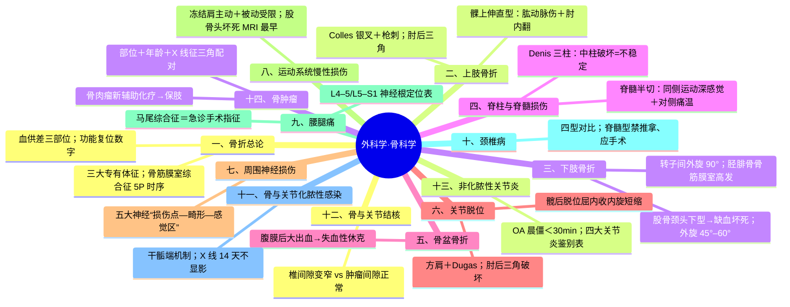
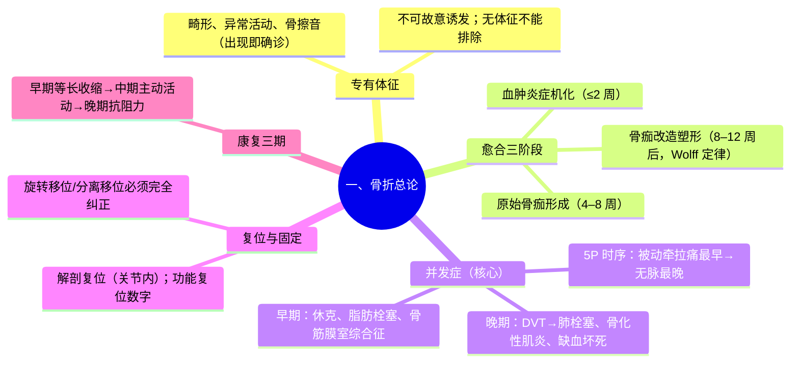
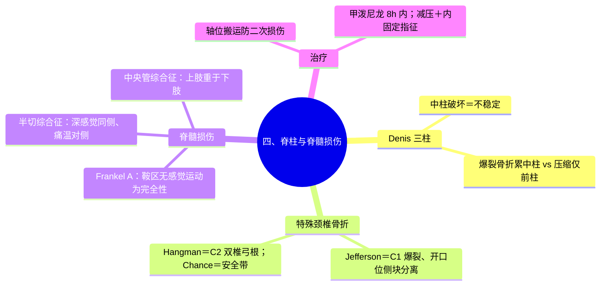
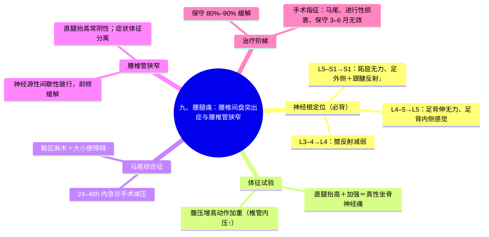

---
tags:
  - 考研306/外科学/骨科学
科目: 外科学
系统: 骨科学
内容: 骨折、脱位、神经损伤、腰腿痛颈肩痛、骨感染结核、骨肿瘤
---
# 外科学·讲义精讲版——骨科学

> 本册覆盖：骨折总论、上肢与下肢骨折、脊柱脊髓损伤与骨盆骨折、关节脱位、周围神经损伤、运动系统慢性损伤、腰腿痛与颈椎病、骨与关节化脓性感染与结核、非化脓性关节炎、骨肿瘤。
> 骨科约占 306 外科学总分的三分之一，"体征—神经定位—影像征象—治疗选择"四条主线是命题核心。
> 复习主线：一切从力学与血供出发——骨折为什么那样移位、为什么这里容易缺血坏死，懂了机制就不用死背。

---

## 一、骨折总论

### 【定义与专有体征】（必背）
- 骨折=骨的完整性与连续性中断。
- **三大专有体征（出现任何一项即可确诊骨折）**：**畸形、异常活动（假关节活动）、骨擦音或骨擦感**。
  - ⚠ 专有体征**不可故意诱发**（加重损伤、增加痛苦）；
  - 无专有体征不能排除骨折（嵌插、裂缝、青枝骨折可以没有）。
- 其他一般表现：疼痛与压痛、局部肿胀瘀斑、功能障碍。

### 【成因与分类】
- 成因：直接暴力；间接暴力（传导、杠杆、扭转——如 Colles 骨折）；肌肉牵拉（髌骨横形骨折）；**积累性劳损（疲劳骨折——第二跖骨、胫骨）**；**病理性骨折**（骨肿瘤、骨髓炎、骨质疏松——受轻微外力即断，治疗需处理原发病）。
- 分类：
| 分类轴 | 类型 |
|---|---|
| 与外界相通 | 闭合性 / 开放性（Gustilo Ⅰ–Ⅲ 型——软组织损伤与污染程度递增） |
| 稳定性 | 稳定（横形、嵌插、裂缝）/ 不稳定（斜形、螺旋、粉碎） |
| 断端关系 | 成角、侧方、缩短、**旋转移位、分离移位**（⚠ 分离移位必须完全纠正——否则不愈合） |
| 特殊形态 | 青枝（儿童——弹性和骨膜厚）、压缩（椎体）、**骨骺分离（儿童）** |

### 【骨折愈合】
- **三期（必背时限）**：
  1. **血肿炎症机化期（约伤后 2 周内）**：血肿→肉芽组织→纤维连接；
  2. **原始骨痂形成期（约 4–8 周）**：内骨痂（骨内膜）+外骨痂（骨外膜）+桥梁骨痂会合；膜内成骨+软骨内成骨；临床愈合的大致时限；
  3. **骨痂改造塑形期（约 8–12 周及以后）**：骨小梁按力学需要排列（Wolff 定律），骨髓腔再通，恢复骨的原形。
- **临床愈合标准（要点）**：局部无压痛无纵向叩击痛、无异常活动；X 线示骨小梁通过骨折线（连续性骨痂）；去除外固定后能耐受行走/持重；连续观察 2 周不变形。
- **骨折延迟愈合与不愈合**：超过平均愈合时间未愈=延迟愈合；**再次固定后仍不愈合、X 线示骨折端硬化、髓腔封闭、假关节形成=骨不连（成人一般以 8–9 个月为界，⚠ 时限表述需核对）**——需手术（植骨+稳定固定）。
- **影响愈合的因素（必背）**：
  - 全身：年龄（儿童快）、营养、慢性病、吸烟；
  - **局部——骨折端血供最关键**：血供差的部位（**股骨颈头下型、腕舟骨腰部、距骨、胫骨中下 1/3**）易不愈合/缺血坏死；
  - 软组织损伤程度与嵌入、感染；
  - 医源性：反复粗暴复位、固定不牢、**过度牵引（断端分离）**、清创摘除过多碎骨片、过早负重。

### 【骨折并发症】（本节核心必背）
**早期并发症**：
1. **休克**：大出血（骨盆骨折、股骨干骨折、多发伤）；
2. **脂肪栓塞综合征**：长骨/骨盆骨折后 48 h 内——呼吸窘迫+神志改变+**颈胸前皮肤瘀点**三联（详见总论创伤篇；早期妥善固定是主要预防）；
3. 重要脏器损伤：肋骨骨折→气胸血胸；骨盆骨折→膀胱尿道直肠；颅脑、脊柱合并伤——**"先救命后治病"，从上到下系统排查**；
4. 重要血管神经损伤：**肱骨髁上骨折→肱动脉**；肱骨干→桡神经；股骨髁上→腘动脉；脊柱→脊髓；
5. **骨筋膜室综合征**（详见下）；
6. 挤压综合征（见总论）。

**骨筋膜室综合征（必考机制）**：
- 定义：骨、骨间膜、肌间隔、深筋膜构成的**封闭骨筋膜室**内压力升高→肌肉神经缺血坏死。
- **机制链**：创伤出血/水肿（或外固定过紧）→室内压↑→**先压迫小静脉回流**→组织液渗出↑→室内压进一步↑→**当室内压升至接近小动脉灌注压（前臂约 65 mmHg、小腿约 55 mmHg，⚠ 数值需核对）时肌肉神经缺血**——注意此时**主干动脉压力仍高于室内压，远端动脉搏动仍可触及**，这就是"无脉是晚期表现"的原因。
- **为什么"被动牵拉痛"最早出现（必考机制）**：筋膜室内肌肉缺血+室内压升高，**被动牵拉使已缺血的肌肉与神经末梢受到机械刺激**→剧烈疼痛；而自主活动受限、感觉异常紧随其后。疼痛特点：**持续性、进行性加剧、与损伤程度不成比例，止痛剂无效**。
- **5P 征的时序**：**Pain 疼痛（最早）→Paresthesia 感觉异常→Paralysis 麻痹（主动活动无力）→Pallor 苍白→Pulselessness 无脉（最晚、已坏死边缘）**——"等 5P 齐了再处理就晚了"，诊断靠"被动牵拉痛+室内压升高+与体征不符的剧痛"。
- 好发：前臂（Volkmann）、小腿（胫腓骨骨折）；
- 处理：**一经确诊立即切开减压（彻底切开全部筋膜室——前臂掌背两侧、小腿四个筋膜室）**，**禁用抬高患肢、禁按摩、禁加压包扎**；减压后防再灌注损伤（高钾、酸中毒）；
- 晚期后果：**Volkmann 缺血性肌挛缩**——肌肉坏死后纤维化挛缩→**典型"爪形手"畸形**（腕屈、掌指关节过伸、指间关节屈曲——⚠ 与尺神经爪形手"掌指关节过伸+指间关节屈曲"形态相似但病因不同，Volkmann 为全手缺血挛缩、常有前臂旋前屈腕）。

**晚期并发症**：
1. 坠积性肺炎（长期卧床——翻身拍背）；压疮；**下肢深静脉血栓→肺栓塞**；
2. 感染（开放骨折→骨髓炎）；
3. **损伤性骨化（骨化性肌炎）**：关节附近骨折/脱位（**肘部最典型**）血肿机化骨化→关节僵硬；预防：**避免粗暴反复复位、避免过早被动强力活动**；
4. **创伤性关节炎**：关节内骨折未解剖复位→关节面不平整→磨损；
5. **关节僵硬**：固定时间长+缺乏锻炼（浆液纤维素渗出粘连）——康复的关键原因；
6. **缺血性骨坏死**：**股骨头、腕舟骨、距骨**（血供单一部位）；
7. 骨折畸形愈合（成角/旋转/短缩——影响功能者需矫正）。

### 【复位】（必背标准）
- **解剖复位**：对位对线完全正常（关节内骨折必须尽量解剖复位——防创伤性关节炎）。
- **功能复位标准（必背）**：
  1. 骨折端**对位 ≥1/2**、干骺端可稍差；
  2. 成角：下肢向前向后成角 **<10°**（与关节活动方向一致者可代偿）；**侧方成角必须纠正**；⚠ 不同教材对成人/儿童、不同部位角度要求有差异，需核对；
  3. 短缩：成人下肢 **<1–2 cm**（儿童可利用生长再塑形放宽）；
  4. **旋转移位必须完全纠正**；分离移位必须纠正；
  5. **前臂骨折要求高**——尺桡骨双骨折应争取解剖复位（旋转功能依赖骨间间隙与对位）。
- 复位方法：手法复位（闭合）为主；切开复位指征：关节内骨折要求解剖复位、血管神经损伤、开放骨折、闭合复位失败、不稳定骨折保守失败、多发伤需早期坚强固定者。

### 【固定】
- **外固定**：石膏/小夹板（⚠ 石膏过松=无效固定，过紧=骨筋膜室综合征——石膏固定后必须观察远端血运感觉并交代复诊）；牵引（皮牵引/骨牵引——**股骨骨折常用股骨髁上或胫骨结节骨牵引**，借肌肉张力逐渐复位）；外固定架（开放骨折、骨盆骨折临时稳定）。
- **内固定**：髓内钉（长骨——股骨、胫骨交锁髓内钉为成人首选之一）、钢板螺钉、克氏针/张力带（髌骨）；优点=解剖复位+早期活动；缺点=二次手术、感染风险。
- 开放性骨折的处理原则：及时彻底清创（6–8 h 内最佳，超过也力争清创）、固定（外固定架利于换药）、软组织覆盖、抗感染；**一期内固定须权衡感染风险**。

### 【康复（功能锻炼三期）】（必背分期）
- **早期（伤后 1–2 周）**：肌肉**等长收缩**+固定肢体的被动活动，未固定关节主动活动——防肌肉萎缩与血栓；
- **中期（2 周后至临床愈合）**：加大主动活动，逐步恢复邻近关节全范围运动；
- **晚期（临床愈合后）**：抗阻力锻炼、恢复日常生活与劳动能力。
- 原则："固定与活动统一"——既要保证复位稳定，又要尽早恢复功能；主动为主、循序渐进。

### 【高频考点提示】
- 三大专有体征；"无脉是 5P 最晚"与被动牵拉痛最早的机制配对。
- 血供差三部位（股骨头/舟骨/距骨）+胫骨中下 1/3。
- 功能复位数字（对位 1/2、成角 <10°、旋转移位必须纠正）。
- 康复三期与骨化性肌炎的预防（勿粗暴复位）。

> **相关知识点**：[[01-病理学-总论#3.3 栓塞 ★|栓塞（病理）]] ｜ [[07-骨科学#四、脊柱与脊髓损伤|脊柱与脊髓损伤]] ｜ [[07-骨科学#七、周围神经损伤|周围神经损伤]]

---

## 二、上肢骨折

### 【锁骨骨折】
- 最常见部位：**中外 1/3 交界处**；机制：跌倒肩部着地或手撑地传导暴力。
- 移位机制：**内侧端受胸锁乳突肌牵拉向上后方；外侧端受上肢重力与胸大肌等牵拉向下向前内**→断端重叠。
- 表现：局部隆起压痛，患肩下沉、头向患侧偏斜（减轻牵拉痛）；儿童青枝骨折仅"拥抱反射"消失/不愿活动上肢。
- 治疗：无移位/轻度移位→**"8"字绷带固定**（儿童青枝骨折首选）；移位明显、开放、合并血管神经损伤→切开复位内固定（钢板髓内针）；畸形愈合多不影响功能（**不追求解剖复位**——锁骨复位要求低、以对线为主）。

### 【肱骨外科颈骨折】
- 位置：解剖颈下 2–3 cm，大、小结节下方——老年人骨质疏松性；分**无移位、外展型、内收型、粉碎型**。
- 移位：外展型（外展暴力）——远端外展、近端内收成角；内收型相反。
- 治疗：无移位三角巾悬吊；有移位手法复位+外固定；严重移位/粉碎→手术（髓内钉/钢板）。⚠ 老年者注意肩周粘连——早期活动防**肩周炎（继发冻结肩）**。

### 【肱骨干骨折】（桡神经损伤经典部位）
- 机制：直接暴力（中 1/3 横形）、间接扭转（下 1/3 螺旋形）。
- **移位机制**：三角肌止点以上——近端（胸大肌牵拉）内收前移、远端（三角肌）外展；三角肌止点以下——近端（三角肌+喙肱肌）外展前屈、远端（肱二头肌肱三头肌）向上重叠。
- **桡神经损伤（考点）**：桡神经紧贴**桡神经沟**走行，中下 1/3 骨折易伤——**垂腕畸形（伸腕伸指不能）+虎口区（手背桡侧）感觉障碍**；闭合性多为神经挫伤/牵拉（可观察恢复），开放性/明显移位者探查。
- 治疗：多数手法复位+夹板/U 型石膏；手术指征：血管神经损伤、开放、多发伤、复位失败、病理性骨折。

### 【肱骨髁上骨折】（儿童经典）
- 好发：**5–12 岁儿童**；**伸直型占约 90%**——跌倒手掌撑地、肘过伸，**骨折远端向后上移位**；屈曲型少见（远端向前）。
- **移位与畸形**：伸直型常有**远折端向尺（内）侧移位**→**肘内翻畸形（晚期最常见并发症）**——机制：尺偏移位+复位不良+内侧骨骺生长障碍。
- **肱动脉损伤（必考机制）**：伸直型近折端（尖锐前缘）向前下刺伤**肱动脉与正中神经**（动脉紧贴肱骨前面下行入肘窝）→前臂缺血→**骨筋膜室综合征→Volkmann 挛缩（爪形手）**。**"剧痛+苍白+无脉+被动牵拉痛"=紧急探查血管**。
- 与肘关节脱位鉴别（必考）：**肘后三角关系**——正常屈肘 90° 时肱骨内上髁、外上髁与鹰嘴构成等腰三角形；**髁上骨折三者关系正常，肘关节脱位关系破坏**（肘脱位是"第二常见关节脱位"，见脱位篇）。
- 治疗：无明显移位石膏固定；移位→闭合复位+石膏（屈肘位固定——⚠ 屈肘角度需兼顾桡动脉搏动，过屈压迫肱动脉）；肿胀严重→**尺骨鹰嘴骨牵引**；血管神经损伤/开放/复位失败→切开复位克氏针。

### 【桡骨远端骨折：Colles / Smith / Barton】（必背对比）
| 类型 | 机制 | 移位方向 | 畸形 |
|---|---|---|---|
| **Colles 骨折（伸直型，最常见）** | 跌倒**手掌撑地**、腕背伸、前臂旋前 | **远折端向背侧+桡侧移位**，骨折向掌侧成角 | **"银叉（餐叉）样"畸形（侧面）+"枪刺刀"样畸形（正面）** |
| **Smith 骨折（屈曲型）** | 跌倒**手背撑地**、腕屈曲 | **远折端向掌侧+尺侧移位** | "反 Colles"畸形 |
| **Barton 骨折** | 暴力经腕骨传导 | **桡骨远端关节面骨折伴腕关节半脱位**（掌侧或背侧缘骨折块与腕骨一起移位） | 属关节内骨折，需解剖复位 |
- **Colles 远端为何向背桡侧移位（必考机制）**：跌倒手撑地时腕呈背伸位，地面的反作用力经腕骨（舟月骨）**顶推桡骨远端关节面向背侧**；同时**肱桡肌（附着于桡骨茎突）收缩将远折端牵向桡侧**+前臂旋前肌群的作用→远端向背+桡侧移位、近端向掌侧，骨折向掌侧成角。
- 治疗：Colles→手法复位（**掌屈+尺偏位石膏固定**——抵消背桡侧移位）后改功能位；Smith/Barton→复位方向相反，不稳定者手术（桡骨远端掌侧钢板）。
- 并发症：正中神经受压（腕管内）、**伸拇长肌腱断裂（晚期）**、创伤性关节炎、腕关节僵硬、反射性交感神经营养不良（Sudeck 萎缩——老年）。

### 【尺桡骨干双骨折】
- 机制：直接暴力（同一平面）、间接传导（桡高尺低两平面）、扭转（螺旋）。
- **治疗原则（必考）**：前臂功能=旋转（旋前旋后），依赖**尺桡骨对位对线+骨间膜完整间隙**——**多需切开复位内固定（钢板）**，保守仅用于无移位/儿童青枝；否则旋转功能丧失、骨桥形成（交叉愈合）。

### 【儿童骨骺损伤】
- **Salter-Harris 分型 Ⅰ–Ⅴ**：Ⅰ 骨骺分离、Ⅱ 经骺板+干骺端（最常见）、Ⅲ 经骺板+骨骺、Ⅳ 贯穿骺板+骨骺+干骺端（生长障碍高危）、Ⅴ 骺板挤压伤（预后最差——生长停滞）；**越靠后分型预后越差**。

### 【高频考点提示】
- 桡神经沟+垂腕=肱骨干；髁上伸直型=肱动脉+正中神经+肘内翻。
- 肘后三角：骨折正常、脱位破坏。
- Colles"餐叉+枪刺"、远端背桡侧移位机制；复位固定"掌屈尺偏"。
- 尺桡双骨折争取解剖复位（旋转功能）；Salter-Harris Ⅴ 最差。

> **相关知识点**：[[07-骨科学#七、周围神经损伤|周围神经损伤]] ｜ [[07-骨科学#一、骨折总论|骨折总论]]

---

## 三、下肢骨折

### 【股骨颈骨折】（必考核心）
- 人群：**老年人**（骨质疏松）——轻微外力（滑倒扭转）即可；青年为高能暴力。
- 解剖与血供（必考机制）：股骨头血供来源：①**股骨头圆韧带内的小凹动脉**（供头凹部小区域）；②**股骨干滋养动脉**（仅达股骨颈基底部）；③**旋股内、外侧动脉的分支（支持带动脉/关节囊支）——最主要**，其中**外侧骺动脉（上支持带）供给股骨头外侧大半**。**头下型骨折切断支持带动脉→股骨头缺血坏死+骨折不愈合率高**——这就是"头下型最危险"的全部机制。
- 分型（必背）：
  - **按骨折线部位**：**头下型**（血供破坏最大——坏死与不愈合率最高）、经颈型、**基底型**（血供好、愈合好）；
  - **按 X 线（Pauwels 角）**：骨折线与两髂嵴连线夹角——**<30° 外展型（剪切力小、稳定）；30°–50°；>50° 内收型（剪切力大、不稳定）**；
  - **Garden 分型**：Ⅰ 不完全/外展嵌插、Ⅱ 完全无移位、Ⅲ 完全部分移位、Ⅳ 完全完全移位（Ⅰ–Ⅱ 无移位、Ⅲ–Ⅳ 移位）。
- 临床表现：髋部疼痛、不能站立行走（嵌插型可勉强行走——漏诊来源）；**患肢外旋 45°–60°、短缩、屈曲畸形**；**大转子上移**——**Bryant 三角底边缩短、大转子在 Nelaton 线（髂前上棘与坐骨结节连线）之上**。
- **治疗选择逻辑（必背）**：
  - **无移位（Garden Ⅰ–Ⅱ）/基底型/年轻患者：闭合（或切开）复位+内固定（空心加压螺钉）**——保存自体股骨头；
  - **65 岁以上（或移位明显的头下型 Garden Ⅲ–Ⅳ）老年患者：人工关节置换**——因为内固定后仍面临**不愈合+股骨头缺血坏死**两大风险，二次手术率；身体好、活动量大的用**全髋置换**，高龄体弱者用**人工股骨头（半髋）置换**；
  - 术前牵引、抗凝、围术期管理（老年髋部骨折"尽早手术"原则——降低卧床并发症死亡率）。
- 并发症：**股骨头缺血坏死（伤后 1–2 年内高发，随访 2 年以上）**、骨折不愈合、深静脉血栓、坠积性肺炎。

### 【股骨转子间骨折】
- 人群：比股骨颈骨折**更年迈**（基础骨质疏松更重）。
- **鉴别要点（必考）**：血供丰富——**极少不愈合与缺血坏死**，但更易**髋内翻畸形**；**患肢外旋可达 90°**（股骨颈 45°–60°）——外旋程度是最重要的床旁鉴别。
- 治疗：老年者**尽早手术内固定**（防卧床死亡）——股骨近端髓内钉（PFN/InterTAN 类）、动力髋螺钉（DHS，稳定型）；目标是早期离床。

**股骨颈 vs 转子间骨折对比表**（必背大表）
| 项目 | 股骨颈骨折 | 股骨转子间骨折 |
|---|---|---|
| 好发年龄 | 老年（稍低） | 老年（更高龄） |
| 骨折部位 | 关节囊内 | 关节囊外 |
| 患肢外旋 | **45°–60°** | **约 90°** |
| 血供 | 差（头下型最差） | 好 |
| 并发症特点 | **不愈合+股骨头缺血坏死** | **髋内翻畸形；极少不愈合** |
| 治疗选择 | 年轻/无移位→内固定；老年移位→人工关节 | 尽早内固定（髓内钉/DHS），多不置换 |

### 【股骨干骨折】
- 高能损伤；**失血量大（单侧可达 500–1000 ml 以上，⚠ 数值需核对）**→警惕休克；多发伤时注意脂肪栓塞。
- **移位机制（必背）**：
  - 上 1/3：近折端受**髂腰肌**牵拉→屈曲、外展、外旋；远折端（内收肌群）向上内后；
  - 中 1/3：重叠移位（内收肌+腘绳肌），可有成角；
  - 下 1/3：**远折端受腓肠肌牵拉向后移位→压迫腘血管神经（⚠ 必查足背动脉与胫后动脉）**。
- 治疗：**成人首选闭合复位+交锁髓内钉**（早期手术、早离床）；牵引用于儿童与暂时稳定（3 岁以下儿童 Bryant 悬吊牵引⚠ 需核对适应证）；下 1/3 骨折警惕血管损伤。

### 【髌骨骨折】
- 机制：直接暴力（粉碎型）或**股四头肌猛烈收缩**（横形——上楼梯滑倒）。
- 判断与治疗：**无移位（分离 <2–3 mm，⚠ 数值需核对）且伸膝装置完整→石膏伸膝位固定**；**移位明显（分离 >3 mm）或关节面不平整→切开复位+张力带钢丝（AO 张力带原理：股四头肌收缩时将骨折端转化为压力）**；严重粉碎的下极小骨折可部分切除。
- 治疗目标=恢复伸膝装置连续性与关节面平整；髌骨切除保留为最后手段（伸膝力臂丧失→伸膝无力）。

### 【胫腓骨骨折】
- 长管骨骨折中最常见；**胫骨前内侧面紧贴皮下**→**最易成为开放性骨折**。
- **特点与并发症**：①**中下 1/3 血供差（滋养动脉断裂后仅靠骨膜）→延迟愈合/不愈合高发**；②小腿**四个骨筋膜室→骨筋膜室综合征高发**；③易合并腘动脉、腓总神经（腓骨颈）损伤；④开放骨折感染风险。
- 治疗：**交锁髓内钉为成人首选之一**；开放骨折→清创+外固定架/内固定（按软组织条件）；无移位稳定型可石膏；⚠ 单纯腓骨骨折可保守（不负重结构为主）；腓骨颈骨折查腓总神经（足下垂）。

### 【踝部骨折要点】
- 分型（Lauge-Hansen 按受伤时足姿势与暴力方向；Danis-Weber 按腓骨骨折线高度与胫腓联合关系）；**双踝、三踝骨折或伴下胫腓分离=不稳定→手术解剖复位内固定**（关节内骨折原则）。

### 【高频考点提示】
- 头下型=支持带动脉断→坏死不愈合；Garden 与 Pauwels 分型数字。
- 转子间外旋 90° vs 股骨颈 45°–60°；转子间"坏死少、髋内翻多"。
- 股骨干移位三段机制+下 1/3 查腘血管；胫腓骨=开放+骨筋膜室+中下 1/3 不愈合。

> **相关知识点**：[[07-骨科学#八、运动系统慢性损伤|运动系统慢性损伤]] ｜ [[01-呼吸系统#八、肺血栓栓塞症（PTE）|肺血栓栓塞症（内科）]] ｜ [[05-腹部外科#十七、周围血管疾病|周围血管疾病（外科）]]

---

## 四、脊柱与脊髓损伤

### 【解剖与稳定：Denis 三柱理论】（必背）
- **前柱**：前纵韧带+椎体与纤维环前 2/3；**中柱**：椎体与纤维环后 1/3+后纵韧带；**后柱**：椎弓根、椎板、小关节、黄韧带、棘上/棘间韧带等。
- **中柱破坏=不稳定**——爆裂骨折累及中柱，为不稳定与神经损伤风险标志；压缩骨折仅累及前柱，多稳定。
- 好发部位：**胸腰段（T10–L2，尤其 T12–L1）**——胸椎后凸与腰椎前凸交界、应力集中。

### 【常见损伤形态】
- 压缩骨折（前柱、屈曲暴力——骨质疏松老人常见）；**爆裂骨折**（垂直暴力，中柱破坏、骨块突入椎管）；**Chance 骨折（屈曲牵张/安全带损伤）**——椎体水平劈裂经椎弓根，三柱受累、不稳定（汽车安全带减速伤）；**骨折脱位**（三柱全断——最不稳定，脊髓损伤率最高）。
- 颈椎特殊骨折（必背三个名字）：
  - **Jefferson 骨折**：**寰椎（C1）爆裂骨折**——垂直暴力经枕骨髁传至侧块→前后弓双处断裂；**开口位 X 线/CT：侧块向两侧分离**；
  - **Hangman 骨折**：**枢椎（C2）双侧椎弓根骨折**——过伸牵张暴力（绞刑机制/车祸过伸）；
  - 齿状突骨折（Anderson 分型 Ⅰ–Ⅲ，Ⅱ 型不愈合率高——基底血供差）。
- 寰枢椎脱位/横韧带断裂：不稳定，四肢瘫痪风险。

### 【临床表现与影像】
- 损伤平面疼痛、压痛、畸形（后凸）；**四肢瘫痪/截瘫**；腹壁反射与感觉平面定位；**脊髓休克**（伤后损伤平面以下弛缓性瘫痪、反射消失——数日至数周恢复，其间无法判断完全性与不完全性损伤）。
- 影像：**CT+三维重建为骨性结构评估首选**；MRI 评估脊髓/韧带/椎间盘（水肿、出血、压迫）；X 线初筛。

### 【脊髓损伤】（必背）
- **Frankel 分级（A–E）**：
| 级别 | 含义 |
|---|---|
| A | 完全性损伤：损伤平面以下无任何运动与感觉功能（**含鞍区 S4–S5 无感觉运动、肛门括约肌无自主收缩**——判断完全性的关键残留区检查） |
| B | 不完全性：损伤平面以下有感觉（含鞍区感觉）但无运动 |
| C | 不完全性：有运动但肌力 <3 级（不能对抗重力） |
| D | 不完全性：有运动且肌力 ≥3 级 |
| E | 感觉运动功能正常（可有反射异常） |
- **脊髓半切综合征（Brown-Séquard）**：脊髓一侧损伤——**同侧：损伤平面以下上运动神经元瘫痪+深感觉（本体觉、位置觉）障碍；对侧：痛温觉障碍**（机制：皮质脊髓束与后索未交叉、痛温觉纤维已交叉——**深感觉同侧、痛温对侧**是交叉位置的直接推论）。
- **中央管周围综合征**：中央灰质出血水肿→**上肢重于下肢的瘫痪**（内侧皮质脊髓束支配上肢的纤维位于内侧、易受累）；**前脊髓综合征**：运动与痛温丧失、本体觉与触觉保留——预后较差。
- 颈髓损伤节段：C4 以上→呼吸肌瘫痪（膈神经 C3–5）需呼吸支持；C5–8 平面决定上肢功能残留。
- **治疗**：
  - 急救：**轴位翻身/搬运（防二次损伤）**、呼吸循环支持、防低血压（维持脊髓灌注，MAP 目标 85–90 mmHg，⚠ 按指南）；
  - **大剂量甲泼尼龙冲击**：伤后 **8 小时内**使用可改善神经功能（疗效有争议但仍是考试标准答案，⚠ 按教材核对）；
  - 手术指征：**不稳定骨折、神经受压（椎管侵占）、进行性神经加重、开放伤**——**减压+复位+内固定融合**；完全性损伤手术目的为稳定与康复；
  - 并发症防治：呼吸系统、压疮、DVT/肺栓塞、泌尿系感染（留置导尿）、异位骨化、体温调节障碍。
- 马尾神经损伤（L1 以下）：下运动神经元性瘫痪+鞍区感觉障碍+大小便功能障碍——马尾再生能力优于脊髓，预后相对好。

### 【高频考点提示】
- Denis 三柱：中柱破坏=不稳定；爆裂 vs 压缩的柱别。
- Jefferson=C1 前后弓+开口位侧块分离；Hangman=C2 椎弓根；Chance=安全带。
- Frankel A 的判断靠鞍区/括约肌；半切"同侧运动深感觉+对侧痛温"。
- 甲泼尼龙 8 h 内；轴位搬运。

> **相关知识点**：[[02-体格检查#第 7 节 脊柱、四肢与神经系统检查|神经系统检查（诊断）]] ｜ [[02-生理学-下#第十章 神经系统的功能 ★★★|神经系统功能（生理）]] ｜ [[02-神经外科#七、GCS 昏迷评分（格拉斯哥）|GCS 昏迷评分（外科）]]

---

## 五、骨盆骨折

### 【特点】（必背）
- 高能损伤（车祸、坠落挤压）；**首要致命问题是失血**——盆腔静脉丛与髂内动脉分支丰富，**腹膜后血肿可达 1000–2000 ml 以上**→失血性休克为早期死亡主因。
- **合并伤率高（必查清单）**：**后尿道与膀胱损伤（最常见合并伤之一）**、直肠肛管损伤（开放骨折 reaching 直肠→感染风险剧增）、阴道损伤、**腰骶丛与坐骨神经损伤**、腹腔内脏器、大血管。
- 分型（Tile：稳定型/旋转不稳定/旋转+垂直不稳定——**垂直剪切不稳定最严重**；Young-Burgess：APC 前后挤压、LC 侧方挤压、VS 垂直剪切、CM 混合）。
- 临床：骨盆环压痛、挤压分离试验阳性（⚠ 急救时慎用反复检查加重出血）、会阴瘀斑血尿、下肢短缩旋转；**骨盆骨折合并休克先按骨盆带/外固定稳定骨盆+输血**。
- 影像：X 线（骨盆正位+入口位/出口位）、CT 增强评估出血与脏器。
- 急诊处理顺序：**抗休克（大量输血方案）→骨盆带固定/外固定架（减少骨盆容积、稳定骨折端→减少继续出血）→CTA 发现动脉出血→介入栓塞（髂内分支）→必要时手术**；稳定后二期固定。
- 治疗：稳定型保守（卧床）；不稳定→手术复位内固定（前环钢板、后环骶髂螺钉）。

### 【高频考点提示】
- "骨盆骨折+休克=腹膜后大出血；先稳定骨盆再栓塞"；后尿道伤与骨盆骨折的固定搭配。

> **相关知识点**：[[01-外科总论#四、外科休克|外科休克]] ｜ [[06-泌尿外科#一、泌尿系统损伤|泌尿系统损伤（外科）]]

---

## 六、关节脱位

### 【肩关节脱位（前脱位最常见）】（必背）
- 机制：外展外旋上举位跌倒手掌撑地→肱骨头冲破关节囊前下方→**喙突下脱位最常见**。
- 表现：**方肩畸形**（肩峰突出、原肱骨头处空虚）、**Dugas 征阳性（患侧肘部贴胸时手不能搭对侧肩，或手搭对侧肩时肘不能贴胸——标志性体征）**、弹性固定。
- 合并伤：**腋神经损伤**（三角肌区感觉减退、三角肌无力）、**Bankart 损伤（前下盂唇撕脱）**、**Hill-Sachs 损伤（肱骨头后外侧压缩骨折）**——反复脱位的结构基础；大结节撕脱骨折。
- 处理：**尽早手法复位**（Hippocrates 足蹬法、Kocher 旋转法——勿粗暴防肱骨外科颈骨折与腋神经伤）；**复位后固定 3 周（三角巾/绷带内收内旋位）**——防**习惯性脱位**；固定期腕手活动防僵硬；拆固定后渐练肩活动。
- 陈旧性/合并骨折神经损伤→切开复位。

### 【肘关节脱位】（第二常见）
- 机制：跌倒手掌撑地、肘过伸→**后脱位最常见**。
- **肘后三角关系破坏（必考鉴别）**：内上髁、外上髁、鹰嘴的等腰三角关系在**脱位时消失**，而**肱骨髁上骨折时保持正常**。
- 表现：肘部肿痛、弹性固定于半伸位、前臂缩短、肘后空虚。
- 处理：手法复位（纵向牵引+屈肘）、石膏固定约 2–3 周；⚠ **避免粗暴复位与过早强力被动活动→损伤性骨化（骨化性肌炎）**；合并尺神经、肱动脉损伤注意。

### 【桡骨头半脱位（牵拉肘）】（必考）
- **<5 岁幼儿**：桡骨头发育未全、环状韧带松弛——**前臂被纵向牵拉**（穿袖、上台阶拉拽）后**突然不肯用患肢、不肯伸手取物**。
- **无肿胀畸形、X 线阴性**（诊断靠典型牵拉史+表现）。
- 处理：**手法复位**——术者拇指按桡骨头、另一手**旋后（或旋前）同时屈肘**，"弹响"即复位，**立刻恢复使用患肢**（复位成功的判断标准）；**无需固定**（⚠ 反复发作者复位后短期三角巾悬吊）；向家长交代避免牵拉。

### 【髋关节脱位】（必考）
- **后脱位最常见**：机制=**屈膝屈髋位膝部前方暴力（车祸仪表盘伤）**——股骨头冲破关节囊后上方。
- **典型畸形（必背）**：**患肢屈曲、内收、内旋、短缩畸形**，大转子上移（Nelaton 线上方）、臀部可及股骨头；**弹性固定**。
- 合并伤：**坐骨神经损伤（股骨头后方紧贴——约 10%+，⚠ 需核对）**——足下垂背伸不能；髋臼后缘骨折；同侧股骨干骨折掩盖脱位。
- 处理：**尽早（最好 24 h 内，越早越好——股骨头缺血坏死与坐骨神经压迫）**闭合复位 **Allis 法（提拉法）**：麻醉下屈髋屈膝 90° 纵向牵引提拉内旋；复位后**皮牵引/支具 3–4 周**（防再脱位，⚠ 时限需核对）；复位失败/合并髋臼骨折→手术。
- 并发症：**股骨头缺血坏死（伤后 2–3 年内）**、创伤性关节炎、坐骨神经瘫、异位骨化。
- **前脱位对比**：**患肢屈曲、外展、外旋畸形**——与后脱位正好相反。
- ⚠ 三处大转子相关畸形鉴别（必背）：**髋后脱位=屈曲内收内旋短缩；股骨颈骨折=外旋 45°–60°；转子间骨折=外旋 90°**——"外旋三档"是选择题常客。

### 【高频考点提示】
- Dugas 征；方肩；Bankart/Hill-Sachs；复位后 3 周。
- 肘后三角脱位消失。
- 桡骨头半脱位<5 岁+牵拉史+旋后屈肘复位。
- 髋后脱位"屈内收内旋短缩"+坐骨神经+尽早复位。

> **相关知识点**：[[07-骨科学#一、骨折总论|骨折总论]] ｜ [[07-骨科学#七、周围神经损伤|周围神经损伤]]

---

## 七、周围神经损伤

### 【总论】
- 分类（Seddon）：神经震荡（功能性麻痹——可完全恢复）、轴索中断（可再生）、神经断裂（需手术）。
- 表现：运动（弛缓性瘫痪、肌萎缩）、感觉（支配区麻木）、自主神经（无汗、皮肤萎缩）、Tinel 征（叩击损伤平面远端出现向支配区的放射麻感——**提示神经再生前沿位置，随访恢复的指标**）。
- 治疗：一期修复（清洁锐器伤 6–8 h/24 h 内缝合）；二期修复；吻合方式外膜/束膜；**感觉与运动恢复的判断以功能恢复为准**；神经营养药物辅助。

### 【五大神经损伤对比表】（本节必背大表）

| 神经 | 常见损伤点 | 运动障碍（畸形） | 感觉障碍区 |
|---|---|---|---|
| **正中神经** | 腕部（**腕管综合征**）、肘部 | 腕部：**大鱼际肌萎缩、拇指对掌不能**→"猿手"；肘上：前臂旋前、屈腕屈指（桡侧）障碍 | **桡侧三个半手指**（拇、示、中指及环指桡侧半）掌侧 |
| **尺神经** | **肘管**（肘部）、腕部（Guyon 管） | **爪形手（环、小指掌指关节过伸+指间关节屈曲）**、骨间肌与第 3–4 蚓状肌瘫痪（夹指无力）、**Froment 征阳性（拇收肌瘫痪——捏纸时拇指指间关节屈曲代偿）**、小鱼际萎缩 | **尺侧一个半手指**（小指与环指尺侧半） |
| **桡神经** | **肱骨干桡神经沟**（骨折）、桡骨头（骨间后神经） | 肱骨干水平：**垂腕（伸腕伸指伸拇不能）**；桡骨头水平（骨间后神经）：**伸指不能但可伸腕（桡侧腕长伸肌支已发出）**——"垂指不垂腕" | **虎口区（手背桡侧半，第 1、2 掌骨间）**——桡神经感觉缺失的特异区 |
| **腓总神经（腓深+腓浅）** | **腓骨小头**（骨折、石膏压迫、盘腿久坐） | **足下垂+足内翻畸形（"马蹄内翻足"）**——背伸外翻不能（腓深=背伸、腓浅=外翻） | 小腿前外侧与**足背** |
| **坐骨神经** | **髋关节后脱位**、臀部注射不当（应选外上象限） | 膝以下屈肌（腘绳肌）与小腿足全部肌群瘫痪、足下垂 | 小腿后外侧与足 |

- 记忆钩子："正中猿手桡侧三半；尺爪尺半 Froment；桡垂腕虎口区；腓总马蹄内翻；坐骨臀注外上象限"。
- **桡神经感觉区与运动区交叉记忆**：桡神经损伤垂腕最典型，但感觉障碍仅虎口一小片（其余区域有邻神经重叠）——"重运动轻感觉"是桡神经特点；尺神经感觉与运动同样显著。

### 【高频考点提示】
- 各神经"损伤点—畸形—感觉区"三要素配对是每年必考；Froment 征与夹纸试验对应拇收肌（尺）。
- 垂腕 vs 垂指（肱骨干 vs 桡骨头水平）。

> **相关知识点**：[[02-体格检查#7.5 上运动神经元 vs 下运动神经元瘫痪鉴别（必背）|上下运动神经元瘫痪（诊断）]] ｜ [[02-生理学-下#第十章 神经系统的功能 ★★★|神经系统功能（生理）]] ｜ [[07-骨科学#二、上肢骨折|上肢骨折]]

---

## 八、运动系统慢性损伤

### 【肩关节周围炎（冻结肩、粘连性肩关节囊炎、"五十肩"）】
- 好发 50 岁左右、女性略多；病理为关节囊及周围滑囊**粘连挛缩**。
- 特点：**肩痛+各方向主动与被动活动均受限（以外旋、外展受限最早最显著）**、**夜间痛明显**（与肩袖损伤鉴别点之一）、三角肌失用性萎缩；**自限性病程（约 1–2 年）但可残留活动受限**。
- 鉴别：**肩袖损伤——主动受限而被动正常、坠落试验阳性**；颈椎病（神经根性放射痛）。
- 治疗：**功能锻炼是核心（"爬墙"、钟摆运动、循序渐进）**+NSAIDs+痛点封闭+理疗；⚠ 不主张长期制动（制动反而加重粘连）；麻醉下手法松解/关节镜松解用于顽固者。

### 【肱骨外上髁炎（网球肘）】（必考）
- 机制：**前臂伸肌总腱起点（外上髁）反复牵拉劳损**（微撕裂与退变）。
- 表现：肘关节外侧痛、提重物（握拳伸腕）加重；**Mill 征（伸肌牵拉试验）阳性——肘伸直、握拳、腕屈曲下前臂旋前时外上髁疼痛**。
- 治疗：休息+制动前臂（护具）、NSAIDs、**痛点封闭（长效糖皮质激素，⚠ 注射次数不宜过多——反复注射致肌腱断裂与皮肤萎缩）**；顽固者手术（伸肌腱松解）。

### 【桡骨茎突狭窄性腱鞘炎（de Quervain 病）】
- **拇长展肌与拇短伸肌**腱鞘（桡骨茎突部）狭窄；抱婴、拇指重复动作人群。
- **Finkelstein 征（握拳尺偏试验）阳性——拇指屈于掌心握拳、腕尺偏时桡骨茎突剧痛**（必考）。
- 治疗：制动、封闭、**腱鞘切开松解术**（狭窄性腱鞘炎的根本治疗）。

### 【腕管综合征】（必考）
- 解剖：腕管由**屈肌支持带（腕横韧带）与腕骨**构成，内有**正中神经+9 条屈肌腱**——最狭窄处的神经卡压。
- 表现：中年女性多见；**桡侧三个半手指麻木刺痛、夜间痛醒（"麻醒"、甩手缓解——标志性）**；后期**大鱼际肌萎缩、拇指对掌无力**（猿手倾向）；**Phalen 试验阳性（极度屈腕 1 分钟诱发症状）**、Tinel 征阳性。
- 诊断：**肌电图/神经传导速度检查为客观确诊手段（正中神经腕部潜伏期延长）**。
- 治疗：制动+封闭（腕管内注射⚠ 勿注入神经）、**手术：屈肌支持带切开（内镜/开放）为根本治疗**——正中神经减压。
- 鉴别：颈椎病神经根型（颈痛、上肢放射但非"夜间麻醒+腕管内压诱发"）、胸廓出口综合征、旋前圆肌综合征。

### 【股骨头缺血性坏死（成人股骨头坏死）】（必背分期）
- 病因：**糖皮质激素（最常见）**、长期大量饮酒、**创伤（股骨颈骨折、髋脱位——头下型）**、减压病、镰状细胞贫血等；机制核心：**血供中断/骨髓内高压→骨细胞缺血死亡→修复改建→承重区塌陷**。
- 表现：髋部/腹股沟区疼痛（可放射至膝——**"髋病膝痛"**，与髋关节结核同理）、跛行、**"4"字试验（Patrick 试验）阳性**、内旋受限最早。
- 分期（Ficat/ARCO 概念）：
| 期别 | 病理与影像 |
|---|---|
| 0 期 | 无症状、MRI 可正常（⚠ 高危筛查） |
| Ⅰ 期 | X 线正常，**MRI 最早发现**（骨髓水肿、双线征——修复带） |
| Ⅱ 期 | X 线：囊性变/硬化/骨质疏松，**股骨头轮廓正常**；MRI 确诊 |
| Ⅲ 期 | **"新月征"（软骨下骨塌陷）→股骨头塌陷变扁** |
| Ⅳ 期 | 继发髋臼改变、骨关节炎（关节间隙狭窄） |
- 治疗逻辑：**塌陷前（Ⅰ–Ⅱ 期）争取"保头"**——戒酒停激素、保护性负重、**髓芯减压+植骨（打压植骨/带血管蒂骨瓣）**；**塌陷后（Ⅲ–Ⅳ 期）人工髋关节置换**——年轻患者尽量推迟置换时机。
- **MRI 是早期诊断最敏感手段**（X 线阴性不能排除）——必考。

### 【高频考点提示】
- 冻结肩"主动+被动均受限+夜间痛"；Mill 征、Finkelstein 征、Phalen 征三大试验配对。
- 腕管=屈肌支持带切开；肌电图确诊。
- 股骨头坏死：MRI 最早、新月征=塌陷开始、塌陷前后决定"保头还是置换"。

> **相关知识点**：[[02-体格检查#第 7 节 脊柱、四肢与神经系统检查|神经系统检查（诊断）]] ｜ [[07-骨科学#十、颈椎病（四型对比，必背大表）|颈椎病]]

---

## 九、腰腿痛：腰椎间盘突出症与腰椎管狭窄

### 【腰椎间盘突出症（LDH）】（本节核心必背）
- 解剖基础：腰椎间盘由纤维环+髓核+软骨终板构成；**L4–5 与 L5–S1 承受应力最大、活动最多——约 90% 以上的突出发生于这两个间隙**。
- 病理：纤维环退变破裂→髓核突出→**压迫/化学刺激神经根与马尾**。
- 好发人群：20–50 岁青壮年、长期弯腰负重。

- **神经根定位表（必背大表）**：
| 突出间隙 | 受累神经根 | 运动障碍 | 感觉障碍 | 反射 |
|---|---|---|---|---|
| **L4–5** | **L5 神经根** | **足踇背伸无力（踇长伸肌、胫前肌——足背伸）** | 小腿前外侧、**足背内侧** | 无特异（膝跟反射多正常） |
| **L5–S1** | **S1 神经根** | **足跖屈无力（腓肠肌、踇长屈肌）、足踇跖屈** | 小腿后外侧、**足外侧（包括足跟外侧）** | **跟腱反射减弱/消失** |
| L3–4 | L4 | 股四头肌伸膝无力、足背伸无力 | 小腿内侧 | **膝反射减弱** |
- 记忆钩子："L5 背伸管足背；S1 跖屈管外侧+跟腱反射；L4 膝反射管内侧"。
- **马尾综合征（急诊手术指征，必考）**：巨大中央型突出压迫马尾——**鞍区（会阴部）麻木、大小便功能障碍（尿潴留/失禁）、性功能障碍、双下肢无力**——**需尽快（24–48 h 内）手术减压**。

- **临床表现**：
  - 腰痛+**坐骨神经痛**（沿臀部→大腿后→小腿→足放射）；**腹压增高动作（咳嗽、喷嚏、排便）加重**（椎管内压↑→神经根受压加重——定位意义）；
  - 感觉异常、肌力下降、反射改变（按定位表）；
  - 间歇性跛行（合并椎管狭窄时）。
- **体征试验（必背）**：
  - **直腿抬高试验（Lasègue 征）与加强试验（Bragard 征）**：抬高 <60° 出现放射痛为阳性；放低至痛消失再背伸踝关节诱发疼痛=加强试验阳性——**坐骨神经受压（真性放射痛）的证据**，L5–S1 与 L4–5 突出阳性率最高（L3–4 突出常阴性——股神经牵拉试验代替）；
  - 突出间隙棘突间旁压痛+放射；
  - 感觉、肌力、反射按定位表检查。
- 影像：**MRI 为首选**（椎间盘、神经、马尾、鉴别肿瘤）；CT（骨性与钙化突出）；X 线用于排查（间隙狭窄、滑脱、肿瘤破坏——**不能确诊 LDH**）。
- **治疗**：
  - **非手术治疗（80%–90% 可缓解）**：严格卧床（3 周左右，硬板床）、牵引、NSAIDs+肌松药、脱水与神经营养（甲钴胺）、硬膜外/神经根封闭、**腰背肌锻炼与姿势矫正（恢复期）**——核心逻辑：突出物早期可回纳缩小、水肿可消退；
  - **手术指征（必背）**：①**马尾综合征（急诊）**；②**进行性加重的神经损害（足下垂等肌力进行性下降）**；③**正规保守治疗 3–6 个月无效、症状严重影响生活**；④反复发作、疼痛剧烈难忍；
  - 术式：**椎板开窗髓核摘除（标准）**、显微/内镜（MED、UBE）、**腰椎融合（PLIF/TLIF——用于不稳定、滑脱、复发、多节段退变者）**。
- **腰椎管狭窄症**（必背鉴别）：
  - 病理：椎管矢状径/容积狭窄（退变、发育性——矢状径 <10–12 mm，⚠ 阈值需核对）压迫马尾与神经根。
  - **典型表现：神经源性间歇性跛行——直立行走后双下肢麻木无力疼痛，蹲下/前倾弯腰/坐下缓解**（机制：行走时椎管内静脉淤血+黄韧带褶皱→管腔进一步缩小；**前屈位椎管容积增大**——"购物车征"）。
  - 与 LDH 鉴别：狭窄主诉多为"双下肢"、**直腿抬高试验常阴性**、症状体征分离明显；LDH 多为单侧放射痛+直腿抬高阳性；
  - 与血管源性跛行鉴别（必考）：下肢动脉缺血者**停止行走即缓解**（不必蹲下）、足背动脉搏动减弱、ABI<0.9、皮肤营养改变。
  - 治疗：保守为主（姿势管理、核心肌力）；症状重/保守无效→**椎管减压（±融合）**。

### 【高频考点提示】
- L4–5/L5–S1 定位表（运动-感觉-反射三要素）每年必考。
- 马尾综合征=鞍区麻木+大小便障碍→急诊。
- 直腿抬高+加强=真性坐骨神经痛；间歇性跛行"前倾缓解"=椎管狭窄（神经源性）vs"停步即缓"=血管源性。

> **相关知识点**：[[02-体格检查#7.8 Lasegue 征（直腿抬高试验）|Lasegue 征（诊断）]] ｜ [[07-骨科学#十、颈椎病（四型对比，必背大表）|颈椎病]]

---

## 十、颈椎病（四型对比，必背大表）

| 项目 | 神经根型 | **脊髓型** | 交感型 | 椎动脉型 |
|---|---|---|---|---|
| 发生率 | **最常见（约 50%–60%）** | 较少但**最严重** | 较常见 | 少见 |
| 受压结构 | 神经根（钩椎关节/椎间孔骨赘） | **脊髓**（椎管狭窄+退变压迫） | 颈交感神经（刺激/抑制） | 椎动脉（钩椎关节骨赘刺激——⚠ 诊断存争议） |
| 典型表现 | **颈肩痛+上肢放射性痛麻**（按根性分布：C5–6 拇示指、C6–7 中指——桡侧/中指/尺侧感觉与肱二/三头肌反射对应）、肌力下降 | **四肢无力、手部精细动作障碍（扣扣子、写字笨拙）、"束带感"、踩棉花感（本体觉）、行走不稳易跌倒** | 头晕、眼花、耳鸣、心悸、出汗异常、血压不稳 | **眩晕（转颈诱发/加重）、猝倒**、耳鸣视力模糊 |
| 重要体征 | **压头试验（Spurling）阳性、臂丛牵拉试验（Eaton）阳性**、相应根性感觉肌力反射改变 | **锥体束征：腱反射亢进、Hoffmann 征（+）——上肢病理征、Babinski 征（+）、髌踝阵挛**；肌张力增高 | 多无客观体征（排除性诊断） | 旋颈试验（+），注意与内科眩晕鉴别 |
| 影像 | MRI/CT 示椎间孔狭窄根受压 | **MRI 示脊髓受压+髓内 T2 高信号**、椎管矢状径狭窄 | 多无特异 | MRA/CTA、动态造影 |
| 治疗要点 | **首选保守**（牵引⚠ 谨慎、颈托、NSAIDs、理疗；正规保守无效→前路减压） | **一经确诊尽早手术（前路 ACDF 或后路单开门椎管扩大成形）——保守无效且推拿牵引禁忌** | 保守（排除内科疾病） | 保守为主，反复猝倒考虑手术 |
| ⚠ 禁忌 | — | **禁止推拿按摩、禁止大重量牵引**——可致瘫痪加重 | — | — |

- **脊髓型颈椎病手术指征逻辑**：脊髓压迫为**进行性不可逆损伤**过程，一旦出现脊髓病体征（Hoffmann、Babinski、行走不稳）→**手术减压是唯一有效阻止进展的手段**——考试反复考"脊髓型禁推拿、应手术"。
- 术式选择：1–2 个间隙、前方压迫→**前路椎间盘切除融合（ACDF）**；≥3 个间隙/发育性椎管狭窄（Pavlov 比值 <0.75）→**后路单开门椎管扩大成形术**。

### 【高频考点提示】
- 四型"受压结构—体征—治疗"整表；脊髓型=锥体束征（Hoffmann 是上肢病理征的代表）+禁推拿+手术。
- 神经根型根性分布（C5–6 桡侧、C7 中指）与压头/臂丛牵拉试验。

> **相关知识点**：[[02-体格检查#7.5 上运动神经元 vs 下运动神经元瘫痪鉴别（必背）|上下运动神经元瘫痪（诊断）]] ｜ [[07-骨科学#四、脊柱与脊髓损伤|脊柱与脊髓损伤]]

---

## 十一、骨与关节化脓性感染

### 【急性血源性骨髓炎】（必考）
- 人群：**儿童长骨干骺端**；病原：**金黄色葡萄球菌最常见（约 80%）**，其次溶血性链球菌。
- **为什么好发于干骺端（必考机制）**：干骺端**血流丰富但流速缓慢**（终末动脉呈襻状、血窦化）+儿童期骨骺板阻隔，细菌（多来自其他部位感染灶的血行播散）易在此**停留、繁殖**；外伤/受凉常为诱因。
- 感染扩散路径：干骺端脓肿→穿破骨皮质→**骨膜下脓肿**（骨膜掀起→骨皮质缺血→**死骨**；骨膜下新骨→**包壳**）→软组织脓肿或窦道；**成人骺板已闭→可侵入关节→化脓性关节炎**；**儿童骺板阻挡→一般不直接入关节**（⚠ 除股骨上端等特殊部位——干骺端在关节囊内者可入关节）。
- **临床表现**：起病急骤、**寒战高热**（39 ℃ 以上）、中毒症状；**干骺端（膝上下等）深部持续性剧痛、拒动拒触**；局部皮温高、压痛深在（早期红肿不明显——深在骨内）；晚期肿胀波动（骨膜下脓肿到达皮下）。
- **辅助检查（必考时序）**：
  - 血白细胞与中性粒细胞升高、血培养（寒战时抽——阳性率最高）；
  - **X 线：起病 2 周（14 天）内多无异常**（骨质破坏需 30%–50% 脱钙才显影——"X 线 14 天不显影"是必考数字）——**切勿因 X 线阴性而延误治疗**；
  - **MRI：早期最敏感**（骨髓水肿、脓肿、骨膜下积脓）；骨扫描（99mTc）敏感但特异差；
  - **局部分层穿刺：早期确诊手段**（穿出脓液=确诊+涂片培养指导用药）。
- **治疗（"早"字当头，必考）**：
  - **抗生素：确诊/高度怀疑立即开始**，大剂量静脉（金黄色葡萄球菌——头孢唑林/耐酶青霉素±依据培养调整）；**足疗程（体温正常后续用，静脉约 3–4 周或更久，⚠ 具体疗程需核对）**；
  - **手术（钻孔/开窗引流）指征：①抗生素治疗 2–3 天无效（高热不退、症状加重）；②骨膜下脓肿形成/穿刺有脓；③死骨形成前减压防骨坏死**——引流减压是保骨关键；
  - 支持与制动：患肢石膏托/牵引制动（**防病理性骨折、减轻疼痛、防关节挛缩**）、降温、补液；
  - 慢性化（死骨+死腔+窦道+包壳形成）→慢性骨髓炎：手术清除死骨+消灭死腔（碟形术、肌瓣/骨水泥珠链、Ilizarov）——**死骨未分离清楚前不做彻底清创（防大段骨缺损）**。
- 鉴别：**化脓性关节炎**（关节肿胀、任何活动剧痛、穿刺确诊）；尤文肉瘤（低热+骨干虫蚀破坏——"骨髓炎样表现"，警惕误诊）；急性风湿热（游走性大关节痛）。

### 【化脓性关节炎】（必考）
- 病原：金葡最常见；途径：血行、邻近骨髓炎蔓延（成人）、开放伤/关节穿刺/手术。
- **关节选择逻辑**：膝、髋最常见（负重、血供丰富滑膜）。
- **病理与时间窗（必考）**：**细菌与脓液对关节软骨的破坏在起病 48–72 小时内即开始**（酶溶解）——**越早引流预后越好**；浆液渗出期→浆液纤维蛋白期→脓性期（软骨大面积破坏→纤维/骨性强直）。
- 表现：高热寒战；**关节剧痛、任何被动活动均剧痛（"拒动"）**、肿胀、皮温高、关节积液征（膝浮髌试验阳性）；半屈位弹性固定倾向。
- **诊断：关节穿刺（确诊）**——穿刺液浑浊/脓性，**白细胞计数显著升高（>50 000/μl 量级、中性为主）、葡萄糖明显低于血糖、革兰染色与培养**。
- 治疗：
  - 抗生素（静脉，金葡方案）+全身支持；
  - **引流冲洗：反复穿刺抽液冲洗、关节镜下灌洗清创（首选——微创且彻底）、切开引流（髋关节等难穿刺者/穿刺无效者）**——髋关节化脓性关节炎（儿童）主张尽早切开引流（防股骨头坏死与脱位）；
  - **局部制动于功能位**（防畸形）+ 间隔一定时间开始**适度主动活动/CPM**（防强直、促软骨营养）——"制动防畸形、活动防强直"的平衡。

### 【高频考点提示】
- 干骺端"血流慢+菌栓停留"机制；X 线 14 天不显影；分层穿刺确诊；抗生素 2–3 天无效→钻孔开窗。
- 化脓性关节炎：穿刺液白细胞>50 000；48–72 h 软骨破坏→关节镜灌洗尽早；功能位制动。

> **相关知识点**：[[01-病理学-总论#第四章 炎症 ★★|炎症（病理）]] ｜ [[03-实验室检查#第 13 节 CRP 与 PCT（感染标志物对比）|CRP 与 PCT（诊断）]]

---

## 十二、骨与关节结核

### 【总论】
- 继发于肺结核等（血行播散）；好发于儿童与青少年；**脊柱（约 50%，椎体为主——胸腰段多）> 髋、膝**。
- 病理特点：渗出→增殖（结核结节）→**干酪样坏死**；"**寒性脓肿**"（无红热痛的脓肿——结核性）为其标志。
- 单纯骨结核/滑膜结核→**全关节结核**（关节软骨面破坏——后遗症根源）。

### 【脊柱结核】（必考）
- 好发：**椎体**（血供与负荷）——**胸腰段最常见**；单一或相邻多椎体。
- **病理与影像机制（必考）**：椎体前部/中心破坏→椎体塌陷→**后凸畸形（角状驼背）**；**椎间盘无血供、早期即被破坏→椎间隙变窄/消失**（⚠ 与肿瘤鉴别核心：**肿瘤一般不破坏椎间盘（间隙正常）、结核常破坏椎间盘（间隙变窄）**）；脓液沿筋膜间隙流注——**椎旁脓肿、腰大肌脓肿（髂窝/大腿内侧）、咽后壁脓肿（颈椎）**。
- 临床表现："**两慢一快**"——发病慢、病程长，但**瘫痪进展可快**：
  - 疼痛（钝痛、劳累加重）、后凸畸形、活动受限（拾物试验阳性——腰僵）；
  - **寒性脓肿**（不红不热）；**截瘫（最严重并发症——脓液、死骨、干酪物、后凸骨嵴压迫脊髓）**；
  - 全身：低热盗汗、消瘦、乏力；ESR/CRP 升高、**T-SPOT/PPD 辅助**。
- 影像：X 线——**椎体破坏楔形变、椎间隙变窄、椎旁脓肿影**；**MRI 首选**（早期骨炎、椎间盘与椎旁脓肿、脊髓受压全面评估）；CT 看死骨与骨嵴。
- 鉴别：脊柱肿瘤（间隙多正常、夜间痛重、全身症状不同）、化脓性脊柱炎（起病急高热）。
- **治疗（必背框架）**：
  - **抗结核药物治疗是根本**：联合、足量、**足疗程（一般 12 个月左右——2HRZE/10HR 类方案，⚠ 具体方案按教材）**；制动（支具/石膏床）；
  - 手术指征：①**脊髓受压/截瘫**；②明显死骨、大脓肿（尤其窦道形成）难以吸收；③严重/进行性后凸畸形与不稳定；④保守无效；
  - 术式：**病灶清除+植骨融合+内固定**（现代标准）——"清病灶、矫畸形、稳脊柱、促愈合"。
- 并发症：截瘫（治疗越早恢复越好）、窦道混合感染、畸形。

### 【髋关节结核】
- 儿童多见；**早期表现为髋痛但患儿主诉"膝痛"（闭孔神经支配两处——"髋病膝痛"必考）**；跛行、**Thomas 征阳性（健侧屈髋时患髋不能伸直——屈曲挛缩）**、"4"字试验阳性；晚期寒性脓肿、病理性脱位（后上脱位）。
- 治疗：抗结核+牵引（防挛缩畸形）+病灶清除/滑膜切除；晚期全关节结核→关节成形/融合（成人）。
- **膝关节结核**：滑膜型多见——**梭形肿胀、浮髌试验阳性**、皮温不高（寒性）；晚期屈曲挛缩、纤维强直。

### 【高频考点提示】
- 椎间隙变窄（结核）vs 间隙正常（肿瘤）——影像鉴别必考。
- 寒性脓肿流注方向；截瘫=最严重并发症；抗结核+病灶清除植骨内固定。
- 髋结核"髋病膝痛"+Thomas 征。

> **相关知识点**：[[01-呼吸系统#六、肺结核|肺结核（内科）]] ｜ [[02-病理学-各论#15.1 结核病 ★★★|结核病（病理）]] ｜ [[06-泌尿外科#三、泌尿系结核|泌尿系结核（外科）]]

---

## 十三、非化脓性关节炎（重点 OA，配鉴别表）

### 【骨关节炎（OA，退行性关节病）】（必背）
- 本质：**关节软骨退行性变+继发性骨质增生**；原发性与年龄/肥胖/遗传/劳损相关；负重关节为主。
- 好发：**膝、髋、脊柱、远端指间关节**；45 岁以上、女性绝经后增多（膝 OA）。
- 临床：
  - **疼痛：活动后加重、休息缓解（"使用痛"）；晚期静息痛与夜间痛**；
  - **晨僵 <30 分钟（短）**——与 RA（>1 h）鉴别的关键；
  - 手部：**Heberden 结节（远端指间关节骨性结节）与 Bouchard 结节（近端指间关节）**；
  - 关节肿胀积液、摩擦感、活动受限与畸形（**膝内翻——"O 形腿"**）。
- **X 线四征（必背）**：①**关节间隙不对称狭窄（最早征象）**；②**骨赘形成（边缘骨质增生）**；③**软骨下骨硬化**；④**软骨下囊性变**；晚期关节变形、游离体。
- 治疗阶梯（必背层次）：
  1. 基础：教育、**减重、股四头肌肌力锻炼**、护具支具、热疗；
  2. 药物：NSAIDs（局部→口服）、对乙酰氨基酚（轻症）、关节腔注射**透明质酸**（润滑）与糖皮质激素（急性发作，⚠ 每年注射次数有限制——一般 <3–4 次/年）；
  3. 手术：**截骨术（胫骨高位截骨——年轻、早中期、矫正力线、保留关节）**；**人工关节置换（TKA/THA——终末期、畸形与静息痛的金标准治疗）**；关节镜清理（有限作用）。

### 【OA vs RA vs AS vs 痛风鉴别表】（必背大表）

| 项目 | 骨关节炎 | 类风湿关节炎 | 强直性脊柱炎 | 痛风性关节炎 |
|---|---|---|---|---|
| 病理 | 软骨退变+骨赘 | **滑膜炎症**（血管翳）→骨侵蚀 | 骶髂关节与脊柱**附着点炎**→强直 | **尿酸钠结晶**沉积致炎 |
| 人群 | 老年、女性（膝）、肥胖 | 中年女性为主 | **青年男性**（20–30 岁） | 中年男性、肥胖饮酒者 |
| 关节分布 | **负重关节+远端指间（DIP）**、不对称 | **对称性小关节（腕、掌指、近端指间——MCP/PIP）**，DIP 少见 | **中轴关节（骶髂、脊柱）**、大关节 | **第一跖趾关节（最典型）**、单发不对称 |
| 晨僵 | **<30 min** | **>1 h** | 晨僵+夜间痛、活动后缓解 | 急性发作、夜间剧痛 |
| 特征体征 | Heberden/Bouchard 结节、膝内翻 | 梭形肿胀、**尺侧偏斜、天鹅颈/纽扣花畸形**、皮下类风湿结节 | 驼背、胸廓活动度下降、**"4"字试验阳性**、HLA-B27（+） | 红肿热痛、痛风石、耳廓结节 |
| 实验室 | 炎症指标正常 | **RF（+）、抗 CCP（+）、ESR/CRP↑** | HLA-B27（+）、ESR/CRP↑ | **血尿酸↑（发作期可正常）**；关节液**偏振光见针状负性双折光结晶** |
| X 线 | 间隙窄+骨赘+硬化+囊变 | **骨侵蚀、关节间隙对称窄、关节周围骨质疏松** | **骶髂关节炎→脊柱"竹节样"变、韧带骨赘** | 穿凿样骨缺损（慢性） |
| 治疗 | 减重+NSAIDs+透明质酸→置换 | DMARDs（甲氨蝶呤）、生物制剂 | NSAIDs、生物制剂、锻炼 | 秋水仙碱/NSAIDs/激素（急性）、降尿酸（慢性） |

### 【高频考点提示】
- 晨僵时间（OA<30 min vs RA>1 h）；Heberden=DIP、Bouchard=PIP。
- OA 的 X 线四征；RA 的对称小关节+抗 CCP；AS 的骶髂起点+竹节样；痛风的第一跖趾+针状结晶。

> **相关知识点**：[[07-风湿性疾病与中毒#一、类风湿关节炎（RA）|RA（内科）]] ｜ [[06-内分泌与代谢#十三、痛风与高尿酸血症|痛风（内科）]] ｜ [[02-病理学-各论#10.2 类风湿关节炎与其他|类风湿关节炎（病理）]]

---

## 十四、骨肿瘤

### 【总论与良恶性鉴别】（必背大表）
| 鉴别点 | 良性骨肿瘤 | 恶性骨肿瘤 |
|---|---|---|
| 病程生长 | 慢、无症状或轻微胀痛 | **快、进行性疼痛（夜间痛、静息痛）** |
| 局部体征 | 界清、质硬、无压痛、皮温正常 | **肿块、压痛、皮温升高、静脉怒张**、肢体周径增大 |
| 全身 | 无 | 消瘦、贫血、发热（尤因） |
| 转移 | 无 | 血行转移（**肺最常见**——骨肉瘤）、淋巴结少 |
| 实验室 | 正常 | ALP↑（成骨活动——骨肉瘤）、ESR/CRP↑ |
| **X 线** | **边界清楚、膨胀性生长、硬化边、骨皮质完整、无（或仅刺激性）骨膜反应** | **边界不清（虫蚀样/渗透样）、溶骨或成骨混合、骨皮质破坏、软组织肿块、骨膜反应（Codman 三角、日光射线、葱皮样）** |
| 处理 | 观察/局部切除（刮除+植骨/骨水泥） | **活检确诊→新辅助化疗→广泛切除（保肢）→辅助化疗** |

- **活检原则**：确诊靠**穿刺或切开活检**；活检切口/通道须在最终手术时**连同标本整块切除**；⚠ 多中心协作、活检前完成分期影像。
- Enneking 外科分期（GTM：良性 1–3；恶性 Ⅰ 低度 Ⅱ 高度 Ⅲ 转移；A/B 间室内外——⚠ 了解框架即可）。

### 【常见骨肿瘤】（必背对比）

| 肿瘤 | 年龄 | 好发部位 | X 线特征 | 性质与治疗 |
|---|---|---|---|---|
| **骨软骨瘤** | 青少年 | 长骨干骺端（股骨下端、胫骨上端最多） | **骨性突起、皮质与髓腔与宿主骨连续、背离关节生长、带蒂或广基、顶留软骨帽** | **最常见的良性骨肿瘤**；多无症状→观察；压迫/生长快/**软骨帽厚（成人 >2 cm 警惕软骨肉瘤变）**→整块切除（含软骨帽） |
| **骨巨细胞瘤** | **20–40 岁成年**、女性略多 | **长骨骨端**（股骨下端、胫骨上端、桡骨远端——"骨端三兄弟"） | **偏心性、膨胀性溶骨破坏、多房"肥皂泡样"、无骨膜反应、皮质变薄** | **交界性（潜在恶性）**；治疗：**扩大刮除+灭活（酒精/液氮）+骨水泥/植骨**；复发率高、可恶变、少数肺转移 |
| **骨肉瘤（成骨肉瘤）** | **10–20 岁青少年** | **长骨干骺端**（股骨下端、胫骨上端——膝关节周围最多） | **成骨/溶骨/混合性破坏+骨膜反应：Codman 三角（骨膜被掀起处三角状新骨）、"日光放射"状骨针（与骨干垂直的肿瘤骨）**、软组织肿块 | **最常见的原发恶性骨肿瘤**；**局部疼痛（夜间进行性）首发+肿块+皮温高**；**肺转移（血行）**；治疗：**活检确诊→新辅助化疗（MAP：甲氨蝶呤+多柔比星+顺铂±异环磷酰胺）→广泛切除保肢（假体/同种骨）→术后化疗**；5 年生存率显著提高（约 60%–70%，⚠ 数值需核对） |
| **尤因肉瘤（Ewing）** | **5–15 岁儿童** | 长骨**骨干**与扁骨（骨盆） | **"葱皮样"（层状）骨膜反应+虫蚀样溶骨破坏**、发热白细胞升高（似骨髓炎） | 恶性度高；**CD99（+）免疫组化、EWS-FLI1 融合基因**；**对放化疗敏感**→新辅助化疗+手术±放疗 |
| **软骨肉瘤** | 30–60 岁成人 | 骨盆、股骨、肱骨近端（中心型） | **溶骨破坏+点状/环弧状钙化（基质钙化——软骨特征）**、骨内膜扇贝样侵蚀 | 对放化疗**不敏感**→**广泛/根治性手术切除为唯一有效治疗** |
| **骨纤维肉瘤/恶性纤维组织细胞瘤** | 成人 | 长骨干骺端 | 溶骨为主、少骨膜反应 | 手术广泛切除 |
| **转移性骨肿瘤** | 中老年 | **脊柱（胸腰段椎体）、骨盆、股骨近端** | **溶骨性（肺癌、乳腺癌、肾癌、甲状腺癌）vs 成骨性（前列腺癌典型、部分乳腺癌）** | **最常见的骨恶性肿瘤**；疼痛（夜间）+**病理性骨折+高钙血症+脊髓压迫**；治疗：**姑息**——局部放疗（止痛）、**双膦酸盐/地诺单抗**、内固定（防/治病理骨折）、椎体成形（PVP）、原发瘤系统治疗 |
- **转移性骨肿瘤记忆**：来源顺序常考"乳腺、肺、前列腺、肾、甲状腺"（⚠ 教材列举略有差异）；**前列腺=成骨、肺乳肾甲=溶骨**。
- 其他良性病变要点：**骨囊肿**（儿童干骺端中心性透亮区，**病理性骨折常为首发**——刮除植骨/激素注射，骨折可"自愈"刺激成骨）；**骨纤维异常增殖症**（"磨玻璃样"改变、Albright 综合征三联——多骨+皮肤咖啡斑+性早熟）；**Paget 骨病**（老年、ALP↑、"棉絮样"改变、双膦酸盐治疗）。

### 【高频考点提示】
- 良恶性 X 线鉴别（硬化边/骨膜反应/软组织肿块）。
- "部位+年龄+X 线征"三角配对：干骺端+日光射线+Codman=骨肉瘤；骨端+肥皂泡+无骨膜反应=骨巨；骨干+葱皮+CD99=尤因；干骺端+带软骨帽突起=骨软骨瘤。
- 骨肉瘤"新辅助化疗→保肢"；尤因放化疗敏感；软骨肉瘤手术为主。
- 转移癌：脊柱最常见；成骨=前列腺；治疗=姑息（放疗+双膦酸盐+内固定）。

> **相关知识点**：[[01-外科总论#九、肿瘤总论|肿瘤总论（外科）]] ｜ [[01-病理学-总论#第五章 肿瘤 ★★★|肿瘤（病理）]]

---

## 附：骨科学速记总表

| 考点 | 一句话答案 |
|---|---|
| 专有体征 | 畸形、异常活动、骨擦音 |
| 骨筋膜室综合征 | 被动牵拉痛最早；5P 中无脉最晚；立即筋膜切开 |
| Volkmann 挛缩 | 爪形手——前臂缺血挛缩 |
| 血供差三部位 | 股骨头、腕舟骨、距骨（+胫骨中下 1/3 不愈合） |
| 功能复位 | 对位 1/2、成角<10°、旋转必须纠正、前臂要求高 |
| 锁骨骨折 | 中外 1/3；8 字绷带 |
| 肱骨干 | 桡神经沟→垂腕+虎口麻木 |
| 髁上伸直型 | 远端后上移+肱动脉/正中神经伤+肘内翻 |
| 肘后三角 | 脱位破坏、髁上骨折正常 |
| Colles | 银叉+枪刺；远端背桡侧；掌屈尺偏固定 |
| 尺桡双骨折 | 旋转功能→争取解剖复位多手术 |
| 股骨颈 | 头下型血供断→坏死不愈合；Garden/Pauwels；老年移位→置换 |
| 转子间 | 外旋 90°；坏死少、髋内翻；尽早内固定 |
| 股骨干 | 移位三段机制；下 1/3 查腘血管 |
| 髌骨 | 分离>3 mm→张力带 |
| 胫腓骨 | 开放常见+骨筋膜室+中下 1/3 不愈合 |
| Denis 三柱 | 中柱破坏=不稳定 |
| Jefferson | C1 前后弓；开口位侧块分离 |
| Frankel A | 鞍区无感觉运动、括约肌无功能 |
| 脊髓半切 | 同侧运动深感觉+对侧痛温 |
| 骨盆骨折 | 腹膜后大出血；先骨盆带/外固定再栓塞；后尿道伤 |
| 肩脱位 | 方肩+Dugas；复位后 3 周 |
| 桡骨头半脱位 | <5 岁+牵拉史；旋后屈肘复位不固定 |
| 髋后脱位 | 屈曲内收内旋短缩+坐骨神经；Allis 法尽早 |
| 尺神经 | 爪形手+Froment 征+尺侧一个半指 |
| 腓总神经 | 腓骨小头→足下垂马蹄内翻 |
| 冻结肩 | 主动+被动均受限+夜间痛；功能锻炼核心 |
| 网球肘 | Mill 征；de Quervain→Finkelstein 征 |
| 腕管综合征 | 夜间麻醒甩手缓解；Phalen（+）；肌电图确诊；支持带切开 |
| 股骨头坏死 | MRI 最早；新月征=塌陷；塌陷前保头、后置换 |
| LDH 定位 | L5 背伸+足背内侧；S1 跖屈+外侧+跟腱反射↓ |
| 马尾综合征 | 鞍区麻木+二便障碍→急诊手术 |
| 椎管狭窄 | 神经源性间歇跛行、前倾缓解、直腿抬高常阴性 |
| 脊髓型颈椎病 | 锥体束征+Hoffmann；禁推拿；手术 |
| 急性骨髓炎 | 干骺端+X 线 14 天不显影+分层穿刺确诊；抗生素 2–3 天无效开窗 |
| 化脓性关节炎 | 穿刺白细胞>50 000；48–72 h 破坏软骨→关节镜灌洗 |
| 脊柱结核 | 椎间隙变窄+寒性脓肿+截瘫；MRI 首选 |
| OA | 晨僵<30 min；X 线四征；Heberden=DIP |
| RA | 对称小关节+抗 CCP；晨僵>1 h |
| AS | 骶髂起点+竹节样+HLA-B27 |
| 痛风 | 第一跖趾+针状负性双折光结晶 |
| 骨巨细胞瘤 | 20–40 岁+骨端+肥皂泡+无骨膜反应；交界性 |
| 骨肉瘤 | 干骺端+日光射线+Codman 三角；新辅助化疗+保肢；肺转移 |
| 尤因肉瘤 | 骨干+葱皮样+CD99；放化疗敏感 |
| 软骨肉瘤 | 点环状钙化；手术为主 |
| 骨转移 | 脊柱最常见；成骨=前列腺；双膦酸盐+放疗姑息 |
