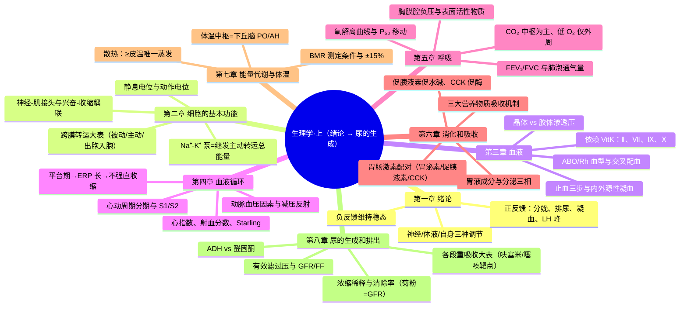
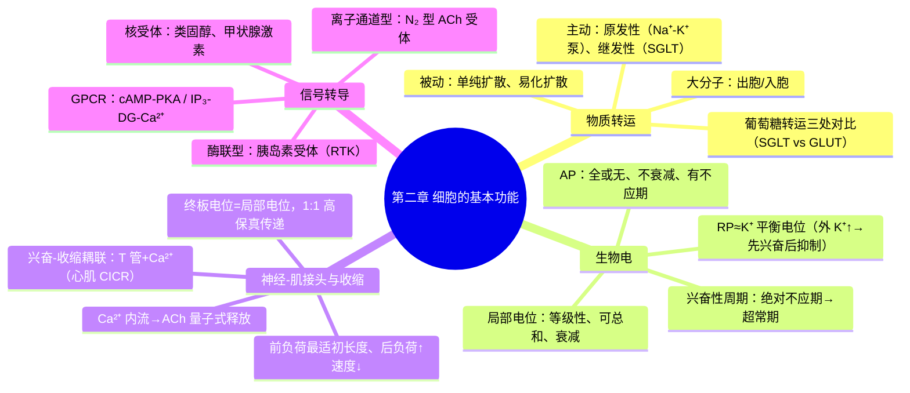
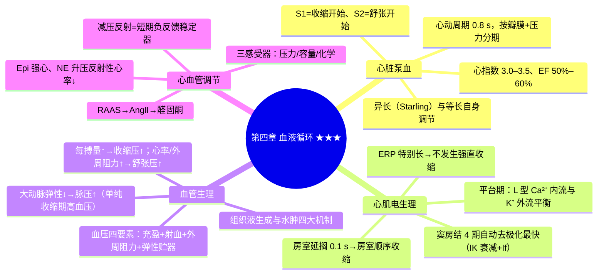
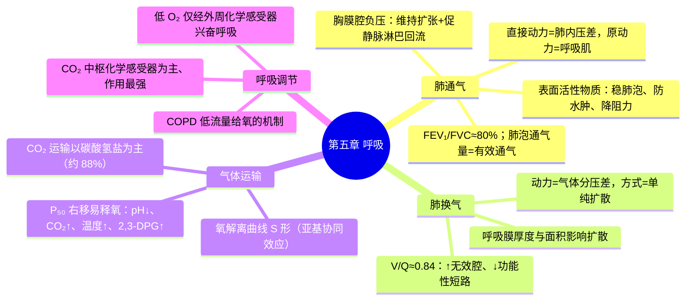
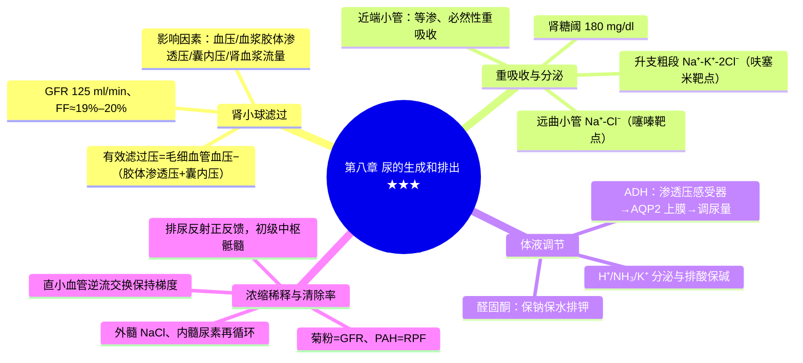

---
tags:
  - 考研306/生理学
科目: 生理学
内容: 绪论、细胞、血液、血液循环、呼吸、消化吸收、能量代谢与体温、尿的生成
---
# 生理学·讲义精讲版——01 上（绪论 → 尿的生成和排出）

> 覆盖：绪论、细胞的基本功能、血液、血液循环、呼吸、消化和吸收、能量代谢与体温、尿的生成和排出。
> 骨架：每节按【定义/概述】→【机制与原理】→【要点展开】→【对比/鉴别表】→【高频考点提示】展开；★=高频考点，⚠=易错点。
> 用法：一轮逐节精读并抄写对比表；二轮只看"高频考点提示"与文末数值速记表。

---

## 第一章 绪论

### 1.1 内环境与稳态

【定义/概述】
- 体液占体重约 60%：细胞内液约 40%，细胞外液约 20%（血浆约 5% + 组织液约 15%）。
- ★ 内环境 = 细胞外液；稳态 = 内环境理化性质（温度、pH、渗透压、各种化学成分）保持相对恒定的动态平衡。

【机制与原理】为什么强调"动态平衡"？
- 内环境的各项指标并非固定于某一点，而是在窄范围内波动（如体温、pH 均有节律性起伏）；稳态靠"干扰→反馈纠正"的持续运转来维持，其中**负反馈是维持稳态的最主要机制**，正反馈只在需要"快速完成"的事件中短暂启用。

【要点展开】
- 稳态的扩展含义：不仅指理化性质，也包括各器官系统功能活动的稳定（如血压、血糖稳定）。
- 稳态破坏 → 疾病；治疗的目的本质上是帮助机体重建稳态。

### 1.2 机体功能活动的调节

【对比表】三种调节方式

| 方式 | 速度/范围/时间 | 机制基础 | 典型例子 |
|---|---|---|---|
| 神经调节 | **最快**、精确、短暂；**最主要的调节方式** | 反射弧 | 减压反射、膝反射、唾液分泌的条件反射 |
| 体液调节 | 缓慢、广泛、持久 | 激素/代谢产物经体液运输 | 胰岛素降糖、CO₂/腺苷等局部体液因素 |
| 自身调节 | 最小、幅度小、灵敏度低 | 组织细胞自身特性 | 肾血流量的肌源性调节、脑血流自身调节、心室功能曲线 |

【机制与原理】体液调节与神经调节的关系
- 很多内分泌腺本身受神经支配（如肾上腺髓质受交感节前纤维支配），形成"神经-体液调节"；神经调节常需通过改变激素分泌来实现长期效应。

### 1.3 反馈控制系统

- ★ 负反馈：输出偏离后向"纠偏方向"作用，维持稳态（减压反射、体温、血糖调节）。绝大多数稳态调节均属此。
- ★ 正反馈：输出不断自我加强，直至过程迅速完成并终止。
  【口诀：分娩排尿又凝血，排便射精 LH 峰】
- ⚠ 病理状态的"恶性循环"（失血性休克→灌注↓→心收缩力↓→血压↓……）方向上类似正反馈，但**不是**生理性调节机制。
- 前馈：干扰信息先于输出变化即提前调整（条件反射、进餐时胰岛素分泌先于血糖升高）；使反应更快、更协调，但不作为闭环纠错。

【高频考点提示】
- ★ 正反馈清单必背；LH 峰是唯一写在生殖章前就要记住的正反馈。
- ★ "维持内环境稳态最重要的调节方式"——负反馈；"最主要的功能调节方式"——神经调节。

---

## 第二章 细胞的基本功能

### 2.1 细胞膜的物质转运 ★★

【定义/概述】
- 被动转运（顺浓度梯度，不耗能）：单纯扩散、易化扩散（通道型/载体型）。
- 主动转运（逆浓度梯度，耗能）：原发性（直接耗 ATP）、继发性（间接耗能，借助 Na⁺ 浓度差势能）。
- 大分子物质转运：出胞/入胞。

【机制与原理】Na⁺-K⁺ 泵为什么是全身继发性主动转运的"总能量来源"？
- 泵每消耗 1 分子 ATP，将 3 个 Na⁺ 泵出细胞、2 个 K⁺ 泵入细胞，造成**膜外高 Na⁺、膜内高 K⁺ 的浓度差储备**（势能）。所有继发性主动转运体（SGLT、Na⁺-Ca²⁺ 交换、Na⁺-H⁺ 交换等）都利用 Na⁺ 顺浓度差内流的势能带动另一种物质逆浓度转运。所以阻断 Na⁺-K⁺ 泵 → Na⁺ 梯度消失 → 全部继发性主动转运停摆。
- 泵本身**生电**（3 出 2 入，净转出 1 个正电荷），对静息电位有小贡献。

【对比表】跨膜转运方式大全（本文件核心大表之一）

| 方式 | 耗能 | 依赖蛋白 | 方向 | 典型例子 | 关键特征 |
|---|---|---|---|---|---|
| 单纯扩散 | 否 | 无 | 顺浓度差 | O₂、CO₂、N₂、乙醇、尿素、类固醇激素 | 脂溶性小分子 |
| 经通道易化扩散 | 否 | 通道（电压门控/化学门控/机械门控） | 顺电-化学梯度 | Na⁺、K⁺、Ca²⁺、Cl⁻；AP 去极化时 Na⁺ 内流 | 速度快、有离子选择性 |
| 经载体易化扩散 | 否 | 载体 | 顺浓度差 | ★葡萄糖入一般细胞（GLUT）、红细胞 | **饱和现象、竞争性抑制、结构特异性** |
| 原发性主动转运 | 是（直接耗 ATP） | 泵 | 逆浓度差 | ★Na⁺-K⁺ 泵、Ca²⁺ 泵（肌浆网/细胞膜）、H⁺ 泵 | 生电（Na⁺-K⁺ 泵） |
| 继发性主动转运 | 是（间接） | 转运体 | 一顺一逆 | ★同向：SGLT（肠/肾小管葡萄糖重吸收）；★反向：Na⁺-Ca²⁺、Na⁺-H⁺ 交换 | 依赖 Na⁺ 梯度 |
| 出胞 | 是 | — | 膜外 | 递质释放、外分泌腺分泌 | 需 Ca²⁺ 参与 |
| 入胞 | 是 | — | 膜内 | 吞噬（中性粒细胞/巨噬细胞）、★受体介导入胞（LDL、铁-转铁蛋白） | 大分子 |

【要点展开】
- ⚠ 三处葡萄糖转运对比例题必会：肠上皮吸收与肾小管重吸收 = **继发性主动转运**（SGLT）；葡萄糖入红细胞/一般组织细胞 = **经载体易化扩散**（GLUT）；胰岛素促进的是 GLUT4 转位。
- 钠泵生理意义（4 条）：①建立浓度势能（继发主动转运+生物电基础）；②维持细胞渗透压和容积；③为代谢（Na⁺ 依赖性）供基础；④生电作用直接影响静息电位。

### 2.2 静息电位与动作电位 ★★

【定义/概述】
- 静息电位（RP）：安静时膜内外电位差，膜内为负，接近 K⁺ 平衡电位（Ek）。
- 动作电位（AP）：受刺激后膜电位快速倒转又恢复的电位波动，是细胞兴奋的标志。

【机制与原理】
- RP 形成的逻辑链：安静时膜对 K⁺ 通透性最大（漏通道开放）→ K⁺ 顺浓度差外流 → 膜内积聚负电荷形成电场 → 电场阻力与浓度差推动力平衡 → K⁺ 达电-化学平衡（Ek）。**RP 略小于 Ek 绝对值**的原因：①少量 Na⁺ 内流（膜对 Na⁺ 有小通透性）；②Na⁺-K⁺ 泵的生电作用使其略增——两者方向相反，前者影响为主。
- RP 绝对值 ∝ 膜外/膜内 K⁺ 浓度比 → ★细胞外 K⁺↑（高钾）→ RP 绝对值↓（去极化）→ 膜电位靠近阈电位而兴奋性先↑，但持续去极化使 Na⁺ 通道失活 → 兴奋性最终↓（先升高后降低）。
- AP 上升支：阈刺激 → 少量 Na⁺ 通道开放 → Na⁺ 内流去极化 → 达阈电位 → **再生性 Na⁺ 内流（正反馈）** → 陡峭升支，接近 Na⁺ 平衡电位。
- 下降支：Na⁺ 通道**失活关闭** + K⁺ 外流↑ → 复极化。
- 后电位：负后电位（去极化方向——复极期 K⁺ 蓄积膜外，扩散受限）；正后电位（超极化方向——钠泵活动增强）。

【对比表】局部电位 vs 动作电位

| 特征 | 局部电位 | 动作电位 |
|---|---|---|
| 幅度 | 等级性（随刺激强度增减） | "全或无"（达阈后恒定） |
| 传播 | 电紧张性扩布，**衰减** | 不衰减传导 |
| 总和 | 可时间/空间总和 | 不可总和 |
| 不应期 | 无 | 有（决定最大兴奋频率） |
| 通道 | 门控通道少量开放，可关闭 | 再生性大量开放 |
| 代表 | 终板电位、EPSP/IPSP、感受器/发生器电位 | 神经/骨骼肌 AP |

【要点展开】兴奋性周期变化（快反应细胞）★

| 时期 | 通道状态 | 兴奋性 | 与 AP 对应 |
|---|---|---|---|
| 绝对不应期 | Na⁺ 通道完全失活 | 零 | 峰电位 |
| 局部反应期 | 失活通道少量复活 | 阈上刺激仅局部反应 | 负后电位前段 |
| 相对不应期 | 部分复活 | 低于正常（阈上刺激可兴奋） | 负后电位 |
| 超常期 | 基本复活、膜电位距阈电位近 | **高于正常** | 正后电位前后 |

- ★ 绝对不应期决定了 AP 不会融合——即限制最大兴奋频率；心肌 ERP 特别长 → 不发生强直收缩。

### 2.3 神经-肌接头传递与骨骼肌收缩 ★

【机制与原理】传递全过程逻辑链
- AP 传到接头前膜 → 前膜电压门控 **Ca²⁺ 通道开放，Ca²⁺ 内流** → ACh 囊泡量子式释放 → ACh 与终板膜 **N₂ 型 ACh 受体（化学门控阳离子通道）** 结合 → 终板电位（局部去极化）→ 电紧张扩布至邻近肌膜 → 达阈电位 → 肌膜爆发 AP。
- ★ 特点：**1:1 高保真传递**（终板电位幅度远超阈电位）——与突触传递的关键区别；单向；突触延搁；易受药物/病理因素影响（肉毒毒素抑制 ACh 释放；筒箭毒竞争阻断 N₂ 受体；有机磷抑制胆碱酯酶 → ACh 蓄积、肌束颤动）。

【机制与原理】兴奋-收缩耦联与肌丝滑行
- 关键结构 **T 管**；耦联因子 **Ca²⁺**。骨骼肌：T 管膜 L 型 Ca²⁺ 通道（DHPR）与肌浆网 RYR1 **机械耦联**直接触发释放；心肌：少量外 Ca²⁺ 内流经"**钙诱导钙释放（CICR）**"放大。
- 收缩逻辑链：Ca²⁺↑ → 与肌钙蛋白结合 → 原肌球蛋白移位暴露肌动蛋白结合位点 → 横桥结合 → 横桥周期（结合—摆动—解离—再结合，**每次循环耗 ATP**）→ 肌节缩短。Ca²⁺ 回收（肌浆网 Ca²⁺ 泵）→ 舒张。

【对比表】前负荷/后负荷对骨骼肌收缩的影响

| 项目 | 前负荷（初长度） | 后负荷 |
|---|---|---|
| 概念 | 收缩前承受的负荷 | 收缩开始后遇到的负荷 |
| 调节曲线 | 长度-张力曲线：**最适初长度（肌节 2.0–2.2 μm）张力最大** | 张力-速度曲线：后负荷↑→缩短速度↓、开始缩短延迟 |
| 机制 | 粗细肌丝最适重叠+Ca²⁺ 敏感性 | 先产张力克服负荷，再缩短 |
| 心脏对应 | 异长自身调节（Starling） | 动脉血压 |

【高频考点提示】
- ★ 终板电位是局部电位；神经-肌接头是 1:1 传递。
- ★ 完全强直收缩时**肌膜 AP 仍分开，收缩波融合**——与心肌不发生强直收缩对照记忆。
- ★ 阈电位与阈强度区分：阈电位是膜本身的临界值（约 −55 mV），阈强度是外加刺激的最小强度；"阈下刺激"只能引起局部电位。

### 2.4 跨膜信号转导 ★

【定义/概述】
- 少数信号分子可直接入胞（类固醇激素、甲状腺激素），多数信号需经膜受体介导的信号转导系统。

【对比表】三类膜受体介导的信号转导（必背）

| 途径 | 结构基础 | 机制 | 代表 |
|---|---|---|---|
| ★G 蛋白偶联受体（GPCR） | 7 次跨膜受体+G 蛋白+效应器 | Gs→腺苷酸环化酶→**cAMP→PKA**；Gq→PLC→**IP₃/DG→Ca²⁺↑/PKC** | 肾上腺素（α/β）、M 受体、多数肽类激素受体 |
| 离子通道型受体 | 受体与通道一体 | 配体结合直接开闭通道 | ★N₂ 型 ACh 受体、Glu/GABA 受体 |
| 酶联型受体 | 胞内段自身具酶活性 | 酪氨酸激酶/鸟苷酸环化酶等级联 | ★胰岛素受体（RTK）、生长因子受体；ANP（cGMP）；GH/PRL（JAK-STAT） |
| 核受体（不属于膜受体） | 胞质/核内 | 与配体结合后作用于**激素反应元件**、调节转录 | 类固醇激素、甲状腺激素、1,25-(OH)₂D₃ |

【要点展开】
- 第二信使：cAMP、cGMP、IP₃、DG、Ca²⁺（cAMP 由腺苷酸环化酶催化、被磷酸二酯酶降解——咖啡因抑制 PDE 使 cAMP↑）。
- 信号转导的意义：把胞外"化学语言"翻译为胞内效应，是激素、神经递质、生长因子作用的共同通路；肿瘤中该系统异常激活（ras、HER2）见生化篇。

> **相关知识点**：[[02-循环系统#二、心律失常|心律失常（内科）]] ｜ [[01-外科总论#二、外科患者的水、电解质与酸碱失衡|水电酸碱失衡（外科）]] ｜ [[04-心电图与器械检查#第 1 节 导联体系与正常心电图|心电图基础（诊断）]] ｜ [[01-生理学-上#4.2 心肌电生理 ★★★|心肌电生理]] ｜ [[02-生理学-下#10.1 神经元、胶质细胞与突触传递|突触传递]]

---

## 第三章 血液

### 3.1 血液的组成与理化特性

【定义/概述】
- 血浆渗透压约 280–310 mOsm/(kg·H₂O)；等渗溶液：0.85%（0.9%）NaCl、5% 葡萄糖；**等张溶液仅 0.85% NaCl**（葡萄糖可透入细胞被代谢，不能维持张力）。
- 血浆 pH 7.35–7.45，最重要缓冲对 NaHCO₃/H₂CO₃（20:1）。

【对比表】晶体渗透压 vs 胶体渗透压（必背）

| | 晶体渗透压 | 胶体渗透压 |
|---|---|---|
| 形成物质 | 晶体物质（主要是 **Na⁺、Cl⁻**） | 血浆蛋白（主要是**白蛋白**） |
| 数值 | 构成血浆渗透压的绝大部分 | 约 1.3 mOsm，占小部分 |
| 作用 | 维持**细胞内/外**水平衡 | 维持**血管内/外**水平衡 |
| 改变后果 | 高渗→细胞脱水；低渗→细胞水肿 | 白蛋白↓→组织水肿 |
| 感受器关联 | 下丘脑渗透压感受器（ADH） | 容量感受器间接感知 |

### 3.2 红细胞生理 ★

【机制与原理】红细胞悬浮稳定性与血沉
- 红细胞因表面负电荷互相排斥、双凹圆盘形下沉缓慢；若血浆中**球蛋白、纤维蛋白原↑** → 中和负电荷 → 红细胞叠连 → 摩擦阻力↓ → **血沉加快**；白蛋白↑则血沉减慢。血沉反映的是**血浆成分改变**，不是红细胞本身病变。

【要点展开】
- 特性：可塑变形性、悬浮稳定性（ESR）、渗透脆性（越衰老脆性越大）。
- 生成原料：**铁+蛋白质**（合成 Hb）；**维生素 B₁₂+叶酸**（DNA 合成，"成熟因子"；B₁₂ 吸收需壁细胞内因子）。缺铁 → 小细胞低色素性贫血；缺 B₁₂/叶酸 → 巨幼细胞贫血。
- 调节：**EPO**（肾皮质管周细胞产生，作用于红系祖细胞——晚期红系祖细胞为主要靶点）；雄激素促进；肾性贫血的机制即 EPO↓。
- 寿命约 120 天，衰老 RBC 在脾、肝被巨噬细胞吞噬破坏。

### 3.3 生理性止血与血液凝固 ★★

【机制与原理】止血三步的逻辑
- 血管收缩（最快、最初步，反射性+血小板释放 TXA₂/5-HT）→ 血小板止血栓（**黏附—释放—聚集**：ADP、TXA₂ 促聚集）→ 血液凝固加固。三者依次接力，且互相正反馈放大（ADP 释放吸引更多血小板）。
- **PGI₂（血管内皮产生，抑制聚集）与 TXA₂（血小板产生，促进聚集）构成动态平衡**——阿司匹林抑制 COX → TXA₂↓ → 抗血小板。

【对比表】内源性 vs 外源性凝血途径

| | 内源性 | 外源性 |
|---|---|---|
| 启动 | 血管内膜下胶原激活 **Ⅻ** | 组织损伤释放 **TF（Ⅲ）与 Ⅶ** 形成复合物 |
| 参与因子 | Ⅻ、Ⅺ、Ⅸ、Ⅷ 全部来自血液 | Ⅲ 来自组织、Ⅶ 来自血液 |
| 速度 | 慢（环节多） | 快（两步即达 Ⅹa） |
| 临床意义 | 体外实验/接触激活 | **生理性止血的主要启动途径** |

- 共同途径：Ⅹa → 凝血酶原（Ⅱ）→ 凝血酶 → 纤维蛋白原（Ⅰ）→ 纤维蛋白单体 → **ⅩⅢa** 使其交联稳固。
- ★ 凝血因子特性：Ⅳ 是 Ca²⁺；依赖维生素 K：**Ⅱ、Ⅶ、Ⅸ、Ⅹ**（肝合成）。【口诀：二七九十依赖维K】枸橼酸盐/草酸盐抗凝 = 螯合 Ca²⁺。

【要点展开】抗凝与纤溶
- 抗凝血酶Ⅲ（灭活凝血酶及 Ⅸa、Ⅹa、Ⅺa、Ⅻa；**肝素增强其作用**）、蛋白质 C 系统（灭活 Ⅴa、Ⅷa）、TFPI（抑制 TF-Ⅶa）。
- 纤溶：纤溶酶原 →（tPA/uPA 激活）→ 纤溶酶 → 降解纤维蛋白为 FDP、D-二聚体；抑制物 PAI-1。

### 3.4 血型与输血 ★

【对比表】ABO 与 Rh 血型系统

| | ABO | Rh |
|---|---|---|
| 抗原 | 红细胞 A/B 凝集原 | D 抗原（我国汉族约 99% 阳性） |
| 抗体性质 | 天然 **IgM**（不通过胎盘） | 免疫性 **IgG**（**可通过胎盘**） |
| 首次输血/妊娠 | 立即反应（已有天然抗体） | 一般不反应，但致敏 |
| 再次暴露 | 反应更重 | **新生儿溶血病多发生在第二胎及以后** |

- 交叉配血：主侧（供者 RBC + 受者血清）、次侧（受者 RBC + 供者血清）；主侧凝集绝对禁止；两侧均不凝最理想。O 型"万能供血者"、AB 型"万能受血者"仅为应急说法，主张同型输血。

【对比表】主要白细胞的功能与临床（306 常考）

| 白细胞 | 占比（计数） | 主要功能 | 临床联系 |
|---|---|---|---|
| 中性粒细胞 | 50%–70% | **吞噬化脓菌**（急性炎症第一道细胞防线） | 急性化脓性感染↑ |
| 嗜酸性粒细胞 | 0.5%–5% | 抗寄生虫、限制过敏反应 | 寄生虫感染、过敏↑ |
| 嗜碱性粒细胞 | 0%–1% | 释放组胺、肝素（介导速发型过敏） | — |
| 单核细胞 | 3%–8% | 入组织演化为巨噬细胞 | 慢性炎症、结核 |
| 淋巴细胞 | 20%–40% | T 细胞免疫/B 体液免疫 | 病毒感染↑ |

- 脾脏四大功能：滤血（清除衰老 RBC）、储血、免疫、造血（胚胎期）；脾切除后外周血出现幼稚 RBC 与靶形红细胞。

【高频考点提示】
- ★ Rh 抗体 IgG 可过胎盘 → 母婴血型不合溶血多见于第二胎；ABO 天然抗体 IgM 不能。
- ★ 血沉加快的因素=球蛋白、纤维蛋白原↑。

> **相关知识点**：[[05-血液系统#十二、出血性疾病总论|出血性疾病总论（内科）]] ｜ [[05-血液系统#十五、输血与输血反应|输血与输血反应（内科）]] ｜ [[01-外科总论#三、输血|输血（外科）]] ｜ [[03-实验室检查#第 3 节 止血与血栓检查|止血与血栓检查（诊断）]]

---

## 第四章 血液循环 ★★★

### 4.1 心脏泵血 ★★

【定义/概述】
- 心率 75 次/分 → 心动周期 0.8 s：心房收缩 0.1 s、舒张 0.7 s；心室收缩 0.3 s、舒张 0.5 s。心率加快时**舒张期缩短更明显**。

【机制与原理】为什么心室充盈主要靠"抽吸"而不是"心房收缩"？
- 心室舒张早期，室内压急剧下降并低于房内压，形成"抽吸"效应，快速充盈期充盈量最大；心房收缩仅在舒张末期补充约 10%–30%。因此房颤（心房失去有效收缩）时静息心输出量可基本维持，但活动耐受下降。

【对比表】心动周期分期与压力-容积-瓣膜要点

| 时期 | 瓣膜状态 | 容积/压力特点 | 标志事件 |
|---|---|---|---|
| 等容收缩期 | 均关 | 容积不变、室内压上升最快 | 主动脉压最低点在期末 |
| 快速射血期 | 主/肺动脉瓣开 | **室内压最高**、射血量占 2/3–3/4 | — |
| 减慢射血期 | 开 | 室内压略低于主动脉压（惯性射血） | — |
| 等容舒张期 | 均关 | 容积不变、室内压下降最快 | — |
| 快速充盈期 | 房室瓣开 | **充盈量最大**（心室抽吸） | S3 有关 |
| 减慢充盈期 | 开 | 充盈减慢 | — |
| 心房收缩期 | 开 | 补充 10%–30% | S4 有关 |

- ★ 心音：S1——心尖部最响、音调低历时长，标志**心室收缩开始**（房室瓣关闭）；S2——音调高历时短，标志**心室舒张开始**（半月瓣关闭）。

【对比表】心输出量评价指标

| 指标 | 定义 | 正常值 | 意义 |
|---|---|---|---|
| 每搏输出量 | 一侧心室一次射血量 | 60–80 ml | 基础指标 |
| 心输出量 | 每搏输出量×心率 | 5–6 L/min | 总功能 |
| **心指数** | 心输出量/体表面积 | 3.0–3.5 L/(min·m²) | 消除体型差异 |
| **射血分数** | 每搏输出量/舒张末期容积 | 50%–60% | 心室扩大时比心输出量更敏感 |

【机制与原理】前负荷/后负荷/收缩能力如何区分调节？
- **异长自身调节（Starling 机制）**：改变初长度→粗细肌丝重叠改变，是**对搏出量的精细、快速调节**（如体位变化、输液后几秒内完成），曲线即心室功能曲线，无降支（正常范围内）。
- **等长自身调节**：不依赖长度，心肌收缩能力本身改变（儿茶酚胺↑收缩能力；心衰↓）。
- **后负荷**：动脉血压↑ → 射血阻力↑ → 搏出量暂↓ → 残余血量↑ → 下搏动前负荷↑代偿；长期后负荷增高 → 心室肥大。
- 心率：70–180 次/分内 ↑ 心率可 ↑ 心输出量；★**>180 次/分 → 舒张期充盈不足 → 心输出量反而下降**。

### 4.2 心肌电生理 ★★★

【机制与原理】为什么心肌 AP 有平台期而骨骼肌没有？
- 心室肌 2 期同时存在**L 型 Ca²⁺ 内流（慢通道）与 K⁺ 外流**，两者暂时平衡 → 膜电位稳定于 0 mV 附近 → AP 时程长（200–300 ms）→ **有效不应期特别长（覆盖整个收缩期+舒张早期）** → 心肌不会强直收缩、心脏得以保持泵血节律。
- 0 期：快 Na⁺ 通道；1 期：一过性外向 K⁺ 电流（Ito）；3 期：K⁺ 外流（IK）；4 期：Na⁺-K⁺ 泵 + Na⁺-Ca²⁺ 交换恢复离子分布。

【机制与原理】为什么窦房结是正常起搏点？
- 窦房结 P 细胞 **4 期自动去极化速度最快**（自动去极化达阈电位所需时间最短），故节律最高（约 100 次/分），抢先占领全心脏；其他潜在起搏点（房室结约 50、浦肯野约 25）被"抢先占领 + 超速驱动压抑"双重控制。
- 4 期自动去极化机制：**IK（K⁺ 外流）进行性衰减 + If（内向 Na⁺ 起搏电流）递增强 + 晚期 T 型 Ca²⁺ 内流**——递减性 IK 衰减与递增性 If 是主要机制。
- ★ 慢反应细胞 0 期为**慢 Ca²⁺ 通道（L 型）内流**，去极慢、幅度小、传导慢；无 1、2 期。

【对比表】快反应 vs 慢反应心肌细胞电生理（必背大表）

| 特征 | 快反应细胞（心房肌、心室肌、浦肯野） | 慢反应细胞（窦房结、房室结） |
|---|---|---|
| 0 期离子 | 快 Na⁺ 内流 | 慢 Ca²⁺（L 型）内流 |
| 0 期速度/幅度 | 大、陡 | 小、缓 |
| AP 时程 | 有平台期 | 无明确平台 |
| 4 期 | 稳定（静息电位） | **自动去极化** |
| 静息/最大复极电位 | −85~−90 mV | −50~−60 mV |
| 传导速度 | 快（浦肯野最快） | 慢（房室结最慢） |
| 阻断剂 | Na⁺ 通道阻滞剂敏感 | Ca²⁺ 通道阻滞剂敏感 |

【要点展开】
- 有效不应期（ERP）：心室肌 0 期至 3 期复极约 −55~−60 mV，**特别长 → 不发生完全强直收缩**。
- 期前收缩与代偿间歇：期前兴奋后，窦房结下一次冲动常落在期前兴奋的 ERP 内而被"脱落"一次 → 代偿间歇。
- 传导性：房室结传导最慢 → **房室延搁约 0.1 s** → 保证房-室顺序收缩；浦肯野纤维传导最快。
- ⚠ 影响：高 K⁺ → 兴奋性/传导性↓（重者心脏停搏于舒张期）；高 Ca²⁺ → 收缩增强；迷走-ACh → K⁺ 外流↑、4 期去极化减慢 → **负性变时/变力/变传导**；交感-NE → β₁ → **正性三变**。

【要点展开】心电图基础（与诊断学衔接）
- ★ 各波含义：P 波=心房去极化；QRS 波群=心室去极化；T 波=心室复极化；PR 间期（0.12–0.20 s）=房室传导时间；ST 段≈平台期；QT 间期=心室去极+复极总时程。
- ⚠ 心电图记录的是**整个心脏兴奋扩布的综合电向量**，不是单个细胞的跨膜电位；体表导联（双极肢体、加压肢体、胸导联）从不同角度"看"同一向量。
- 心力贮备：最大输出量与安静输出量之差——贮备反映泵功能潜力，包括心率贮备与每搏贮备（收缩期/舒张期贮备）。

【机制与原理】心室功能曲线为什么没有降支？
- 正常心室肌初长度增加时肌节被逐渐拉向最适长度（2.0–2.2 μm），张力单调上升；心室壁较厚且正常心室处于"未充分利用"状态，故生理范围内曲线只有升支——与骨骼肌长度-张力曲线（有降支）的差异是考点。

### 4.3 血管生理 ★★

【机制与原理】动脉血压如何形成？
- 四要素：足量血液充盈（前提）+ 心脏射血（动力）+ **外周阻力（小动脉/微动脉）** + **大动脉弹性贮器**（射血期扩张储压、舒张期回缩续流——缓冲收缩压、维持舒张压、减小脉压）。缺外周阻力则射血的动能只表现为"脉冲式血流"而无稳定血压。

【对比表】影响动脉血压各因素（必背）

| 因素 | 变化 | 明显改变的是 | 记忆点 |
|---|---|---|---|
| 每搏输出量↑ | — | **收缩压↑↑（脉压↑）** | 射血多 |
| 心率↑ | — | **舒张压↑↑（脉压↓）** | 舒张期短、存血多 |
| 外周阻力↑ | — | **舒张压↑↑（脉压↓）** | 高血压的主要血流动力学机制 |
| 大动脉弹性↓（老年） | 收缩压↑、舒张压↓ | **脉压↑↑** | 单纯收缩期高血压 |
| 循环血量↓（失血） | 收缩压、舒张压均↓ | — | 平均动脉压↓ |

- 正常值：收缩压 90–139 mmHg、舒张压 60–89 mmHg、脉压 30–40 mmHg；平均动脉压 ≈ 舒张压 + 1/3 脉压。
- 静脉系统：CVP 4–12 cmH₂O（反映右心前负荷、指导输液）；静脉回心血量因素：体循环平均充盈压、心肌收缩力（右心衰→回心障碍）、体位、**骨骼肌泵+静脉瓣**、**呼吸泵（吸气→胸内压更负→回心血量↑）**。
- 微循环三通路：迂回通路（营养、物质交换）、直捷通路（保证回流）、动-静脉短路（体温调节）。
- ★ 组织液生成与水肿机制：有效滤过压 =（毛细血管血压 + 组织液胶体渗透压）−（血浆胶体渗透压 + 组织液静水压）；动脉端滤过、静脉端重吸收、淋巴回流补充。水肿四大机制：毛细血管血压↑（右心衰）、血浆胶体渗透压↓（低蛋白）、淋巴回流受阻（丝虫病）、通透性↑（炎症）。

### 4.4 心血管活动的调节 ★★

【机制与原理】减压反射为什么是"负反馈稳定器"？
- 血压↑ → 颈动脉窦/主动脉弓压力感受器牵张↑ → 窦神经（加入舌咽神经）/迷走神经传入 → 孤束核 → 心迷走紧张↑、心交感与缩血管紧张↓ → 心率↓、收缩力↓、血管扩张 → 血压回降。**感受器敏感区在血压 100 mmHg 附近**（日常血压波动最有效缓冲）；窦神经切断后血压剧烈波动（缓冲神经失能）。意义：**短期快速稳定血压**，对长期血压调节不重要。

【对比表】三种感受器对比（必考大表）

| | 压力感受器（颈动脉窦/主动脉弓） | 心肺容量感受器 | 化学感受器（颈动脉体/主动脉体） |
|---|---|---|---|
| 适宜刺激 | 血管壁机械牵张 | 容量/牵张 | **PaO₂↓、PaCO₂↑、H⁺↑** |
| 传入神经 | 窦神经（Ⅸ）、主动脉神经（Ⅹ） | 迷走神经 | 窦神经、迷走神经 |
| 主要效应 | 心迷走↑、交感↓→血压↓ | 交感↓、ADH↓→血压↓、尿量↑ | **呼吸兴奋为主**；心血管效应仅在窒息/失血时（交感↑） |
| 性质 | 负反馈稳定短期血压 | 调节血容量 | 应激时维持循环呼吸 |

【要点展开】体液调节
- ★ **RAAS**：肾灌注↓/交感↑/致密斑 Na⁺↓ → 球旁细胞分泌肾素 → AngⅠ → **ACE（肺血管内皮）** → AngⅡ（强烈缩血管、促 ADH 与醛固酮、致口渴、促心肌与血管重构）→ 醛固酮（保 Na⁺ 保水排 K⁺）。
- ★ **Epi vs NE 经典对比**：Epi 与心脏 β₁ 强心（心输出量↑），血管低剂量 β₂ 占优、总外周阻力可略降 → "强心药"；NE 主要 α → 血管强烈收缩、外周阻力↑、血压↑，但**反射性心率↓** → "升压药"。
- ADH（大剂量缩血管）、NO/PGI₂ 舒血管、内皮素缩血管、激肽/组胺/5-HT 舒血管。
- 冠脉循环：**灌注主要在舒张期**（心缩压迫冠脉，左心室更明显）；调节最重要的是**心肌代谢水平（腺苷为主要舒血管物质）**；舒张压↑/舒张期长（心率↓）→ 冠脉流量↑。⚠ 贫血、缺氧也显著扩冠。
- ★ 血压的长期调节最终靠**肾脏**（RAAS+压力-利尿机制）——短期靠神经反射、中期靠体液因素、长期靠肾体液平衡，三条时间线常出组合题。
- 脑循环：血-脑屏障；对缺氧最敏感（4–6 min 不可逆损伤）；CO₂ 是强效扩脑血管因素。

【高频考点提示】
- ★ 减压反射是负反馈；夹闭颈总动脉 → 窦内压↓ → 减压反射减弱 → 血压↑。
- ★ NE 升压反射性心率↓；Epi 强心——临床用药考点。
- ★ 冠脉血流舒张期>收缩期；腺苷是最重要代谢性扩血管物质。

> **相关知识点**：[[02-循环系统#一、心力衰竭|心力衰竭（内科）]] ｜ [[02-循环系统#三、高血压|高血压（内科）]] ｜ [[02-循环系统#四、冠状动脉粥样硬化性心脏病|冠心病（内科）]] ｜ [[04-心电图与器械检查#第 1 节 导联体系与正常心电图|心电图基础（诊断）]] ｜ [[02-体格检查#第 5 节 心脏检查|心脏检查（诊断）]]

---

## 第五章 呼吸

### 5.1 肺通气 ★★

【定义/概述】
- 直接动力 = 肺内压与大气压之差；原动力 = 呼吸肌运动。吸气时肺内压<大气压，呼气时>大气压，吸气末/呼气末相等。

【机制与原理】胸膜腔负压为什么形成？有什么用？
- 胸廓自然容积大于肺自然容积，胸膜腔将两者耦联 → 肺被牵拉而趋于回缩 → 胸内压 = 肺内压 − 肺回缩力，**始终低于大气压**（平静呼气末约 −3～−5 cmH₂O，吸气末更负）。意义：①维持肺扩张；②促进静脉血与淋巴回流。气胸 → 胸内压=大气压 → 肺塌陷、回心血量↓。

【机制与原理】肺泡表面活性物质为什么"一举三得"？
- Ⅱ 型肺泡细胞分泌 DPPC，铺于肺泡液-气界面降低表面张力。因为小肺泡中表面张力回缩力本应更大（Laplace 定律），表面活性物质在小肺泡中密度更高、降张力更显著 → 大小肺泡稳定性一致（防止小泡塌陷并入大泡）；同时表面张力是肺水肿的"抽水机"，降低之即防止肺水肿；整体降低吸气阻力、增加顺应性。新生儿缺乏 → NRDS（进行性呼吸困难、透明膜形成）。

【对比表】弹性阻力与顺应性

| 项目 | 肺弹性阻力 | 胸廓弹性阻力 |
|---|---|---|
| 组成 | 表面张力（约 2/3）+ 弹性纤维回缩力（1/3） | 胸廓弹性组织 |
| 方向 | 吸气阻力 | <60% 肺容量时是动力、>67% 时是阻力 |
| 病理 | 肺纤维化/表面活性物质缺乏→顺应性↓；肺气肿→顺应性↑ | 脊柱畸形、肥胖 |

- 非弹性阻力：气道阻力为主，主要在**大气道**，与半径 4 次方成反比；呼气时气道阻力大（管径压缩）。哮喘小气道痉挛 → 呼气性呼吸困难。

【对比表】肺通气量指标（必背）

| 指标 | 定义/数值 | 意义 |
|---|---|---|
| 潮气量 TV | 400–600 ml | 平静呼吸进出量 |
| 功能残气量 FRC | 残气量+补呼气量 | 缓冲肺泡气分压波动 |
| 肺活量 VC | 最大吸气后全部呼出（男约 3.5 L） | 静态指标 |
| ★ FEV₁/FVC | 第 1 秒用力呼气量/用力肺活量 ≈ **80%** | **通气功能最可靠指标**：阻塞→比值↓；限制→FVC↓但比值正常或↑ |
| 每分通气量 | TV×呼吸频率 | 静息约 6–9 L/min |
| ★ 肺泡通气量 | （TV−无效腔 150 ml）×频率 | **有效通气量**：浅快呼吸效率低、深慢呼吸效率高 |

### 5.2 肺换气与组织换气 ★

【机制与原理】
- 换气动力 = 气体分压差，方式 = 单纯扩散。呼吸膜（气血屏障）菲薄：表面活性物质层+肺泡上皮+基膜+毛细血管基膜（部分融合）+内皮——结构越薄扩散越快；肺水肿/纤维化时厚度↑ → 扩散↓。影响因素：呼吸膜厚度（肺纤维化、肺水肿→扩散↓）、面积（肺气肿、肺不张→↓）、**V/Q 匹配**。
- ★ V/Q 正常约 **0.84**：V/Q↑（血流相对不足）→ **无效腔增大**（肺栓塞）；V/Q↓（通气相对不足）→ **功能性动-静脉短路**（肺不张、实变）。直立位肺尖 V/Q 大、肺底 V/Q 小。
- 肺牵张反射（黑-伯反射）：肺扩张 → 迷走传入 → 抑制吸气、促吸气转呼气；成人平静呼吸中不发挥主要作用。

【要点展开】呼吸中枢与节律形成
- ★ 节律起源在**延髓**（呼吸神经元基本节律）；脑桥上部**呼吸调整中枢**——限制吸气、促进吸气向呼气转换；大脑皮层可**随意**控制呼吸（屏气、过度通气——经皮层脊髓束，故睡眠中消失）。
- 呼吸的机械感受性反射：肺牵张反射、呼吸肌本体感受性反射、防御性呼吸反射（★咳嗽反射与喷嚏反射——感受器位于喉、气管、支气管黏膜，经迷走神经传入）。

### 5.3 气体运输 ★★

【机制与原理】氧解离曲线为什么呈 S 形？
- Hb 四个亚基与 O₂ 结合存在**协同效应**：第一个 O₂ 结合困难（曲线平缓上段），随后结合促进后续结合（陡峭中段），饱和后趋平（下段平坦）。这种变构（T 态↔R 态）恰使曲线的三段分别对应"肺内安全载氧、组织常规释氧、组织代谢旺盛时加量释氧"。

【对比表】氧解离曲线三段与影响因素（必背）

| 段 | PO₂ 范围 | 特点 | 生理意义 |
|---|---|---|---|
| 上段 | 60–100 mmHg | 平坦 | 高原/轻中度呼吸功能不全时 SaO₂ 仍高——安全缓冲区 |
| 中段 | 40–60 mmHg | 较陡 | 组织正常释 O₂ |
| 下段 | 15–40 mmHg | 最陡 | 代谢增强时进一步释 O₂——储备 |

- ★ P₅₀（SaO₂ 50% 时 PO₂，约 26.5 mmHg）：**右移（P₅₀↑）= 亲和力↓易释氧**——pH↓（波尔效应）、PCO₂↑、温度↑、2,3-DPG↑（高原、贫血）；**左移 = 亲和力↑不易释氧**——上述反向、胎儿 Hb、CO 中毒（CO 与 Hb 亲和力约为 O₂ 的 250 倍，且使余下位点亲和力↑）。
- CO₂ 运输：物理溶解约 5%、**碳酸氢盐约 88%（主要）**、氨基甲酰血红蛋白约 7%；**氯离子转移**（Cl⁻ shift）；何尔登效应（去氧 Hb 携带 CO₂ 能力↑）。

### 5.4 呼吸运动的调节 ★

【对比表】三种化学刺激对呼吸的调节（必考大表）

| 刺激 | 感受部位 | 途径 | 强度与特点 |
|---|---|---|---|
| CO₂↑ | **中枢化学感受器为主**（延髓腹外侧，感受脑脊液 H⁺）+ 外周 | CO₂ 易过血脑屏障→脑脊液 H⁺↑ | **作用最强**；慢性潴留时中枢适应，靠低 O₂ 维持呼吸 |
| H⁺↑ | 外周为主（中枢受血脑屏障限制） | 颈动脉体/主动脉体 | 作用次之 |
| 低 O₂ | **仅外周化学感受器** | 颈动脉体 | 轻度抑制中枢、反射性兴奋外周；**严重缺氧直接抑制呼吸中枢** |

【机制与原理】为什么 COPD 患者要低流量给氧？
- 长期 CO₂ 潴留使中枢化学感受器适应，呼吸主要靠低 O₂ 刺激外周化学感受器维持；高浓度吸氧解除低 O₂ 驱动 → 呼吸抑制 → CO₂ 麻醉。

【高频考点提示】
- ★ 表面活性物质三点作用+NRDS；FEV₁/FVC 判别阻塞/限制；V/Q=0.84 及失衡后果。
- ★ 低 O₂ 只通过外周化学感受器；CO₂ 中枢占主导。

> **相关知识点**：[[01-呼吸系统#一、慢性阻塞性肺疾病（COPD）|COPD（内科）]] ｜ [[01-呼吸系统#十四、呼吸衰竭与氧疗|呼吸衰竭与氧疗（内科）]] ｜ [[03-实验室检查#第 9 节 电解质与血气分析|血气分析（诊断）]] ｜ [[01-生理学-上#4.4 心血管活动的调节 ★★|心血管活动的调节]]

---

## 第六章 消化和吸收

### 6.1 消化道平滑肌与胃肠神经

- 慢波（基本电节律）：起源于 **Cajal 间质细胞**，纵行肌产生；胃约 3 次/分、十二指肠约 12 次/分；慢波本身不引起收缩，达阈电位后爆发 AP（去极相主要 Ca²⁺ 内流）→ 收缩。
- 【对比表】消化道各段运动形式

| 部位 | 主要运动形式 | 意义 |
|---|---|---|
| 胃 | 容受性舒张（迷走）、蠕动（幽门泵） | 储存、研磨、排空 |
| 小肠 | ★**分节运动**（最主要，混合食糜）、蠕动、蠕动冲 | 混合与推进 |
| 大肠 | 袋状往返运动、★集团蠕动（胃-结肠反射） | 储存与排便 |

- ⚠ 分节运动不推进食糜，只起混合作用；蠕动才是推进性运动。
- 内在（肠）神经系统独立完成局部反射；副交感（迷走）→ 促运动促分泌；交感 → 抑制。

### 6.2 胃肠激素 ★

【对比表】主要胃肠激素（必背）

| 激素 | 来源 | 主要作用 | 促分泌因素 |
|---|---|---|---|
| 促胃液素 | G 细胞（胃窦、十二指肠） | **促胃酸分泌（最强）**、促胃运动、营养胃黏膜 | 蛋白质消化产物、扩张；pH<2.5 抑制 |
| 促胰液素 | S 细胞（十二指肠） | **促胰液（水与 HCO₃⁻）**、抑制胃酸与胃运动 | 盐酸（最强） |
| 缩胆囊素 CCK | I 细胞 | **促胰酶**、胆囊收缩、Oddi 括约肌松弛、抑制胃排空 | 蛋白质与脂肪消化产物 |
| 抑胃肽 GIP | K 细胞 | 抑制胃酸分泌；**促胰岛素分泌（"肠促胰素"）** | 葡萄糖、脂肪 |
| 促胃动素 | M 细胞 | 促 MMC（消化间期移行性复合运动） | 消化间期周期性释放 |

【口诀：胃泌素促酸促运动，胰泌素促水促碱抑胃，CCK 促酶缩胆抑胃】

### 6.3 胃液分泌 ★★

【机制与原理】盐酸（壁细胞）如何分泌？
- 壁细胞顶膜 **H⁺-K⁺-ATP 酶（质子泵）** 将 H⁺ 泵入分泌小管；Cl⁻ 经通道伴随分泌；基底侧 HCO₃⁻ 出胞（"餐后碱潮"来源）。质子泵是 PPI（奥美拉唑）的作用靶点。

【对比表】胃液成分与功能

| 成分 | 分泌细胞 | 作用/意义 |
|---|---|---|
| 盐酸 | **壁细胞** | 激活胃蛋白酶原、杀菌、促胰液素释放、促铁/钙吸收 |
| 胃蛋白酶原 | **主细胞** | 激活后最适 pH≈2；pH>6 失活 |
| 黏液与 HCO₃⁻ | 黏液颈细胞等 | **黏液-碳酸氢盐屏障**保护黏膜 |
| 内因子 | **壁细胞** | 促回肠 B₁₂ 吸收——萎缩性胃炎→恶性贫血 |

【对比表】胃液分泌三相

| 期 | 机制 | 分泌特点 | 占比 |
|---|---|---|---|
| 头期 | 迷走-迷走反射+迷走促胃泌素释放（**神经+体液**） | 量多、酸高、酶丰富 | 约 30% |
| 胃期 | 扩张+氨基酸/肽类 → 局部反射与胃泌素 | 量最多 | 约 60% |
| 肠期 | 十二指肠扩张与产物 → 胃泌素等 | 量少 | 约 10% |

- 抑制胃液分泌：盐酸（pH<2.5 负反馈）、脂肪（肠抑胃素类）、高张溶液。
- ★ 胃排空顺序：**糖 > 蛋白 > 脂肪**；受胃内促进因素与十二指肠抑制因素（酸、脂肪、渗透压）双重控制 → **间断排空**。

### 6.4 胰液与胆汁 ★★

【机制与原理】为什么胰液是最重要的消化液？
- 唯一同时含三大营养素消化酶（胰淀粉酶、胰脂肪酶、蛋白酶原）的消化液；蛋白酶原需肠激酶激活——"酶以酶原形式存在"避免自身消化。
- **促胰液素 → 水与 HCO₃⁻ 多而酶少；CCK → 酶多而水盐少**——两条体液通路分工对应"中和胃酸"与"消化食物"两大任务。

【要点展开】胆汁
- 肝细胞分泌、**不含消化酶**；**胆盐**乳化脂肪、形成混合微胶粒促脂肪吸收；胆盐的**肠-肝循环**（回肠重吸收）维持胆盐池；迷走神经与促胰液素促分泌。

### 6.5 吸收 ★

【对比表】三大营养物质吸收（必背大表）

| | 糖 | 蛋白质 | 脂肪 |
|---|---|---|---|
| 吸收形式 | 葡萄糖、半乳糖、果糖 | 氨基酸、寡肽 | 甘油+脂肪酸、甘油一酯（微胶粒） |
| 转运机制 | ★葡萄糖/半乳糖经 **SGLT1 继发主动**；果糖易化扩散 | Na⁺ 依赖性继发主动转运 | 胞内重新合成甘油三酯 → 乳糜微粒 |
| 输出途径 | 血液 | 血液 | **淋巴为主（乳糜管）**（中短链脂肪酸走血） |
| 关键部位 | 小肠上段 | 小肠 | 十二指肠、空肠 |

- ★ 铁：Fe²⁺ 形式吸收（酸性环境、维 C 促进），十二指肠与空肠上段，转铁蛋白转运。
- ★ 钙：活性 VitD₃（1,25-(OH)₂D₃）促进，需钙结合蛋白，十二指肠为主。
- ★ 维生素 B₁₂：回肠末端，需内因子；脂溶性维生素（A/D/E/K）吸收需胆汁。

【要点展开】大肠与排便
- 大肠功能：吸收水分与电解质、储存粪便；运动形式以**袋状往返运动**为主，饭后出现**集团蠕动**（胃-结肠反射）推动粪便入直肠。
- ★ 排便反射：直肠壁感受器 → 盆神经与腹下神经传入 → **脊髓腰骶段初级中枢** → 传出引起降结肠/乙状结肠/直肠收缩、肛门内括约肌舒张；属**正反馈**；大脑皮层可随意抑制（阴部神经控制外括约肌）。脊髓高位损伤早期排便/排尿潴留，后期为反射性失禁。

【高频考点提示】
- ★ 促胰液素促"水碱"、CCK 促"酶"——两者来源与刺激物配对。
- ★ 葡萄糖吸收=继发性主动转运；脂肪吸收以淋巴为主。

> **相关知识点**：[[03-消化系统#三、消化性溃疡（PU）|消化性溃疡（内科）]] ｜ [[03-消化系统#十一、急性胰腺炎（AP）|急性胰腺炎（内科）]] ｜ [[02-生理学-下#11.6 胰岛内分泌 ★★|胰岛内分泌]] ｜ [[02-生理学-下#11.4 钙磷调节三激素 ★★（必背大表）|钙磷调节三激素]]

---

## 第七章 能量代谢与体温

### 7.1 能量代谢

【定义/概述】
- 间接测热法核心概念：氧热价（消耗 1 L O₂ 的产热量）、呼吸商 RQ = CO₂ 产生量/O₂ 消耗量（糖 1.0、脂肪约 0.71、蛋白约 0.80；混合食物约 0.85）。

【机制与原理】为什么 BMR 与体表面积成正比而与体重无关？
- 产热主要来自体表散热相关的组织代谢，体表面积是散热面积的度量；同种动物间"表面积定律"使不同体型个体的代谢率可比。因此 BMR 以每小时每平方米体表面积产热量表示。

【要点展开】
- ★ 测定条件：清醒、静卧、空腹 12 h 以上、环境 20–25 ℃；正常值 **±15%** 以内。
- ★ BMR↑：**甲亢（最显著）**、发热；BMR↓：甲减、Addison 病等。
- 影响能量代谢的因素：**肌肉活动（最显著）**、精神活动、**食物特殊动力效应（蛋白质最强，可达 30%）**、环境温度（20–30 ℃ 时最低——"中性温度"）。
- 体温调定点的临床延伸：脱水热（汗腺分泌受限）、新生儿体温易波动（体温调节功能不完善）。

### 7.2 体温 ★

【要点展开】
- 正常值：腋窝 36.0–37.0 ℃、口腔 36.3–37.2 ℃、直肠 36.5–37.7 ℃；昼夜波动<1 ℃（清晨最低、午后最高）。
- 产热：安静时以**内脏（肝）**为主；运动/寒战时以**骨骼肌**为主；新生儿褐色脂肪非寒战产热。
- 散热：辐射、传导、对流、蒸发；★**环境温度≥皮肤温度时唯一有效方式是蒸发（发汗）**。汗腺受交感**胆碱能**纤维支配。
- ★ 体温调节中枢：**下丘脑 PO/AH（视前区-下丘脑前部）**；调定点学说：致热原（内生致热原 IL-1、TNF、IL-6 经 PG 介导）→ 调定点上移 → 产热↑散热↓ → 发热；阿司匹林抑制 PG 合成而退热。

【高频考点提示】
- ★ BMR 与甲亢；环境≥皮温只有蒸发；体温调节中枢在下丘脑 PO/AH。

> **相关知识点**：[[01-症状学#第 1 节 发热|发热（诊断）]] ｜ [[07-风湿性疾病与中毒#十四、中暑与热射病|中暑与热射病（内科）]] ｜ [[02-生理学-下#11.3 甲状腺激素 ★★|甲状腺激素]] ｜ [[02-生理学-下#10.5 自主神经系统 ★|自主神经系统]]

---

## 第八章 尿的生成和排出 ★★★

### 8.1 肾功能解剖与血流

- 滤过膜三层：毛细血管内皮窗孔 + 基膜（机械屏障主要部分）+ 足细胞裂孔膜（nephrin）；分子屏障（负电荷排斥白蛋白）。
- 皮质肾单位（多、入球>出球口径、髓袢短）vs 近髓肾单位（髓袢长、直小血管——**尿浓缩稀释**相关）。
- 肾血流量占心输出量 20%–25%；动脉压 **80–180 mmHg 范围内 GFR 稳定**——肌源性机制 + 管球反馈（致密斑）双重自身调节。

### 8.2 肾小球滤过 ★★

【机制与原理】有效滤过压如何逐段变化？
- 有效滤过压 = 肾小球毛细血管血压 −（血浆胶体渗透压 + 囊内压）。入球端约 +10 mmHg 以上，沿毛细血管血浆蛋白浓缩、胶体渗透压渐升，至出球端达到平衡——**滤过平衡**。因此肾血浆流量越大，滤过平衡点越后移，GFR 越大。

【要点展开】
- ★ GFR 约 125 ml/min；**滤过分数 FF = GFR/RPF ≈ 19%–20%**。
- 影响滤过的因素：毛细血管血压（80–180 mmHg 内自身调节不变；<80 → GFR↓）、**血浆胶体渗透压↓（大量输液、低蛋白）→ GFR↑**、囊内压↑（结石梗阻）→ GFR↓、肾血浆流量。

### 8.3 肾小管与集合管重吸收与分泌 ★★

【对比表】各段重吸收功能大表（必背）

| 段 | 主要重吸收 | 关键机制 | 备注 |
|---|---|---|---|
| 近端小管 | 全部葡萄糖/氨基酸/维生素；约 65%–70% Na⁺、水；HCO₃⁻ 约 80%–90% | SGLT、Na⁺-H⁺ 交换、碳酸酐酶 | **等渗性、必然性重吸收**（不受 ADH 调节） |
| 髓袢降支细段 | 水通透 | — | 逆流倍增的"浓缩段" |
| ★髓袢升支粗段 | Na⁺、K⁺、2Cl⁻ | **Na⁺-K⁺-2Cl⁻ 同向转运体（呋塞米靶点）** | 对水不通透→形成**外髓高渗** |
| 远曲小管 | NaCl（噻嗪类靶点） | Na⁺-Cl⁻ 同向 | 起始段仍不受 ADH 影响 |
| 集合管 | 水（ADH 调节）、Na⁺（醛固酮）、分泌 K⁺/H⁺ | AQP2、ENaC | **调节性重吸收**，决定终尿量 |

【机制与原理】肾糖阈为什么存在？
- 葡萄糖重吸收仅限近端小管，且转运体数量有限——血糖 >8.9–10 mmol/L（180 mg/dl，**肾糖阈**）时部分肾单位吸收达饱和 → 出现糖尿。血糖升高与尿糖出现之间存在"非同步"，故肾糖阈反映的是"部分肾单位饱和"的起始点而非最大转运能力。

【机制与原理】ADH 与醛固酮的分工
- ★ **ADH（下丘脑视上核为主合成）**：渗透压感受器（下丘脑，最灵敏，阈约 280 mOsm）与容量感受器（心肺牵张——血容量↑抑制 ADH）双重调节 → V₂ 受体 → **AQP2 上膜** → 集合管水重吸收↑ → 决定尿量与渗透压（浓缩/稀释的"开关"）。
- ★ **醛固酮（球状带）**：RAAS + 血 K⁺↑/Na⁺↓ 调节 → 远曲小管+集合管主细胞 ENaC 与 Na⁺-K⁺ 泵 → **保 Na⁺、保水、排 K⁺**（K⁺"多进多排、少进少排、不进也排"）。
- H⁺ 分泌：近端 Na⁺-H⁺ 交换 + 远端闰细胞 H⁺ 泵；NH₃（谷氨酰胺代谢）扩散入管腔与 H⁺ 结合成 NH₄⁺ 排出——肾排酸保碱的三机制：HCO₃⁻ 重吸收、可滴定酸、NH₄⁺。

### 8.4 尿液的浓缩与稀释 ★★

【机制与原理】高渗梯度如何建立？
- 外髓：升支粗段主动重吸收 NaCl（对水不通透）→ 外髓组织间液高渗；
- 内髓：**尿素再循环**（内髓集合管尿素通透、扩散入内髓间质）+ 髓袢升降支 NaCl 逆流交换 → 内髓高渗；直小血管保持梯度（逆流交换）。
- ADH 决定集合管水通透性 → 高渗尿或低渗尿。水利尿：大量饮清水 → 血浆晶体渗透压↓ → ADH↓ → 低比重多尿；失水/出汗 → ADH↑ → 少尿高比重。

### 8.5 清除率与排尿

- ★ 清除率 C =（U×V）/P；**菊粉清除率 = GFR（125 ml/min）**；**PAH 清除率 ≈ 肾血浆流量**；自由水清除率评价浓缩稀释功能。
- 排尿反射为**正反馈**；初级中枢骶髓 S2–S4；高位脊髓损伤 → 尿失禁（反射性排尿）；大脑皮层可抑制排尿。

【要点展开】尿量异常与肾功能评价
- 少尿 <400 ml/24 h、无尿 <100 ml/24 h、多尿 >2500 ml/24 h；正常尿量 1000–2000 ml/24 h。
- ⚠ GFR 轻度下降时血肌酐可仍在"正常范围"（肾有巨大功能储备）——清除率试验比血肌酐更早反映肾损害。
- 排尿异常辨析：尿频/尿急/尿痛=膀胱刺激征（炎症）；尿失禁=神经控制丧失（脊髓横贯）；尿潴留=下尿路梗阻或骶髓损伤；遗尿=夜间皮层抑制不足。

【高频考点提示】
- ★ 有效滤过压公式与四大影响因素；肾糖阈 180 mg/dl。
- ★ ADH 调渗透压、醛固酮调容量+排 K——两者对比是年年考点。
- ★ 呋塞米=升支粗段；噻嗪=远曲小管；菊粉=GFR、PAH=RPF。

> **相关知识点**：[[04-泌尿系统#一、肾小球疾病总论|肾小球疾病总论（内科）]] ｜ [[04-泌尿系统#七、急性肾损伤（AKI）|急性肾损伤（内科）]] ｜ [[03-实验室检查#第 4 节 尿液检查|尿液检查（诊断）]] ｜ [[06-内分泌与代谢#十、尿崩症|尿崩症（内科）]] ｜ [[01-外科总论#二、外科患者的水、电解质与酸碱失衡|水电酸碱失衡（外科）]]

---

## 附：上册数值速记表（考前必背）

| 项目 | 数值/内容 |
|---|---|
| Na⁺-K⁺ 泵 | 3Na⁺ 出/2K⁺ 入，耗 ATP，生电 |
| 血浆渗透压 | 280–310 mOsm；晶体（Na⁺/Cl⁻）管细胞内外、胶体（白蛋白）管血管内外 |
| 白细胞比例 | 中性 50%–70%、淋巴 20%–40%、单核 3%–8%、嗜酸 0.5%–5% |
| 依赖 VitK 因子 | Ⅱ、Ⅶ、Ⅸ、Ⅹ |
| 心动周期 | 0.8 s（室缩 0.3/室舒 0.5） |
| PR 间期 | 0.12–0.20 s；P/QRS/T=房去极/室去极/室复极 |
| 心输出量/心指数/EF | 5–6 L/min；3.0–3.5 L/(min·m²)；50%–60% |
| CVP | 4–12 cmH₂O |
| FEV₁/FVC | ≈80% |
| V/Q | ≈0.84 |
| P₅₀ | ≈26.5 mmHg；右移=pH↓/PCO₂↑/温度↑/2,3-DPG↑ |
| CO₂ 运输 | 碳酸氢盐 88% 为主 |
| 肾糖阈 | 180 mg/dl（8.9–10 mmol/L） |
| GFR/FF | 125 ml/min；≈19%–20% |
| 尿量 | 正常 1–2 L；少尿 <400 ml/24h；无尿 <100 ml/24h |
| 菊粉=GFR；PAH=RPF | — |
| BMR | ±15%；甲亢↑ |
| 环境温度≥皮温 | 蒸发是唯一散热方式 |
| 体温调节中枢 | 下丘脑 PO/AH |
| 混合食物 RQ | 0.85；蛋白质特殊动力效应最强 |
| 排便/排尿中枢 | 脊髓腰骶段（正反馈） |
| 第二信使 | cAMP、cGMP、IP₃、DG、Ca²⁺ |
