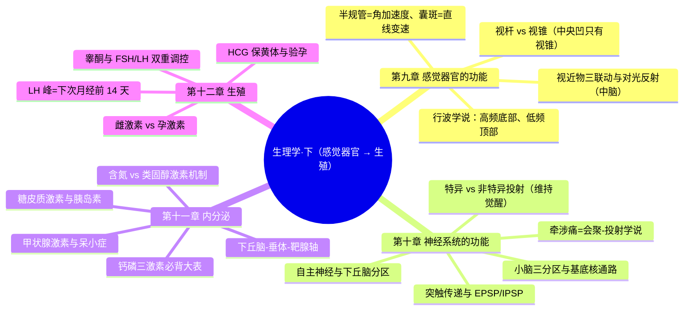
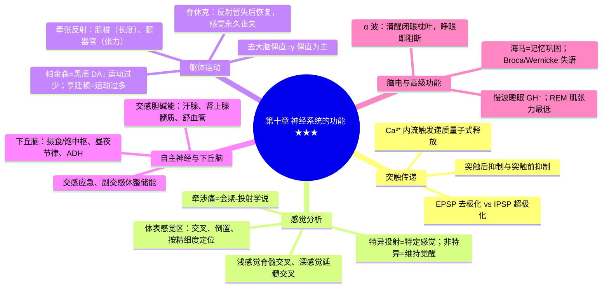
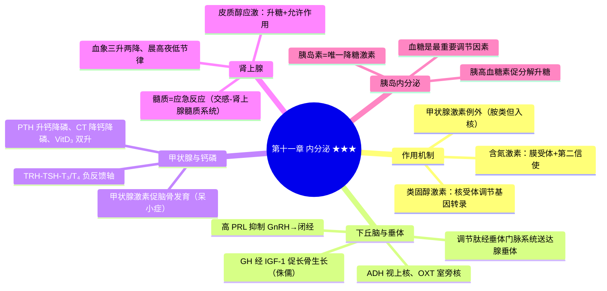

---
tags:
  - 考研306/生理学
科目: 生理学
内容: 感觉器官、神经系统、内分泌、生殖
---
# 生理学·讲义精讲版——02 下（感觉器官 → 生殖）

> 覆盖：感觉器官的功能、神经系统的功能、内分泌、生殖。
> 骨架：每节按【定义/概述】→【机制与原理】→【要点展开】→【对比/鉴别表】→【高频考点提示】展开；★=高频考点，⚠=易错点。
> 用法：神经系统与内分泌是本册分值重心，基底核通路、钙磷三激素、月经周期激素变化务必结合表图精读。

---

## 第九章 感觉器官的功能

### 9.1 感受器的一般生理特性

- 适宜刺激、换能作用、编码功能、适应现象：**快适应**（触觉、嗅觉——"新异刺激探测器"）；**慢适应**（肌梭、颈动脉窦压力感受器、痛觉——持续报告状态）。
- 感受器电位/发生器电位均属**局部电位**（可总和、衰减性）。

### 9.2 视觉 ★★

【机制与原理】视近物调节"三联动"为什么缺一不可？
- 晶状体变凸（睫状肌收缩→悬韧带松弛）增加屈光力——解决"焦点后移"；
- 瞳孔缩小缩小球面像差并增加景深——保证成像清晰；
- 双眼会聚使物像落在两眼视网膜对称点上——避免复视。
- 三者由动眼神经副交感纤维统一协调，故称"视近物三联动"。

【要点展开】
- 瞳孔对光反射：中枢在**中脑**（中脑损伤的重要体征指标）；互感性对光反射（光照一侧、双侧缩瞳）。
- 屈光异常对比：

| | 成像位置 | 矫正 |
|---|---|---|
| 近视 | 视网膜**前**（眼轴过长/屈光过强） | 凹透镜 |
| 远视 | 视网膜**后** | 凸透镜 |
| 散光 | 角膜/晶状体各经线曲率不等 | 柱镜 |
| 老视 | 晶状体**弹性↓**、调节力↓（非屈光不正） | 凸透镜（视近） |

- ★ 两种感光细胞：

| | 视杆细胞 | 视锥细胞 |
|---|---|---|
| 视觉 | 暗视觉（晚近视） | 昼光觉、色觉 |
| 分布 | 周边多、中央凹无 | **中央凹只有视锥细胞** |
| 敏感性 | 高、分辨率低 | 低、分辨率高 |
| 色素 | 视紫红质（视黄醛+视蛋白；维 A 缺乏→夜盲） | 三种视锥色素（红绿蓝） |
| 联系 | 会聚多 | 一对一（中央凹） |

- 色盲：红绿色盲为 **X 连锁隐性遗传**。
- 视网膜信息处理：光感受器 → 双极细胞 → 神经节细胞（感受野）；★光照下感光细胞产生**超极化**感受器电位（少数例外之一）。
- ★ 生理盲点：视盘（视神经乳头）处无感光细胞，双侧视野互补故平时不觉察。
- 视网膜生物电记忆点：★光照下感光细胞（视杆/视锥）发生**超极化**感受器电位——神经系统中少数"光照=超极化"的例外；信息经双极细胞传至神经节细胞，节细胞轴突构成视神经（只有节细胞能产生 AP）。
- 耳蜗生物电：内淋巴电位（+80 mV，血管纹生成，为毛细胞感受器电位的动力）；耳蜗微音器电位——频率、波形与声波一致，潜伏期极短、无疲劳。

### 9.3 听觉与前庭感觉 ★

【机制与原理】中耳为什么能"增压"？耳蜗如何"分频"？
- 鼓膜面积远大于卵圆窗膜 + 听骨链杠杆作用 → 增压效应约 22 倍，弥补空气-内液阻抗差；咽鼓管平衡中耳气压。
- 基底膜**行波学说**：声波沿基底膜传播，**高频→底部共振（振幅最大）、低频→顶部**——基底膜不同位置编码不同频率；耳蜗微音器电位为感受器电位。
- 前庭器官：

| 结构 | 感受器 | 适宜刺激 |
|---|---|---|
| 椭圆囊、球囊 | 囊斑（耳石膜） | 直线变速运动、头空间位置 |
| 半规管 | 壶腹嵴 | **角（旋转）加速度** |

- 听阈与听域：人耳 20–20000 Hz，最敏感 1000–3000 Hz。
- ★ 前庭反应：半规管受旋转刺激 → **眼震颤**（快动相方向与旋转方向一致）+ 植物性功能反应（恶心、呕吐、冷汗——晕车晕船的基础，前庭-植物神经联系）。

### 9.4 其他感觉

- 嗅觉：嗅觉感受器位于嗅上皮，是唯一与大脑皮层**直接相连**、不经过丘脑换元的感觉系统；适应快；适宜刺激为脂溶性气味物质。
- 味觉：基本味觉为酸、咸、苦、甜（鲜味另计）；舌背各部位对不同味敏感度不同；味觉经面神经（舌前 2/3）、舌咽神经（舌后 1/3）、迷走神经（会厌部）传入。
- 皮肤感觉：触-压觉（快适应——Meissner 小体；慢适应——Merkel/Ruffini 小体）、温觉与冷觉、痛觉。
- 本体感觉（深感觉）：肌梭、腱器官与关节感受器——感受肢体位置与运动（与中枢深感觉传导通路联动）。

【高频考点提示】
- ★ 嗅觉不经丘脑直接入脑；味觉三对脑神经（Ⅶ、Ⅸ、Ⅹ）。
- ★ 光照下视杆/视锥细胞超极化——节细胞才产生 AP；耳蜗微音器电位无潜伏期、无疲劳。

【高频考点提示】
- ★ 三联动+对光反射（中脑）；中央凹只有视锥；行波学说底部高频顶部低频；半规管=旋转、囊斑=直线变速。

> **相关知识点**：[[02-生理学-下#10.3 感觉分析功能 ★|感觉分析功能]]

---

## 第十章 神经系统的功能 ★★★

### 10.1 神经元、胶质细胞与突触传递

【要点展开】神经元与神经胶质细胞
- 神经纤维传导特征：生理完整性、绝缘性、双向性、**相对不疲劳性**；有髓纤维呈**跳跃式传导**（速度快、耗能少）。
- 轴浆运输：顺向（快速——递质囊泡、膜蛋白；慢速——细胞骨架）、**逆向**（神经营养因子回收；狂犬病病毒、HSV、破伤风毒素沿此入中枢；辣根过氧化物酶示踪的原理）。
- 胶质细胞：星形胶质细胞（参与血脑屏障、K⁺ 与谷氨酸缓冲）、少突胶质细胞（**中枢**髓鞘）/施万细胞（**周围**髓鞘）、小胶质细胞（免疫吞噬）；胶质细胞不产生动作电位。
- 神经营养因子（NGF、BDNF 等）：经逆向运输支持神经元存活与分化。

【机制与原理】经典化学突触传递全过程
- AP 传至突触前末梢 → **Ca²⁺ 内流** → 递质量子式释放 → 后膜受体 → EPSP/IPSP → 总和达阈电位 → 后神经元兴奋/抑制。Ca²⁺ 是兴奋-分泌耦联的关键（与神经-肌接头一致）。

【对比表】EPSP vs IPSP

| | EPSP | IPSP |
|---|---|---|
| 离子流 | Na⁺ 内流为主（K⁺ 外流↓） | Cl⁻ 内流（或 K⁺ 外流） |
| 膜电位 | 去极化（局部） | 超极化（局部） |
| 意义 | 提高兴奋性 | 降低兴奋性 |

- 突触传递特征：单向、突触延搁（0.3–0.5 ms/突触）、总和、兴奋节律改变、后发放、易疲劳、对内环境与药物敏感。
- ★ 突触后抑制（回返性抑制——Renshaw 细胞负反馈抑制 α 运动神经元；传入侧支性抑制——交互抑制）与突触前抑制（轴-轴突触，减少递质释放）。
- 突触可塑性：习惯化、敏感化、**LTP（长时程增强）——学习记忆的神经基础**。

### 10.2 神经递质与受体 ★

【对比表】外周神经纤维分类与递质

| 纤维 | 递质 | 备注 |
|---|---|---|
| 全部交感/副交感节前纤维 | ACh（N₁） | — |
| 全部副交感节后纤维 | ACh（M） | — |
| 少数交感节后纤维 | ACh（M） | ★支配汗腺、骨骼肌血管舒血管纤维 |
| 多数交感节后纤维 | NE（α/β） | — |
| 运动神经 | ACh（N₂） | 神经-肌接头 |

【对比表】受体与效应（必背大表）

| 受体 | 分布 | 效应 | 阻断剂 |
|---|---|---|---|
| N₁ | 神经节、肾上腺髓质 | 节后神经元兴奋、髓质分泌 | 六烃季铵 |
| N₂ | 骨骼肌终板膜 | 骨骼肌收缩 | 筒箭毒 |
| M | 心肌、平滑肌、腺体 | 心抑制、平滑肌收缩（胃肠/支气管）、腺体分泌、血管舒张 | 阿托品 |
| α₁ | 血管平滑肌为主 | 收缩 | 酚妥拉明 |
| α₂ | 突触前膜 | 抑制 NE 释放（负反馈） | — |
| β₁ | 心脏 | 正性变时变力变传导 | 美托洛尔等 |
| β₂ | 支气管、骨骼肌血管、子宫 | 舒张/舒张/松弛 | — |

- 中枢主要递质：谷氨酸（主要兴奋性）、GABA 与甘氨酸（抑制性）、多巴胺（黑质-纹状体通路——帕金森病核心）、5-HT、NE。

【对比表】中枢主要递质速览

| 递质 | 主要分布/通路 | 功能与临床 |
|---|---|---|
| 谷氨酸 | 广泛，皮层主要兴奋性递质 | 过度释放→兴奋性毒性（脑缺血损伤机制） |
| GABA | 广泛抑制性 | 巴比妥类增强其作用（结合位点） |
| 甘氨酸 | 脊髓抑制性递质 | 破伤风毒素阻断其释放→痉挛 |
| 多巴胺 | 黑质-纹状体、中脑-边缘 | 帕金森病↓；精神分裂症（中脑边缘通路）相关↑ |
| 5-HT | 中脑-延髓中缝核群 | 睡眠、情绪、体温调节 |
| NE | 蓝斑为主 | 觉醒维持、情绪 |

### 10.3 感觉分析功能 ★

【对比表】特异性投射系统 vs 非特异性投射系统（必背大表）

| | 特异性投射系统 | 非特异性投射系统 |
|---|---|---|
| 通路 | 丘脑感觉接替核/联络核 | 脑干网状结构→丘脑髓板内核群 |
| 投射 | 点对点至皮层特定区域 | 弥散投射全皮层 |
| 功能 | 引起**特定感觉**并激发皮层发出冲动 | **维持和改变皮层兴奋状态（觉醒）** |
| 损伤后果 | 特定感觉丧失 | **昏睡/昏迷**（上行激动系统） |
| 药物 | — | 对巴比妥类/乙醚敏感（麻醉机制） |

- 大脑皮层体表感觉区（中央后回）投射特点：**左右交叉、倒置排列、代表区大小与感觉精细度成正比**（拇指、唇最大）。
- 内脏感觉特征：传入纤维少、感受器分布稀、痛阈高——"内脏痛定位不准、易被牵涉痛掩盖"的解剖学解释。
- ★ 痛觉：

| | 快痛 | 慢痛 |
|---|---|---|
| 纤维 | Aδ | C |
| 性质 | 尖锐、定位准 | 钝痛、弥散、伴情绪与内脏反应 |
| 出现时相 | 立即 | 0.5–1 s 后 |

- ★ 牵涉痛：内脏疾病引发特定体表痛/痛觉过敏；机制=**会聚-投射学说**（内脏与体表传入会聚于同一脊髓节段神经元，大脑"误判"来源）。配对：心→左肩臂（胸 1–5）、胆囊→右肩胛、胃/胰→左上腹与肩胛间、肾/输尿管→腰与腹股沟、阑尾炎早期→脐周。
- 痛觉调制：**闸门学说**（脊髓背角胶质区细胞"开关"粗细纤维传入平衡）——抚摸/经皮电刺激（粗纤维）可镇痛；内源性阿片系统（脑啡肽、β-内啡肽）为下行抑制通路的关键。

【对比表】浅感觉 vs 深感觉传导通路（与解剖联动）

| | 浅感觉（痛、温、粗触觉） | 深感觉（位置、运动、精细触觉） |
|---|---|---|
| 一级神经元 | 脊髓节 | 脊髓节 |
| ★交叉平面 | **脊髓内交叉**（白质前连合，上升 1–2 节） | **延髓交叉**（内侧丘系交叉） |
| 上行束 | 脊髓丘脑束 | 薄束/楔束→内侧丘系 |
| 损伤表现 | 损伤平面以下**对侧**痛温觉障碍 | **同侧**深感觉障碍（脊髓后索病变：脊髓痨、亚急性联合变性、共济失调） |

### 10.4 对躯体运动的调节 ★★

【机制与原理】牵张反射如何闭环？
- 肌肉被快速牵拉 → **肌梭**（长度感受器，梭内肌由 γ 运动神经元支配以维持敏感性）初级末梢放电↑ → Ia 传入 → 脊髓 α 运动神经元（单突触）→ 梭外肌收缩对抗牵拉。γ 环路的意义：γ 放电↑ → 梭内肌收紧 → 肌梭敏感性↑ → α 放电↑（γ-α 联合激活保证任何长度下反射有效）。
- **腱器官**（张力感受器，位于腱内， Ib 传入）→ 反牵张反射：张力过大时保护性抑制。
- ★ 去大脑僵直：在中脑上、下丘之间横断脑干 → 易化区活动占优势 → 伸肌紧张性亢进（角弓反张）；**主要属 γ 僵直**（经 γ 环路实现；若切断脊髓背根即消失）。
- ★ 脊休克：脊髓与高位中枢离断后，断面以下反射**暂时消失**（骨骼肌紧张性↓、外周血管扩张、发汗停止、粪尿潴留），数周至数月反射逐渐恢复——证明脊髓反射平时受高位中枢的**易化性**调控；恢复后反射亢进，但感觉与随意运动**永久丧失**。

【对比表】脊髓 vs 脑干 vs 小脑 vs 基底核 vs 大脑皮层在运动调节中的分工

| 结构 | 主要功能 | 损伤表现 |
|---|---|---|
| 脊髓 | 牵张反射、姿势反射的初级中枢 | 脊休克后反射恢复 |
| 脑干网状结构 | 调节肌紧张（易化区/抑制区） | 去大脑僵直 |
| 小脑 | 运动协调、肌紧张、平衡、运动编程 | 共济失调、意向性震颤 |
| 基底核 | 运动计划与运动"开关"（直接/间接通路） | 帕金森病/亨廷顿病 |
| 大脑皮层 | 发起随意运动（锥体系） | 上运动神经元瘫 |

【对比表】小脑三分区（必背）

| 分区 | 组成 | 功能 | 损伤表现 |
|---|---|---|---|
| 前庭小脑 | 绒球小结叶 | 平衡 | 站立不稳 |
| 脊髓小脑 | 蚓部+半球中间部 | 调节进行中运动、**调节肌紧张** | **意向性震颤、共济失调、动作分解、肌张力↓** |
| 皮层小脑 | 半球外侧部 | 随意运动设计与编程 | 计划障碍、运动学习受损 |

【机制与原理】基底核直接/间接通路——帕金森病为什么"运动过少"、亨廷顿病为什么"运动过多"？
- **直接通路**：皮层 → 纹状体（D₁ 兴奋）→ 抑制苍白球内侧部 → 抑制丘脑↓ → 丘脑对皮层兴奋↑ → **促进运动**。
- **间接通路**：皮层 → 纹状体（D₂ 抑制）→ 苍白球外侧部抑制↓ → 丘脑底核兴奋↑ → 兴奋苍白球内侧部 → 抑制丘脑 → **抑制运动**。
- ★ **帕金森病**：黑质多巴胺能神经元变性 → 多巴胺对直接通路（D₁，促进）减弱、对间接通路（D₂，解除抑制）作用减弱 → 间接通路相对占优 → **运动过少、肌张力↑、静止性震颤、运动迟缓**；治疗思路=补充多巴胺（左旋多巴）/抗胆碱能。
- ★ **亨廷顿病（舞蹈病）**：新纹状体 GABA 能（间接通路起始）神经元缺失 → 间接通路活动↓ → **运动过多、肌张力↓**、不自主舞蹈样动作。

【要点展开】
- 大脑皮层运动区（中央前回与运动前区）：交叉支配、倒置（拇指代表区大）、精细。
- 【对比表】锥体系 vs 锥体外系

| | 锥体系 | 锥体外系 |
|---|---|---|
| 组成 | 皮层脊髓束、皮层脑干束 | 经典锥体外通路（纹状体-苍白球、皮质-脑桥-小脑等） |
| 功能 | ★**发起随意运动**、控制精细动作 | 调节肌紧张、协调运动、运动自动化 |
| 损伤 | 上运动神经元瘫（痉挛性瘫+腱反射↑+病理征） | 肌紧张异常、舞蹈/震颤（基底核征） |

- ⚠ 上/下运动神经元损伤的鉴别细节（弛缓 vs 痉挛性瘫、肌萎缩有无、病理反射）归入诊断学，此处记"锥体系损伤=硬瘫"的核心结论。
- 锥体系（发起随意运动、控制精细动作）vs 锥体外系（调节肌紧张、协调与自动化）。

### 10.5 自主神经系统 ★

【对比表】交感 vs 副交感（必背大表）

| | 交感神经 | 副交感神经 |
|---|---|---|
| 节前/节后纤维 | 节前短、节后长 | 节前长、节后短 |
| 分布 | 广泛（几乎全身血管） | 局限（皮肤血管、汗腺、肾上腺髓质无） |
| 整体效应 | **应急反应**：心率↑、血压↑、支气管扩张、瞳孔散大、血糖↑、胃肠抑制、竖毛 | **休整、消化、储能、保护**：心率↓、胃肠运动分泌↑、缩瞳、膀胱收缩排尿 |
| 递质/受体 | 节前 ACh-N₁；节后 NE（α/β） | 节前 ACh-N₁；节后 ACh-M |
| 紧张性意义 | 血压的基础紧张性 | 心迷走紧张（迷走神经损伤→心率↑） |

- ⚠ 特殊记忆：汗腺、肾上腺髓质、骨骼肌舒血管纤维 = 交感**胆碱能**；唾液腺受双重支配且均促分泌（交感→黏稠少量，副交感→稀薄大量）。
- 【对比表】下丘脑功能分区速查

| 下丘脑结构 | 功能 |
|---|---|
| 视前区-下丘脑前部（PO/AH） | 体温调节整合中枢 |
| 外侧区 | ★**摄食中枢** |
| 腹内侧核 | ★**饱中枢**（损伤→肥胖） |
| 视上核、室旁核 | 合成 ADH 与 OXT |
| 视交叉上核 | ★昼夜节律起搏点 |
| 弓状核 | 摄食调节（瘦素靶点）、GnRH 脉冲式释放 |

- ★ 脊髓是内脏活动的初级中枢（排尿、排便、血管张力）；**下丘脑是较高级内脏调节中枢**——体温（PO/AH）、摄食（腹内侧核=饱中枢、外侧区=摄食中枢）、水平衡（ADH/渗透压感受器）、生物节律（视交叉上核）、内分泌（调控垂体）；边缘系统与情绪、记忆（杏仁核——恐惧，海马——陈述性记忆）。

### 10.6 脑电活动与觉醒睡眠 ★

【对比表】EEG 四种波形

| 波 | 频率 | 出现状态 |
|---|---|---|
| α | 8–13 Hz | 清醒、安静、**闭眼**（枕叶；睁眼即消失=**α 阻断**） |
| β | 14–30 Hz | 睁眼、活动、思维（额叶） |
| θ | 4–7 Hz | 困倦、少年 |
| δ | 0.5–3 Hz | 深睡、婴儿、深度麻醉 |

【对比表】慢波睡眠 vs 快眼动睡眠（必考大表）

| | 慢波睡眠（NREM） | 快眼动睡眠（REM/异相睡眠） |
|---|---|---|
| 脑电 | 同步化慢波（δ 明显） | **去同步化、似清醒**（低幅快波） |
| 眼球/肌张力 | 少、肌张力保留 | **眼球快速运动、肌张力最低**（脑活跃而"瘫软"） |
| 激素 | ★**GH 分泌↑** | GH↓；NE、5-HT 能活动↓ |
| 意义 | 促进生长与体力恢复 | 促进学习记忆、精力恢复；做梦 |
| 临床关联 | — | REM 期易发心绞痛、哮喘、猝死 |

- 觉醒维持：**脑干网状上行激动系统**（非特异投射）；睡眠启动相关：下丘脑腹外侧视前区（VLPO）、褪黑素（松果体，昼夜节律）。
- 记忆锚：觉醒=上行激动系统+蓝斑 NE；入睡=VLPO 抑制觉醒系统；昼夜节律=视交叉上核→松果体褪黑素。

### 10.7 脑的高级功能

【要点展开】学习与记忆
- ★ 分类：非陈述性（程序性）记忆——纹状体、小脑参与（技能、习惯）；陈述性记忆——★**海马-内侧颞叶**为短时→长时记忆转化（巩固）的关键部位。
- 长时记忆依赖**LTP（长时程增强）**与基因转录、新蛋白合成；顺行性遗忘（新信息不能存入——海马损伤）与逆行性遗忘（已存记忆丢失）。
- 【对比表】语言中枢与失语（优势半球——右利手者多为**左侧**）

| 中枢 | 部位 | 损伤表现 |
|---|---|---|
| ★Broca 区（运动性语言中枢） | 额下回后部 | **能听懂、不能说**（运动性失语） |
| ★Wernicke 区（听觉性语言中枢） | 颞上回后部 | 能说但**听不懂**、答非所问（感觉性失语） |
| 书写中枢 | 颞中回后部/额中回后部 | 失写 |
| 视觉性语言中枢 | 角回 | 失读 |

- 本能行为与情绪：杏仁核（恐惧、防御）；下丘脑奖赏系统（多巴胺通路——自我刺激实验）；边缘系统统摄情绪-内脏-记忆联系。

【高频考点提示】
- ★ 直接通路促运动、间接通路抑运动；帕金森=黑质 DA↓；亨廷顿=新纹状体 GABA↓。
- ★ 去大脑僵直=γ 僵直为主；牵张反射感受器=肌梭（长度）、腱器官（张力）。
- ★ 慢波睡眠分泌 GH；上行激动系统受损→昏迷。

> **相关知识点**：[[01-症状学#第 10 节 意识障碍|意识障碍（诊断）]] ｜ [[02-体格检查#第 7 节 脊柱、四肢与神经系统检查|神经系统检查（诊断）]] ｜ [[02-神经外科#一、颅内压增高|颅内压增高（外科）]] ｜ [[01-生理学-上#2.2 静息电位与动作电位 ★★|静息电位与动作电位]]

---

## 第十一章 内分泌 ★★★

### 11.1 概述

- 含氮激素（多数，膜受体+第二信使）vs 类固醇激素（**皮质醇、醛固酮、性激素、1,25-(OH)₂D₃**，胞内受体、调节基因转录）。
- 激素作用特征：特异性、信使性、高效性、相互作用（协同、拮抗、**允许作用**——如糖皮质激素允许儿茶酚胺发挥缩血管效应）。
- 下丘脑-垂体-靶腺轴的长/短/超短反馈。

【对比表】含氮激素 vs 类固醇激素作用机制（必背大表）

| | 含氮激素（肽/蛋白/胺类） | 类固醇激素 |
|---|---|---|
| 受体部位 | **细胞膜受体** | 胞质/核内受体 |
| 信号机制 | 第二信使（cAMP、cGMP、IP₃/DG、Ca²⁺）→酶级联（快） | 激素-受体复合物作用于**激素反应元件→调节基因转录**（慢） |
| 起效速度 | 秒-分钟 | 数小时 |
| 代表 | 甲状腺激素（⚠例外：胺类但受体在核内）、胰岛素、GH、PTH、儿茶酚胺 | ★皮质醇、醛固酮、性激素、1,25-(OH)₂D₃ |

【要点展开】下丘脑调节肽与门脉系统
- 下丘脑促垂体区分泌：TRH、GnRH、CRH、GHRH、生长抑素（SS）、PIF（多巴胺）/PRF——经**垂体门脉系统**（正中隆起一级毛细血管丛→门静脉→腺垂体二级毛细血管丛）送达腺垂体。
- 松果体褪黑素：昼夜节律（视交叉上核→颈上神经节→松果体），促睡眠；胸腺肽：T 淋巴细胞分化（神经-内分泌-免疫网络的一环）。

### 11.2 下丘脑与垂体 ★

【机制与原理】为什么 GH 促生长却与甲状腺激素分工不同？
- GH 经 **IGF-1** 介导促**骨骼、肌肉、内脏**生长（促蛋白合成、软骨增殖），但**不促进脑发育**；甲状腺激素是**脑与骨**发育所必需——幼年缺乏→**呆小症**，幼年 GH 缺乏→**侏儒症**。两激素协同，缺一即生长障碍，但智力结局不同（呆小症智力障碍、侏儒智力正常）。

【对比表】腺垂体激素速览

| 激素 | 靶/作用 | 要点 |
|---|---|---|
| GH | 肝 IGF-1 介导促生长；升血糖、促脂解、保蛋白 | 慢波睡眠↑；过多→巨人症/肢端肥大症；受 GHRH（+）与生长抑素（−） |
| PRL | 促泌乳 | ★哺乳期高 PRL 抑制 GnRH → 闭经/不育；受多巴胺抑制（PIF） |
| TSH | 甲状腺 | 受 TRH（+）、T₃/T₄ 负反馈（−） |
| ACTH | 肾上腺皮质束状带 | 应激↑；Addison 病 ACTH↑→色素沉着 |
| FSH/LH | 性腺 | 生精/卵泡发育；LH 峰促排卵 |
| 促黑素 MSH | 黑素细胞 | — |

- GH 分泌调节与异常小结：睡眠（慢波期）、运动、应激、低血糖促进；高血糖抑制；下丘脑 GHRH/SS 双重控制。★幼年过多=巨人症、成年过多=肢端肥大症；幼年缺乏=侏儒症——靶点都在"长骨生长"，智力均正常（与呆小症区分）。

【对比表】神经垂体激素

| | ADH（血管升压素） | OXT（缩宫素） |
|---|---|---|
| 合成核团 | **视上核为主** | **室旁核为主** |
| 靶/效应 | V₂→集合管 AQP2 重吸收水；V₁→缩血管 | 子宫收缩；**射乳反射（正反馈）** |
| 调节 | 渗透压感受器（最敏感）、容量感受器 | 吸吮乳头（正反馈）、分娩扩张 |

### 11.3 甲状腺激素 ★★

【机制与原理】合成与储存的特殊性
- 聚碘（NIS）→ 碘活化（TPO）→ 酪氨酸碘化与耦联（MIT/DIT→T₃/T₄）→ **储存于滤泡腔胶质**（体内唯一"细胞外储存"的激素，量大可维持数周供应）；T₄ 分泌量约为 T₃ 的 10 倍，**T₃ 活性强 3–5 倍**（外周 T₄→T₃ 脱碘转换）。

【要点展开】
- 作用：①**促进生长发育（脑与骨）**——幼年缺乏→呆小症；②产热效应（↑Na⁺-K⁺-ATP 酶、提高 BMR）；③代谢：升血糖（促吸收与糖原分解），促脂肪分解（**胆固醇↓**——甲减时胆固醇↑），生理量促蛋白合成、过量促分解；④提高神经系统兴奋性（甲亢→烦躁失眠）；⑤心血管：β 效应→心率↑、心输出量↑。
- 调节：TRH-TSH-T₃/T₄ 轴；T₃/T₄ 负反馈抑制 TSH（Graves 病时 TRAb 模拟 TSH 刺激甲状腺，TSH 反被抑制）；碘过量**Wolff-Chaikoff 效应**（暂时抑制释放）；自主调节（碘碘泵对过量碘的自身封闭）。
- ⚠ 对比记忆：甲亢时总胆固醇↓（分解↑）而"甲减"时↑；甲状腺激素对婴幼儿脑发育"不可替代"——错过窗口期（呆小症）不可逆。

### 11.4 钙磷调节三激素 ★★（必背大表）

| | PTH | 降钙素 CT | 1,25-(OH)₂D₃ |
|---|---|---|---|
| 来源 | 甲状旁腺主细胞 | 甲状腺滤泡旁细胞（C 细胞） | 肾 1α-羟化酶活化（受 PTH 促进） |
| 血钙 | **↑** | ↓ | ↑ |
| 血磷 | **↓**（促肾排磷） | ↓ | ↑ |
| 骨 | 促溶骨（动员骨钙） | 抑制破骨 | 促骨重建 |
| 肾 | 促远端重吸收 Ca²⁺、排磷；激活 1α-羟化酶 | — | 促近端小管重吸收钙磷 |
| 小肠 | 间接（经 VitD₃ 促吸收） | — | **直接促钙磷吸收** |
| 调节特点 | **最重要、慢性、精细**（低钙即时刺激） | 急性、作用弱（成人意义有限） | 长效 |

【机制与原理】为什么 PTH"升钙降磷"看似矛盾却合理？
- 骨钙动员与肾小管钙重吸收同时会带出磷，若磷潴留将与钙形成异位钙化并抑制骨动员；PTH 特异地**抑制近端小管磷重吸收**（促尿磷排出），保证血钙升高时血磷不升——"升钙必排磷"是协同骨动员的必要配套。
- 缺乏/过剩：VitD₃ 缺乏 → 儿童佝偻病、成人骨软化症；PTH 过多 → 纤维囊性骨炎、肾结石。

### 11.5 肾上腺 ★★

【机制与原理】糖皮质激素为什么是"应激激素"？
- 应激（创伤、失血、剧痛、感染）→ 下丘脑 CRH-ACTH↑ → 皮质醇↑ → 升血糖（糖异生）为脑供能、**允许儿茶酚胺发挥缩血管与强心效应（维持血压）**、抑制免疫炎症（防止过度反应损伤机体）。皮质功能不全者遇应激 → 肾上腺危象（低血压、休克）——这是"允许作用"的临床反证。

【对比表】糖皮质激素（皮质醇）系统效应

| 系统 | 作用 | 临床/考点 |
|---|---|---|
| 糖 | 升血糖（糖异生↑、利用↓） | "类固醇性糖尿病" |
| 蛋白 | 促分解（肌肉消瘦、皮肤变薄） | 库欣体征 |
| 脂肪 | 促分解+**重新分布（向心性肥胖）** | 满月脸、水牛背 |
| 水盐 | 保钠排钾（弱）；**允许作用** | 皮质功能不全→低血压 |
| 血液 | ★**红细胞↑、血小板↑、中性粒细胞↑、淋巴细胞↓、嗜酸性粒细胞↓** | 鉴别库欣与应激 |
| 免疫/炎症 | **四抗：抗炎、抗过敏、抗免疫、抗休克** | 临床用药基础 |
| 分泌节律 | **清晨 6–8 时最高、午夜最低** | 长期给药宜晨间顿服 |
| 调节 | ACTH；负反馈 | 长期外用糖皮质激素→停药要渐减（防皮质萎缩/危象） |

- 盐皮质激素（醛固酮）：球状带；保钠保水排钾（远曲小管+集合管）；受 RAAS 与血 K⁺ 调节。
- ★ 肾上腺髓质（嗜铬细胞，受交感节前胆碱能支配）分泌 E（为主）>NE：**应急反应**（交感-肾上腺髓质系统）vs **应激反应**（ACTH-皮质醇轴）——两套系统常同时被动员但分属不同通路。
- ⚠ 切除肾上腺的动物不能耐受应激；Addison 病：皮质↓+ACTH↑→皮肤色素沉着。

### 11.6 胰岛内分泌 ★★

【对比表】胰岛素 vs 胰高血糖素

| | 胰岛素（B 细胞，占 65%–80%） | 胰高血糖素（A 细胞） |
|---|---|---|
| 总效应 | **唯一降糖激素**，促合成代谢 | 升糖，促分解代谢 |
| 糖 | 促摄取/利用/糖原合成；抑制糖异生 | 促糖原分解与糖异生 |
| 脂肪 | 促合成、抑制脂肪动员 | 促脂肪分解（酮体↑） |
| 蛋白 | 促合成 | 促肝摄取氨基酸并糖异生 |
| 调节 | **血糖↑（最重要）**；氨基酸（精氨酸最强）；GIP（肠促胰素）；迷走（M）促进、交感抑制 | 低血糖最强；交感促进；促胰液素抑制 |
| 受体 | 酪氨酸激酶型受体（RTK） | G 蛋白偶联受体 |

- 生长抑素（D 细胞）旁分泌抑制 A、B 细胞；胰多肽（PP 细胞）。
- 胰岛素缺乏 → 糖尿病：糖异生↑+脂肪动员↑ → 酮症酸中毒（与生化/内科联动记忆）。

【高频考点提示】
- ★ GH 与甲减的"侏儒 vs 呆小"；GH 升血糖。
- ★ PTH 升钙降磷、CT 降钙降磷、VitD₃ 双升——三大激素表格必须默写。
- ★ 糖皮质激素血象五联（三升两降）与晨高夜低节律。
- ★ 胰岛素唯一降糖；GIP 早期相分泌。

> **相关知识点**：[[06-内分泌与代谢#一、Graves 病（弥漫性毒性甲状腺肿）|Graves 病（内科）]] ｜ [[06-内分泌与代谢#五、库欣综合征（Cushing 综合征）|库欣综合征（内科）]] ｜ [[06-内分泌与代谢#十一、糖尿病|糖尿病（内科）]] ｜ [[02-生理学-下#12.2 女性生殖与月经周期 ★★|女性生殖与月经周期]]

---

## 第十二章 生殖

### 12.1 男性生殖

- 睾丸两大功能：生精（曲细精管）+ 内分泌（间质细胞分泌**睾酮**）。
- 精子生成微环境：支持细胞构成"血-睾屏障"并为生精细胞提供营养与 ABP（维持局部高睾酮环境）；生精过程依赖 FSH+睾酮协同、温度低于腹腔（隐睾→不育的机制）。
- 睾酮作用：促男性第二性征与性器官发育、维持生精（经支持细胞）、显著促蛋白合成（同化作用）、促骨骺闭合、促红细胞生成。
- ★ 睾酮分泌的两条线索：每日呈脉冲式分泌（清晨略高）；靶细胞内经 5α-还原酶转为**双氢睾酮（DHT）**作用于外生殖器与前列腺，经芳香化酶转为**雌二醇**发挥部分效应（男性乳腺发育的机制线索）。
- 双重调控：**LH → 间质细胞**（睾酮分泌）；**FSH → 支持细胞**（分泌雄激素结合蛋白 ABP、抑制素 B）；睾酮与抑制素分别对 LH、FSH 负反馈。

### 12.2 女性生殖与月经周期 ★★

【机制与原理】雌激素与孕激素为什么"先建立内膜、再维持内膜"？
- 雌激素促子宫内膜**增生**、宫颈黏液稀薄拉丝长（利于精子穿透）、并对下丘脑产生**正反馈**（只有雌激素达阈值并持续 2 天以上才触发 LH 峰）——保证排卵发生在卵泡成熟后；
- 排卵后黄体分泌孕激素，将内膜转为**分泌期**（容受态）、抑制子宫平滑肌兴奋性（"安胎"）、**升高基础体温 0.3–0.5 ℃**——为着床做准备。未受孕 → 黄体退化 → 激素骤降 → 内膜崩脱出血。

【对比表】雌激素 vs 孕激素

| | 雌激素（雌二醇为主） | 孕激素 |
|---|---|---|
| 来源 | 卵泡颗粒细胞、黄体、胎盘 | 排卵后黄体、妊娠胎盘 |
| 子宫内膜 | 增生期 | 分泌期（在雌激素基础上） |
| 宫颈黏液 | 稀薄、拉丝长 | 黏稠、拉丝短 |
| 基础体温 | 无明显作用 | **升高 0.3–0.5 ℃** |
| 反馈 | 排卵前**正反馈**（LH 峰）；一般负反馈 | 负反馈（抑制 FSH/LH） |
| 其他 | 促第二性征、乳腺导管、对 LH/FSH 调控 | 促乳腺腺泡、抑制子宫收缩 |

【对比表】月经周期四期激素变化（必背）

| 期 | 时间（28 天模型） | 主要激素 | 卵巢/子宫事件 |
|---|---|---|---|
| 月经期 | 1–4 天 | 雌、孕激素**最低** | 内膜螺旋动脉痉挛→剥脱出血 |
| 增生期（卵泡期） | 5–14 天 | FSH↑→雌激素↑ | 卵泡发育、内膜增生 |
| **排卵** | ★LH 峰（雌激素正反馈）后，约下次月经前 **14 天** | LH 峰 | 成熟卵泡破裂排卵 |
| 分泌期（黄体期） | 15–28 天 | 孕激素（+雌激素） | 黄体形成、内膜分泌期、基础体温↑ |

### 12.3 妊娠与哺乳

- 受精 → 着床；★ **HCG（合体滋养层细胞分泌）**：与 LH 同源同受体 → **保黄体（月经黄体→妊娠黄体）** → 孕激素持续维持内膜；孕 8–10 周达峰后下降（胎盘接手分泌孕/雌激素）；**验孕指标**（免疫法测尿 HCG）。
- 【要点展开】受精与着床的生理要点
  - 受精部位：**输卵管壶腹部**；精子在子宫/输卵管内完成**获能**；顶体反应释放顶体酶穿透放射冠与透明带；卵子**皮质反应**阻止多精受精。
  - 着床：受精后约 6–7 天开始，需子宫内膜处于分泌期"容受态"（雌激素+孕激素协同、胚泡与内膜同步发育）。
- 胎盘内分泌汇总：hCG（保黄体）、**hPL**（人胎盘催乳素——促胎儿生长、生乳样作用、抗胰岛素作用）、孕激素（妊娠后期主要由胎盘分泌）、雌激素（妊娠期以**雌三醇 E3** 为主——胎儿肾上腺提供 DHEA+胎盘芳香化，故测血/尿 E3 评估胎儿-胎盘功能）。
- 胎儿-胎盘单位：胎儿提供 DHEA、胎盘芳香化 → 雌激素（雌三醇 E3 为妊娠期主要雌激素）。
- 分娩：胎儿信号+机械扩张 → OXT（正反馈）→ 子宫节律性收缩。
- 射乳反射：吸吮 → OXT（正反馈）→ 乳腺肌上皮收缩；PRL 维持泌乳并抑制 GnRH（哺乳期闭经）。
- 【要点展开】避孕的生理学基础（各环节对应机制）
  - 抑制排卵：复合避孕药（负反馈抑制 FSH/LH 峰）；
  - 阻止受精：安全期（避开排卵前后）、屏障法；
  - 干扰着床：宫内节育器、紧急避孕药（改变内膜容受态）；
  - 杀灭精子/阻断运输：杀精剂、输精管/输卵管结扎。

【高频考点提示】
- ★ LH 峰由雌激素正反馈触发、出现在下次月经前 14 天；基础体温升高=孕激素。
- ★ HCG 保黄体、8–10 周达峰、验孕；哺乳期高 PRL → 闭经。
- ★ FSH 作用于支持细胞/颗粒细胞，LH 作用于间质细胞/黄体细胞。

> **相关知识点**：[[06-内分泌与代谢#九、垂体瘤（PRL 瘤、GH 瘤）|垂体瘤（内科）]] ｜ [[02-生理学-下#11.2 下丘脑与垂体 ★|下丘脑与垂体]]

---

## 附：下册数值与标志速记表（考前必背）

| 项目 | 数值/内容 |
|---|---|
| 嗅觉 | 唯一不经丘脑直接入皮层的感觉 |
| α 波 | 清醒闭眼、枕叶；睁眼消失=α 阻断 |
| 中央凹 | 只有视锥细胞；视盘=生理盲点 |
| 行波 | 高频底部、低频顶部 |
| 半规管/囊斑 | 角加速度/直线变速；眼震颤=前庭反应 |
| 浅/深感觉交叉 | 脊髓内交叉/延髓交叉（内侧丘系） |
| 特异/非特异投射 | 特定感觉/维持觉醒（上行激动系统） |
| 牵涉痛 | 心→左肩臂；胆囊→右肩胛 |
| 脊休克 | 断面下反射暂时消失后恢复，感觉与随意运动永久丧失 |
| Broca/Wernicke | 额下回后部运动性失语/颞上回后部感觉性失语；优势半球在左 |
| 去大脑僵直 | 中脑上下丘之间横断；γ 僵直为主 |
| 小脑三区 | 平衡/肌紧张与协调/运动编程 |
| 帕金森 | 黑质 DA↓→运动过少；亨廷顿=新纹状体 GABA↓→运动过多 |
| 下丘脑 | PO/AH 体温、外侧区摄食、腹内侧核饱、视交叉上环节律 |
| EEG 睡眠 | 慢波=GH↑；REM=去同步化、肌张力最低 |
| 类固醇激素 | 皮质醇、醛固酮、性激素、1,25-(OH)₂D₃（核受体）；含氮激素膜受体+第二信使 |
| 呆小症/侏儒 | 幼年甲减/幼年 GH 缺乏 |
| 钙磷三激素 | PTH 升钙降磷；CT 降钙降磷；VitD₃ 双升 |
| 糖皮质激素节律 | 晨 6–8 最高、午夜最低 |
| 糖皮质激素血象 | RBC、PLT、中性粒↑；淋巴、嗜酸↓ |
| 胰岛素 | 唯一降糖；血糖是最重要调节因素 |
| 排卵 | LH 峰；下次月经前 14 天 |
| HCG | 8–10 周达峰；保黄体；验孕；雌三醇=胎儿-胎盘功能 |
