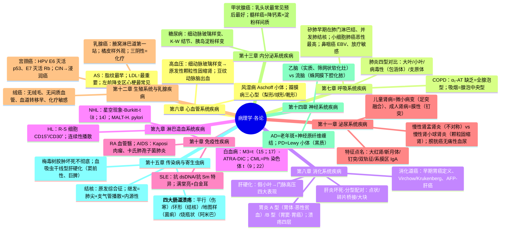
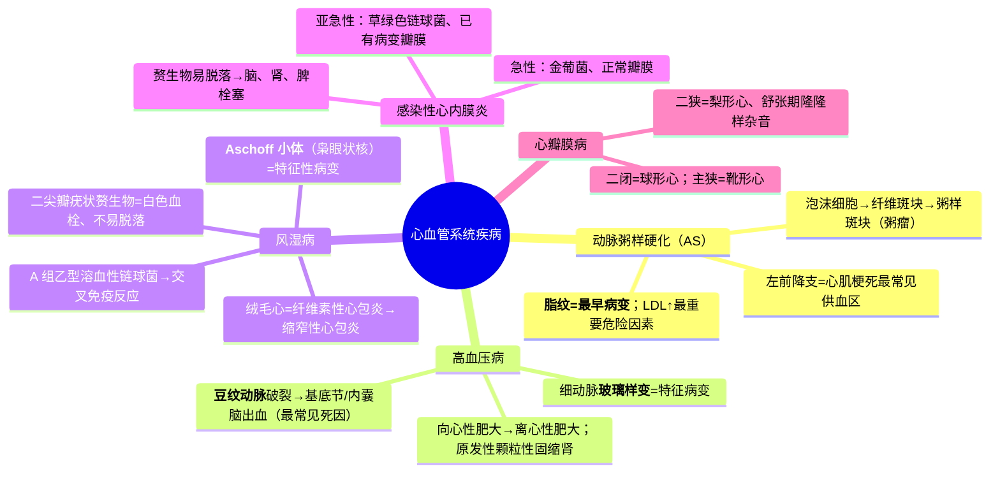
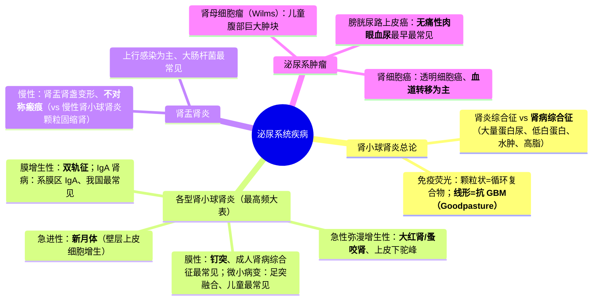
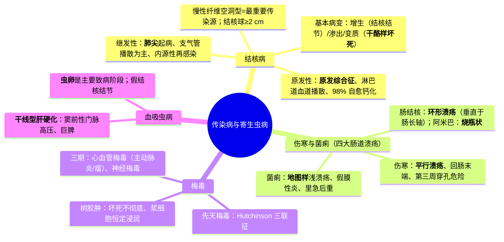

---
tags:
  - 考研306/病理学/各论
科目: 病理学
系统: 各论
内容: 心血管、呼吸、消化、淋巴造血、免疫、泌尿、生殖乳腺、内分泌、神经、传染病
---
# 病理学·讲义精讲版——02 各论（心血管系统 → 传染病与寄生虫病）

> 覆盖：心血管系统、呼吸系统、消化系统、淋巴造血系统、免疫性疾病、泌尿系统、生殖系统与乳腺、内分泌系统、神经系统、传染病与寄生虫病。
> 骨架：每个主要疾病按【定义/概述】→【机制与原理】→【要点展开】→【对比/鉴别表】→【高频考点提示】展开；★=高频考点，⚠=易错点。
> 用法：各论抓"特征性病变+一张鉴别表"；肾小球肾炎大表、各型肝炎坏死类型表、四大肠道溃疡对比表、HL 四亚型表是分值重仓。

---

## 第六章 心血管系统疾病 ★★

### 6.1 动脉粥样硬化（AS）★

【定义/概述】
- AS 是以大中动脉内膜**脂质沉积、纤维化**为特征的动脉疾病；主要累及**主动脉、冠状动脉、脑基底动脉、肾动脉、下肢动脉**。

【机制与原理】脂纹如何一步步演变为粥瘤？
- 危险因素（★LDL↑最重要，加上高血压、吸烟、糖尿病、年龄/性别、家族史）→ 内皮损伤、脂质渗入内膜 → 单核细胞迁入并吞噬氧化 LDL 形成泡沫细胞 → **脂纹（最早病变）** → 平滑肌迁入增生+胶原 → **纤维斑块**（纤维帽）→ 深层脂质与坏死崩解物、胆固醇结晶 → **粥样斑块（粥瘤）** → 复合病变（斑块内出血、破裂→附壁血栓、钙化、动脉瘤）。"内皮损伤-脂质沉积-炎症"三位一体是主线。

【要点展开】
- ★主要器官后果：★冠心病（心肌梗死——左前降支供血区最常见：左室前壁、室间隔前 2/3、心尖）、脑软化与脑出血、肾动脉粥样硬化性固缩肾（凹陷性瘢痕）、下肢间歇跛行/干性坏疽、主动脉瘤（腹主动脉）。

### 6.2 高血压脑出血机制补充

【机制与原理】为什么破裂的是豆纹动脉？
- 豆纹动脉从大脑中动脉几乎**直角分出**，承受主干血流冲击最大，且走行于基底节区——长期高血压使细动脉玻璃样变+微小动脉瘤形成 → 血压骤升时此处最易破裂（"出血动脉"）。血液破入内囊→三偏征；破入脑室→迅速昏迷死亡。

### 6.2 高血压病 ★

【机制与原理】良性高血压的靶器官病变为何呈"梯度"？
- 基本病变在**细小动脉**：功能紊乱期（痉挛）→ 动脉病变期（★细动脉**玻璃样变**=特征；肌型小动脉纤维化）→ 内脏病变期。管腔持续狭窄 → 心（后负荷↑→**向心性肥大**→离心性肥大）、肾（入球细动脉硬化→肾小球纤维化玻璃样变→★**原发性颗粒性固缩肾**）、脑（脑水肿、脑软化、★**脑出血——基底节/内囊，豆纹动脉破裂，最常见死因**）、视网膜（中央动脉硬化）逐级显现。
- ⚠ "向心性→离心性"的转化逻辑：心肌肥大代偿有限，失代偿后心腔扩大、射血分数下降——肥大是"代偿"而非"治愈"。

【对比表】良性 vs 恶性（急进型）高血压

| | 良性 | 恶性 |
|---|---|---|
| 病程 | 慢、多年 | 快、1–2 年 |
| 动脉病变 | 细动脉**玻璃样变** | ★**坏死性细动脉炎（纤维素样坏死）+增生性小动脉硬化（洋葱皮样）** |
| 肾脏 | 原发性颗粒性固缩肾 | 入球动脉坏死→肾衰 |
| 眼底 | 硬化为主 | 出血渗出+视盘水肿 |

### 6.3 风湿病 ★★

【机制与原理】Aschoff 小体怎么来的？
- A 组乙型溶血性链球菌感染 → 交叉免疫反应（抗链球菌抗体与心肌/结缔组织抗原交叉；Ⅲ/Ⅳ型超敏参与）→ 结缔组织**纤维素样坏死** → 组织细胞增生并吞噬坏死物演变为**风湿细胞/Aschoff 细胞**（★枭眼状核/毛虫样核）+ 淋巴细胞 → 构成 **Aschoff 小体（风湿性肉芽肿）**=风湿病的特征性诊断依据。

【要点展开】
- 基本病变三期：**变质渗出期 → 增生期（肉芽肿期，Aschoff 小体）→ 瘢痕期（纤维化）**。
- ★ 心脏三层受累：
  - **风湿性心内膜炎**：★**二尖瓣最常受累**——瓣膜闭锁缘**疣状赘生物**（血小板+纤维蛋白，白色血栓，**不易脱落**）→ 反复发作 → 瓣膜变形 → **风湿性心瓣膜病（二尖瓣狭窄最常见）**；
  - **风湿性心肌炎**：心肌间质小血管旁 Aschoff 小体；
  - **风湿性心外膜炎**：★**纤维素性炎（绒毛心）**——大量渗出可致缩窄性心包炎。
- 心外表现：游走性关节炎（浆液性、不遗留畸形）、环形红斑、**皮下结节（Aschoff 小体）**、小舞蹈病。
- 【要点展开】心包与风湿活动的关系
  - 绒毛心（纤维素性心包炎）：大量纤维素渗出覆盖心包表面呈绒毛状——听诊心包摩擦音；吸收不全 → 纤维性粘连 → **缩窄性心包炎**。
  - 风湿活动期 Aschoff 小体（增生期）提示"活动性"；瘢痕期只见纤维化——形态学可判断病程阶段。

### 6.4 感染性心内膜炎 ★

【对比表】急性 vs 亚急性感染性心内膜炎（必背大表之一）

| | 急性 | 亚急性 |
|---|---|---|
| 病原 | ★**金黄色葡萄球菌**（毒力强） | ★**草绿色链球菌**（少数肠球菌等） |
| 瓣膜基础 | 多为**正常瓣膜** | **已有病变瓣膜**（风湿性、先心病） |
| 病程 | 短、凶险 | 6 周以上 |
| 赘生物 | 大、易脱落→栓塞与脓肿 | 中等、易破碎脱落→**脑、肾、脾栓塞** |
| 特征体征 | 化脓性表现 | Osler 结节、Roth 斑、Janeway 损害 |

### 6.5 心瓣膜病与心肌疾病

【对比表】四大瓣膜病心型与杂音（必背）

| 瓣膜病 | 杂音 | 心型 | 血流动力学链 |
|---|---|---|---|
| ★二尖瓣狭窄 | 舒张期隆隆样 | **梨形心** | 左房↑→肺淤血→右心衰 |
| 二尖瓣关闭不全 | 收缩期吹风样 | **球形心** | 左房左室↑ |
| 主动脉瓣狭窄 | 收缩期喷射性 | **靴形心** | 心绞痛+晕厥+呼吸困难三联 |
| 主动脉瓣关闭不全 | 舒张期叹息样 | — | 脉压↑（水冲脉、毛细血管搏动） |

- 心肌病：扩张型（心腔扩大、收缩功能障碍）、肥厚型（★**室间隔不对称性肥厚、流出道梗阻、舒张障碍**）、限制型；心肌炎：病毒性（**柯萨奇 B 组最常见**；心肌间质淋巴细胞单核细胞浸润+心肌细胞变性坏死）、孤立性（特发性巨细胞性——大量多核巨细胞、预后差）心肌炎。
- 【要点展开】主动脉病变：①**动脉瘤**——AS 性（腹主动脉最常见）、梅毒性（升主动脉）、先天性；②**夹层动脉瘤**（主动脉中膜撕裂、血液进入中膜——高血压为基础，剧痛+血压不对称，凶险）；破裂为大出血死因。

【高频考点提示】
- ★ 脂纹最早；LDL↑ 最重要危险因素；左前降支区心梗最常见。
- ★ Aschoff 小体=枭眼状核；疣状赘生物=白色血栓不脱落（vs 感染性心内膜炎易脱落）。
- ★ 二尖瓣受累最多；梨形心=二狭、球形=二闭、靴形=主狭。
- ★ 动脉瘤三型按病因分：AS 性（腹主动脉）、梅毒性（升主动脉）、夹层（中膜撕裂）；主动脉瓣关闭不全+舒张压↓+脉压↑="水冲脉三联"。

> **相关知识点**：[[02-循环系统#三、高血压|高血压（内科）]] ｜ [[02-循环系统#四、冠状动脉粥样硬化性心脏病|冠心病（内科）]] ｜ [[02-循环系统#五、心脏瓣膜病（四病对比表，必背）|心脏瓣膜病（内科）]] ｜ [[02-循环系统#六、风湿热与 Jones 标准|风湿热（内科）]] ｜ [[02-循环系统#七、感染性心内膜炎（IE）|感染性心内膜炎（内科）]] ｜ [[01-病理学-总论#3.2 血栓形成 ★★|白色血栓·疣状赘生物]]

---

## 第七章 呼吸系统疾病 ★★

### 7.1 慢性阻塞性肺疾病（COPD）★

【对比表】慢支与肺气肿要点

| | 慢性支气管炎 | 肺气肿 |
|---|---|---|
| 诊断/定义 | 咳痰喘每年≥3 个月、连续 2 年 | 终末细支气管远端气腔异常扩大+壁破坏 |
| 形态 | 黏液腺增生肥大、杯状细胞增多、纤毛倒伏脱落、★支气管黏膜上皮**鳞化** | 气腔扩大、肺泡壁断裂融合 |
| 机制 | 感染+吸烟+大气污染 | ★**α₁-抗胰蛋白酶缺乏+弹性蛋白酶↑**（中性粒细胞弹性蛋白酶；吸烟抑制 α₁-AT）；**α₁-AT 缺乏→全腺泡型**；吸烟慢阻肺→**腺泡中央型** |
| 并发 | →肺气肿→肺心病 | 自发性气胸（肺大疱）、肺心病 |

- 支气管哮喘：嗜酸性粒细胞为主的气道慢性炎症+高反应性+可逆气流受限；**Curschmann 螺旋（黏液栓）、Charcot-Leyden 结晶（嗜酸性蛋白晶体）**。
- 支气管扩张症：支气管壁弹性组织与肌层破坏（感染+阻塞循环）→ 囊/柱状扩张；反复咯血（支气管动脉破裂）与大量脓痰（静置分层）；并发肺心病、脑脓肿、杵状指。
- 支气管哮喘机制补充：嗜酸粒细胞碱性蛋白损伤上皮、神经暴露+气道重塑（平滑肌肥厚、基底膜增厚）——"炎症-高反应性-重塑"链条。

### 7.2 肺炎 ★★

【对比表】大叶性 vs 小叶性 vs 病毒性 vs 支原体肺炎（必背大表之二）

| | ★大叶性 | ★小叶性（支气管肺炎） | ★病毒性 | 支原体 |
|---|---|---|---|---|
| 病原 | ★**肺炎链球菌** | 化脓菌**混合感染** | 呼吸道病毒 | 支原体 |
| 人群 | 健康青壮年 | 小儿、年老体弱、长期卧床 | — | 青年 |
| 范围/形态 | **整个大叶**、肺泡内纤维素性炎；肺泡结构不破坏 | ★两肺**下叶背侧**散在灶状实变、**病灶间有正常肺组织**、细支气管为中心化脓 | **间质性肺炎**（肺泡间隔增宽、淋巴单核细胞浸润） | 间质性 |
| 特征 | 四期：充血水肿→红色肝样变（铁锈色痰）→灰色肝样变（大量中性粒、缺氧反而减轻）→溶解消散 | 融合可呈大叶化 | ★**包涵体**（CMV——核内嗜碱"鹰眼"；麻疹——Warthin-Finkeldey 巨细胞；RSV——胞质） | 冷凝集试验+、红霉素 |
| 并发 | ★**肺肉质变（机化性肺炎）**、肺脓肿、脓胸、败血症、感染性休克 | 多、易并发呼衰心衰 | — | — |

- ⚠ 肺肉质变机制：中性粒细胞渗出不足、纤维素不能被蛋白酶溶解 → 肉芽组织机化。

### 7.3 肺尘埃沉着症与慢性肺心病 ★

- ★ 矽肺：游离 **SiO₂** 粉尘 → 矽结节（★同心圆状玻璃样变胶原+巨噬细胞）+ 肺间质弥漫纤维化；**早期病变在肺门淋巴结/肺门周围**；并发症：**肺结核**（最常见）、肺心病。石棉肺：石棉小体、胸膜斑、**间皮瘤**。
- 【要点展开】矽肺病变分期
  - Ⅰ 期：矽结节限于肺门淋巴结与近肺门肺组织，胸膜可累及；
  - Ⅱ 期：结节散布全肺、肺门周围明显，纤维化范围扩大（肺野 1/3 以内为界线的考法见教材）；
  - Ⅲ 期：结节融合成团块（进行性大块纤维化）、肺气肿与胸膜肥厚显著。
  - ⚠ 病程长（接触 10–15 年以上发病）、脱离粉尘后仍可进展——矽肺的特征。
- ★ 慢性肺源性心脏病：病因 **COPD 最常见**；机制：缺氧→肺小动脉痉挛+肌型动脉中膜肥厚+无肌型动脉肌化 → **肺动脉高压** → 右心室肥大扩张 → 右心衰竭（诊断三要素：肺动脉高压+右室肥大+右心衰表现）；并发肺性脑病（缺氧与 CO₂ 潴留）为其死亡原因之一。
- ARDS：肺毛细血管弥漫损伤、透明膜形成。

### 7.4 肺癌 ★★

【对比表】肺癌大体与组织学分型（必背）

| 维度 | 分型 | 特征 |
|---|---|---|
| 大体 | ★中央型 | 主支气管/叶支气管，**鳞癌、小细胞癌**多见 |
| | 周围型 | 段以下，**腺癌**多见 |
| | 弥漫型 | 肺炎样（原细支气管肺泡癌——贴壁生长型） |
| 组织学 | ★鳞状细胞癌 | 吸烟、中央型；**角化珠、细胞间桥** |
| | ★腺癌 | 女性非吸烟者、周围型；腺管/乳头状 |
| | ★小细胞癌 | 神经内分泌来源；★**恶性度最高、生长快转移早、对放化疗敏感**；副肿瘤综合征（异位 ACTH、ADH） |
| | 大细胞癌 | 未分化、高度恶性 |

- 扩散：直接蔓延、淋巴道（肺门→纵隔）、血道（脑、骨、肝、肾上腺）。

### 7.5 鼻咽癌（我国华南高发，必背）

【要点展开】
- ★与 **EB 病毒**高度相关（VCA-IgA、EBV DNA 为筛查指标）；与遗传（HLA 关联）和环境（亚硝胺、咸鱼）有关。
- 好发**鼻咽顶部与侧壁**；组织学以★**低分化鳞状细胞癌、泡状核细胞癌**为主；★**对放疗敏感**。
- ★**早期即经淋巴道转移至颈部淋巴结**——颈部无痛性肿块可为首发表现；血道转移晚。
- ⚠ 鼻咽癌与肺癌的副肿瘤表现可相似（肺性肥大性骨关节病）；EBV 抗体谱（VCA-IgA↑）是筛查线索而非确诊。

【高频考点提示】
- ★ α₁-AT 缺乏=全腺泡型肺气肿；吸烟=腺泡中央型。
- ★ 大叶性=肺炎链球菌+四期+肺肉质变；小叶性=下叶背侧灶状+正常组织间隔；病毒性=间质性+包涵体。
- ★ 矽肺早期在肺门淋巴结；并发肺结核。
- ★ 小细胞癌=恶性最高+副肿瘤综合征；鳞癌=角化珠。

> **相关知识点**：[[01-呼吸系统#一、慢性阻塞性肺疾病（COPD）|COPD（内科）]] ｜ [[01-呼吸系统#四、肺部感染性疾病（肺炎）|肺炎（内科）]] ｜ [[01-呼吸系统#七、原发性支气管肺癌|肺癌（内科）]] ｜ [[01-呼吸系统#九、肺动脉高压与慢性肺源性心脏病|慢性肺心病（内科）]] ｜ [[04-胸部外科#六、肺癌的外科治疗原则|肺癌外科（外科）]] ｜ [[02-病理学-各论#15.1 结核病 ★★★|结核病·矽肺最常见并发症]]

---

## 第八章 消化系统疾病 ★★

### 8.1 慢性胃炎 ★

【对比表】A 型 vs B 型慢性萎缩性胃炎（必考大表）

| | A 型 | B 型 |
|---|---|---|
| 病因 | ★**自身免疫**（抗壁细胞、抗内因子抗体） | ★**幽门螺杆菌**感染 |
| 部位 | **胃体** | **胃窦**为主 |
| 后果 | 内因子↓→B₁₂ 吸收障碍→★**恶性贫血** | 我国常见；★与**胃癌**关系密切 |
| 形态共性 | 固有腺体萎缩、肠上皮化生/假幽门腺化生、淋巴浆细胞浸润 | 同左 |

### 8.2 消化性溃疡 ★★

【机制与原理】胃溃疡为什么好发于小弯、并发穿孔在球部前壁？
- 胃酸+胃蛋白酶的消化作用与黏膜防御失衡（H. pylori、NSAIDs）是根本；**胃溃疡——幽门部小弯侧**（胃酸与黏膜运动冲突、血供差的"分水岭区"）；**十二指肠溃疡——球部前壁**（胃酸高、青年多）——前壁浆膜面无毗邻保护，故易穿孔。
- 大体：单个、圆/椭圆形、<2 cm、边缘整齐如刀切、深达肌层甚至浆膜（穿凿状）、贲门侧潜掘状、幽门侧阶梯状。

【对比表】溃疡四层结构（必背）

| 层（由表及里） | 成分 |
|---|---|
| 渗出层 | 纤维素+中性粒细胞 |
| 坏死层 | 坏死组织 |
| 肉芽组织层 | 新生毛细血管+成纤维细胞 |
| ★瘢痕层 | 增生胶原瘢痕（可见增殖性动脉内膜炎/神经纤维断端球状增生——疼痛与出血的形态基础） |

- ★ 并发症：**出血（最常见）**、穿孔（十二指肠多见）、幽门梗阻（瘢痕/水肿）、**癌变（仅胃溃疡约 <1%；⚠ 十二指肠溃疡几乎不癌变）**。

### 8.3 病毒性肝炎 ★★

【机制与原理】各型坏死为何对应不同病程？
- 肝细胞对病毒损伤的应答形式由"免疫清除强度×肝细胞量"决定：轻度点状坏死=急性普通型（可完全再生）；汇管区周围**碎片状/桥接坏死**=慢性（持续攻击界板+纤维化）；肝细胞大块溶解坏死=重型（再生来不及→肝衰竭）。

【对比表】病毒性肝炎坏死类型与临床分型（必背大表之三）

| 类型 | 坏死特征 | 病程/结局 |
|---|---|---|
| ★急性普通型 | 广泛**细胞水肿（气球样变）+点状坏死**、嗜酸性小体（凋亡） | 多痊愈 |
| ★慢性肝炎（轻中重） | **碎片状坏死**（界板破坏）±**桥接坏死**（汇管区之间/汇管区-中央静脉）+纤维化 | →肝硬化 |
| ★急性重型（暴发性） | ★**大块坏死**（≥2/3 肝细胞溶解）、肝显著缩小（**急性黄色肝萎缩**） | 病死率极高 |
| ★亚急性重型 | 大片坏死+**结节状再生**+纤维组织 | →坏死后性肝硬化 |

- 病毒型肝炎基本病变总述：细胞水肿最常见、嗜酸性变→嗜酸性小体、炎细胞浸润（淋巴/单核）、Kupffer 细胞与小胆管增生。
- 【要点展开】慢性肝炎"炎症-纤维化"的恶性循环：碎屑坏死破坏界板 → 汇管区纤维化 → 小叶结构紊乱 → 桥接纤维化 → 假小叶——把坏死类型和"→肝硬化"的结局连线记忆。

### 8.4 肝硬化 ★★

【机制与原理】假小叶如何形成、门脉高压如何发生？
- 反复肝细胞坏死 → 纤维组织增生形成间隔 → 残存肝细胞结节状再生 → 纤维间隔**分割包绕**肝细胞团形成★**假小叶**（中央静脉偏位/缺如/双个、肝细胞索排列紊乱）——肝硬化形态学标志。假小叶使肝内血管扭曲受压 → **窦后性**门脉高压；肝细胞总量↓+血管分流 → 肝功能不全。

【机制与原理】门脉高压的四大表现为何"各管一段"？
- 假小叶使肝内血管床扭曲受压、门静脉血流阻力↑（窦后性）→ 脾静脉回流受阻（脾大）、胃肠淤血、门-体吻合支开放（侧支循环）——四个表现全部是"同一阻力↑"在不同血管床的投影；腹水则是门脉高压+低蛋白+激素失衡的合流。

【对比表】门脉高压症四大表现（必背）

| 表现 | 机制 | 临床 |
|---|---|---|
| ★脾肿大（脾功能亢进） | 脾静脉回流受阻 | 全血细胞↓ |
| ★腹水（漏出液） | 门脉高压+低白蛋白+醛固酮/ADH↑+淋巴回流障碍 | 移动性浊音 |
| ★**侧支循环开放** | 门体静脉吻合支开放 | ★**食管下段胃底静脉曲张（破裂→上消化道大出血——最凶险死因）**；直肠静脉丛（痔）；脐周静脉丛（海神头） |
| 胃肠淤血 | 门脉回流障碍 | 腹胀、食欲↓ |

- ★ 肝功能不全表现：出血倾向（凝血因子合成↓）、黄疸、★**肝掌/蜘蛛痣（雌激素灭活↓）**、★肝性脑病、低白蛋白血症、男性乳房发育。
- 分类：门脉性（小结节）、坏死后性（大结节/混合——肝炎后）、胆汁性（胆汁淤积、羽毛状变性、小胆管增生）。
- 酒精性肝病三步：脂肪肝 → 酒精性肝炎（★**Mallory 小体**+中性粒细胞浸润+气球样变）→ 酒精性肝硬化。

### 8.5 消化系统常见癌 ★★

【对比表】食管癌/胃癌/大肠癌/肝癌要点（必背大表之四）

| | 好发部位 | 病理 | 特征/标志 |
|---|---|---|---|
| 食管癌 | ★**中段**最多 | 鳞癌为主；早期=原位/黏膜内（钡餐黏膜皱襞改变）；中晚期四型（髓质、蕈伞、溃疡、缩窄） | ★Barrett 食管→腺癌 |
| ★胃癌 | **幽门窦/胃小弯** | 腺癌；★**早期胃癌=限于黏膜及黏膜下层（无论有无转移）**；进展期：息肉型、溃疡型、★**皮革胃（弥漫浸润型）** | 淋巴道→★**左锁骨上 Virchow 淋巴结**；种植→★**Krukenberg 瘤**（印戒细胞） |
| ★大肠癌 | **直肠**最多、乙状结肠次之 | 腺癌；途径：★APC→KRAS→p53 与微卫星不稳定途径 | Dukes 分期（A 壁内/B 穿透肌层无转移/C 淋巴结转移/D 远处）；CEA |
| ★原发性肝癌 | — | 肝细胞癌（**多结节/巨块/弥漫**）与胆管细胞癌 | ★肝细胞癌 **AFP⁺**；与 HBV/黄曲霉毒素/肝硬化相关；★**肝内转移最早（门静脉）**；血道→肺 |

- 急性胰腺炎：胆道疾病+酗酒 → 胰酶自我消化；急性水肿型（轻）与★**急性出血坏死型**（凝固性坏死+脂肪坏死钙皂+出血；并发症：休克、腹膜炎、假性囊肿、脓肿）。
- 阑尾炎：单纯性→蜂窝织炎性→坏疽性；穿孔→腹膜炎、阑尾周围脓肿、门静脉炎→肝脓肿。
- 胃肠道间质瘤（GIST）：★**c-KIT（CD117）⁺** 梭形细胞肿瘤——伊马替尼有效的分子病理范例。
- 胃癌组织学细分（常考）：管状腺癌、乳头状腺癌、**黏液腺癌**（胶样癌）、★**印戒细胞癌**（黏液充盈胞质、核挤向一侧——恶性度高）、未分化癌。
- 【对比表】溃疡性结肠炎 vs Crohn 病（必考大表）

| | 溃疡性结肠炎 | Crohn 病 |
|---|---|---|
| 部位 | ★直肠、乙状结肠为主，连续性、倒灌性上行 | 回肠末端+邻近结肠为主，节段性（跳跃） |
| 大体 | 浅溃疡、假息肉、黏膜连续受累 | ★纵行溃疡+鹅卵石样外观、肠壁增厚 |
| 镜下 | 隐窝脓肿、杯状细胞减少 | ★**非干酪性肉芽肿**、全壁层炎 |
| 并发 | 中毒性巨结肠、癌变 | 梗阻、瘘管、脓肿 |

【对比表】良性溃疡 vs 溃疡型胃癌（大体鉴别，必考）

| | 良性（消化性）溃疡 | 溃疡型胃癌 |
|---|---|---|
| 部位 | 胃小弯幽门部 | 任何部位 |
| 外形 | 圆/椭圆、规整 | 不规整、火山口状 |
| ★边缘 | 整齐如刀切、不隆起 | **隆起外翻、结节状** |
| 底部 | 平坦、清洁 | 凹凸不平、污秽出血 |
| 深度 | 深达肌层（穿凿状） | 较浅但肌层被浸润破坏 |
| 周围黏膜 | ★皱襞向溃疡放射状集中 | 皱襞中断、破坏 |

【对比表】肝硬化三大类型（必背）

| | 门脉性 | 坏死后性 | 胆汁性 |
|---|---|---|---|
| 病因 | 乙肝、酒精、营养不良 | 重症肝炎/药物大面积坏死 | 胆道梗阻/胆管炎（原发者为自身免疫性 PBC） |
| 结节 | ★**小结节**（<3 mm、均匀） | ★大结节/大小混合、大小悬殊 | 无明显结节、绿褐色、纤维分割 |
| 肝功能损害 | 相对轻、门脉高压突出 | 肝功能损害重、黄疸明显 | 胆红素↑、瘙痒；晚期亦可肝硬化 |
| 癌变 | 少 | ★较常见（肝炎-坏死后肝硬化-肝癌链） | 少 |

【高频考点提示】
- ★ A 型=胃体+恶性贫血；B 型=胃窦+H. pylori+胃癌。
- ★ 溃疡四层；出血最常见；十二指肠不癌变。
- ★ 坏死类型-肝炎分型一一对应；急性黄色肝萎缩=大块坏死。
- ★ 侧支循环三支+食管胃底曲张出血=最凶险；肝掌蜘蛛痣=雌激素灭活↓。
- ★ 早期胃癌定义（黏膜+黏膜下层）；AFP=肝细胞癌；Virchow/Krukenberg。
- ★ 溃结=连续+隐窝脓肿+中毒性巨结肠；Crohn=跳跃+肉芽肿+瘘管——两者在内科亦有对应考点。

> **相关知识点**：[[03-消化系统#二、慢性胃炎|慢性胃炎（内科）]] ｜ [[03-消化系统#三、消化性溃疡（PU）|消化性溃疡（内科）]] ｜ [[03-消化系统#八、肝硬化|肝硬化（内科）]] ｜ [[05-腹部外科#四、胃十二指肠溃疡的外科治疗|胃十二指肠溃疡外科（外科）]] ｜ [[04-胸部外科#七、食管癌|食管癌（外科）]] ｜ [[05-腹部外科#九、结直肠癌|结直肠癌（外科）]]

---

## 第九章 淋巴造血系统疾病 ★

### 9.1 霍奇金淋巴瘤（HL）★

【机制与原理】R-S 细胞为何是诊断核心？
- HL 的肿瘤成分只占少数（R-S 细胞及其变异型，多源于生发中心 B 细胞），周围大量非肿瘤性反应细胞（淋巴、浆、嗜酸细胞）——"少数肿瘤细胞+大量炎性背景"是其组织学签名。★**R-S 细胞：双核/多核"镜影细胞"，CD15⁺、CD30⁺**；变异型：陷窝细胞（结节硬化型）、LP 细胞（淋巴细胞为主型）、木乃伊细胞。

【对比表】经典型 HL 四亚型（必考大表之五）

| 亚型 | 特征 | 预后 |
|---|---|---|
| 结节硬化型 | ★**最多见**；年轻女性、纵隔；**陷窝细胞**+胶原纤维分隔结节 | 较好 |
| 淋巴细胞为主型 | 大量淋巴细胞、R-S 少 | ★最好 |
| 混合细胞型 | 较多典型 R-S 细胞、多种炎细胞 | 中等 |
| ★淋巴细胞消减型 | 淋巴细胞少、R-S 多/异型 | ★最差 |
| （另）结节性淋巴细胞为主型 | 单列于经典型之外；LP 细胞（"爆米花"） | 最好 |

- 临床：无痛性颈部/锁骨上淋巴结肿大；B 症状（发热、盗汗、消瘦）；★**蔓延呈连续性、由邻近淋巴结依次播散**（与 NHL 跳跃式对照）；Ann Arbor 分期（Ⅰ–Ⅳ期，膈上下与结外）指导放疗/化疗选择（与内科联动）。
- ⚠ HL 少见结外受累、骨髓受累晚——与 NHL"结外多、骨髓易受累"对照出题。

### 9.2 非霍奇金淋巴瘤（NHL）★

【对比表】常见 NHL 配对大表（必背）

| 类型 | 关键特征 | 标记/遗传学 |
|---|---|---|
| ★弥漫大 B 细胞淋巴瘤 | **成人最常见** | BCL-6；t(14;18) 可见 |
| ★滤泡性淋巴瘤 | 滤泡模式 | ★**t(14;18)→BCL-2 过表达（抗凋亡）** |
| ★Burkitt 淋巴瘤 | ★**"星空"现象**（巨噬细胞散布于肿瘤细胞间）；EBV 相关；颌面部/腹部 | ★**t(8;14)（c-myc）** |
| MALT 淋巴瘤 | 胃黏膜相关淋巴组织；H. pylori 相关 | 抗 H. pylori 治疗可退 |
| 套细胞淋巴瘤 | 套区；中老年 | ★t(11;14) cyclin D1 |
| ★NK/T 细胞淋巴瘤（鼻型） | 鼻腔、坏死明显 | ★EBV |
| 蕈样霉菌病 | 皮肤 T 细胞淋巴瘤 | ★Pautrier 微脓肿 |

### 9.3 白血病 ★

【对比表】白血病要点配对

| 类型 | 关键点 |
|---|---|
| ★**AML-M3（急性早幼粒细胞白血病）** | ★**t(15;17)（PML-RARα）** → **维 A 酸（ATRA）靶向治疗**；★易并发 **DIC** |
| ALL | 儿童最常见 |
| ★CML | ★**Ph 染色体 t(9;22)（BCR-ABL）** → 伊马替尼；脾极度肿大；慢性期→加速期→急变期 |
| CLL | 老年、成熟小淋巴细胞、预后较好 |

- FAB 分型记忆锚：M3=早幼粒（ATRA/DIC）、M6=红白血病、M7=巨核细胞白血病；AML 常见 Auer 小体（原粒细胞胞质红色棒状包涵体）——MDS 与 AML 的鉴别点之一。

- ★ 类白血病反应 vs CML：**NAP 积分（类白血病反应↑、CML↓）**、Ph 染色体、嗜碱粒细胞。
- 【对比表】急性 vs 慢性白血病

| | 急性白血病 | 慢性白血病 |
|---|---|---|
| 细胞分化 | ★**原始细胞为主**、分化停滞早期 | 较成熟细胞为主 |
| 起病/病程 | 急、进展快（数月） | 缓（CML 慢性期→加速期→急变期） |
| 肝脾淋巴结 | 可轻中度肿大 | ★**CML 脾极度肿大** |
| 预后 | 差（化疗/移植） | 相对好（CML 靶向治疗） |

- 骨髓增殖性肿瘤（MPN，了解）：CML（BCR-ABL⁺）、真性红细胞增多症（★JAK2 V617F 突变）、原发性血小板增多症、原发性骨髓纤维化——多能造血干细胞克隆性增殖、脾大、可转化为急性白血病。
- 多发性骨髓瘤：浆细胞肿瘤；★**CRAB**（高钙血症、肾损害、贫血、骨病——穿凿样骨破坏）；M 蛋白/本周蛋白（轻链尿）；继发淀粉样变。
- Langerhans 细胞组织细胞增生症：CD1a⁺、S-100⁺、电镜 Birbeck 颗粒。

【高频考点提示】
- ★ R-S 细胞 CD15⁺/CD30⁺；结节硬化型最多、消减型最差。
- ★ t(14;18)-BCL2、t(8;14)-c-myc、t(11;14)-cyclin D1、t(15;17)-M3-ATRA-DIC、t(9;22)-CML——五对基因易位表必须默写。
- ★ 类白血病反应 NAP↑ 而 CML↓。

> **相关知识点**：[[05-血液系统#七、急性白血病|急性白血病（内科）]] ｜ [[05-血液系统#九、淋巴瘤|淋巴瘤（内科）]] ｜ [[01-病理学-总论#5.5 肿瘤的病因与发病机制 ★★|肿瘤的病因与发病机制·基因易位]]

---

## 第十章 免疫性疾病 ★

### 10.1 系统性红斑狼疮（SLE）★

【机制与原理】狼疮性肾炎为什么"满堂亮"？
- 多种自身抗体与核抗原形成循环免疫复合物，广泛沉积于肾小球系膜、内皮上下各处 → 免疫荧光见 **IgG、IgA、IgM、C3、C1q 全阳性（"满堂亮"）**；大量内皮下沉积→毛细血管壁增厚僵硬（**白金耳样**）；核碎片+抗核抗体→**苏木素小体**。

【要点展开】
- ★抗体：ANA 敏感；★**抗双链 DNA 抗体、抗 Sm 抗体特异**。
- 皮肤：面部蝶形红斑——表皮**基底膜液化变性**+真皮水肿；狼疮细胞/狼疮小体；**狼疮带试验**：真皮-表皮交界处免疫球蛋白与补体带状沉积（皮肤诊断特征）。
- 肾：狼疮性肾炎分 Ⅵ 型，★Ⅳ（弥漫增殖型）最重。
- 心：疣状心内膜炎（**Libman-Sacks**——无菌性疣状赘生物）。

### 10.2 类风湿关节炎与其他

- RA：类风湿因子（IgM 型抗 IgG）；★**滑膜炎+血管翳形成**→软骨骨破坏、关节强直畸形；类风湿结节（中心纤维素样坏死）。
- ★ 自身免疫病共同特征：①体内有高效价特异性自身抗体/自身反应性 T 细胞；②女性多于男性、与 HLAⅡ 类基因关联；③慢性迁延、反复发作；④病变与抗体/T 细胞的靶组织分布一致；⑤易出现多器官重叠（重叠综合征）；⑥免疫抑制治疗有效。
- 干燥综合征：SSA/SSB 抗体；泪腺唾液腺淋巴浸润。系统性硬化（硬皮病）。
- 原发性免疫缺陷：DiGeorge（胸腺发育不全——T 缺陷）、Bruton（X 连锁无丙种球蛋白血症——B 缺陷）、SCID。

### 10.3 AIDS（HIV）★

【机制与原理】HIV 如何瓦解免疫系统？
- HIV gp120 与 **CD4⁺ T 细胞**结合并破坏之（兼感染巨噬细胞、树突细胞）→ CD4⁺/CD8⁺ 倒置 → 细胞免疫崩溃 → 机会性感染与肿瘤丛生。
- ★ 三大病理特征：①**机会性感染**（★卡氏肺孢子菌肺炎最常见；真菌、CMV、弓形虫）；②**恶性肿瘤**（★Kaposi 肉瘤——HHV-8 相关；B 细胞淋巴瘤）；③淋巴结病变：早期反应性增生 → 晚期**荒芜**（滤泡萎缩、淋巴细胞耗竭）。

### 10.4 移植排斥反应

【对比表】三种排斥反应

| | 超急性 | 急性 | 慢性 |
|---|---|---|---|
| 机制 | ★体液（预存抗体+补体） | ★细胞免疫为主（T 细胞）+体液 | 血管慢性损伤 |
| 时间 | 数分钟至数小时 | 数周 | 数月至数年 |
| 形态 | 血管内凝血、梗死 | 间质炎细胞浸润、血管炎 | ★血管内膜纤维化（移植物动脉硬化）→缺血萎缩 |

- GVHD（移植物抗宿主病）：骨髓移植、免疫缺陷者。

【高频考点提示】
- ★ 抗 dsDNA/抗 Sm 特异；满堂亮+白金耳+苏木素小体=狼疮肾炎。
- ★ 血管翳=RA；Kaposi 肉瘤=AIDS+HHV-8；卡氏肺孢子菌肺炎最常见机会感染。

> **相关知识点**：[[07-风湿性疾病与中毒#一、类风湿关节炎（RA）|RA（内科）]] ｜ [[07-风湿性疾病与中毒#二、系统性红斑狼疮（SLE）|SLE（内科）]] ｜ [[04-泌尿系统#三、继发性肾小球疾病|狼疮肾炎（内科）]] ｜ [[02-病理学-各论#11.2 各型肾小球肾炎（必背大表之六——本表是病理学最高频表格之一）|各型肾小球肾炎（含继发性）]]

---

## 第十一章 泌尿系统疾病 ★★★

### 11.1 肾小球肾炎总论

【机制与原理】免疫荧光为什么能区分原位与循环复合物？
- 循环免疫复合物沉积：随机滞留于滤过屏障各处 → **颗粒状荧光**；原位免疫复合物（如抗体直接攻击 GBM 抗原）→ 抗体沿基底膜均匀铺展 → ★**连续线形荧光**（Goodpasture 综合征——肺出血+急进性肾炎）。荧光模式即机制指纹。

【要点展开】
- 临床综合征：★**肾炎综合征**（血尿、蛋白尿、水肿、高血压、氮质血症）；★**肾病综合征**（大量蛋白尿 >3.5 g/d + 低白蛋白血症 <30 g/L + 水肿 + 高脂血症）；急进性肾炎综合征；慢性肾炎综合征。

### 11.2 各型肾小球肾炎（必背大表之六——本表是病理学最高频表格之一）

| 类型 | 光镜 | 电镜/免疫荧光 | 临床 |
|---|---|---|---|
| ★急性弥漫增生性（毛细血管内增生性/链感后） | 内皮+系膜细胞弥漫增生、中性粒细胞浸润；★**大红肾/蚤咬肾** | 上皮下**驼峰状**沉积；C3 颗粒状 | 儿童；急性肾炎综合征；ASO↑、C3 一过性↓；多痊愈 |
| ★急进性（新月体性） | 肾球囊**壁层上皮细胞增生→新月体/环状体** | Ⅰ型——抗 GBM**线形** IgG；Ⅱ型——颗粒状复合物；Ⅲ型——ANCA 相关（少免疫型） | 急进性肾炎综合征，数周-数月肾衰 |
| ★膜性肾病 | 基膜弥漫增厚、★**钉突**形成（PASM） | ★上皮下颗粒状 IgG、C3；无细胞增生 | **成人肾病综合征最常见**；激素疗效差 |
| ★微小病变性（脂性肾病） | 光镜基本正常、近曲小管脂肪变 | ★**足细胞足突融合**；荧光阴性 | ★**儿童肾病综合征最常见**；激素敏感 |
| 膜增生性肾炎（MPGN） | 系膜增生插入、★**双轨征**、分叶状 | Ⅰ型内皮下 C3；Ⅱ型基膜致密层内 | 肾病+肾炎混合综合征；**C3 持续降低** |
| ★IgA 肾病（Berger 病） | 系膜区系膜细胞与基质增生 | ★**系膜区 IgA 沉积（最特征）** | ★**我国最常见肾小球疾病**；上感后 1–2 天肉眼血尿 |
| 局灶节段性肾小球硬化（FSGS） | 局灶节段硬化玻璃样变 | 足细胞损伤、IgM/C3 节段 | 激素抵抗、进展肾衰 |
| 慢性肾炎 | ★肾小球玻璃样变纤维化+残存代偿肥大（**颗粒性固缩肾**） | — | 终末期尿毒症 |

- 继发性：狼疮性肾炎（满堂亮、白金耳）、糖尿病肾病（★结节性肾小球硬化——**K-W 结节**）、乙肝病毒相关性肾炎。
- 急性肾小管坏死（ATN）：★缺血（休克）或毒性（氨基苷类、重金属、血红蛋白/肌红蛋白管型）→ 肾小管上皮凝固/溶解坏死、基底膜断裂——急性肾衰的常见病理基础（与肾前性氮质血症的鉴别靠钠排泄分数等临床指标）。

### 11.3 肾盂肾炎与泌尿系肿瘤 ★

【机制与原理】上行性感染为什么是主要途径？
- 女性短尿道+器械操作+尿路梗阻/返流 → ★**大肠杆菌**（肠道常驻菌）自尿道上行 → 肾盂与肾间质化脓；血源性则多为金葡菌。慢性者因反复感染与返流 → 肾盂肾盏变形、间质纤维化（区别于肾小球炎的病变主区）。

【对比表】急慢性肾盂肾炎

| | 急性 | 慢性 |
|---|---|---|
| 形态 | 肾间质化脓、脓肿形成、肾盂黏膜充血脓性 | ★肾盂肾盏**变形**、间质纤维化+淋巴单核浸润、肾小管萎缩含胶样管型（**甲状腺样变**） |
| 临床 | 发热、腰痛、脓尿、菌尿 | 反复发作→高血压、慢性肾衰 |

【对比表】慢性肾盂肾炎 vs 慢性肾小球肾炎（易混辨析，必考）

| | 慢性肾盂肾炎 | 慢性肾小球肾炎 |
|---|---|---|
| 本质 | ★**间质+肾盂的化脓性/慢性炎**（细菌） | ★**肾小球增生免疫性病变** |
| 大体 | 肾体积缩小、★不对称、瘢痕凹陷、肾盂肾盏变形 | 颗粒性固缩肾、**对称**、皮髓质分界不清 |
| 镜下 | 间质纤维化、甲状腺样变肾小管 | 肾小球玻璃样变纤维化、残存小球代偿肥大 |
| 临床 | 反复尿路感染史、菌尿 | 蛋白尿血尿史、无菌尿 |

【对比表】泌尿系三大肿瘤

| 肿瘤 | 特征 | 转移/表现 |
|---|---|---|
| ★肾细胞癌 | ★透明细胞癌最常见（VHL 基因）；肾区、血尿 | ★**血道转移为主（肾静脉→肺）**；三联征：血尿、腰痛、肿块；副肿瘤表现（红细胞增多症、高血压——EPO/肾素样物质） |
| ★肾母细胞瘤（Wilms） | 儿童；WT1；胚胎性组织（原始肾小管/肾小球样+间叶分化——横纹肌、软骨） | 儿童腹部巨大肿块 |
| ★膀胱尿路上皮癌 | 好发**三角区与侧壁**；分级 G1–G3 | ★**无痛性肉眼血尿**为最早最常见表现；易复发 |

【高频考点提示】
- ★ 儿童肾病综合征=微小病变（足突融合、激素敏感）；成人=膜性（钉突）。
- ★ 线形荧光=抗 GBM；颗粒=复合物；系膜 IgA=我国最常见。
- ★ 大红肾/蚤咬肾、新月体、双轨征、K-W 结节四大形态特征点名。
- ★ 肾癌血道转移为主、膀胱癌无痛性血尿。

> **相关知识点**：[[04-泌尿系统#一、肾小球疾病总论|肾小球疾病总论（内科）]] ｜ [[04-泌尿系统#四、尿路感染（UTI）|尿路感染（内科）]] ｜ [[06-泌尿外科#四、泌尿系肿瘤|泌尿系肿瘤（外科）]] ｜ [[02-病理学-各论#10.1 系统性红斑狼疮（SLE）★|SLE·狼疮肾炎满堂亮]] ｜ [[02-病理学-各论#13.3 糖尿病 ★|糖尿病·K-W 结节]]

---

## 第十二章 生殖系统与乳腺疾病 ★

### 12.1 子宫颈疾病 ★

【机制与原理】HPV 如何把鳞状上皮推向癌变？
- ★HPV16/18 的 **E6 蛋白灭活 p53、E7 蛋白灭活 Rb**——两个"细胞周期闸门"同时失效 → 宫颈移行带鳞状上皮异型增生 → CIN Ⅰ（轻度）→ Ⅱ → Ⅲ（含原位癌）→ 浸润癌（**鳞状细胞癌为主**）。
- 大体四型：糜烂型、内生浸润型（宫颈肥硬如桶）、外生菜花型、溃疡型。
- ★扩散：直接蔓延（阴道壁、宫旁、膀胱/直肠——膀胱阴道瘘）+★淋巴道为**主要**转移途径（宫旁→闭孔→髂内髂外→髂总→腹主动脉旁）；筛查：**TCT 细胞学+HPV 检测**；浸润深度 ≤5 mm=早期浸润癌（镜下早浸）；⚠ 筛查的意义在于阻断"CIN→浸润癌"的漫长阶梯（数年窗口期可干预）。

### 12.2 滋养层细胞疾病 ★★

【对比表】葡萄胎 vs 侵蚀性葡萄胎 vs 绒毛膜癌（必考大表之七）

| | 葡萄胎 | 侵蚀性葡萄胎 | ★绒毛膜癌 |
|---|---|---|---|
| 绒毛结构 | 水泡状绒毛（间质水肿、血管消失、滋养细胞增生） | ★**水泡状绒毛侵入子宫肌层** | ★**无绒毛、无间质血管**，异型滋养细胞成片+明显出血坏死 |
| 性质 | 良性（完全性：无胎儿成分、父源染色体；部分性：有胎儿成分） | 交界/低度恶性 | ★高度恶性 |
| 转移 | 无 | 少数远处转移 | ★**血道转移早**（肺——咯血、阴道结节） |
| 标志 | ★hCG 极度升高、子宫>孕周 | hCG 持续 | hCG 极高 |
| 预后 | 清宫后随访（完全性恶变率 10%–20%） | 化疗效果好 | ★**对化疗极敏感**（预后反而较好） |

- ⚠ 鉴别核心：**有无绒毛**——侵蚀性葡萄胎有、绒癌无。

### 12.3 乳腺癌 ★★

【机制与原理】为什么乳腺癌首选淋巴道转移至腋窝？
- 乳腺大部分淋巴回流至**同侧腋窝淋巴结（第一站）**；癌细胞顺流先入此处。大体：灰白质硬、边界不清、★"蟹足状"浸润；累及 Cooper 韧带→皮肤凹陷，阻塞真皮淋巴管→橘皮样外观。

【要点展开】
- 组织学：非浸润性——★**导管原位癌（DCIS）**、小叶原位癌；浸润性——★浸润性导管癌（无特殊型，最常见）、浸润性小叶癌（★单行线排列）。
- 良性乳腺病变对照：纤维腺瘤（年轻女性、境界清、活动好）；乳腺纤维囊性病（癌前背景之一）；导管内乳头状瘤（乳头血性溢液）。
- ★ 转移：淋巴道——同侧腋窝（第一站）→锁骨下/锁骨上；血道——肺、骨（**溶骨性**）、肝、脑；⚠ 与前列腺癌成骨转移对照记忆（乳腺=溶骨、前列腺=成骨）。
- ★ **Paget 病（乳头湿疹样癌）**：表皮内 Paget 细胞，乳头乳晕湿疹样外观。
- ★ 分子分型与治疗：ER/PR⁺→内分泌治疗（他莫昔芬）；HER2 过表达→曲妥珠单抗；★三阴性（ER−/PR−/HER2−）→化疗。危险因素：雌激素持续刺激、★BRCA1/2 突变。
- 前列腺疾病：前列腺增生（**移行区/中央区**、结节状、排尿困难）vs ★前列腺癌（**外周区**、腺癌、Gleason 评分、★PSA↑、骨转移**成骨性**）。
- 卵巢肿瘤：浆液性/黏液性囊腺瘤与交界性/癌；畸胎瘤（成熟囊性畸胎瘤/皮样囊肿最常见；未成熟畸胎瘤恶性）；颗粒细胞瘤（雌激素）；卵黄囊瘤（★Schiller-Duval 小体、AFP↑）；无性细胞瘤（同精原细胞瘤）。

【对比表】卵巢常见肿瘤分类（必背）

| 来源 | 良性/交界 | 恶性 | 特征 |
|---|---|---|---|
| ★表面上皮（最常见来源） | 浆液性囊腺瘤、黏液性囊腺瘤 | ★浆液性囊腺癌（最常见卵巢恶性）、黏液性囊腺癌 | 浆液性=可见**砂粒体**；黏液性=多房大囊 |
| 生殖细胞 | ★成熟畸胎瘤（皮样囊肿——最常见卵巢良性肿瘤） | 未成熟畸胎瘤、★无性细胞瘤、卵黄囊瘤、绒癌 | 卵黄囊瘤=Schiller-Duval 小体+AFP↑ |
| 性索间质 | 纤维瘤（★Meigs 综合征——纤维瘤+胸腹水） | ★颗粒细胞瘤（分泌雌激素）、支持-间质细胞瘤（雄激素） | "功能性肿瘤" |
| 转移性 | — | ★Krukenberg 瘤（胃等印戒细胞癌种植） | 双侧多见 |

- 睾丸肿瘤：★精原细胞瘤（最常见睾丸生殖细胞肿瘤、对**放疗**敏感、PLAP/CD117⁺）；胚胎性癌（高度恶性、AFP/hCG 可阳性）；卵黄囊瘤（婴幼儿 AFP 显著↑）；睾丸淋巴瘤（老年）。

【高频考点提示】
- ★ E6-p53、E7-Rb；CIN 分级；淋巴道为主要转移途径。
- ★ 绒癌三无（无绒毛、无间质血管、出血坏死）+血道转移+化疗敏感。
- ★ 浸润性导管癌最常见；Paget 病；三阴性=化疗；前列腺癌成骨转移+PSA。

> **相关知识点**：[[03-颈部与乳腺外科#九、乳腺癌（本模块核心）|乳腺癌（外科）]] ｜ [[01-病理学-总论#5.2 肿瘤的扩散 ★★|肿瘤的扩散·转移途径]] ｜ [[01-病理学-总论#5.4 癌前病变、异型增生与原位癌 ★★|癌前病变与原位癌·CIN/DCIS]]

---

## 第十三章 内分泌系统疾病 ★

### 13.1 垂体疾病

- 垂体腺瘤：★**PRL 瘤最常见**（闭经泌乳）；GH 瘤（巨人症/肢端肥大症）；ACTH 瘤（Cushing 病）。
- 【要点展开】弥漫性非毒性（单纯性）甲状腺肿三期
  - 增生期：滤泡上皮活跃增生、胶质少；
  - ★胶质储积期：滤泡扩大、大量胶质储积（"胶性甲状腺肿"）；
  - 结节期：不对称结节状增大、出血囊性变钙化——结节性甲状腺肿。
  - 机制：缺碘→TH↓→TSH↑→滤泡上皮持续增生（代偿性，一般不伴甲亢）；⚠ 应与结节性毒性甲状腺肿（伴甲亢）区分。
- ★ **Sheehan 综合征**：产后大出血 → 垂体缺血坏死 → 席汉功能全低。

【要点展开】肾上腺病变与 MEN（了解+高频配对）
- ★Cushing 综合征按因分类：垂体 ACTH 瘤（**Cushing 病**——最多见）、异位 ACTH（★小细胞肺癌）、肾上腺皮质腺瘤/癌、医源性糖皮质激素；鉴别依赖血 ACTH 水平与地塞米松抑制试验。
- ★Addison 病（原发性慢性皮质功能减退）：自身免疫性肾上腺炎、结核（历史主要病因）；★皮肤色素沉着（ACTH↑，POMC 衍生片段具 MSH 样活性）。
- ★嗜铬细胞瘤：肾上腺髓质嗜铬细胞；"**10% 肿瘤**"（约 10% 双侧、10% 肾上腺外、10% 恶性、10% 家族性）；阵发性高血压、血/尿儿茶酚胺与甲氧基肾上腺素↑；MEN2 相关。
- MEN 综合征：MEN1（垂体+甲状旁腺+胰腺内分泌肿瘤）；MEN2A（甲状腺髓样癌+嗜铬细胞瘤+甲状旁腺增生）；MEN2B（+黏膜神经瘤）——★RET 基因突变。

### 13.2 甲状腺疾病 ★★

【对比表】甲状腺炎与 Graves 病

| | Graves 病（弥漫毒性） | 亚急性甲状腺炎 | 桥本甲状腺炎 |
|---|---|---|---|
| 机制 | TSH 受体抗体（TSAb）刺激 | ★病毒感染后肉芽肿性 | ★自身免疫（抗 TPO/TG 抗体） |
| 形态 | ★滤泡增生、柱状上皮、胶质稀薄、**边缘吸收空泡**；淋巴组织增生 | ★巨细胞+肉芽肿、疼痛 | ★大量淋巴细胞+生发中心+**Askanazy 细胞（嗜酸）**、纤维化 |
| 功能 | 甲亢+浸润性突眼+胫前黏液水肿 | 一过性甲亢→甲减 | ★甲减 |

【对比表】甲状腺癌四型（必考大表之八）

| 类型 | 占比/人群 | 形态特征 | 转移/预后 |
|---|---|---|---|
| ★乳头状癌 | ★**最常见** | ★乳头状结构+**砂粒体**+**毛玻璃核（核沟、核内包涵体）** | ★**淋巴道转移为主、预后最好** |
| 滤泡癌 | 中年 | 包膜/血管浸润（与腺瘤区别关键） | 血道转移 |
| ★髓样癌 | — | ★**滤泡旁 C 细胞来源、分泌降钙素、间质淀粉样变**；MEN2 相关 | — |
| 未分化（间变性）癌 | 老年 | 高度恶性、异型显著 | ★**预后最差** |

### 13.3 糖尿病 ★

【机制与原理】并发症为什么围绕"小血管"展开？
- 长期高血糖→糖基化终产物+渗透性损伤→★**细动脉玻璃样变（特异性）**与**动脉粥样硬化提前加重**；微血管病集中表现为肾（★**结节性肾小球硬化——K-W 结节**、弥漫性、渗出性）、视网膜（微血管瘤、出血渗出）、神经与皮肤。
- 1 型：胰岛炎、B 细胞减少；2 型：★**胰岛淀粉样变**。

【高频考点提示】
- ★ PRL 瘤最常见；Sheehan=产后大出血。
- ★ 乳头状癌=砂粒体+毛玻璃核+淋巴道转移+预后最好；髓样癌=降钙素+淀粉样间质。
- ★ 糖尿病细动脉玻璃样变与 K-W 结节。
- ★ 桥本=淋巴生发中心+Askanazy 细胞+甲减；亚急性炎=疼痛性巨细胞肉芽肿——两类甲状腺炎镜下别混。

> **相关知识点**：[[06-内分泌与代谢#一、Graves 病（弥漫性毒性甲状腺肿）|Graves 病（内科）]] ｜ [[06-内分泌与代谢#十一、糖尿病|糖尿病（内科）]] ｜ [[03-颈部与乳腺外科#二、甲状腺功能亢进的外科治疗|甲亢外科（外科）]] ｜ [[06-内分泌与代谢#五、库欣综合征（Cushing 综合征）|库欣综合征（内科）]] ｜ [[01-病理学-总论#1.2 可逆性损伤（变性）★|淀粉样变·髓样癌间质]]

---

## 第十四章 神经系统疾病 ★

### 14.1 流行性乙型脑炎 vs 流行性脑脊髓膜炎（必背对比）

| | ★流行性乙型脑炎 | ★流行性脑脊髓膜炎 |
|---|---|---|
| 病原/途径 | 乙脑病毒，★**蚊虫叮咬、嗜神经** | ★**脑膜炎奈瑟菌，呼吸道传播** |
| 病变部位 | 实质：大脑皮层、基底核、视丘最重 | 膜：★蛛网膜下腔脓性渗出 |
| 镜下特征 | ★神经细胞变性坏死（**卫星现象**——少突胶质细胞围绕；**噬神经现象**——小胶质细胞吞噬）、★**筛网状软化灶（特征性）**、血管套（淋巴细胞袖套）、小胶质结节 | 中性粒细胞为主的化脓性脑膜炎；脑膜刺激征 |
| 临床/并发症 | 意识障碍、抽搐、呼吸衰竭 | 皮肤瘀点瘀斑（败血症）；★暴发型=**Waterhouse-Friderichsen 综合征（双侧肾上腺出血）** |

### 14.2 变性与退行性疾病 ★

【对比表】AD vs 帕金森病

| | ★阿尔茨海默病（AD） | ★帕金森病（PD） |
|---|---|---|
| 部位 | 海马、皮层（胆碱能神经元——Meynert 基底核丢失） | ★黑质多巴胺能神经元丢失 |
| 标志病变 | ★**老年斑（β-淀粉样蛋白 Aβ）**+★**神经原纤维缠结（Tau 蛋白）**、颗粒空泡变性、Hirano 小体 | ★**Lewy 小体（α-突触核蛋白）** |
| 临床 | 痴呆 | 静止性震颤、肌张力增高、运动迟缓 |

- 朊蛋白病：PrPᢩᶜ、海绵样空泡（CJD）。
- ★ 颅内高压与脑疝：占位/水肿 → ①小脑幕切迹疝（颞叶海马钩回疝——压迫动眼神经：同侧瞳孔散大、对侧偏瘫）；②★枕骨大孔疝（小脑扁桃体疝——直接压迫延髓生命中枢，呼吸骤停最危险）。
- 脑水肿类型：血管源性（血管通透性↑——肿瘤/梗死周围）、细胞毒性（细胞肿胀——缺氧）、间质性（脑积水时脑脊液渗入脑室旁白质）；脑积水=脑脊液循环受阻（交通性/非交通性）。
- 其他感染性神经病变：狂犬病——★**Negri 小体**（海马、小脑 Purkinje 细胞胞质内嗜酸性包涵体）；HIV 脑病（小胶质结节、多核巨细胞）；进行性多灶性白质脑病（JC 病毒——少突胶质细胞包涵体）。

### 14.3 中枢神经系统常见肿瘤

【对比表】常见 CNS 肿瘤特征

| 肿瘤 | 部位/人群 | 特征 |
|---|---|---|
| 弥漫性星形细胞瘤→★胶质母细胞瘤（GBM） | 成人；恶性度最高之一 | ★坏死+**血管内皮增生（肾小球样）** |
| 少突胶质细胞瘤 | 成人 | ★钙化、**核周空晕（鸡爪样/蜂窝状）** |
| 室管膜瘤 | ★第四脑室、儿童 | ★菊形团/血管周围**假菊形团** |
| 髓母细胞瘤 | ★小脑、儿童，高度恶性 | ★Homer-Wright 菊形团 |
| 脑膜瘤 | 良性 | ★砂粒体、压迫而非浸润 |
| ★神经鞘瘤 | 听神经（前庭神经）等 | Antoni A/B、**Verocay 小体** |
| 转移瘤 | — | 多发、边界清（肺癌最常见来源） |

【高频考点提示】
- ★ 乙脑=实质（筛网状软化灶、噬神经）vs 流脑=蛛网膜下腔化脓（瘀斑、W-F 综合征）。
- ★ AD=Aβ 斑+Tau 缠结；PD=Lewy 小体+黑质。
- ★ GBM=坏死+血管内皮增生；髓母细胞瘤=儿童小脑。

> **相关知识点**：[[03-实验室检查#第 14 节 脑脊液检查|脑脊液检查（诊断）]] ｜ [[02-神经外科#二、脑疝|脑疝（外科）]] ｜ [[01-病理学-总论#1.3 细胞死亡：坏死 ★★|液化性坏死（脑）]]

---

## 第十五章 传染病与寄生虫病 ★★★

### 15.1 结核病 ★★★

【机制与原理】结核的三种基本病变由什么决定？
- 感染菌量、毒力与机体免疫力（Th1/细胞免疫）三方博弈：免疫强、菌少 → **增生为主（结核结节）**；过敏反应强、菌多 → **渗出为主（浆液性/纤维素性炎）**；菌量极大、免疫力极低 → **变质为主（干酪样坏死）**。三者可互相转化——这解释了继发性结核"新旧病变并存"。
- 转归：吸收消散、纤维化钙化 vs 浸润进展、溶解播散（支气管、淋巴、血道——粟粒性结核）。

【对比表】原发性 vs 继发性肺结核（必考大表之九）

| | ★原发性 | ★继发性 |
|---|---|---|
| 人群/感染 | 儿童、首次感染 | 成人、再次感染（★**内源性为主**） |
| 起始部位 | 上叶下部/下叶上部近胸膜处 | **肺尖**（锁骨下） |
| ★标志 | **原发综合征**=肺原发灶+结核性淋巴管炎+肺门淋巴结结核 | 新旧病变并存、以增生与坏死交替 |
| 播散 | ★淋巴道、血道（**粟粒性**）、支气管 | ★**支气管播散为主**、极少血道 |
| 结局 | ★**98% 自愈（钙化）** | 病程长、需治疗 |

【对比表】继发性肺结核各型（必背）

| 类型 | 要点 |
|---|---|
| 局灶型 | 早期、可自愈 |
| ★浸润型 | **最常见的活动性类型**；锁骨下浸润、干酪样坏死 |
| ★慢性纤维空洞型 | ★**厚壁空洞三层**（干酪坏死层+结核性肉芽+纤维层）、垂柳状纤维化——**最重要传染源** |
| 干酪样肺炎 | 急重（"奔马痨"） |
| ★结核球 | ≥2 cm 纤维包裹的干酪样坏死灶（手术指征评估对象） |
| 结核性胸膜炎 | 渗出性/增生性 |

- 肺外结核：★肠结核（**回盲部**；溃疡型——★**环形溃疡与肠长轴垂直**；增生型——息肉样肿块）、结核性脑膜炎（★**脑底部**、灰黄胶冻状渗出）、肾结核（干酪坏死空洞、输尿管膀胱蔓延）、骨结核（★**脊柱结核——椎体破坏、冷脓肿、驼背**）、颈淋巴结结核（瘰疬）。
- ★ 结核菌素试验（PPD）：检测Ⅳ型超敏反应——强阳性提示体内有活动性结核可能；阴性不能完全除外（原发感染 4–8 周内未致敏、免疫低下如 AIDS）；卡介苗（减毒牛型结核杆菌）接种后 PPD 可阳性。

### 15.2 伤寒与菌痢（与肠结核、阿米巴并考）★★

【对比表】四大肠道溃疡鉴别（必考大表之十）

| 疾病 | 病原/机制 | 好发部位 | ★溃疡形态 | 临床特征 |
|---|---|---|---|---|
| ★肠伤寒 | 伤寒沙门菌——**全身单核巨噬细胞系统增生**（伤寒细胞→伤寒小结） | **回肠末端**淋巴组织 | ★**溃疡长轴与肠长轴平行**（椭圆形）；四期：髓样肿胀→坏死→溃疡→愈合 | 持续高热、相对缓脉、玫瑰疹、肥达反应；★**肠出血、肠穿孔（第三周最危险）** |
| ★肠结核 | 结核分枝杆菌（饮含菌牛奶/吞咽含菌痰） | ★**回盲部** | ★**环形溃疡（与肠长轴垂直）**——环形收缩→肠腔狭窄 | 增生型可扪及肿块 |
| ★细菌性痢疾 | 痢疾杆菌——★**纤维素性炎（假膜性）** | ★直肠、乙状结肠 | ★浅表、"**地图样**"溃疡 | 里急后重、脓血便；中毒性菌痢（儿童、肠道病变轻而毒血症重） |
| ★肠阿米巴病 | 溶组织内阿米巴**滋养体** | ★**盲肠、升结肠** | ★**烧瓶状溃疡（口小底大）**，溃疡间黏膜正常 | 暗红色果酱样便、腥臭、里急后重轻；★并发症=**阿米巴肝脓肿（最常见，肝右叶，"巧克力酱"脓液）** |

### 15.3 梅毒 ★

【机制与原理】树胶肿为什么"似结核而不同于结核"？
- 梅毒螺旋体感染 → **闭塞性动脉内膜炎+血管周围炎（★浆细胞恒定浸润）** → 缺血性肉芽肿——树胶肿：类上皮细胞与巨细胞构成的肉芽肿，但★**坏死不彻底（残留血管轮廓）、钙化少**——与干酪样坏死鉴别点。
- 分期：★一期——**硬性下疳**（传染性极强）；★二期——梅毒疹、扁平湿疣；★三期——**树胶肿**（皮肤黏膜、骨、★心血管：梅毒性主动脉炎/主动脉瘤/主动脉瓣关闭不全；中枢神经：麻痹性痴呆、脊髓痨）。心血管梅毒的本质：主动脉中层弹力纤维被破坏 → 动脉瘤样扩张与瓣环扩大。
- 先天梅毒：★Hutchinson 三联征=**锯齿状门齿+间质性角膜炎+神经性耳聋**（另：马鞍鼻）。
- 诊断：非特异性（RPR/VDRL）+特异性（TPPA）。

### 15.4 血吸虫病与其他 ★

【机制与原理】血吸虫病为什么"虫卵致病"而肝纤维化"干线型"？
- 尾蚴经皮肤感染，成虫产卵；★**虫卵（成熟毛蚴分泌抗原）是主要致病阶段**：急性虫卵结节（★嗜酸性脓肿——嗜酸粒细胞+Charcot-Leyden 结晶）→ 慢性虫卵结节（★**假结核结节**——类上皮细胞、异物巨细胞、钙化）。虫卵沿门静脉沉积于汇管区 → ★**干线型（管道型）肝硬化**：汇管区纤维化、**假小叶不典型** → **窦前性**门脉高压 → ★巨脾（脾功能亢进显著）。
- 结肠（乙状结肠直肠虫卵结节、息肉→**癌变**）、肝、肺、脑受累。
- 【要点展开】其他传染病速览（选择级考点）
  - 白喉：白喉杆菌 → 咽喉**假膜**（纤维素+坏死+菌落，强行剥离易出血）+★**外毒素**损伤心肌与周围神经（白喉性心肌炎、软腭麻痹）——外毒素通过灭活 **EF-2** 抑制蛋白合成（与生化翻译章联动）。
  - 百日咳：百日咳鲍特菌 → 卡他期→痉咳期→恢复期。
  - 钩端螺旋体病：钩体经疫水感染 → 全身毛细血管损伤；分型：肺出血型、黄疸出血型、脑膜脑炎型等。
  - 流行性出血热（肾综合征出血热）：汉坦病毒（鼠类传播）→ 全身小血管广泛损伤；发热、出血、肾损害三主征，五期经过。
  - 炭疽、鼠疫、猩红热（A 组链球菌红疹毒素）：了解。
- 深部真菌病配对：曲菌（45° 分支菌丝、肺曲菌球）、白色念珠菌（假菌丝+芽生孢子——鹅口疮）、新型隐球菌（★荚膜——黏蛋白卡红染色、脑膜炎）、毛霉菌（血管侵袭、梗死）。
- 麻风：结核样型（细胞免疫强、神经粗大）vs 瘤型（泡沫样麻风细胞、传染性强）。
- 流行性出血热（汉坦病毒——全身小血管损伤、"三痛三红"）等（了解）。

【高频考点提示】
- ★ 原发综合征三件套；继发=肺尖+支气管播散+内源性。
- ★ 慢性纤维空洞型=最重要传染源；厚壁空洞三层。
- ★ 四大肠道溃疡形态对比——每年必考其一（平行/环形/地图样/烧瓶状）。
- ★ 树胶肿坏死不彻底+浆细胞；Hutchinson 三联征。
- ★ 血吸虫=虫卵致病+假结核结节+干线型肝硬化（窦前性、巨脾）。

> **相关知识点**：[[01-呼吸系统#六、肺结核|肺结核（内科）]] ｜ [[03-消化系统#六、肠结核|肠结核（内科）]] ｜ [[06-泌尿外科#三、泌尿系结核|泌尿系结核（外科）]] ｜ [[07-骨科学#十二、骨与关节结核|骨与关节结核（外科）]] ｜ [[01-病理学-总论#1.3 细胞死亡：坏死 ★★|干酪样坏死]] ｜ [[01-病理学-总论#4.4 慢性炎症与肉芽肿性炎 ★★|肉芽肿性炎·结核结节/树胶肿]]

---

## 附：各论速记表（考前必背）

| 项目 | 要点 |
|---|---|
| 泡沫细胞 | AS 脂纹（单核源巨噬细胞+平滑肌源） |
| 向心性肥大 | 高血压左心室 |
| 恶性高血压 | 坏死性细动脉炎+洋葱皮样小动脉硬化 |
| 主动脉夹层 | 中膜撕裂（高血压基础） |
| Aschoff 小体 | 风湿病（枭眼状核）；疣状赘生物=白色血栓不脱落 |
| 亚急性心内膜炎 | 草绿色链球菌；赘生物易脱落 |
| 梨形/球形/靴形心 | 二狭/二闭/主狭 |
| 鼻咽癌 | EBV、低分化泡状核细胞癌、放疗敏感、颈部淋巴结转移早 |
| 肺肉质变 | 大叶性肺炎（中性粒细胞不足） |
| α₁-AT 缺乏 | 全腺泡型肺气肿；吸烟=腺泡中央型 |
| 包涵体 | 病毒性肺炎（CMV 核内嗜碱鹰眼状）；狂犬病=Negri 小体 |
| 矽结节 | 同心圆玻璃样变；早期在肺门淋巴结 |
| A/B 型胃炎 | 胃体+恶性贫血 / 胃窦+H. pylori+胃癌 |
| 溃疡四层 | 渗出-坏死-肉芽-瘢痕；良性溃疡皱襞放射状集中 |
| 肝炎坏死 | 点状-急性；碎片/桥接-慢性；大块-急性重型 |
| 假小叶 | 中央静脉偏位/缺如/双个；坏死后肝硬化癌变较常见 |
| 海神头/痔 | 脐周静脉丛/直肠静脉丛（侧支循环） |
| R-S 细胞 | HL（CD15⁺/CD30⁺）；结节硬化型最多 |
| t(14;18) | 滤泡性淋巴瘤-BCL2 |
| 星空现象 | Burkitt-t(8;14)-c-myc |
| Ph 染色体 | CML t(9;22)-BCR-ABL |
| M3 | t(15;17)、ATRA、DIC |
| 满堂亮/白金耳 | 狼疮性肾炎 |
| 大红肾/蚤咬肾 | 急性弥漫增生性肾炎（儿童） |
| 新月体 | 急进性肾炎；线形荧光=抗 GBM |
| 钉突/双轨征 | 膜性（上皮下）/膜增生性 |
| 儿童肾病综合征 | 微小病变（足突融合、激素敏感） |
| IgA 肾病 | 我国最常见；上感后肉眼血尿 |
| K-W 结节 | 糖尿病结节性肾小球硬化 |
| 肾癌/膀胱癌 | 血道转移为主（肾静脉→肺）/无痛性血尿 |
| Krukenberg 瘤 | 胃癌种植卵巢（印戒细胞） |
| 早期胃癌 | 限于黏膜及黏膜下层 |
| AFP/hCG/PSA | 肝细胞癌/葡萄胎绒癌/前列腺癌 |
| 绒癌 | 无绒毛无间质血管、血道转移早、化疗敏感 |
| 卵巢肿瘤 | 浆液性囊腺癌最常见恶性；皮样囊肿最常见良性；卵黄囊瘤=SD 小体 |
| 乳头状甲状腺癌 | 砂粒体+毛玻璃核+淋巴道转移+预后最好 |
| 髓样甲状腺癌 | C 细胞、降钙素、淀粉样间质；MEN2 |
| 嗜铬细胞瘤 | 髓质、10% 规律、阵发性高血压 |
| 乙脑 vs 流脑 | 实质（软化灶）/蛛网膜下腔脓液；W-F 综合征=肾上腺出血 |
| AD/PD | Aβ+Tau / Lewy 小体（黑质） |
| 脑疝 | 枕骨大孔疝最危险（压迫延髓）；豆纹动脉=基底节出血动脉 |
| Auer 小体 | AML（原粒细胞红色棒状包涵体） |
| 原发综合征 | 原发灶+淋巴管炎+肺门淋巴结 |
| 肠道溃疡 | 伤寒平行/结核环形/菌痢地图样/阿米巴烧瓶状 |
| 巧克力脓液 | 阿米巴肝脓肿 |
| 干线型肝硬化 | 血吸虫（窦前性、巨脾） |
| 树胶肿 | 三期梅毒（坏死不彻底、浆细胞） |
| Hutchinson 三联征 | 锯齿门齿+间质性角膜炎+神经性耳聋 |
| 白喉毒素 | 灭活 EF-2（心肌与神经损伤） |
| 溃结 vs Crohn | 连续浅溃疡+隐窝脓肿 / 跳跃+鹅卵石+非干酪肉芽肿 |
| 慢肾盂 vs 慢肾小球 | 不对称瘢痕+肾盂变形 / 对称颗粒固缩肾+小球玻璃样变 |
| 纤维腺瘤/导管内乳头状瘤 | 年轻女性境界清 / 乳头血性溢液 |
| 乳腺=溶骨、前列腺=成骨 | 两类骨转移的对照 |
| 单纯性甲状腺肿 | 增生期→胶质储积期→结节期（缺碘、TSH↑） |
| 矽肺 | 早期肺门淋巴结；脱离粉尘仍进展；并发肺结核 |
| 结核播散 | 继发性=支气管为主；原发性=淋巴道/血道（粟粒性） |
