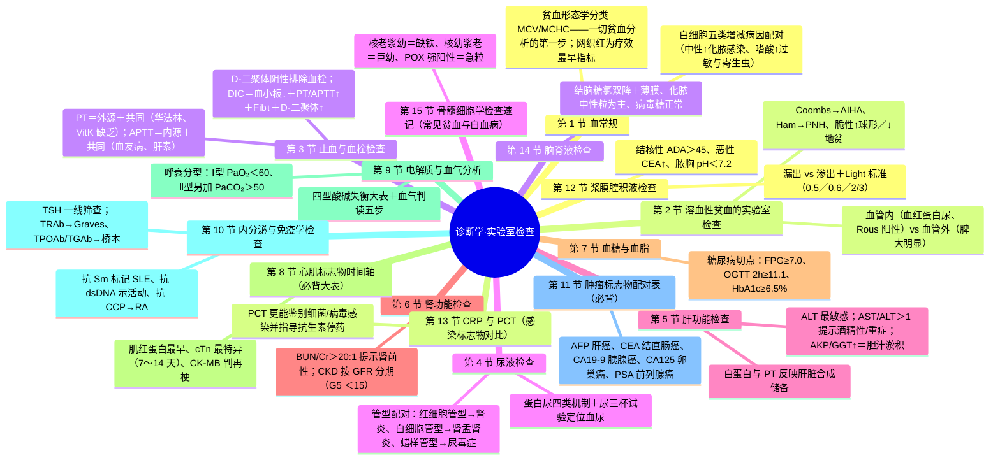
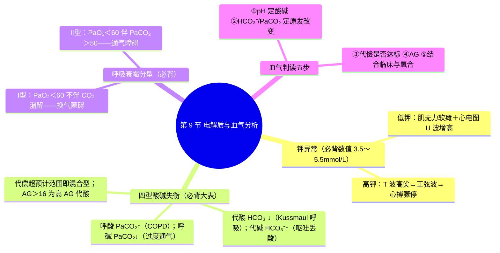

---
tags:
  - 考研306/诊断学/实验室检查
科目: 诊断学
系统: 实验室检查
内容: 血常规、溶血、止血血栓、尿液、肝肾功能、血糖血脂、心肌标志物、电解质血气、内分泌免疫、肿瘤标志物、浆膜腔积液、脑脊液
---
# 诊断学·讲义精讲版——03 实验室检查

> 本册为 2028 届临床医学专硕 306 统考"讲义精讲版"诊断学部分第 3 册，供一轮精读与二轮背诵使用。
> 知识体系以人民卫生出版社第 10 版《诊断学》为准；实验室检查是 A1/A2 型题的数值密集区，核心是"指标—疾病"配对与"方向—机制"判读。
> 全册按"血液 → 尿液 → 肝肾功能 → 代谢 → 标志物 → 体液"展开，每节附配对大表；数值均取公认稳定值（不同实验室参考区间略有差异），⚠ 处请自行核对。

---

## 第 1 节 血常规

### 1.0 红细胞、血红蛋白与贫血分级
- 正常参考：成年男性血红蛋白 120～160g/L、红细胞 (4.0～5.5)×10¹²/L；成年女性血红蛋白 110～150g/L、红细胞 (3.5～5.0)×10¹²/L（⚠ 各实验室略异）。
- 贫血分级（按成人 Hb）：轻度 90～120g/L（女 90～110）；中度 60～90g/L；重度 30～60g/L；极重度 <30g/L。
- 注意：急性大出血早期总血容量未恢复时，血常规可暂时"假性正常"，需结合血细胞比容动态判断。
- 外周血涂片要点：泪滴形红细胞——骨髓纤维化；红细胞缗钱状排列——多发性骨髓瘤（高球蛋白血症）；出现有核红细胞——严重溶血、骨髓浸润。

### 1.1 白细胞五类增减病因配对表（必背）
| 细胞 | 增多 | 减少 |
| --- | --- | --- |
| 中性粒细胞 | **化脓性细菌感染**（肺炎球菌肺炎、败血症）、组织坏死（心梗、大手术后、烧伤）、急性大出血、白血病、恶性肿瘤 | 伤寒、副伤寒、流感、病毒性肝炎等病毒感染；再生障碍性贫血；化疗放疗；脾功能亢进；**伤寒的中性粒细胞减少**为经典考点 |
| 嗜酸性粒细胞 | **过敏性疾病**（哮喘、荨麻疹）、**寄生虫病**（血吸虫、蛔虫）、皮肤病、猩红热 | 伤寒（嗜酸性粒细胞减少或消失——伤寒的特点之一）、应激、长期用糖皮质激素 |
| 嗜碱性粒细胞 | 慢性粒细胞白血病、嗜碱性粒细胞白血病、过敏性疾病 | —— |
| 淋巴细胞 | **病毒感染**（传染性单核细胞增多症、百日咳——淋巴细胞增多型）、结核、淋巴瘤、淋巴细胞白血病 | 放射病、应用肾上腺皮质激素、HIV 感染（晚期） |
| 单核细胞 | 感染性心内膜炎、疟疾、活动性结核、单核细胞白血病 | —— |

### 1.2 网织红细胞
- 正常参考值：成人 0.5%～1.5%（绝对值 (24～84)×10⁹/L，⚠ 各教材微有差异）。
- 意义：
  1. 反映骨髓红系增生能力：溶血性贫血、急性失血时升高；再生障碍性贫血时减少。
  2. **贫血疗效观察的最早指标**：缺铁性贫血补铁后 3～7 天网织红细胞率先上升（其后血红蛋白才上升）；治疗无效则需重新评估诊断。
  3. 判断贫血类型：升高的贫血=增生性（溶血、失血）；降低的贫血=增生不良（再障、骨髓浸润）。

### 1.3 血小板
- 正常参考：(100～300)×10⁹/L。
- 增多（>400×10⁹/L）：骨髓增殖性疾病、急慢性炎症、缺铁、脾切除后、恶性肿瘤。
- 减少（<100×10⁹/L）：①生成障碍——再生障碍性贫血、急性白血病、化疗后；②破坏增多——ITP、药物免疫性；③消耗增加——DIC、血栓性血小板减少性紫癜；④分布异常——脾功能亢进。
- 血小板明显减少时自发性出血风险显著增加（⚠ 危险阈值判断按教材）。

### 1.4 红细胞沉降率（ESR）
- 正常（Westergren 法）：男 0～15mm/h，女 0～20mm/h。
- 升高无特异性，用于：动态观察结核与风湿病活动性、鉴别功能性与器质性疾病、辅助鉴别良恶性肿瘤；见于炎症（感染、风湿）、组织损伤坏死（心梗、大手术）、恶性肿瘤、高球蛋白血症（多发性骨髓瘤）、贫血与高胆固醇血症。

### 1.5 贫血形态学分类（MCV/MCHC——一切贫血分析的第一步）
| 类型 | MCV | MCHC | 代表疾病 |
| --- | --- | --- | --- |
| 大细胞性 | >100fl | 正常 | 巨幼细胞贫血（叶酸/维生素 B12 缺乏）、骨髓增生异常综合征 |
| 正常细胞性 | 80～100fl | 32%～35% | 再生障碍性贫血、急性失血性贫血、多数溶血性贫血 |
| 小细胞低色素性 | <80fl | <32% | 缺铁性贫血、海洋性贫血、铁粒幼细胞贫血、慢性病贫血（部分） |
- 小细胞低色素性贫血的进一步鉴别（铁代谢配对）：
| 项目 | 缺铁性贫血 | 海洋性贫血 | 慢性病贫血 |
| --- | --- | --- | --- |
| 血清铁 | ↓↓ | 正常或↑ | ↓ |
| 血清铁蛋白 | ↓↓（储存铁耗竭，最敏感） | 正常或↑ | 正常或↑ |
| 总铁结合力（TIBC） | ↑↑ | 正常 | ↓ |
| 骨髓铁染色 | 细胞内、外铁均减少 | —— | 细胞外铁↑、铁粒幼细胞↓ |

> **相关知识点**：[[05-血液系统#一、贫血总论|贫血总论（内科）]] ｜ [[05-血液系统#七、急性白血病|急性白血病（内科）]] ｜ [[03-实验室检查#第 15 节 骨髓细胞学检查速记（常见贫血与白血病）|骨髓细胞学检查速记]]

---

## 第 2 节 溶血性贫血的实验室检查

### 2.1 溶血的共同证据
- 红细胞破坏↑：血红蛋白↓、间接（非结合）胆红素↑、尿胆原↑、乳酸脱氢酶↑、血清结合珠蛋白↓。
- 红系代偿↑：**网织红细胞↑↑**、骨髓红系增生活跃；外周血可见幼红细胞。
- 血管内溶血特殊证据：血浆游离血红蛋白↑、血清结合珠蛋白显著↓、高铁血红素白蛋白血症、**含铁血黄素尿（Rous 试验阳性）**、血红蛋白尿（酱油色尿）。
- 诊断思路三步法：①确定溶血存在（网织红↑＋间接胆红素↑＋结合珠蛋白↓）→②定位破坏场所（血管内/血管外）→③特异性试验定性（Coombs、Ham、脆性、电泳等）。

### 2.2 血管内 vs 血管外溶血大表（必背）
| 项目 | 血管内溶血 | 血管外溶血 |
| --- | --- | --- |
| 红细胞破坏场所 | 血循环内（血管中） | 单核-巨噬系统（脾、肝、骨髓） |
| 血红蛋白尿（酱油色尿） | 有 | 无 |
| 游离血红蛋白↑、结合珠蛋白↓ | 显著 | 不明显 |
| 含铁血黄素尿 | 阳性（慢性血管内溶血） | 阴性 |
| 脾大 | 常不明显 | 常明显 |
| 起病 | 多急骤 | 多缓慢 |
| 代表疾病 | PNH、蚕豆病（G6PD 缺乏）、血型不合输血、行军性血红蛋白尿 | 遗传性球形红细胞增多症、温抗体型自身免疫性溶血、海洋性贫血 |
| 尿色 | 酱油色（血红蛋白尿） | 正常 |

### 2.3 特殊检查-疾病配对表（必背）
| 检查 | 阳性/异常意义 | 代表疾病 |
| --- | --- | --- |
| **Coombs 试验**（抗人球蛋白试验）阳性 | 红细胞膜上吸附自身抗体（或补体） | **自身免疫性溶血性贫血（AIHA）**；新生儿溶血 |
| **Ham 试验**（酸溶血试验）阳性 | 酸化血清中补体敏感红细胞溶解 | **阵发性睡眠性血红蛋白尿（PNH）**（CD55/CD59 缺失为确诊依据） |
- AIHA 分型速记：温抗体型——IgG，37℃ 反应，Coombs 阳性，以血管外溶血为主、脾大明显；冷抗体型——IgM 冷凝集素，遇冷诱发、补体介导血管内溶血（冷凝集试验阳性）。
| 红细胞渗透脆性**增高** | 膜面积/体积比减小（球形） | **遗传性球形红细胞增多症** |
| 红细胞渗透脆性**减低** | 膜面积相对增大（靶形） | **海洋性贫血（地中海贫血）** |
| 血红蛋白电泳异常 | HbA2 升高（β 地贫）、Hb Bart's/H（α 地贫） | 海洋性贫血 |
| 高铁血红蛋白还原试验异常 | G6PD 缺乏 | 蚕豆病 |
| 异形红细胞形态 | 靶形（地贫）、球形、椭圆形、镰形（镰状细胞贫血） | 相应疾病 |

> **相关知识点**：[[05-血液系统#五、溶血性贫血|溶血性贫血（内科）]] ｜ [[01-症状学#第 8 节 黄疸|黄疸]]

---

## 第 3 节 止血与血栓检查

### 3.1 PT 与 APTT 途径配对（必背）
| 项目 | 检测途径 | 正常参考 | 延长的疾病/情形 |
| --- | --- | --- | --- |
| PT（血浆凝血酶原时间） | **外源性＋共同途径**（Ⅰ、Ⅱ、Ⅴ、Ⅶ、Ⅹ） | 11～13s，超过对照 3s 以上有意义 | **维生素 K 缺乏**（Ⅱ、Ⅶ、Ⅸ、Ⅹ 凝血因子依赖 VitK）、**口服华法林**、严重肝病、DIC |
| APTT（活化部分凝血活酶时间） | **内源性＋共同途径**（Ⅷ、Ⅸ、Ⅺ、Ⅻ 等） | 26～36s（⚠ 试剂依赖），超过对照 10s 以上有意义 | **血友病 A（Ⅷ）/B（Ⅸ）缺乏**、vWD、**肝素治疗**监测、DIC、抗磷脂抗体 |
| 二者均延长 | 共同途径 | —— | 严重肝病、DIC、循环抗凝物 |
- INR 公式：INR =（患者 PT/对照 PT）^ISI——ISI 为试剂敏感度指数，使不同实验室结果可比。

### 3.2 INR、D-二聚体与纤维蛋白原
- **INR**（国际标准化比值）：口服华法林监测的标准化指标——一般目标 2.0～3.0（机械瓣等高危情形 2.5～3.5，⚠ 以具体抗凝方案为准）。
- **D-二聚体**：交联纤维蛋白的降解产物——
  1. **阴性（低值）具有重要的排除价值**：基本可排除急性肺血栓栓塞、深静脉血栓。
  2. 升高见于：肺栓塞、深静脉血栓、DIC、手术创伤、妊娠——**特异性差**（升高≠血栓病）。
  3. DIC 诊断组合：血小板进行性下降＋PT/APTT 延长＋纤维蛋白原↓＋D-二聚体↑＋FDP↑。
- **纤维蛋白原（FIB）**：正常 2～4g/L——减低见于 DIC（消耗）、严重肝病、先天缺乏；增高为急性时相反应、血栓风险因素。

### 3.3 其他止血血栓指标（速记）
- 概念对应：一期止血=血管＋血小板（表现瘀点紫癜）→初筛：血小板计数、出血时间、束臂试验（毛细血管脆性试验）；二期止血=凝血因子＋纤维蛋白（表现血肿、关节出血）→初筛：PT、APTT、FIB。
- 血块收缩试验——血小板功能筛查；过敏性紫癜束臂试验可阳性。
- vWF 缺陷（血管性血友病）：出血时间延长，APTT 可延长（Ⅷ因子载体减少）。
- 凝血因子活性测定：Ⅷ、Ⅸ 活性测定是血友病 A/B 确诊与分型的依据。

> **相关知识点**：[[05-血液系统#十二、出血性疾病总论|出血性疾病总论（内科）]] ｜ [[05-血液系统#十三、DIC（弥散性血管内凝血）|DIC（内科）]] ｜ [[01-症状学#第 9 节 皮肤黏膜出血|皮肤黏膜出血]]

---

## 第 4 节 尿液检查

### 4.1 蛋白尿四类机制表（必背）
| 类型 | 机制 | 特点 | 代表疾病 |
| --- | --- | --- | --- |
| 肾小球性 | 肾小球滤过膜通透性/电荷屏障受损 | 量大，可达 3.5g/d 以上；以白蛋白为主 | 肾病综合征（**大量蛋白尿 >3.5g/d**）、肾小球肾炎 |
| 肾小管性 | 近端小管重吸收障碍 | 量较小（<1～2g/d），以小分子蛋白为主（β₂ 微球蛋白、溶菌酶） | 间质性肾炎、药物性肾损害、Fanconi 综合征 |
| 溢出性 | 血中异常小分子蛋白过多，超过肾小管重吸收能力 | **本周蛋白（凝溶蛋白）**、血红蛋白、肌红蛋白 | **多发性骨髓瘤**（本周蛋白尿）、血管内溶血、横纹肌溶解 |
| 功能性/体位性 | 肾脏无器质性病变 | 一过性、微量；直立体位性蛋白尿见于青少年，平卧后消失 | 剧烈运动、发热、受寒、精神紧张 |
- 正常人 24h 尿蛋白 <150mg；>150mg 为蛋白尿。
- 选择性蛋白尿：尿中仅漏出以白蛋白为主的中小分子——滤过膜电荷屏障受损为主，见于微小病变肾病；非选择性蛋白尿——大分子蛋白亦漏出，见于膜性肾病等。

### 4.2 血尿
- 标准：离心尿沉渣镜检红细胞 >3 个/HP 为镜下血尿。
- **尿三杯试验**（必背）：
| 杯次 | 出血部位 |
| --- | --- |
| 第一杯（初始血尿） | 前尿道 |
| 第三杯（终末血尿） | 膀胱三角区、后尿道、前列腺 |
| 三杯均有（全程血尿） | 肾脏、输尿管、膀胱全部（上尿路或膀胱全程） |
- **肾小球源性 vs 非肾小球源性**：相差显微镜见**变形（异形）红细胞**占多数（如 >80%）提示肾小球源性（红细胞经滤过膜受机械挤压变形）；均一形态红细胞提示外科性血尿（结石、肿瘤、感染）。
- 血尿伴随配对：血尿＋肾绞痛（结石）；中老年**无痛性肉眼血尿**（警惕泌尿系肿瘤）；血尿＋膀胱刺激征（泌尿系感染、结核）；血尿＋水肿高血压蛋白尿（肾小球疾病）；血尿＋关节痛/皮疹（过敏性紫癜、狼疮肾炎）；剧烈运动后一过性血尿（功能性）。

### 4.3 管型-疾病配对大表（必背）
| 管型 | 形成基础 | 代表疾病 |
| --- | --- | --- |
| 透明管型 | T-H 蛋白凝聚 | 正常人偶见（运动、发热后）；肾实质病变时增多 |
| **红细胞管型** | 红细胞凝聚 | **急性肾小球肾炎**、急进性肾炎——肾小球源性血尿的确认 |
| **白细胞管型** | 白细胞凝聚 | **急性肾盂肾炎**（上尿路感染的定位依据）、间质性肾炎 |
| 上皮细胞管型 | 肾小管上皮细胞脱落 | 急性肾小管坏死 |
| 颗粒管型 | 变性细胞残渣 | 各类肾实质疾病（慢性肾炎常见） |
| **蜡样管型** | 长期少尿、管型滞留变性 | **慢性肾衰竭（尿毒症）**——预后不良的标志 |
| **脂肪管型** | 脂滴凝聚（可偏振光下马耳他十字） | **肾病综合征（微小病变）** |
| 宽大（肾衰）管型 | 扩张的远端肾小管 | 慢性肾衰竭、急性肾损伤 |

### 4.4 尿糖与尿亚硝酸盐
- 尿糖阳性：血糖超**肾糖阈 8.9～10mmol/L** 时出现（糖尿）；血糖正常性糖尿——肾性糖尿（近端小管重吸收缺陷）、妊娠期、应激性。
- 亚硝酸盐阳性：尿中革兰阴性杆菌（大肠埃希菌等）含硝酸盐还原酶，将硝酸盐还原为亚硝酸盐——**提示泌尿系细菌感染**；阴性不能排除（球菌、利尿、频繁排尿时可为阴性）。
- 尿酮体：阳性见于糖尿病酮症酸中毒、饥饿性酮症、妊娠剧吐——与血糖、血气联合判读。

### 4.5 尿量异常（必背数值）
| 项目 | 标准 | 代表情形 |
| --- | --- | --- |
| 正常尿量 | 1000～2000ml/24h | —— |
| 多尿 | >2500ml/24h | 糖尿病、尿崩症、急性肾衰多尿期、精神性烦渴 |
| 少尿 | <400ml/24h（或 <17ml/h） | 肾前性（脱水、休克）、肾性（肾实质损害）、肾后性（尿路梗阻） |
| 无尿 | <100ml/24h | 严重肾衰竭 |
- 尿路感染定位：**白细胞尿（清洁中段尿沉渣 WBC >5/HP）**＋亚硝酸盐阳性——提示感染；出现白细胞管型/抗体包裹细菌——支持上尿路感染（肾盂肾炎）；膀胱刺激征（尿频、尿急、尿痛）突出而无全身表现——多为下尿路感染（膀胱炎）。

### 4.6 粪便检查要点（速记）
- **粪便隐血试验**：上消化道出血 >5ml 即可阳性——筛查消化道出血与肿瘤；注意假阳性（进食动物血、肉类、铁剂）与假阴性（大量维生素 C ⚠）。
- 性状-疾病配对：柏油样便——上消化道出血；白陶土样便——胆道梗阻；果酱样便——阿米巴痢疾；脓血便——细菌性痢疾、溃疡性结肠炎、直肠癌；米泔水样便——霍乱；鲜血便——下消化道出血（痔、肛裂、直肠息肉）。
- 镜检：寄生虫卵、红细胞/白细胞比例（菌痢——大量脓细胞与红细胞）；脂肪泻（粪脂增多）——胰腺外分泌不足、吸收不良综合征。

> **相关知识点**：[[04-泌尿系统#一、肾小球疾病总论|肾小球疾病总论（内科）]] ｜ [[03-实验室检查#第 6 节 肾功能检查|肾功能检查]]

---

## 第 5 节 肝功能检查

### 5.1 酶学指标配对表（必背）
| 指标 | 意义 | 关键配对 |
| --- | --- | --- |
| **ALT** | 肝细胞损伤**最敏感**的指标 | 急性病毒性肝炎早期即升高；升高幅度大致反映损伤程度 |
| AST | 肝细胞线粒体（及心肌、骨骼肌）酶 | **AST/ALT >1** 提示慢性酒精性肝病、重症肝炎（线粒体破坏）或肝硬化进展 |
| **AKP（ALP）与 GGT** | 胆管酶，反映胆汁淤积 | 梗阻性黄疸、胆汁淤积时同向显著升高；**单纯骨病（骨肿瘤、佝偻病）AKP 升高而 GGT 正常**——鉴别肝源性与骨源性 AKP 升高的关键 |
| 胆碱酯酶（CHE） | 肝合成功能 | 降低反映肝细胞损害与合成储备下降（有机磷中毒时亦降低） |

### 5.2 合成功能指标
- **白蛋白**：仅由肝合成，半衰期长（约 15～19 天）——反映**慢性**肝损害与肝储备；肝病早期可正常，肝硬化时下降。
- **前白蛋白**：半衰期短（数天）——反映急性/近期肝损害，较白蛋白敏感。
- **PT（凝血酶原时间）**：凝血因子半衰期短，肝合成能力下降时 PT 迅速延长——反映**肝脏合成储备功能**的敏感指标；补充维生素 K 不能纠正的重症肝病 PT 延长提示预后差。
- 胆红素代谢见 01 症状学黄疸节：CB/UCB、尿胆红素、尿胆原组合判读黄疸类型。
- 血清蛋白电泳速记：肝病——白蛋白↓、γ 球蛋白↑；多发性骨髓瘤——M 蛋白（单克隆 γ 区带）；肾病综合征——白蛋白↓、α₂ 球蛋白↑。
- 酶学判读三句话：ALT 最敏感（肝细胞损伤）；AST/ALT>1 提示线粒体受损（酒精性肝病、重症肝炎）；AKP/GGT 同向升高提示胆汁淤积，AKP 升高而 GGT 正常则考虑骨源性。

> **相关知识点**：[[03-消化系统#八、肝硬化|肝硬化（内科）]] ｜ [[02-病理学-各论#8.3 病毒性肝炎 ★★|病毒性肝炎（病理）]] ｜ [[01-症状学#第 8 节 黄疸|黄疸]]

---

## 第 6 节 肾功能检查

### 6.1 主要指标配对（必背）
| 指标 | 正常参考 | 意义与配对 |
| --- | --- | --- |
| 血肌酐（Scr） | 男 53～106μmol/L、女 44～97μmol/L（⚠ 各实验室略异） | 反映 GFR，但**早期肾功能损害不敏感**（肾脏储备大，GFR 降至正常 1/3 左右才明显升高） |
| 血尿素氮（BUN） | 3.2～7.1mmol/L | 受蛋白摄入、分解代谢、消化道出血影响，特异性低于 Scr |
| **BUN/Cr 比值** | 正常约 10:1（以 mg/dl 计） | **>20:1 提示肾前性氮质血症**（脱水、心衰、消化道出血、高分解代谢）；肾实质性者比值不高 |
| **内生肌酐清除率（Ccr）** | 80～120ml/min | **评价 GFR 较早、较敏感**的指标；也用于指导经肾排泄药物的剂量调整 |
| **血 β₂ 微球蛋白** | 升高提示 GFR 下降 | **尿 β₂ 微球蛋白升高提示近端肾小管重吸收功能障碍**（间质性肾炎、药物性肾损害）——近端小管损伤的敏感指标 |
| 尿渗量、尿比重 | —— | 浓缩稀释功能；等渗尿（尿渗量≈血浆渗量）提示浓缩功能严重受损 |
| 血尿酸 | 男 150～416μmol/L、女 89～357μmol/L（⚠ 各实验室略异） | 升高：痛风、高嘌呤饮食、肾功能下降、利尿剂、肿瘤溶解综合征 |

### 6.2 CKD 分期（按 GFR，ml/min/1.73m²，必背）
| 期 | GFR | 说明 |
| --- | --- | --- |
| G1 | ≥90 | 肾脏损伤标志阳性而 GFR 正常 |
| G2 | 60～89 | 轻度下降 |
| G3a | 45～59 | 轻～中度下降 |
| G3b | 30～44 | 中～重度下降 |
| G4 | 15～29 | 重度下降 |
| G5 | <15 | 肾衰竭（尿毒症期），需透析或移植 |

> **相关知识点**：[[04-泌尿系统#八、慢性肾脏病（CKD）与肾脏替代治疗|CKD（内科）]] ｜ [[03-实验室检查#第 4 节 尿液检查|尿液检查]]

---

## 第 7 节 血糖与血脂

### 7.1 糖尿病诊断与糖代谢状态切点（必背数值）
| 项目 | 切点（mmol/L，静脉血浆） |
| --- | --- |
| 空腹血糖（FPG）正常 | <6.1 |
| **空腹血糖受损（IFG）** | **6.1～7.0**（空腹受损区间的下界为 6.1、上界为糖尿病切点 7.0） |
| **糖尿病 FPG 切点** | **≥7.0** |
| OGTT 2h 血糖正常 | <7.8 |
| **糖耐量减低（IGT）** | **7.8～11.1** |
| **糖尿病 OGTT 2h 切点** | **≥11.1** |
| 随机血糖糖尿病切点 | ≥11.1（伴典型症状） |
| **HbA1c**（ADA 诊断切点） | **≥6.5%**（需标准化方法检测；反映近 **2～3 个月**平均血糖水平） |
- HbA1c 检测注意：受血红蛋白病、溶血性贫血、近期大量输血影响（红细胞生存改变时结果不可靠）。
- 确诊需有典型症状＋一次达标，或无症状者**改日复测**确认（⚠ 具体确认规则请核对最新指南）。
- OGTT 适应证：FPG 6.1～7.0（IFG）者、疑似糖尿病而 FPG 未达标者。
- OGTT 方法要点：试验前 3 天正常饮食与活动；过夜空腹 8～10h；75g 无水葡萄糖溶于 250～300ml 水中 5 分钟内饮完，自饮第一口计时、2h 采静脉血。
- 糖代谢状态总表（静脉血浆，mmol/L）：
| 状态 | FPG | OGTT 2h |
| --- | --- | --- |
| 正常 | <6.1 | <7.8 |
| IFG（空腹血糖受损） | 6.1～7.0 | <7.8 |
| IGT（糖耐量减低） | <7.0 | 7.8～11.1 |
| 糖尿病 | ≥7.0 | ≥11.1 |
- 尿糖判读：尿糖阳性仅提示血糖超过肾糖阈或肾糖阈降低，**不能诊断糖尿病**（诊断以血糖为准）。

### 7.2 血脂要点
- 主要指标：TC、LDL-C（**致动脉粥样硬化**核心指标，治疗首要目标）、HDL-C（保护性）、TG。
| 指标 | 合适水平（⚠ 切点以最新中国血脂管理指南为准） |
| --- | --- |
| TC | <5.2mmol/L |
| LDL-C | <3.4mmol/L（极高危者目标更低，按危险分层） |
| HDL-C | ≥1.0mmol/L（降低为危险因素） |
| TG | <1.7mmol/L |
- 重度 TG 升高显著增加急性胰腺炎风险；Lp(a) 为独立的遗传性危险因素（了解）。

> **相关知识点**：[[06-内分泌与代谢#十一、糖尿病|糖尿病（内科）]] ｜ [[06-内分泌与代谢#十二、血脂异常|血脂异常（内科）]]

---

## 第 8 节 心肌标志物时间轴（必背大表）
| 标志物 | 开始升高 | 达高峰 | 恢复正常 | 特点与用途 |
| --- | --- | --- | --- | --- |
| **肌红蛋白（Mb）** | 起病 2h 内 | 约 12h 内 | 24～48h | **最早升高**，阴性可用于早期排除；但骨骼肌亦含、**特异性差** |
| **cTnI / cTnT（肌钙蛋白）** | 起病 3～4h | cTnI 11～24h；cTnT 24～48h（合计 11～48h） | cTnI 7～10 天；cTnT 10～14 天（约 7～14 天） | **特异性与敏感性最高**，诊断 AMI 的首选标志物；升高持续时间长，不利于判断再梗死 |
| **CK-MB** | 起病 4h 内 | 16～24h | **3～4 天** | 升高与回落快——**判断再梗死**（再次升高）与溶栓再通（峰值前移）的指标 |
- 判断心梗时间窗：发病数天就诊者 cTn 仍可阳性；判断是否再发梗死以 CK-MB 更有用。
- **cTn 升高≠心肌梗死**（非缺血性升高情形）：心力衰竭、肺栓塞、心肌炎、脓毒症、慢性肾病、应激性心肌病、心脏手术/射频消融后——cTn 反映心肌损伤，结合临床判断是否为缺血性。
- 诊断组合：cTn 是诊断基石（最敏感特异）；CK-MB 用于再梗死与再灌注判断；肌红蛋白用于最早排除。
- **BNP/NT-proBNP**：心室壁应力增高的敏感指标——用于心衰诊断与心源性/肺源性呼吸困难的鉴别、预后评估（⚠ 切点随年龄调整，见内科学）。

> **相关知识点**：[[02-循环系统#四、冠状动脉粥样硬化性心脏病|冠心病（内科）]] ｜ [[04-心电图与器械检查#第 3 节 心肌缺血与心肌梗死|心肌缺血与心肌梗死]]

---

## 第 9 节 电解质与血气分析

### 9.1 正常参考值（必背）
| 项目 | 正常范围 |
| --- | --- |
| 血钾 | **3.5～5.5mmol/L** |
| 血钠 | 135～145mmol/L |
| pH | **7.35～7.45** |
| PaCO₂ | **35～45mmHg** |
| HCO₃⁻ | **22～27mmol/L** |
| 阴离子间隙 AG = Na⁺−(Cl⁻+HCO₃⁻) | **8～16mmol/L** |
| PaO₂ | 80～100mmHg（随年龄增长而下降） |
| SaO₂ | 95%～98% |

### 9.2 钾异常病因与表现速查（必背）
| 项目 | 低钾血症（<3.5mmol/L） | 高钾血症（>5.5mmol/L） |
| --- | --- | --- |
| 病因 | 摄入不足（禁食）；丢失过多（呕吐腹泻、利尿剂、醛固酮增多）；向细胞内转移（碱中毒、胰岛素） | 摄入过多；排出减少（肾衰、保钾利尿剂、肾上腺皮质功能减退）；从细胞内移出（酸中毒、溶血、挤压伤） |
| 对神经肌肉 | 肌无力、软瘫、腹胀、肠麻痹 | 感觉异常、肢体无力，严重者弛缓性瘫痪 |
| 对心脏 | 心律失常（期前收缩、室速、尖端扭转），心电图见 U 波增高 | 心搏骤停（舒张期停搏），心电图高尖 T→正弦波 |
- 钙、镁速记：低钙——神经肌肉兴奋性增高（手足搐搦、Chvostek/Trousseau 征阳性），心电图 Q-T 延长；高钙——兴奋性下降，心电图 Q-T 缩短；顽固性低钾常合并低镁、需同时补镁。

### 9.3 四型酸碱失衡大表（必背）
| 类型 | 原发改变 | pH | 代偿机制 | 常见病因 |
| --- | --- | --- | --- | --- |
| 代谢性酸中毒 | HCO₃⁻↓ | ↓（失代偿） | 通气加深加快（Kussmaul 呼吸），PaCO₂ 代偿性↓ | 酮症酸中毒、乳酸酸中毒、尿毒症、腹泻丢碱、肾小管酸中毒 |
| 代谢性碱中毒 | HCO₃⁻↑ | ↑ | 通气受抑，PaCO₂ 代偿性↑ | **呕吐丢酸（幽门梗阻）**、低氯低钾、利尿剂 |
| 呼吸性酸中毒 | PaCO₂↑ | ↓ | 肾重吸收 HCO₃⁻↑ | **COPD**、呼吸肌麻痹、气道梗阻、镇静剂过量 |
| 呼吸性碱中毒 | PaCO₂↓ | ↑ | 肾排 HCO₃⁻↑ | 癔症性过度通气、发热、肺栓塞早期、机械通气过度 |
- **AG 分型代酸**：高 AG（正常氯）型——酮症、乳酸、尿毒症、水杨酸中毒（"未测定阴离子"增多）；正常 AG（高氯）型——腹泻、肾小管酸中毒。
- **混合型**举例：心跳骤停→呼酸＋代酸；COPD＋呕吐→呼酸＋代碱；**代偿预计值超范围即提示混合型**（⚠ 具体公式见内科学，此处掌握原则）。

### 9.4 钠异常速查（了解）
| 项目 | 低钠血症（<135mmol/L） | 高钠血症（>145mmol/L） |
| --- | --- | --- |
| 常见原因 | 失钠性（呕吐、腹泻、利尿）；稀释性（心衰、肝硬化、SIADH）；假性（高脂、高蛋白血症） | 失水为主（高热大量出汗、尿崩症、水摄入不足） |
| 主要表现 | 乏力、恶心、意识改变——血钠下降速度比绝对值更重要 | 口渴、烦躁、谵妄、昏迷 |

### 9.5 呼吸衰竭分型（必背）
| 分型 | PaO₂ | PaCO₂ | 机制 | 代表疾病 |
| --- | --- | --- | --- | --- |
| Ⅰ型（换气衰竭） | <60mmHg | 正常或降低 | 换气功能障碍（弥散障碍、V/Q 失调、动-静脉分流） | ARDS、重症肺炎、肺栓塞、肺间质纤维化 |
| Ⅱ型（通气衰竭） | <60mmHg | **>50mmHg** | 肺泡通气不足 | COPD 晚期、呼吸肌麻痹 |

### 9.6 血气判读五步流程（方法论）
1. 看 **pH**：7.35～7.45 之外定酸/碱血症；正常不排除代偿性或混合性。
2. 找**原发改变**：pH 与 PaCO₂ 同向变化为代谢性原发、反向变化为呼吸性原发。
3. 判断**代偿程度**：代偿值是否在预计范围内——超出范围提示混合型。
4. 计算 **AG**：>16 提示高 AG 代谢性酸中毒（并核对"delta 比值"判断有无合并代碱 ⚠）。
5. 结合**临床**与氧合：PaO₂、P(A-a)O₂ 判断呼衰类型与换气功能。
- **P(A-a)O₂**（肺泡-动脉血氧分压差）：正常青年人 <15～20mmHg；**增大提示换气功能障碍**（弥散障碍、V/Q 失调、分流）；单纯通气不足（如Ⅱ型呼衰）者差值正常。
- 判读示例：pH 7.25、PaCO₂ 60mmHg、HCO₃⁻ 24——pH↓而 PaCO₂↑（反向）→呼吸性酸中毒原发（如 COPD 急性加重）。pH 7.50、PaCO₂ 30、HCO₃⁻ 24——pH↑而 PaCO₂↓→呼吸性碱中毒（过度通气）。
- 判读原则：代偿是继发改变，其幅度不会超过原发改变——预计代偿公式见内科学。

> **相关知识点**：[[01-外科总论#二、外科患者的水、电解质与酸碱失衡|水电酸碱失衡（外科）]] ｜ [[01-呼吸系统#十四、呼吸衰竭与氧疗|呼吸衰竭与氧疗（内科）]] ｜ [[04-心电图与器械检查#5.3 高钾血症 vs 低钾血症心电图（必背）|高钾低钾心电图]]

---

## 第 10 节 内分泌与免疫学检查

### 10.1 甲状腺功能
- **TSH 是甲状腺功能异常的一线筛查指标**（最敏感）：原发性甲减最早表现为 TSH 升高（亚临床期 FT3/FT4 尚正常）。
| 项目 | 原发性甲减（甲状腺性） | 继发性甲减（垂体性/下丘脑性） |
| --- | --- | --- |
| TSH | **升高** | **降低或正常**（病变在垂体/下丘脑） |
| FT3、FT4 | 降低 | 降低 |
| 病变部位 | 甲状腺本身 | 垂体、下丘脑（TRH 兴奋试验可区分 ⚠） |
- 抗体配对（必背）：
| 抗体 | 意义 |
| --- | --- |
| **TPOAb、TGAb** | **桥本甲状腺炎**（慢性淋巴细胞性甲状腺炎）——滴度显著升高 |
| **TRAb**（TSH 受体抗体，含 TSAb） | **Graves 病**——诊断、预示复发（含刺激型抗体致甲亢） |
- 亚临床状态：亚临床甲减——TSH↑而 FT3/FT4 正常；亚临床甲亢——TSH↓而 FT3/FT4 正常（处理见内科学）。

### 10.2 自身抗体-疾病配对大表（必背）
| 抗体 | 相关疾病与意义 |
| --- | --- |
| ANA（抗核抗体） | 结缔组织病**筛查**：SLE 敏感度最高（特异性低）；低滴度可见于正常人、老年人 |
| **抗 dsDNA 抗体** | SLE **特异性抗体之一，与疾病活动性（尤其狼疮肾炎）相关** |
| **抗 Sm 抗体** | SLE 的**标记抗体**——特异性最高、敏感性低（阳性即基本确诊 SLE） |
| 抗 SSA/抗 SSB 抗体 | **干燥综合征**（SSB 特异性较高）；SSA 亦见于 SLE、亚急性皮肤狼疮、新生儿狼疮 |
| **抗 CCP 抗体** | **类风湿关节炎**早期诊断，特异性高，与骨破坏相关 |
| RF（类风湿因子） | RA 常用但特异性有限（肝病、SLE、老年人可阳性） |
| ANCA-c（PR3-ANCA） | **肉芽肿性多血管炎（GPA，韦格纳肉芽肿）** |
| ANCA-p（MPO-ANCA） | **显微镜下多血管炎**、嗜酸性肉芽肿性多血管炎（⚠ 请核对） |
| **抗 Jo-1 抗体** | 多发性肌炎/皮肌炎（抗合成酶综合征：肌炎＋间质性肺炎＋关节炎） |
| **抗 Scl-70 抗体** | **弥漫性系统性硬化症** |
| **抗着丝点抗体** | **局限性系统性硬化症（CREST 综合征）** |
| 补体 **C3** | **活动性 SLE（狼疮肾炎）降低**（免疫消耗）；急性链球菌感染后肾炎早期下降、8 周内恢复 |
- 免疫球蛋白速记：单克隆增高——浆细胞病（多发性骨髓瘤、巨球蛋白血症）；多克隆增高——慢性感染、慢性肝病、结缔组织病；IgE 升高——过敏与寄生虫病。
- 检查策略：ANA 筛查 → 高滴度阳性者按临床线索进一步查特异性抗体（dsDNA、Sm、SSA/SSB、CCP、ANCA、Jo-1、Scl-70 等）。

> **相关知识点**：[[06-内分泌与代谢#一、Graves 病（弥漫性毒性甲状腺肿）|Graves 病（内科）]] ｜ [[07-风湿性疾病与中毒#二、系统性红斑狼疮（SLE）|SLE（内科）]]

---

## 第 11 节 肿瘤标志物配对表（必背）
| 标志物 | 主要相关肿瘤 | 备注 |
| --- | --- | --- |
| **AFP** | **原发性肝细胞癌** | 明显且持续升高（诊断阈值 ⚠ 按指南）有诊断意义；生殖细胞肿瘤、妊娠、活动性肝炎亦可升高 |
| **CEA** | **结直肠癌**为主，广谱（胃肠、肺、乳腺） | 疗效与复发监测意义大；吸烟者可轻度升高 |
| **CA19-9** | **胰腺癌**（首选标志物） | 胆道、胃肠道肿瘤亦可升高 |
| **CA125** | **卵巢上皮癌** | 大量腹水、结核性腹膜炎、月经期、子宫内膜异位症可升高——特异性受限 |
| **CA15-3** | **乳腺癌** | 复发与转移监测 |
| **PSA** | **前列腺癌** | 前列腺增生、导尿与穿刺操作后可升高；游离/总 PSA 比值有助鉴别 |
| **hCG** | **绒毛膜上皮癌、葡萄胎**、含生殖细胞成分的肿瘤 | 妊娠相关疾病鉴别 |
| **NSE** | **小细胞肺癌**、神经母细胞瘤 | 神经内分泌来源 |
| ProGRP | 小细胞肺癌 | 与 NSE 联合应用（了解） |
| SCC（鳞状细胞癌抗原） | 肺鳞癌、宫颈鳞癌、食管鳞癌 | 了解 |
- 使用原则：①**动态观察**的价值大于单次绝对值；②多标志物**联合检测**提高敏感度；③升高不等于确诊，正常不能完全排除；④主要用于高危人群筛查、辅助诊断、疗效与复发监测、预后判断。

> **相关知识点**：[[03-消化系统#十、原发性肝癌|原发性肝癌（内科）]] ｜ [[05-腹部外科#九、结直肠癌|结直肠癌（外科）]] ｜ [[06-泌尿外科#四、泌尿系肿瘤|泌尿系肿瘤（外科）]]

---

## 第 12 节 浆膜腔积液检查

### 12.1 漏出液 vs 渗出液大表（必背）
| 项目 | 漏出液 | 渗出液 |
| --- | --- | --- |
| 病因 | 非炎症性：静水压升高（心衰）、胶体渗透压降低（肝硬化、肾病综合征）、淋巴回流受阻 | 炎症或肿瘤：感染（结核）、恶性肿瘤、结缔组织病、胰腺炎 |
| 外观 | 淡黄、清亮、透明 | 不定：草黄、血性、脓性、乳糜性，多浑浊 |
| 自凝 | 不自凝 | 常自凝（含纤维蛋白原） |
| 比重 | <1.015～1.018 | >1.018 |
| Rivalta 试验（黏蛋白定性） | 阴性 | 阳性 |
| 蛋白定量 | <25g/L | >30g/L |
| 细胞计数 | <100×10⁶/L | >500×10⁶/L |
| 葡萄糖 | 与血糖接近 | 常低于血糖 |
| 细菌学 | 无细菌 | 可找到病原菌/瘤细胞 |
| 代表疾病 | 心衰、肝硬化、肾病综合征 | 结核性胸膜炎、肺炎旁积液、恶性胸腔积液、脓胸 |

### 12.2 Light 标准（判别渗出液，符合任一条即为渗出液）
1. 胸液蛋白/血清蛋白 **>0.5**；
2. 胸液 LDH/血清 LDH **>0.6**；
3. 胸液 LDH > 正常血清 LDH 上限的 **2/3**。
- 记忆：三个"分数"任一命中即判渗出液——蛋白比 0.5、LDH 比 0.6、LDH 绝对值 2/3 上限。
- 胸液送检组合：常规（外观、比重、细胞计数分类）、生化（蛋白、糖、LDH、ADA、pH）、肿瘤标志物（CEA）、细胞学与病原学（涂片、培养、抗酸染色）。

### 12.3 四种特殊积液鉴别表（必背）
| 性质 | 关键特征 |
| --- | --- |
| **结核性** | 淋巴细胞为主，**ADA（腺苷脱氨酶）>45U/L**（敏感而特异的辅助指标），pH 常 <7.3，CEA 不高；γ-干扰素升高（⚠ 辅助指标） |
| **恶性** | 多为**血性**，**CEA 升高、pH >7.4**，LDH 高；找到脱落肿瘤细胞可确诊；CEA 胸液/血清比值升高意义更大 |
| **脓胸（化脓性）** | 脓性浑浊，白细胞显著增多，**pH <7.2、糖 <2.2mmol/L**、LDH 极高——需尽快引流 |
| **乳糜性** | 乳白色，**甘油三酯升高**、**苏丹Ⅲ染色阳性**（脂肪球），胆固醇不高——胸导管损伤/阻塞 |
- 胸液细胞学速记：淋巴细胞为主——结核、恶性肿瘤；中性粒细胞为主——化脓性、肺炎旁积液；嗜酸性粒细胞增多——气胸、寄生虫、药物反应。
- 心包积液速记：漏出液见于心衰，渗出液见于感染与结缔组织病，血性积液警惕结核与肿瘤；积液 >250～300ml 时心界才扩大（烧瓶心）——**超声心动图是检出积液最敏感的方法**。

> **相关知识点**：[[01-呼吸系统#十一、胸腔积液|胸腔积液（内科）]] ｜ [[01-症状学#第 2 节 水肿|水肿]]

---

## 第 13 节 CRP 与 PCT（感染标志物对比）
| 项目 | CRP（C 反应蛋白） | PCT（降钙素原） |
| --- | --- | --- |
| 本质 | 肝细胞产生的急性时相反应蛋白 | 降钙素前体多肽，严重细菌感染时由肺、肠等组织大量产生 |
| 细菌感染 | 显著升高 | 显著升高（脓毒症时可达极高水平） |
| 病毒感染 | 可轻度升高（一般 <50mg/L） | **一般不升高**——鉴别细菌与病毒感染更有价值 |
| 非感染升高 | 手术创伤、心梗、自身免疫病活动、肿瘤 | 大手术、休克早期可轻中度升高；自身免疫病一般不高 |
| 临床定位 | 粗筛炎症、评估自身免疫病活动性 | **评估细菌感染/脓毒症严重程度、指导抗生素停用** |
- PCT 半衰期较长（约 20～30h ⚠），动态下降趋势可作为抗生素疗效评估与停药的参考。

> **相关知识点**：[[01-症状学#第 1 节 发热|发热]]

---

## 第 14 节 脑脊液检查

### 14.1 正常脑脊液
- 压力 80～180mmH₂O；白细胞 0～8×10⁶/L（均为单个核）；蛋白 0.15～0.45g/L；糖 2.5～4.5mmol/L；氯化物 120～130mmol/L。
- 适应证：中枢感染性疾病的诊断与鉴别、SAH 的诊断（影像不能确定时）、不明原因脑病、椎管内给药或造影等。
- 禁忌：明显颅内高压（尤其后颅窝占位——脑疝风险）、穿刺部位感染、凝血功能严重异常、休克。

### 14.2 三种脑膜炎脑脊液对比大表（必背）
| 项目 | 化脓性脑膜炎 | 结核性脑膜炎 | 病毒性脑膜炎 |
| --- | --- | --- | --- |
| 压力 | 显著升高↑↑ | 升高↑ | 正常或轻度升高 |
| 外观 | 浑浊、脓性 | **微浑、毛玻璃样** | 清亮透明 |
| 白细胞 | 显著增多（常 >1000×10⁶/L），**中性粒细胞为主** | 50～500×10⁶/L，**淋巴细胞为主** | 数十至数百×10⁶/L，淋巴细胞为主 |
| 蛋白 | 显著升高↑↑ | 升高↑（明显） | 轻度升高 |
| 葡萄糖 | **显著降低↓↓** | **降低↓** | **正常**（关键鉴别点） |
| 氯化物 | 降低↓ | **显著降低↓↓** | 正常 |
| 特征性改变 | 涂片/培养找到化脓菌 | **静置 12～24h 出现薄膜（网状膜）**，抗酸染色/培养、PCR | 病毒特异性抗体/PCR 阳性 |
- 注意：结脑脑脊液抗酸杆菌直接涂片阳性率低，诊断依赖临床表现＋脑脊液糖氯双降＋薄膜等综合判断。
- **蛛网膜下腔出血（SAH）**：压力升高，**均匀一致血性**脑脊液，离心后上清液**黄色（黄变）**，蛋白升高、糖正常或降低。
- SAH 与腰穿损伤性出血的鉴别：三管试验——损伤者第一至第三管红细胞计数递减、上清液清亮；SAH 三管均匀一致、上清黄变。

> **相关知识点**：[[02-病理学-各论#14.1 流行性乙型脑炎 vs 流行性脑脊髓膜炎（必背对比）|乙脑 vs 流脑（病理）]] ｜ [[02-体格检查#7.7 脑膜刺激征（三项，必背）|脑膜刺激征]]

---

## 第 15 节 骨髓细胞学检查速记（常见贫血与白血病）
| 疾病 | 骨髓象要点 |
| --- | --- |
| 缺铁性贫血 | 增生活跃，红系以中、晚幼红细胞为主，胞体小、胞浆少、边缘不整（"核老浆幼"） |
| 巨幼细胞贫血 | 红系巨幼变（"核幼浆老"）、粒系巨幼变、巨核细胞分叶过多 |
| 再生障碍性贫血 | 增生减低或重度减低，非造血细胞（淋巴细胞、浆细胞、组织嗜碱细胞）比例增高，巨核细胞明显减少 |
| 急性白血病 | 增生极度活跃，原始细胞比例显著增高（⚠ 诊断阈值按 WHO/FAB 标准核对教材） |
- 细胞化学染色速记：POX（过氧化物酶）强阳性——急性粒细胞白血病；POX 阴性、PAS（糖原）块状阳性——急性淋巴细胞白血病；NSE（非特异性酯酶）阳性且被氟化钠抑制——急性单核细胞白血病。

> **相关知识点**：[[03-实验室检查#第 1 节 血常规|血常规]]

---

## 附 1：必背数值速记清单
- 白细胞 (4～10)×10⁹/L；血小板 (100～300)×10⁹/L；网织红 0.5%～1.5%。
- 尿蛋白 <150mg/24h；大量蛋白尿 >3.5g/d；肾糖阈 8.9～10mmol/L；镜下血尿 RBC >3/HP；白细胞尿 WBC >5/HP。
- BUN 3.2～7.1mmol/L；Scr 男 53～106μmol/L；Ccr 80～120ml/min；CKD G5 期 GFR <15ml/min/1.73m²。
- 糖尿病：FPG ≥7.0、OGTT 2h ≥11.1、HbA1c ≥6.5%；IFG 6.1～7.0；IGT 7.8～11.1。
- 血钾 3.5～5.5；pH 7.35～7.45；PaCO₂ 35～45；HCO₃⁻ 22～27；AG 8～16（mmol/L）。
- Ⅰ型呼衰 PaO₂<60mmHg；Ⅱ型再加 PaCO₂>50mmHg；氧合指数正常 >400。
- PT 超对照 3s 以上；APTT 超对照 10s 以上；华法林目标 INR 2.0～3.0。
- 心肌标志物：肌红蛋白最早；cTn 3～4h 升、7～14 天恢复（最特异）；CK-MB 16～24h 达峰、3～4 天恢复（判再梗）。
- 总胆红素 1.7～17.1μmol/L；隐性黄疸 17.1～34.2μmol/L；ALT 最敏感；AST/ALT>1 提示酒精性/重症。
- 胸液：ADA>45U/L 提示结核性；脓胸 pH<7.2、糖<2.2mmol/L；Light 三条任一符合即渗出液。
- CSF：压力 80～180mmH₂O；白细胞 0～8×10⁶/L；结脑——糖氯双降＋薄膜；病毒性——糖正常。
- 尿量：少尿 <400ml/24h、无尿 <100ml/24h、多尿 >2500ml/24h。
- TSH 一线筛查：原发甲减 TSH↑；继发甲减 TSH 不升。桥本——TPOAb/TGAb；Graves——TRAb。

---

## 附 2：高频"指标—疾病"配对闪卡
- 伤寒——白细胞减少＋嗜酸性粒细胞减少或消失。
- 传染性单核细胞增多症——淋巴细胞增多＋异型淋巴细胞。
- 多发性骨髓瘤——本周蛋白尿＋M 蛋白＋ESR 显著增快。
- 肾病综合征——大量蛋白尿（>3.5g/d）＋脂肪管型。
- 急性肾盂肾炎——白细胞管型；急性肾小球肾炎——红细胞管型＋C3 前期下降（8 周内恢复）。
- 慢性肾衰竭——蜡样管型＋等渗尿。
- 酒精性肝病——AST/ALT>1；梗阻性黄疸——AKP/GGT 显著升高＋瘙痒＋陶土色便。
- 幽门梗阻呕吐——低氯低钾性代谢性碱中毒。
- 肺栓塞——D-二聚体阴性可基本排除；cTn 亦可升高（右心负荷损伤）。
- 桥本甲状腺炎——TPOAb/TGAb 显著升高；SLE 活动——抗 dsDNA 升高＋C3 下降。
- CREST——抗着丝点抗体；弥漫性系统性硬化——抗 Scl-70。
- 结直肠癌监测——CEA；胰腺癌——CA19-9；卵巢上皮癌——CA125；绒癌——hCG；原发肝细胞癌——AFP。

## 附 3：自测八问
1. 伤寒的外周血象有哪两个特征性变化？
2. 血管内溶血的四联证据（游离 Hb、结合珠蛋白、含铁血黄素尿、血红蛋白尿）各提示什么？
3. PT 与 APTT 分别对应哪条凝血途径？各举两个延长代表病。
4. 红细胞管型、白细胞管型、蜡样管型、脂肪管型分别对应什么疾病？
5. IFG 与 IGT 的切点区间各是多少？HbA1c 反映多长时间的血糖？
6. Light 标准三条是什么？结核性、恶性、脓胸积液的关键鉴别指标各是什么？
7. 贫血按 MCV/MCHC 分为哪三型？缺铁性贫血与慢性病贫血的铁代谢如何鉴别？
8. CKD 如何按 GFR 分期？G5 期的 GFR 界值是多少？
