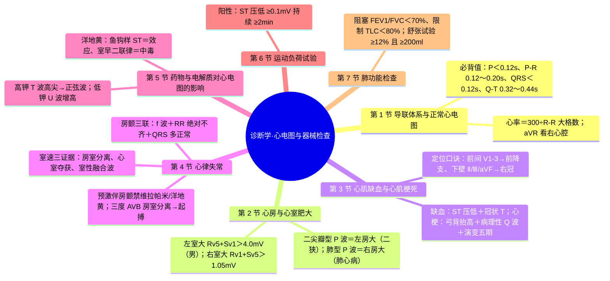
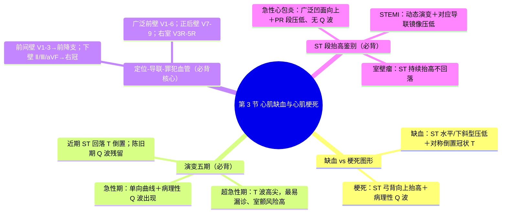
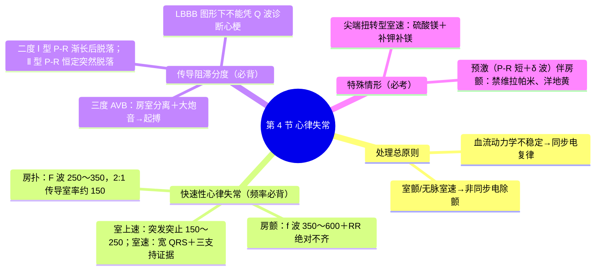

---
tags:
  - 考研306/诊断学/心电图与器械
科目: 诊断学
系统: 心电图与器械检查
内容: 导联与正常心电图、心房心室肥大、心肌缺血心梗、心律失常、药物电解质、运动负荷、肺功能、Holter与超声
---
# 诊断学·讲义精讲版——04 心电图与器械检查

> 本册为 2028 届临床医学专硕 306 统考"讲义精讲版"诊断学部分第 4 册，供一轮精读与二轮背诵使用。
> 知识体系以人民卫生出版社第 10 版《诊断学》为准；心电图是 306 的高频图片题来源，核心是"图形特征—疾病"配对与心梗定位。
> 全册按"导联与正常值 → 肥大 → 缺血/梗死 → 心律失常 → 药物与电解质 → 运动试验 → 肺功能"展开；数值均取公认稳定值，⚠ 处请自行核对。

---

## 第 1 节 导联体系与正常心电图

### 1.0 心电图产生的基本原理（理解图形的钥匙）
- 静息心肌细胞呈极化状态；除极（去极化）与复极过程产生电活动，无数心肌细胞的"综合心电向量"经体表记录即为心电图。
- 顺序决定波形：窦房结→心房（P 波=心房除极）→房室结（PR 段=房室传导的生理性延迟）→希氏束-普肯耶系统→心室（QRS=心室除极）→T 波=心室复极（心房复极波隐没于 QRS 中，不单独成波）。
- 方向决定振幅：除极向量朝向探查电极→正向波（R 波）；背离探查电极→负向波（Q、S 波）。
- 导联=观察角度：12 导联相当于从 12 个角度记录同一向量在不同平面的投影——V1 看"右前"，V5、V6 看"左外侧"，Ⅱ、Ⅲ、aVF 看"下壁"，Ⅰ、aVL 看"左侧壁/高侧壁"。

### 1.1 常用导联
- 肢体导联 6 个：标准导联 Ⅰ、Ⅱ、Ⅲ（双极），加压肢体导联 aVR、aVL、aVF（单极）。
- 胸导联 6 个（V1～V6）：
| 导联 | 体表位置 |
| --- | --- |
| V1 | 胸骨右缘第 4 肋间 |
| V2 | 胸骨左缘第 4 肋间 |
| V3 | V2 与 V4 连线中点 |
| V4 | 左锁骨中线第 5 肋间 |
| V5 | 左腋前线与 V4 同一水平 |
| V6 | 左腋中线与 V4 同一水平 |
- 电轴：正常 -30°～+90°；电轴左偏 <-30°（左室肥大、左前分支阻滞），右偏 >+90°（右室肥大、肺心病）。
- 电轴目测法（Ⅰ 与 Ⅲ 导联主波方向）：Ⅰ、Ⅲ 主波均向上——电轴正常；Ⅰ 向上、Ⅲ 向下——左偏；Ⅰ 向下、Ⅲ 向上——右偏。
- 导联-心壁对应速记：前间壁 V1-3、下壁 Ⅱ/Ⅲ/aVF、侧壁 Ⅰ/aVL/V5-6、正后壁 V7-9、右室 V3R-5R；**aVR 看右心腔**——弥漫性 ST 压低伴 aVR 抬高提示左主干/严重三支病变（⚠ 属危急情形）。
- 低电压：肢体导联 QRS 均 <0.5mV（或胸导 <0.8mV）——心包积液、肺气肿、肥胖、甲状腺功能减退。
- 电交替：QRS 振幅逐搏交替——大量心包积液/心脏压塞的重要提示。

### 1.2 正常心电图波形参考值（必背大表）
| 项目 | 正常范围 | 异常意义 |
| --- | --- | --- |
| P 波 | 时限 **<0.12s**；电压肢导 **<0.25mV**、胸导 <0.20mV；Ⅱ、aVF、V4～V6 直立 | 增宽双峰=左房大（二尖瓣型 P）；高尖=右房大（肺型 P） |
| P-R 间期 | **0.12～0.20s** | >0.20s = 一度房室阻滞；<0.12s＋δ波=预激 |
| QRS 波群 | 时限 0.06～0.10s（**<0.12s**）；V1 呈 rS（R/S<1）、V5、V6 R/S>1；aVR 主波向下 | ≥0.12s 为宽 QRS（室性、束支阻滞、旁路）；Rv5+ Sv1 异常=左室大 |
| ST 段 | 下移 <0.05mV；抬高 ≤0.1mV（**V1～V3 可达 0.3mV**） | 压低=缺血；弓背抬高=心梗 |
| T 波 | 与 QRS 主波方向一致，振幅不低于同导联 R 波的 1/10 | 高尖=高钾；对称深倒（冠状 T）=缺血 |
| Q-T 间期 | **0.32～0.44s** | 延长：低钙、长 QT 综合征、某些药物（→尖端扭转风险） |
| U 波 | T 波后 0.02～0.04s 的小波，方向与 T 波一致 | **显著增高=低钾血症**；倒置可见于心肌缺血 |

### 1.3 读图步骤与心率计算
- 读图六步：①定节律（是否窦性）→②算心率与各间期→③看 P 波（房大？房性心律失常？）→④看 QRS（电压、时限、病理性 Q 波？）→⑤看 ST-T（缺血？抬高？）→⑥看电轴并**结合临床**下结论。
- 心率计算：节律规则时 300÷R-R 间期的大格数（如 R-R 占 3 大格→约 100 次/分）；绝对不齐（房颤）时以 6 秒内 QRS 个数 ×10 估算。
- 心电图描记纸速 25mm/s、定标电压 1mV=10mm（每小格 0.04s、0.1mV）——所有测量均以此为前提。
- 提示：胸导联 R 波自 V1 至 V6 应逐渐增高（R 波进展）；进展不良（如 V1～V4 R 波递增不足）提示前间壁病变或左室肥大等。
- 心电图诊断报告的书写结构：①心律（窦性/异位）→②心室率/心房率→③电轴→④各间期（P-R、QRS、Q-T）→⑤ST-T 描述→⑥结合临床的结论（如"窦性心律，心电图大致正常"或"窦性心律，急性广泛前壁心肌梗死"）。
- 心电图的局限性：心电图正常**不能排除**器质性心脏病（轻度瓣膜病、肥厚型梗阻性心肌病早期等可完全正常）——必须与病史、体格检查、超声心动图结合。

---

## 第 2 节 心房与心室肥大

### 2.1 心房肥大配对表（必背）
| 名称 | 心电图特点 | 意义 | 代表疾病 |
| --- | --- | --- | --- |
| **二尖瓣型 P 波** | P 波时限 ≥0.12s、双峰（双峰间距 ≥0.04s）；V1 正负双向，负向波加深（PtfV1 ≤ -0.04mm·s） | **左房肥大/负荷增加** | 二尖瓣狭窄 |
| **肺型 P 波** | P 波高尖、电压 ≥0.25mV（Ⅱ、Ⅲ、aVF 明显），时限多不增宽 | **右房肥大** | 慢性肺源性心脏病 |
- 机制记忆：P 波前 1/3 为右房除极、后 2/3 为左房除极——右房大→除极电势增大→电压高尖（时限不变）；左房大→除极时间延长→时限增宽、双峰。

### 2.2 心室肥大电压标准（必背）
| 项目 | 标准 | 伴随表现 |
| --- | --- | --- |
| **左心室肥大** | **Rv5（或 Rv6）+ Sv1 >4.0mV（男）/3.5mV（女）**；RaVL >1.2mV（辅助 ⚠） | 电轴左偏、V5-V6 ST-T 继发性改变（"劳损"图形）——高血压性心脏病、主动脉瓣病变 |
| **右心室肥大** | **Rv1 + Sv5 >1.05mV**；V1 R/S ≥1（重度时呈 qR 型）；RaVR >0.5mV | 电轴右偏（>+90°）、V1-V2 ST-T 继发改变——肺心病、先天性心脏病 |
- 双侧心室肥大：两侧电压标准可"互相抵消"，心电图可仅表现一侧肥大甚至大致正常——诊断敏感度低。
- 血流动力学配对：二尖瓣狭窄→二尖瓣型 P 波＋右室大（梨形心）；高血压/主动脉瓣病→左室大（靴形心）；慢性肺心病→肺型 P 波＋右室大。
- 瓣膜病/先心病心电图配对：房间隔缺损——S2 固定分裂＋右束支阻滞图形＋右室大；室间隔缺损——左室大或双室大；动脉导管未闭——左室大；二尖瓣狭窄——二尖瓣型 P 波＋易合并房颤；肺心病——电轴右偏＋肺型 P 波＋Rv1+Sv5>1.05mV＋明显顺钟向转位。
- 注意：心电图电压标准的敏感度有限——阴性不能排除心房/心室肥大，需结合超声心动图。

---

## 第 3 节 心肌缺血与心肌梗死

### 3.1 心肌缺血图形
- 典型表现：面向缺血区导联 **ST 段水平型或下斜型压低 ≥0.05～0.1mV**；T 波**对称性倒置**（"冠状 T"）。
- 机制理解：心内膜下缺血→缺血部位复极延迟、ST 向量背向探查电极→ST 压低；透壁缺血/冠脉痉挛→损伤电流朝向缺血区→ST 抬高（变异型心绞痛、心梗早期）。
- T 波改变：高尖 T 亦可为心内膜下缺血早期表现；T 波低平、双向为非特异改变。
- **变异型心绞痛**：ST 段**抬高**（透壁性缺血），发作缓解后回落。
- 急性心包炎亦见 ST 抬高（鉴别见 3.4）。

### 3.2 心肌梗死图形演变五期（必背）
| 期别 | 时间 | 图形特征 |
| --- | --- | --- |
| 超急性期 | 起病数分钟～数小时 | **T 波高尖**（不对称），ST 段可斜型抬高，尚无 Q 波——最易漏诊、室颤风险高 |
| 急性期 | 数小时～数天 | **ST 段弓背向上抬高**，与 T 波融合呈单向曲线；出现**病理性 Q 波**（Q 波时限 >0.04s、振幅 >同导联 R 波的 1/4，⚠ 新标准 ≥0.03s） |
| 近期（演变/亚急性期） | 数周 | ST 段逐渐回落至基线，**T 波由高耸转为对称倒置**（冠状 T），Q 波持续 |
| 陈旧期 | 3～6 个月后 | **病理性 Q 波残留**（少数可减小或消失），T 波可恢复或持续倒置 |

### 3.3 心梗定位-导联-罪犯血管大表（必背核心）
| 梗死部位 | 特征性改变导联 | 常见罪犯血管 |
| --- | --- | --- |
| **前间壁** | **V1～V3** | **前降支（LAD）** |
| 前壁 | V3～V5 | 前降支 |
| **广泛前壁** | **V1～V6**（可加 Ⅰ、aVL） | 前降支近段 |
| **下壁** | **Ⅱ、Ⅲ、aVF** | **右冠状动脉**（多数）或左回旋支 |
| 侧壁 | Ⅰ、aVL、V5～V6 | 回旋支 |
| 正后壁 | V7～V9（V1～V3 可见镜像改变：R 波增高、ST 压低） | 回旋支或右冠 |
| **右心室** | **V3R～V5R** | 右冠状动脉近段（下壁心梗需常规加做右胸导联） |
- 对应导联镜像改变：梗死区 ST 抬高，对应部位导联 ST 镜像性压低（如下壁抬高时 Ⅰ、aVL 压低）。

### 3.4 三种心绞痛心电图对比（必背）
| 类型 | 发作时 ST-T | 缓解后 | 机制提示 |
| --- | --- | --- | --- |
| 稳定型心绞痛 | ST 水平/下斜型压低 ≥0.05～0.1mV、T 低平或倒置 | 发作后恢复 | 固定狭窄基础上的心肌需血量增加 |
| 不稳定型心绞痛 | ST 压低加深、T 波倒置加深，动态变化 | 部分恢复 | 斑块不稳定，易进展为心梗 |
| 变异型心绞痛 | **ST 段抬高** | 发作缓解后回落 | 冠脉痉挛——透壁性缺血 |

### 3.5 ST 段抬高鉴别大表（必背）
| 疾病 | ST 形态 | 动态演变 | 其他特征 |
| --- | --- | --- | --- |
| **急性心肌梗死（STEMI）** | 弓背向上抬高 | **有动态演变**（抬高→回落、Q 波形成、T 倒置） | 胸痛＋心肌标志物升高；对应导联镜像压低 |
| **急性心包炎** | 广泛导联**凹面向上（凹向上）抬高** | 无 Q 波形成、无镜像压低 | **PR 段压低**（aVR 抬高）；与呼吸体位相关胸痛、心包摩擦音 |
| **室壁瘤** | ST 持续性抬高 | **持续不回落**（心梗后数月仍抬高） | 有陈旧心梗病史；影像见矛盾运动 |
| 变异型心绞痛 | 一过性抬高 | **一过性**，发作缓解后恢复 | 硝酸酯可缓解，冠脉痉挛 |
| **Brugada 综合征** | V1～V3 穹窿型（coved）抬高伴 T 波倒置、类右束支阻滞图形 | 持续/可变 | 家族性猝死史、晕厥；离子通道病 |
| 早复极（生理变异） | J 点抬高、凹向上 | 无演变、长期稳定 | 年轻健康人多见 |

### 3.6 补充要点（ACS 相关）
- NSTEMI：ST 压低/T 波倒置＋心肌标志物升高；不稳定型心绞痛图形相似但标志物不升高——两者合称 NSTE-ACS（是否溶栓等策略见内科学）。
- 再灌注（溶栓/PCI）成功的心电图表现：抬高的 ST 段于 2h 内回落 >50%；可出现再灌注心律失常（如加速性室性自主心律）。
- 心梗并发症线索：室壁瘤——ST 段持续抬高不回落；室间隔穿孔——胸骨左缘新出现粗糙收缩期杂音；乳头肌断裂——心尖区新出现收缩期杂音（急性二闭）；均伴血流动力学恶化。
- 机制理解：病理性 Q 波=透壁坏死区电活动消失，形成面向坏死区的"电窗口"，心室除极初始向量背离该区——故 Q 波主要见于透壁性（Q 波型）心梗。
- 定位口诀：前间 V1-3、前壁 V3-5、广泛前壁 V1-6、下壁 Ⅱ Ⅲ aVF、侧壁 Ⅰ aVL V5-6、正后壁 V7-9、右室 V3R-5R——配对罪犯血管见 3.3 表。
- STEMI vs NSTEMI 一行对比：STEMI——ST 弓背抬高（透壁性全层缺血，多有 Q 波）；NSTEMI——ST 压低/T 倒置（非透壁），标志物升高而无 ST 抬高。
- 时间窗提示：发病 <12h 的 STEMI 首选再灌注（见内科学）；数天后就诊者心电图已进入演变期/陈旧期，cTn 仍可阳性，而 CK-MB 可能已正常。

### 3.7 ST-T 改变的常见原因分类（防"见压低即冠心病"误区）
| 类别 | 特点 | 代表 |
| --- | --- | --- |
| 原发性缺血性 | 压低/倒置与症状相关、有动态演变 | 心绞痛、心梗 |
| 继发性（除极异常所致复极改变） | 伴 QRS 增宽或高电压，方向与主波相反 | 束支阻滞、心室肥大、预激、起搏心律 |
| 药物性 | 鱼钩样 ST 压低、QT 缩短 | 洋地黄效应 |
| 电解质性 | 高尖 T 或 U 波、Q-T 改变 | 高钾、低钾、低钙 |
| 非特异性 | 轻度 T 低平/倒置，临床无症状 | 饱餐、情绪、呼吸改变等（不能作为诊断依据） |

> **相关知识点**：[[02-循环系统#四、冠状动脉粥样硬化性心脏病|冠心病（内科）]] ｜ [[03-实验室检查#第 8 节 心肌标志物时间轴（必背大表）|心肌标志物时间轴]] ｜ [[04-心电图与器械检查#第 5 节 药物与电解质对心电图的影响|药物与电解质影响]]

---

## 第 4 节 心律失常

### 4.0 心律失常分类总览（先分类再对图形）
| 按机制 | 类别 | 代表 |
| --- | --- | --- |
| 激动起源异常 | 窦性心律失常 | 窦速、窦缓、窦性停搏、病窦综合征 |
|  | 房性心律失常 | 房早、房速、房扑、房颤 |
|  | 房室交界性 | 交界性早搏、非阵发性交界速、阵发性室上速 |
|  | 室性心律失常 | 室早、室速、室扑、室颤 |
| 激动传导异常 | 生理性传导障碍 | 干扰与干扰性房室脱节 |
|  | 病理性传导阻滞 | 窦房阻滞、房室阻滞（一度/二度/三度）、束支与分支阻滞 |
|  | 传导途径异常 | 预激综合征（房室旁路） |
- 处理总原则：先判断血流动力学是否稳定——不稳定（低血压、意识障碍、胸痛、心衰）者首选**同步电复律**；稳定者按类型选择药物/观察；室颤与无脉性室速**非同步电除颤**（细节见内科学/急诊医学）。
- 病史采集要点（心律失常者）：晕厥/黑矇史、家族猝死史、用药史（洋地黄、抗心律失常药、延长 Q-T 药物）、电解质与甲状腺功能。

### 4.1 窦性心律与窦性心律失常
- 窦性心律标志：P 波在 Ⅰ、Ⅱ、aVF、V4～V6 直立，aVR 倒置；频率 60～100 次/分。
- 窦速 >100 次/分；窦缓 <60 次/分。
- **病态窦房结综合征**：窦房结功能衰竭——持续显著窦缓（常 <50 次/分）、窦性停搏与窦房阻滞、慢-快综合征（缓慢心律失常与房性快速心律失常交替）；表现为头晕、黑矇、晕厥；有症状者起搏治疗。
- 逸搏与逸搏心律：高位节律点停搏或过慢时的**保护性代偿搏动**——交界性逸搏（40～60 次/分，QRS 不宽）、室性逸搏（20～40 次/分，QRS 宽大畸形）；三度 AVB 与病窦时的逸搏是"救命节律"，不可用药物抑制。
- 呼吸性窦性心律不齐：青少年随呼吸周期性心率变化（吸气快、呼气慢）——生理现象。

### 4.2 三种期前收缩对比表（必背）
| 项目 | 房性早搏 | 交界性早搏 | 室性早搏 |
| --- | --- | --- | --- |
| 提前的心房波 | 异位 P' 波（形态与窦 P 不同） | 逆行 P' 波（可在 QRS 前、中、后） | 无相关 P 波 |
| QRS 形态 | 多正常（可伴室内差传） | 多正常 | **宽大畸形（≥0.12s）** |
| 代偿间歇 | 多不完全 | 多不完全 | **完全** |
| 危险提示 | 频发、多源提示器质性可能 | —— | 频发二联律、多源、R on T 者警惕室速/室颤 |

### 4.3 房性与室上性心律失常（必背表）
| 心律失常 | 心电图特征 | 要点 |
| --- | --- | --- |
| **心房颤动** | P 波消失，代之以大小形态不规则的 **f 波（350～600 次/分）**；**R-R 间期绝对不规则**；QRS 多正常 | 临床三特征见 02 体格检查（心律绝对不齐、S1 强弱不等、脉搏短绌）；栓塞风险需抗凝评估 |
| 房性心动过速 | 心房率 150～200 次/分，P' 波形态异于窦 P，可见等电位线 | 房扑/房颤之间的频段 |
| **心房扑动** | P 波消失，代之以**锯齿状 F 波（250～350 次/分）**，Ⅱ、Ⅲ、aVF 最明显；常呈 2:1 或 4:1 下传，心室率可规则（如 150 次/分） | 规则的 150 次/分心室率要想到房扑 2:1 传导；典型房扑为峡部依赖大折返，射频消融效果好 |
| **阵发性室上性心动过速** | **突发突止**；节律规则，心率 **150～250 次/分**；QRS 多正常（可伴差传）；P 波常难辨或逆行 | 多为房室结折返/房室折返；刺激迷走神经（Valsalva）可终止 |
| 房性期前收缩 | 提前出现的异位 P' 波（形态与窦 P 不同），QRS 多正常，代偿间歇多不完全 | —— |
- **阵发性室上速类型速记**：房室结折返性（AVNRT）——折返环在房室结内，最常见，逆行 P' 多埋于 QRS 内（短 RP）；房室折返性（AVRT）——经隐匿旁路参与，RP' 相对较长。治疗原则相同（急性期刺激迷走神经→腺苷/维拉帕米 ⚠ 用药细节见内科学；根治行射频消融）。
- **心房颤动的分类**（按持续时间）：阵发性（≤7 天、多自行终止）、持续性（>7 天）、长程持续性（>12 个月）、永久性（转复失败或放弃转复）——管理与抗凝策略见内科学。
- 机制速记：房颤——多个子波折返/局灶驱动（肺静脉起源多见）；房扑——右房大折返环（峡部依赖）；文氏现象——房室结相对不应期逐搏延长，直至一次冲动落入有效不应期而脱落。
- 抗凝一句话：房颤的栓塞风险评估（CHA₂DS₂-VASc 评分）与抗凝决策见内科学——心电图环节的任务是准确识别房颤。

### 4.4 室性心律失常
| 心律失常 | 心电图特征 | 要点 |
| --- | --- | --- |
| **室性期前收缩** | 提前出现**宽大畸形 QRS（≥0.12s）**，其前无相关 P 波，T 波与主波方向相反，**完全代偿间歇** | 成对、多源、R on T 者危险性高 |
| **室性心动过速** | 宽 QRS 心动过速，频率 100～250 次/分，节律可稍不齐；**三支持证据：①房室分离 ②心室夺获 ③室性融合波** | 宽 QRS 心动过速按室速处理原则对待 |
| 加速性室性自主心律 | 频率 60～110 次/分的缓慢性室速 | 一过性、多良性——常见于急性心梗再灌注后（溶栓成功的标志之一） |
| **尖端扭转型室速（TdP）** | QRS 主波方向围绕基线不断扭转，多形性，常在 **Q-T（U）延长**基础上发生 | 诱因：长 QT（先天/低钾/药物）；紧急处理：**硫酸镁**静注＋停用延长 QT 药物＋补钾补镁 |
| **心室颤动** | P-QRS-T 完全消失，代之以杂乱低幅颤动波 | **最严重心律失常**——立即非同步电除颤＋心肺复苏 |
| 心室扑动 | 规则大幅正弦样波（约 200～250 次/分） | 常迅速转为室颤，同样按除颤处理 |
- **宽 QRS 心动过速的鉴别思路**：室上速伴差传 vs 室速——支持室速的证据：①房室分离；②心室夺获；③室性融合波；④胸前导联 QRS 主波同向性（全部向上或全部向下）；⑤aVR 初始主波向上；⑥有器质性心脏病史者室速可能性大。**宽 QRS 心动过速难以鉴别时按室速处理**。
- 房颤中宽 QRS 波的判读：长 R-R 后紧跟短 R-R 出现的宽大畸形 QRS——多为室内差传（Ashman 现象）；其前无长间歇、形态固定者——提示室早。

### 4.5 预激综合征（WPW）
- 心电图三联征：**P-R 间期 <0.12s**；QRS 起始部粗钝的**δ（delta）波**；QRS 增宽（≥0.12s）；伴继发性 ST-T 改变。
- 旁路部位分型（了解）：A 型——V1 主波向上（左侧旁路）；B 型——V1 主波向下（右侧旁路）。
- 常合并的心律失常：阵发性室上速（房室折返性，最常见）、心房颤动/心房扑动（危险，见上）。
- 危险情形：**预激合并心房颤动**——旁路不应期短，快速房颤波经旁路下传可致极快心室率→室颤。
- 处理原则（考频极高）：**禁用单纯阻滞房室结的药物（维拉帕米、地高辛/洋地黄类）**——阻滞房室结反而使经旁路下传增加、恶化；血流动力学不稳定者首选同步电复律，药物可选 Ic 类（普罗帕酮）或 Ⅲ 类（胺碘酮）。

### 4.6 房室传导阻滞分度表（必背）
- 常见病因：急性心肌梗死（尤其下壁——右冠供血房室结）、心肌炎、药物（洋地黄、β 受体阻滞剂）、高钾血症、退行性变（特发性传导系统纤维化）、先心病。
| 分度 | 心电图特点 | 要点 |
| --- | --- | --- |
| 一度 AVB | P-R 间期 >0.20s，每个 P 波后均有 QRS | 无 QRS 脱落 |
| 二度 Ⅰ 型（**文氏型/Mobitz Ⅰ**） | **P-R 间期逐渐延长，直至一个 P 波后 QRS 脱落**；脱落前 R-R 渐短，含脱落 R-R <两倍 P-P | 阻滞部位多在房室结，预后较好 |
| 二度 Ⅱ 型（**Mobitz Ⅱ**） | **P-R 间期恒定（可正常或延长），QRS 突然脱落** | 阻滞部位多在希氏束-普肯耶系统，**易进展为三度**，有起搏指征 |
| 三度 AVB（完全性） | **房室分离**：P 波与 QRS 各自独立、房率>室率；QRS 形态与逸搏点位置有关（交界性 40～60 次/分较窄、室性 20～40 次/分宽大畸形） | 常需起搏治疗；体征：S1 强弱不等、"大炮音" |
- 二度 Ⅰ 型 vs Ⅱ 型速记：Ⅰ型"越传越慢最后掉一拍"（P-R 渐长），阻滞多在房室结，常可观察；Ⅱ型"说来就来突然掉一拍"（P-R 恒定），阻滞多在希氏束-普肯耶系统，易进展为三度，倾向起搏。
- 注意：房室传导呈 2:1 固定下传时，无法凭心电图区分 Ⅰ 型或 Ⅱ 型——需结合其他证据（如按摩颈动脉窦、记录更长时间 ⚠ 由专业医师判断）。

### 4.7 束支阻滞图形
| 类型 | 图形特征 | 备注 |
| --- | --- | --- |
| **右束支阻滞（RBBB）** | **V1 呈 rsR'（"M 型"）**，继发 ST-T 改变；Ⅰ、V5、V6 S 波宽钝；QRS ≥0.12s 为完全性 | 亦可见于正常人（不完全性） |
| **左束支阻滞（LBBB）** | **V5、V6、Ⅰ、aVL R 波宽大粗钝/切迹、q 波消失**；V1、V2 呈宽深 QS/rS；QRS ≥0.12s | 多见于器质性心脏病（冠心病、高血压、心肌病） |
- **关键考点：左束支阻滞时心室初始除极顺序改变，可掩盖或酷似病理性 Q 波——LBBB 图形下不能依据 Q 波诊断心肌梗死**（需结合 ST-T 动态演变与心肌标志物）。
- 分支阻滞速记：左前分支阻滞——电轴显著左偏（-45°～-90°）、Ⅱ/Ⅲ/aVF 呈 rS、Ⅰ/aVL 呈 qR；左后分支阻滞——电轴右偏，图形相反，较少见。
- 临床意义：RBBB 可见于正常人；LBBB 均提示器质性心脏病。新发的束支阻滞伴胸痛要警惕急性心梗。

### 4.8 心律失常速查总表（考前速览）
| 心律失常 | 心室率（常见） | P 波（房波） | QRS | 处理方向 |
| --- | --- | --- | --- | --- |
| 窦速 | 100～160 | 窦性 P | 正常 | 找病因 |
| 阵发性室上速 | 150～250 | 难辨/逆行 | 多正常 | 刺激迷走神经→药物/消融 |
| 心房扑动 | 常 150（2:1） | 锯齿 F 波 250～350 | 多正常 | 控室率/转复/消融 |
| 心房颤动 | 不定、绝对不齐 | f 波 350～600 | 多正常 | 控率、抗凝、转复 |
| 室速 | 100～250 | 房室分离 | 宽大 | 电复律（不稳定）/药物 |
| 尖端扭转 | 多形 | —— | 宽、扭转 | 硫酸镁 |
| 心室颤动 | 无序 | 无 | 无序颤动波 | 立即除颤 |
| 三度 AVB | 20～60 | 独立 P 波 | 逸搏形态 | 起搏 |
- 提示：房颤的临床三特征（心律绝对不齐、S1 强弱不等、脉搏短绌）与心电图三特征（f 波、RR 绝对不齐、QRS 多正常）须分开记忆。

> **相关知识点**：[[02-循环系统#二、心律失常|心律失常（内科）]] ｜ [[01-生理学-上#4.2 心肌电生理 ★★★|心肌电生理（生理）]] ｜ [[02-体格检查#5.8 心房颤动的三特征（必背）|心房颤动的三特征]]

---

## 第 5 节 药物与电解质对心电图的影响

### 5.1 洋地黄：效应 vs 中毒（必考对比）
| 项目 | 洋地黄效应（治疗作用） | 洋地黄中毒 |
| --- | --- | --- |
| 心电图 | **ST 段鱼钩样（斜型）压低**、T 波低平双向、Q-T 缩短——为药物作用，**不代表中毒** | 出现新的心律失常 |
| 特征性心律失常 | —— | **室性期前收缩（二联律最多见）**；特征性组合：**房颤伴三度 AVB**、非阵发性交界性心动过速；双向性室速（⚠ 典型但少见） |
| 其他表现 | —— | 胃肠道（恶心呕吐）、神经系统（黄视绿视） |
- 低钾、高钙、心肌缺血、肾功能减退时更易中毒。

### 5.2 钙对心电图的影响（速记）
| 异常 | ST 段与 Q-T | 常见病因 |
| --- | --- | --- |
| 低钙 | ST 平直延长、**Q-T 延长** | 慢性肾衰、甲状旁腺功能减退 |
| 高钙 | ST 缩短、**Q-T 缩短** | 甲状旁腺功能亢进、恶性肿瘤高钙血症 |

### 5.3 高钾血症 vs 低钾血症心电图（必背）
| 血钾 | 心电图演变 |
| --- | --- |
| **高钾** | 血钾渐升的典型顺序：**T 波高尖（帐篷样、窄基底）→ P 波减低/消失、P-R 延长 → QRS 增宽 → QRS 与 T 融合呈"正弦波" → 心室颤动/停搏** |
| **低钾** | **U 波显著增高**、T 波低平、T-U 融合、ST 压低，Q-T（实为 Q-U）延长；严重者诱发**尖端扭转型室速** |
- 机制理解：高钾使复极加速且均一性丧失→T 波高尖（最先出现）、传导减慢→P/QRS 增宽；低钾使复极延迟（3 相钾外流减少）→U 波增高与 Q-U 延长、异位激动易感性增加。

### 5.4 常见药物与心电（速记）
| 药物/情形 | 心电表现 |
| --- | --- |
| 洋地黄 | 效应：鱼钩样 ST、Q-T 缩短（5.1）；中毒：室早二联律等心律失常 |
| Ⅰa/Ⅲ 类抗心律失常药、某些抗菌药、抗精神病药 | Q-T 延长——尖端扭转风险（获得性长 QT） |
| Ⅰ 类（膜稳定剂过量） | QRS 增宽 |
| 三环类抗抑郁药过量 | QRS 增宽、窦速、Q-T 延长 |
| β 受体阻滞剂、非二氢吡啶钙拮抗剂 | 心动过缓、房室阻滞 |
- **长 Q-T 综合征**：先天性——离子通道病（LQT1～3 等），青少年晕厥/猝死家族史；获得性——药物（Ⅰa/Ⅲ 类、某些抗菌药、抗精神病药）＋低钾、低镁、心动过缓。均易发尖端扭转型室速。
- **心包疾患的心电组合**：急性心包炎——广泛 ST 凹面向上抬高＋PR 压低（见 3.5）；大量心包积液——低电压＋（窦速）＋可电交替。

> **相关知识点**：[[02-循环系统#1.8 洋地黄类药物（专段，必背）|洋地黄类药物（内科）]] ｜ [[01-外科总论#二、外科患者的水、电解质与酸碱失衡|水电酸碱失衡（外科）]] ｜ [[03-实验室检查#9.2 钾异常病因与表现速查（必背）|钾异常速查]]

---

## 第 6 节 运动负荷试验

### 6.1 阳性标准（必背）
- 运动中或运动后出现**ST 段水平型或下斜型压低 ≥0.1mV（1mm），并持续 ≥2 分钟**（J 点后 60～80ms 测量）为阳性。
- 典型心绞痛发作、血压异常下降亦可判为阳性/终止。

### 6.2 禁忌证清单（高频）
- 不稳定型心绞痛、心肌梗死急性期（未稳定者）。
- 失代偿性心力衰竭、严重心律失常（室速、高度 AVB）。
- 重度主动脉瓣狭窄、肥厚型梗阻性心肌病。
- 急性心肌炎、心包炎、急性肺栓塞。
- 严重未控制的高血压（如 SBP 显著超标 ⚠ 按教材阈值）、严重肺部疾病或运动障碍者。
- 意义与局限：用于拟诊冠心病者筛查与危险分层；运动试验阴性不能完全排除冠心病。
- 方法：平板运动最常用（Bruce 方案——逐级增加速度与坡度），靶心率为最大心率（220-年龄）的 85%～90% 左右（⚠ 具体终止心率标准核对教材）。
- 安全性：极量运动试验有诱发心律失常/心脏事件的风险，必须在具备急救条件、专业人员监护下进行。
- 适应证要点：静息心电图正常的胸痛疑冠心病者、冠心病危险评估、运动处方前的评估等。
- 终止指征：典型心绞痛、ST 显著压低或抬高、血压较运动前下降 >10mmHg、严重心律失常、达靶心率、严重乏力气促等。
- 注意：运动试验存在假阳性（女性、电解质紊乱、洋地黄影响等）与假阴性（单支病变、负荷不足）——不能单凭运动试验确诊或排除冠心病。
- 运动试验 vs Holter 选择：运动试验——诱发出症状时的缺血证据、评估运动耐量；Holter——捕捉静息/夜间发作的缺血与心律失常、建立症状-心电图联系。
- 不能运动者可用药物负荷（双嘧达莫/多巴酚丁胺等）联合影像学评估（了解，见内科学）。

> **相关知识点**：[[02-循环系统#4.2 稳定型心绞痛|稳定型心绞痛（内科）]]

---

## 第 7 节 肺功能检查

### 7.1 阻塞性 vs 限制性通气功能障碍大表（必背）
| 项目 | 阻塞性通气功能障碍 | 限制性通气功能障碍 |
| --- | --- | --- |
| **FEV1/FVC** | **<70%（下降，判定关键）** | 正常或升高 |
| FEV1（实测/预计%） | 下降 | 下降或正常 |
| FVC | 正常或下降 | 下降 |
| **TLC（肺总量）** | 正常或升高 | **下降（<80% 预计值，判定关键）** |
| RV（残气量） | 升高 | 下降 |
| RV/TLC | 升高 | 正常或略升 |
| **DLCO（弥散量）** | 下降（肺气肿型）；哮喘正常或升高 | 下降（间质性肺病） |
| 机制 | 气道狭窄、呼气受阻 | 肺容积受限（肺间质纤维化、胸廓畸形、神经肌肉病、胸腔积液） |
- 判读三步：①看 FEV1/FVC 判定有无阻塞；②看 TLC 判定有无限制；③看 DLCO 区分——肺气肿 DLCO↓、哮喘 DLCO 正常或↑、肺间质纤维化 DLCO↓。
- 质量控制：测定要求受试者良好配合，重复性差的报告不可靠；结果以实测值占预计值的百分比表达。
- 通气功能严重度：常以 FEV1 占预计值的百分比分级（轻度/中度/重度，⚠ 切点以最新指南为准，如 GOLD 对 COPD 的分级）。
- 适应证：慢性咳嗽/呼吸困难病因鉴别（哮喘、COPD、间质病）、术前评估、职业病与健康体检、疾病严重度与疗效随访。
- 心肺运动试验（CPET，了解）：同时测定运动中的通气、气体交换与心电——评估运动耐量与心源性/肺源性呼吸困难鉴别。
- 肺功能与血气互补：肺功能定"通气障碍的类型与程度"，血气定"低氧/CO₂ 潴留与呼衰分型"——两者结合才能完整评估呼吸功能。
- 流量-容积曲线：阻塞性——呼气相凹陷；限制性——曲线整体变小、形态大致正常。

### 7.2 支气管舒张试验（必背）
- 方法：吸入支气管舒张剂（如沙丁胺醇）后复测 FEV1。
- **阳性标准：FEV1 较用药前增加 ≥12%，且绝对值增加 ≥200ml**。
- 意义：阳性提示气流受限**可逆**——支持支气管哮喘（COPD 亦可有部分可逆）。
- 支气管激发试验（了解）：吸入乙酰甲胆碱等使 FEV1 下降 ≥20% 为阳性，用于不典型哮喘筛查（⚠ 安全性需专业评估）。

### 7.3 换气功能与小气道功能（速记）
- 换气功能：通气/血流比值（V/Q，正常 0.8）、弥散功能（DLCO）、肺内分流——三者异常即"换气障碍"，对应Ⅰ型呼衰。
- 小气道功能：最大呼气中期流速（MMFR）、50%/25% 肺活位最大呼气流速下降——小气道病变的早期敏感指标（哮喘、慢支早期）。
- 呼气峰流速（PEF）：哮喘患者昼夜（晨晚）变异率增大提示病情未控制（阈值按指南 ⚠）。

### 7.4 DLCO（一氧化碳弥散量）要点
- 反映气体弥散功能（受肺泡膜面积/厚度、血红蛋白、通气-血流影响）。
- 下降：肺气肿（肺泡膜破坏）、肺间质纤维化（膜增厚）、贫血（Hb 下降）、肺血管病。
- 正常或升高：哮喘；单纯肺外限制（胸廓、神经肌肉病）多正常。

### 8.1 动态心电图（Holter）
- 连续记录 24h（或更长）体表心电图——捕捉一过性、发作短暂的心律失常（阵发房颤、短暂传导阻滞）与心肌缺血发作，并建立"症状-心电图"对应关系。
- 常用于：晕厥与心悸病因排查、抗心律失常药物疗效评估、起搏器功能评价、心肌缺血的日常负荷评估。
- 心率变异性（HRV）：反映自主神经对心脏的调节，下降者心血管事件风险增加（了解）。
- 报告要素：总心搏数、平均心率、最快/最慢心率、心律失常种类与负荷（如室早总数）、有无缺血性 ST 改变及其与症状的关系。

### 8.2 心脏电生理检查（了解）
- 经血管放置心内电极导管，行程序刺激标测——明确心律失常的机制与部位；射频消融可根治折返性心律失常（房室结折返、旁路、典型房扑、特发性室速等）。

### 8.3 超声心动图高频要点
- **左室射血分数（LVEF）**：收缩功能核心指标——正常约 ≥50%；明显减低（<40% 左右）提示收缩性心衰（⚠ 切点按指南）。
- 二尖瓣狭窄：瓣叶增厚粘连、舒张期开放受限（"鱼口样"）、EF 斜率下降；二尖瓣关闭不全：收缩期左房内反流束。
- 心包积液：心包腔液性暗区——超声是检出积液与引导心包穿刺的首选方法。
- 室壁瘤：局部室壁膨出伴矛盾运动；感染性心内膜炎：瓣膜赘生物；先心病（房缺、室缺、动脉导管未闭）可直接显示分流与缺损。
- 肺动脉压可通过三尖瓣反流速度估测——肺心病的辅助诊断。

### 1.4 波形-机制记忆卡（各波代表什么，一句话）
| 波段 | 代表的电活动 | 常考对应 |
| --- | --- | --- |
| P 波 | 心房除极 | 房大、房性心律失常 |
| P-R 间期 | 房室传导时间 | 一度 AVB 延长、预激缩短 |
| QRS | 心室除极 | 束支阻滞增宽、心室肥大电压 |
| ST 段 | 心室除极完成后的缓慢复极 | 缺血压低、心梗抬高 |
| T 波 | 心室快速复极 | 高尖=高钾；对称倒置=缺血 |
| Q-T 间期 | 心室除极＋复极总时间 | 低钙/长 QT 延长；高钙/洋地黄缩短 |
| U 波 | 复极后电位（机制未完全明确） | 增高=低钾 |

> **相关知识点**：[[01-呼吸系统#一、慢性阻塞性肺疾病（COPD）|COPD（内科）]] ｜ [[01-呼吸系统#十八、肺功能检查判读要点|肺功能判读（内科）]]

---

## 附 1：心电图危急值速查（见到即报警）
| 图形 | 意义 |
| --- | --- |
| 心室颤动、心室扑动 | 心跳骤停——立即除颤 |
| 持续性室性心动过速 | 可恶化为室颤 |
| 尖端扭转型室速（伴 Q-T 延长） | 硫酸镁＋去除诱因 |
| 三度房室阻滞伴缓慢室性逸搏 | 起搏指征 |
| 超急性期 T 高尖＋ST 抬高（STEMI 超急性期） | 最易漏诊、室颤风险高 |
| 高钾正弦波 | 即刻抢救（钙剂、降钾、透析——见内科学） |
| 预激伴房颤（极快心室率） | 禁房室结阻滞剂，准备电复律 |
- Q-Tc（校正 QT）= QT/√RR（Bazett 公式）：>0.44～0.46s 为延长——先天性与获得性（药物、低钾低镁）长 Q-T 均增加尖端扭转风险。

---

## 附 2：必背数值速记清单
- P <0.12s；P-R 0.12～0.20s；QRS <0.12s；Q-T 0.32～0.44s。
- ST：下移 <0.05mV，抬高 ≤0.1mV（V1～V3 可达 0.3mV）；运动试验阳性：ST 压低 ≥0.1mV 持续 ≥2min。
- 左室大：Rv5+ Sv1 >4.0mV（男）/3.5mV（女）；右室大：Rv1+ Sv5 >1.05mV。
- 房颤 f 波 350～600；房扑 F 波 250～350；室上速 150～250；室速 100～250。
- 一度 AVB P-R >0.20s；二度 Ⅱ 型 P-R 恒定有脱落；三度房室分离。
- 舒张试验：FEV1 增加 ≥12% 且绝对值 ≥200ml；阻塞性通气障碍 FEV1/FVC <70%；限制性 TLC <80% 预计值。
- 电轴正常 -30°～+90°；左前分支阻滞 -45°～-90°。
- 运动试验靶心率约为最大心率（220-年龄）的 85%～90%（⚠ 按教材）。

## 附 3：自测十问
1. 正常 PR 间期、QRS、QT 的上限与下限各是多少？
2. 二尖瓣型 P 波与肺型 P 波的图形和疾病配对是什么？
3. 心梗五期演变顺序是什么？下壁心梗看哪些导联、对应哪支血管？
4. 急性心包炎与 AMI 的 ST 抬高如何鉴别（形态、演变、Q 波、PR 段）？
5. 室速三支持证据是什么？预激合并房颤禁用哪些药物、为什么？
6. 二度 Ⅰ 型与 Ⅱ 型 AVB 的鉴别要点和预后差异是什么？
7. 为什么左束支阻滞时不能凭 Q 波诊断心梗？
8. 肺功能"阻塞 vs 限制"的判定关键是哪两个指标？舒张试验的阳性标准是什么？
9. 房颤、房扑、室上速的频率范围与图形特征各是什么？
10. 宽 QRS 心动过速中支持室速的证据有哪些？洋地黄效应与中毒如何区分？
11. 高钾与低钾的心电图演变各有何特点？治疗方向有何不同？
12. 预激合并房颤为什么禁用维拉帕米与地高辛？血流动力学不稳定时首选什么？
